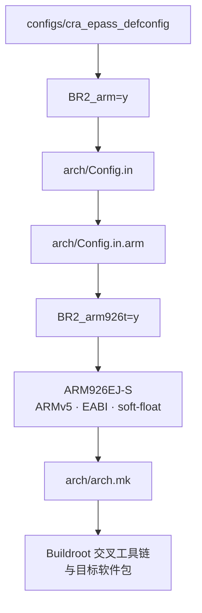

<div align="center">

# Buildroot 架构配置

<sub>Read this in other languages: [English](README_EN.md), [中文](README.md).</sub>

</div>

> [!NOTE]
> `arch/` 是 Buildroot 的目标架构配置层，集中描述处理器架构、CPU 核心、指令集、ABI、字节序、浮点模式及相关工具链参数。
>
> CRA Electric Pass 当前采用 **32 位 ARM** 配置，目标处理器为 Allwinner F1C200S 内的 **ARM926EJ-S**。

<p align="center">
  <a href="#目录职责">目录职责</a> ·
  <a href="#文件组织">文件组织</a> ·
  <a href="#cra-electric-pass-的配置路径">CRA 配置路径</a> ·
  <a href="#配置如何影响构建">构建影响</a> ·
  <a href="#验证当前架构">架构验证</a> ·
  <a href="#维护说明">维护说明</a>
</p>

---

## 目录职责

<table>
<tr>
<td width="25%" valign="top">

### 架构选择

在 Buildroot `menuconfig` 中提供目标架构、CPU 核心与指令集选项。

</td>
<td width="25%" valign="top">

### ABI 与执行模式

选择大小端、ABI、浮点调用约定，以及 ARM / Thumb 等指令模式。

</td>
<td width="25%" valign="top">

### 架构能力

声明 MMU、FPU、原子操作等能力，并约束可用编译器与工具链版本。

</td>
<td width="25%" valign="top">

### 工具链参数

生成 GCC、Binutils 与工具链包装器需要的目标参数，并选择 ELF / FLAT 等可执行文件格式。

</td>
</tr>
</table>

---

## 文件组织

<table>
<tr>
<td width="33%" valign="top">

### `Config.in`

所有目标架构的总入口，负责架构选择、通用能力、工具链约束和可执行文件格式。

</td>
<td width="33%" valign="top">

### `Config.in.*`

各架构的 Kconfig 配置文件，定义对应 CPU、ISA、ABI 和架构特性。

</td>
<td width="33%" valign="top">

### `arch.mk*`

把 Kconfig 结果转换为构建系统使用的 GCC 目标参数，并处理少数架构的额外构建逻辑。

</td>
</tr>
</table>

### 通用入口

| 文件 | 作用 |
| :--- | :--- |
| `Config.in` | 所有目标架构的总入口，提供架构选择、通用能力、工具链约束和可执行文件格式选项。 |
| `arch.mk` | 将 Kconfig 生成的 `BR2_GCC_TARGET_*` 值转换为构建系统使用的 `GCC_TARGET_*` 变量，并加载架构专用 Makefile。 |

### 架构专用 Kconfig

<details>
<summary><b>展开查看全部架构配置文件</b></summary>

<br>

| 文件 | 目标架构 |
| :--- | :--- |
| `Config.in.arm` | 32 位 ARM、ARM 大端、AArch64 和 AArch64 大端。 |
| `Config.in.arc` | Synopsys ARC。 |
| `Config.in.csky` | C-SKY。 |
| `Config.in.m68k` | Motorola 68000 系列。 |
| `Config.in.microblaze` | Xilinx MicroBlaze。 |
| `Config.in.mips` | MIPS32/MIPS64 及大小端模式。 |
| `Config.in.nds32` | Andes NDS32。 |
| `Config.in.nios2` | Altera/Intel Nios II。 |
| `Config.in.or1k` | OpenRISC 1000。 |
| `Config.in.powerpc` | PowerPC 32/64 位。 |
| `Config.in.riscv` | RISC-V 32/64 位及 ISA 扩展。 |
| `Config.in.sh` | Renesas SuperH。 |
| `Config.in.sparc` | SPARC 32/64 位。 |
| `Config.in.x86` | i386 和 x86_64。 |
| `Config.in.xtensa` | Xtensa。 |

</details>

### 架构专用 Makefile

| 文件 | 作用 |
| :--- | :--- |
| `arch.mk.arc` | 为 ARC 设置原子指令和链接页大小等额外参数。 |
| `arch.mk.csky` | 根据 C-SKY 核心、FPU 和 VDSP 选项构造 GCC CPU 参数。 |
| `arch.mk.riscv` | 根据 RV32/RV64 及 M/A/F/D/C 扩展构造 RISC-V ISA 字符串。 |
| `arch.mk.xtensa` | 处理 Xtensa 架构 overlay 的获取和解包。 |

---

## CRA Electric Pass 的配置路径

当前配置从板级 defconfig 逐层进入 Buildroot 架构配置，再生成工具链与目标软件包所需参数：



### 当前选项

| 配置 | 当前值 | 含义 |
| :--- | :---: | :--- |
| `BR2_arm` | `y` | 32 位小端 ARM。 |
| `BR2_arm926t` | `y` | ARM926T/ARM926EJ-S CPU 核心。 |
| `BR2_ARCH` | `arm` | Buildroot 目标架构名称。 |
| `BR2_GCC_TARGET_CPU` | `arm926ej-s` | GCC 的目标 CPU。 |
| `BR2_ARM_CPU_ARMV5` | `y` | 使用 ARMv5 指令集架构。 |
| `BR2_ARM_EABI` | `y` | 使用 ARM EABI。 |
| `BR2_GCC_TARGET_ABI` | `aapcs-linux` | 使用 Linux AAPCS 调用约定。 |
| `BR2_ARM_SOFT_FLOAT` | `y` | 浮点运算由软件实现。 |
| `BR2_GCC_TARGET_FLOAT_ABI` | `soft` | 生成 soft-float ABI 程序。 |
| `BR2_ARM_INSTRUCTIONS_ARM` | `y` | 生成标准 32 位 ARM 指令；Thumb 模式未启用。 |
| `BR2_USE_MMU` | `y` | 启用 MMU，可运行标准 Linux 用户空间。 |
| `BR2_BINFMT_ELF` | `y` | 使用 ELF 可执行文件格式。 |

### 工具链目标

```text
arm-buildroot-linux-gnueabi-
```

> [!IMPORTANT]
> 目标程序需按 **ARMv5 + EABI + soft-float** 构建。ARMv7、AArch64、NEON 或 `gnueabihf` 硬浮点二进制无法直接用于当前设备。

---

## 配置如何影响构建

`Config.in` 与 `Config.in.arm` 产生的 Kconfig 结果写入 Buildroot `.config`，`arch.mk` 再把这些值整理成工具链和软件包构建参数。


### CRA Electric Pass 编译目标

| 项目 | 配置 |
| :--- | :--- |
| CPU | `arm926ej-s` |
| Architecture | `ARMv5` |
| Endianness | `little-endian` |
| ABI | `AAPCS Linux / EABI` |
| Floating point ABI | `soft` |
| Instruction mode | `ARM` |

### 受影响的构建内容

<table>
<tr>
<td width="33%" valign="top">

**基础系统**

- Buildroot 内部工具链
- glibc
- BusyBox

</td>
<td width="33%" valign="top">

**目标程序**

- Linux 用户空间程序
- `drm_app_neo`
- 其他目标软件包

</td>
<td width="33%" valign="top">

**二进制兼容性**

- 第三方预编译库
- ABI 匹配
- 指令集兼容性

</td>
</tr>
</table>

---

## 验证当前架构

在 WSL 的 Buildroot 根目录执行以下检查。

### 1. 生成目标配置

```sh
make cra_epass_defconfig
```

### 2. 检查关键架构选项

```sh
grep -E \
    'BR2_arm=|BR2_arm926t=|BR2_ARM_EABI=|BR2_ARM_SOFT_FLOAT=|BR2_ARM_INSTRUCTIONS_ARM=' \
    .config
```

<details>
<summary><b>预期配置结果</b></summary>

<br>

```text
BR2_arm=y
BR2_arm926t=y
BR2_ARM_EABI=y
BR2_ARM_SOFT_FLOAT=y
BR2_ARM_INSTRUCTIONS_ARM=y
```

</details>

### 3. 检查工具链目标

```sh
output/host/bin/arm-buildroot-linux-gnueabi-gcc -dumpmachine
```

预期输出：

```text
arm-buildroot-linux-gnueabi
```

### 4. 完整构建

```sh
make -j$(nproc)
```

> [!NOTE]
> 上述命令生成配置与镜像，不会向实体设备写入数据。

---

## 维护说明

> [!WARNING]
> `arch/` 与 Buildroot 版本绑定较紧，升级后应重新核对架构 Kconfig、工具链约束和专用 Makefile。

- 保持该目录与当前 Buildroot 版本一致。
- 保留与当前 ARM 目标无关的架构文件。
- 板级 GPIO、设备树和应用配置放入对应板级或应用目录。
- Buildroot 升级以新版上游 `arch/` 为基线处理差异，避免继续叠加旧版本的临时修改。

---

<div align="center">

<sub><b>arch/</b> · target architecture configuration for Buildroot</sub>

</div>
