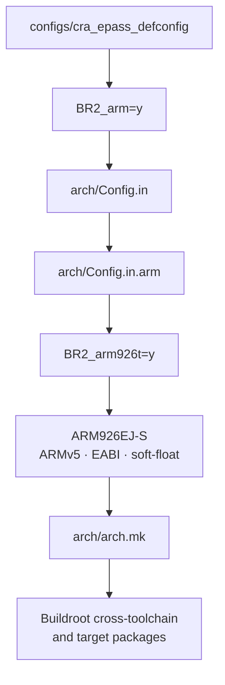

<div align="center">

# Buildroot Architecture Configuration

<sub>Read this in other languages: [English](README_EN.md), [中文](README.md).</sub>

</div>

> [!NOTE]
> `arch/` is Buildroot's target architecture configuration layer. It defines processor architectures, CPU cores, instruction sets, ABIs, endianness, floating-point modes, and related toolchain parameters.
>
> CRA Electric Pass currently uses a **32-bit ARM** configuration targeting the **ARM926EJ-S** core integrated into the Allwinner F1C200S.

<p align="center">
  <a href="#directory-responsibilities">Responsibilities</a> ·
  <a href="#file-organization">File Organization</a> ·
  <a href="#cra-electric-pass-configuration-path">CRA Configuration Path</a> ·
  <a href="#how-the-configuration-affects-the-build">Build Impact</a> ·
  <a href="#verifying-the-current-architecture">Architecture Verification</a> ·
  <a href="#maintenance-notes">Maintenance Notes</a>
</p>

---

## Directory Responsibilities

<table>
<tr>
<td width="25%" valign="top">

### Architecture Selection

Provides target architecture, CPU core, and instruction-set options in Buildroot `menuconfig`.

</td>
<td width="25%" valign="top">

### ABI and Execution Modes

Selects endianness, ABI, floating-point calling convention, and instruction modes such as ARM or Thumb.

</td>
<td width="25%" valign="top">

### Architecture Capabilities

Declares capabilities such as the MMU, FPU, and atomic operations, and constrains the available compiler and toolchain versions.

</td>
<td width="25%" valign="top">

### Toolchain Parameters

Generates target parameters for GCC, Binutils, and the toolchain wrapper, and selects executable formats such as ELF or FLAT.

</td>
</tr>
</table>

---

## File Organization

<table>
<tr>
<td width="33%" valign="top">

### `Config.in`

The main entry point for all target architectures. It handles architecture selection, common capabilities, toolchain constraints, and executable formats.

</td>
<td width="33%" valign="top">

### `Config.in.*`

Architecture-specific Kconfig files that define the corresponding CPUs, ISAs, ABIs, and architecture features.

</td>
<td width="33%" valign="top">

### `arch.mk*`

Converts Kconfig results into GCC target parameters used by the build system and handles additional build logic for selected architectures.

</td>
</tr>
</table>

### Common Entry Points

| File | Purpose |
| :--- | :--- |
| `Config.in` | Main entry point for all target architectures. It provides architecture selection, common capabilities, toolchain constraints, and executable-format options. |
| `arch.mk` | Converts the `BR2_GCC_TARGET_*` values generated by Kconfig into the `GCC_TARGET_*` variables used by the build system, then loads architecture-specific Makefiles. |

### Architecture-Specific Kconfig Files

<details>
<summary><b>Expand to view all architecture configuration files</b></summary>

<br>

| File | Target architecture |
| :--- | :--- |
| `Config.in.arm` | 32-bit ARM, big-endian ARM, AArch64, and big-endian AArch64. |
| `Config.in.arc` | Synopsys ARC. |
| `Config.in.csky` | C-SKY. |
| `Config.in.m68k` | Motorola 68000 family. |
| `Config.in.microblaze` | Xilinx MicroBlaze. |
| `Config.in.mips` | MIPS32/MIPS64 in little-endian and big-endian modes. |
| `Config.in.nds32` | Andes NDS32. |
| `Config.in.nios2` | Altera/Intel Nios II. |
| `Config.in.or1k` | OpenRISC 1000. |
| `Config.in.powerpc` | 32-bit and 64-bit PowerPC. |
| `Config.in.riscv` | 32-bit and 64-bit RISC-V with selectable ISA extensions. |
| `Config.in.sh` | Renesas SuperH. |
| `Config.in.sparc` | 32-bit and 64-bit SPARC. |
| `Config.in.x86` | i386 and x86_64. |
| `Config.in.xtensa` | Xtensa. |

</details>

### Architecture-Specific Makefiles

| File | Purpose |
| :--- | :--- |
| `arch.mk.arc` | Adds ARC-specific parameters for atomic instructions, linker page size, and related settings. |
| `arch.mk.csky` | Builds GCC CPU arguments from the selected C-SKY core, FPU, and VDSP options. |
| `arch.mk.riscv` | Builds the RISC-V ISA string from RV32/RV64 and the M/A/F/D/C extensions. |
| `arch.mk.xtensa` | Handles the retrieval and extraction of Xtensa architecture overlays. |

---

## CRA Electric Pass Configuration Path

The current configuration starts from the board-level defconfig, passes through Buildroot's architecture configuration, and produces the parameters required by the toolchain and target packages:



### Current Selections

| Configuration | Current value | Meaning |
| :--- | :---: | :--- |
| `BR2_arm` | `y` | 32-bit little-endian ARM. |
| `BR2_arm926t` | `y` | ARM926T/ARM926EJ-S CPU core. |
| `BR2_ARCH` | `arm` | Buildroot target architecture name. |
| `BR2_GCC_TARGET_CPU` | `arm926ej-s` | GCC target CPU. |
| `BR2_ARM_CPU_ARMV5` | `y` | Uses the ARMv5 instruction-set architecture. |
| `BR2_ARM_EABI` | `y` | Uses ARM EABI. |
| `BR2_GCC_TARGET_ABI` | `aapcs-linux` | Uses the Linux AAPCS calling convention. |
| `BR2_ARM_SOFT_FLOAT` | `y` | Implements floating-point operations in software. |
| `BR2_GCC_TARGET_FLOAT_ABI` | `soft` | Generates programs that use the soft-float ABI. |
| `BR2_ARM_INSTRUCTIONS_ARM` | `y` | Generates standard 32-bit ARM instructions; Thumb mode is disabled. |
| `BR2_USE_MMU` | `y` | Enables the MMU for a standard Linux userspace. |
| `BR2_BINFMT_ELF` | `y` | Uses the ELF executable format. |

### Toolchain Target

```text
arm-buildroot-linux-gnueabi-
```

> [!IMPORTANT]
> Target programs must be built for **ARMv5 + EABI + soft-float**. ARMv7, AArch64, NEON, and `gnueabihf` hard-float binaries cannot run directly on the current device.

---

## How the Configuration Affects the Build

The Kconfig results produced by `Config.in` and `Config.in.arm` are written to Buildroot's `.config`. `arch.mk` then converts these values into the parameters used to build the toolchain and target packages.


### CRA Electric Pass Compilation Target

| Item | Configuration |
| :--- | :--- |
| CPU | `arm926ej-s` |
| Architecture | `ARMv5` |
| Endianness | `little-endian` |
| ABI | `AAPCS Linux / EABI` |
| Floating-point ABI | `soft` |
| Instruction mode | `ARM` |

### Affected Build Components

<table>
<tr>
<td width="33%" valign="top">

**Base System**

- Buildroot internal toolchain
- glibc
- BusyBox

</td>
<td width="33%" valign="top">

**Target Programs**

- Linux user-space programs
- `drm_app_neo`
- Other target packages

</td>
<td width="33%" valign="top">

**Binary Compatibility**

- Third-party prebuilt libraries
- ABI compatibility
- Instruction-set compatibility

</td>
</tr>
</table>

---

## Verifying the Current Architecture

Run the following checks from the Buildroot root directory in WSL.

### 1. Generate the Target Configuration

```sh
make cra_epass_defconfig
```

### 2. Check the Key Architecture Options

```sh
grep -E \
    'BR2_arm=|BR2_arm926t=|BR2_ARM_EABI=|BR2_ARM_SOFT_FLOAT=|BR2_ARM_INSTRUCTIONS_ARM=' \
    .config
```

<details>
<summary><b>Expected configuration</b></summary>

<br>

```text
BR2_arm=y
BR2_arm926t=y
BR2_ARM_EABI=y
BR2_ARM_SOFT_FLOAT=y
BR2_ARM_INSTRUCTIONS_ARM=y
```

</details>

### 3. Check the Toolchain Target

```sh
output/host/bin/arm-buildroot-linux-gnueabi-gcc -dumpmachine
```

Expected output:

```text
arm-buildroot-linux-gnueabi
```

### 4. Run a Complete Build

```sh
make -j$(nproc)
```

> [!NOTE]
> These commands generate configuration files and images; they do not write data to a physical device.

---

## Maintenance Notes

> [!WARNING]
> `arch/` is tightly coupled to the Buildroot version. After an upgrade, recheck the architecture Kconfig files, toolchain constraints, and architecture-specific Makefiles.

- Keep this directory aligned with the Buildroot version used by the project.
- Retain architecture files that are unrelated to the current ARM target.
- Place board-level GPIO, device-tree, and application configuration in the corresponding board or application directories.
- When upgrading Buildroot, use the new upstream `arch/` directory as the baseline and resolve the differences instead of accumulating temporary changes from older versions.

---

<div align="center">

<sub><b>arch/</b> · target architecture configuration for Buildroot</sub>

</div>
