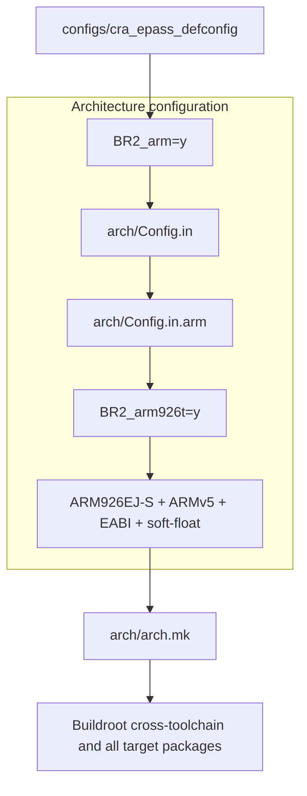

<div align="center">

# Buildroot Architecture Configuration

<sub>Read this in other languages: [English](README_EN.md), [中文](README.md).</sub>

</div>

**This directory is Buildroot's target architecture configuration layer. It describes the supported processor architectures, CPU cores, instruction sets, ABIs, endianness, floating-point modes, and related toolchain parameters.**

> **CRA Electric Pass uses only the 32-bit ARM configuration in this directory. Its target processor is the ARM926EJ-S core integrated into the Allwinner F1C200S.**

---

## Responsibilities

This directory is primarily responsible for:

- Providing target architecture options in Buildroot `menuconfig`.
- Defining the CPU cores and instruction sets supported by each architecture.
- Selecting little-endian or big-endian operation.
- Selecting the ABI and floating-point calling convention.
- Declaring architecture capabilities such as MMU, FPU, and atomic operations.
- Generating target parameters for GCC, Binutils, and the toolchain wrapper.
- Restricting the compiler and toolchain versions available to certain architectures.
- Selecting executable formats such as ELF or FLAT.


---

## File Organization

### Common Entry Points

| File | Purpose |
| :--- | :--- |
| `Config.in` | Main entry point for all target architectures. It provides architecture selection, common capabilities, toolchain constraints, and executable-format options. |
| `arch.mk` | Converts the `BR2_GCC_TARGET_*` values produced by Kconfig into the `GCC_TARGET_*` variables used by the build system, then loads architecture-specific Makefiles. |

### Architecture-Specific Kconfig Files

| File | Target architecture |
| :--- | :--- |
| `Config.in.arm` | 32-bit ARM, big-endian ARM, AArch64, and big-endian AArch64. |
| `Config.in.arc` | Synopsys ARC. |
| `Config.in.csky` | C-SKY. |
| `Config.in.m68k` | Motorola 68000 family. |
| `Config.in.microblaze` | Xilinx MicroBlaze. |
| `Config.in.mips` | MIPS32/MIPS64 in little-endian and big-endian modes. |
| `Config.in.nds32` | Andes NDS32. |
| `Config.in.nios2` | Altera/Intel Nios II. |
| `Config.in.or1k` | OpenRISC 1000. |
| `Config.in.powerpc` | 32-bit and 64-bit PowerPC. |
| `Config.in.riscv` | 32-bit and 64-bit RISC-V with selectable ISA extensions. |
| `Config.in.sh` | Renesas SuperH. |
| `Config.in.sparc` | 32-bit and 64-bit SPARC. |
| `Config.in.x86` | i386 and x86_64. |
| `Config.in.xtensa` | Xtensa. |

### Architecture-Specific Makefiles

| File | Purpose |
| :--- | :--- |
| `arch.mk.arc` | Adds ARC-specific parameters for atomic instructions, linker page size, and related settings. |
| `arch.mk.csky` | Builds the GCC CPU arguments from the selected C-SKY core, FPU, and VDSP options. |
| `arch.mk.riscv` | Builds the RISC-V ISA string from RV32/RV64 and the M/A/F/D/C extensions. |
| `arch.mk.xtensa` | Handles retrieval and extraction of Xtensa architecture overlays. |


---

## CRA Electric Pass Configuration Path

The current target configuration is resolved through the following path:



### Current Selections

| Configuration | Current value | Meaning |
| :--- | :---: | :--- |
| `BR2_arm` | `y` | 32-bit little-endian ARM. |
| `BR2_arm926t` | `y` | ARM926T/ARM926EJ-S CPU core. |
| `BR2_ARCH` | `arm` | Buildroot target architecture name. |
| `BR2_GCC_TARGET_CPU` | `arm926ej-s` | GCC target CPU. |
| `BR2_ARM_CPU_ARMV5` | `y` | Uses the ARMv5 instruction-set architecture. |
| `BR2_ARM_EABI` | `y` | Uses the ARM EABI. |
| `BR2_GCC_TARGET_ABI` | `aapcs-linux` | Uses the Linux AAPCS calling convention. |
| `BR2_ARM_SOFT_FLOAT` | `y` | Implements floating-point operations in software. |
| `BR2_GCC_TARGET_FLOAT_ABI` | `soft` | Generates programs that use the soft-float ABI. |
| `BR2_ARM_INSTRUCTIONS_ARM` | `y` | Generates standard 32-bit ARM instructions rather than Thumb. |
| `BR2_USE_MMU` | `y` | Enables the MMU for a standard Linux userspace. |
| `BR2_BINFMT_ELF` | `y` | Uses the ELF executable format. |

**The resulting toolchain prefix is:**

```text
arm-buildroot-linux-gnueabi-
```

**Executables must be built for ARMv5 EABI with the soft-float ABI. ARMv7, AArch64, NEON, and `gnueabihf` hard-float binaries cannot run on this device directly.**


---

## How the Configuration Affects the Build

The Kconfig results produced by `Config.in` and `Config.in.arm` are written to Buildroot's `.config`. `arch.mk` then reads these values and supplies the target parameters used by the toolchain and package build process.

**For the current device, the effective compiler target is:**

```text
CPU: arm926ej-s
Architecture: ARMv5
Endianness: little-endian
ABI: AAPCS Linux / EABI
Floating point ABI: soft
Instruction mode: ARM
```

**These settings affect:**

- The Buildroot internal toolchain.
- glibc.
- BusyBox.
- Linux userspace programs.
- `drm_app_neo` and other target packages.
- Whether third-party prebuilt libraries can be loaded.


---

## Verifying the Current Architecture

**Run the following command from the Buildroot root directory in WSL:**

```sh
make cra_epass_defconfig
```

**Inspect the generated configuration:**

```sh
grep -E \
    'BR2_arm=|BR2_arm926t=|BR2_ARM_EABI=|BR2_ARM_SOFT_FLOAT=|BR2_ARM_INSTRUCTIONS_ARM=' \
    .config
```

**Expected entries:**

```text
BR2_arm=y
BR2_arm926t=y
BR2_ARM_EABI=y
BR2_ARM_SOFT_FLOAT=y
BR2_ARM_INSTRUCTIONS_ARM=y
```

**Check the toolchain target:**

```sh
output/host/bin/arm-buildroot-linux-gnueabi-gcc -dumpmachine
```

**Expected output:**

```text
arm-buildroot-linux-gnueabi
```

**Run a complete build:**

```sh
make -j$(nproc)
```

**These commands only generate configuration files and images. They do not write anything to a physical device automatically.**


---

## Maintenance Notes

- Keep this directory aligned with the Buildroot release used by the project.
- Do not remove architecture files that are unrelated to the current ARM target.
- Do not place board-level GPIO, device-tree, or application configuration in this directory.
- When upgrading Buildroot, use the new upstream `arch/` directory as the baseline and resolve the differences instead of accumulating local temporary modifications.
