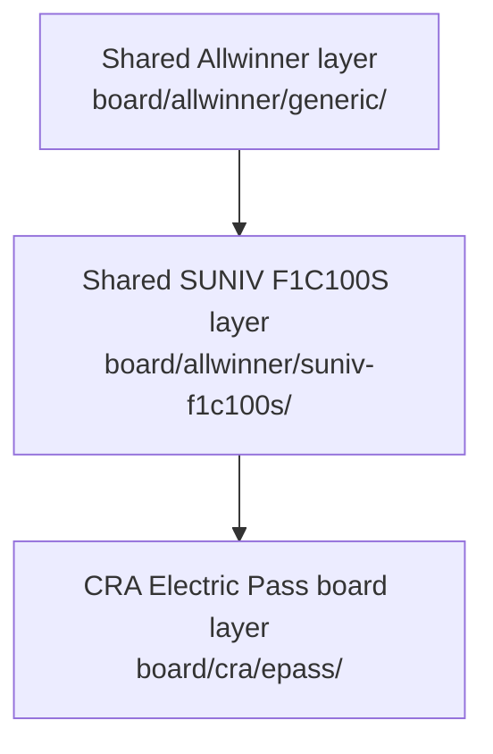
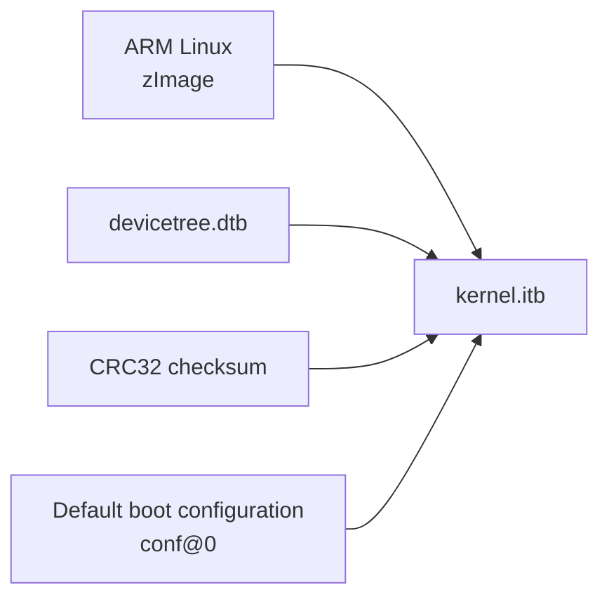
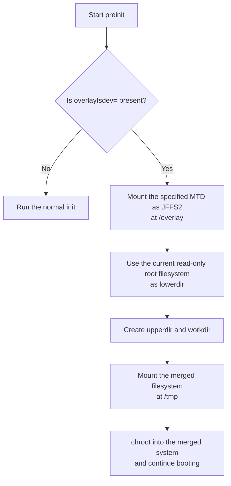
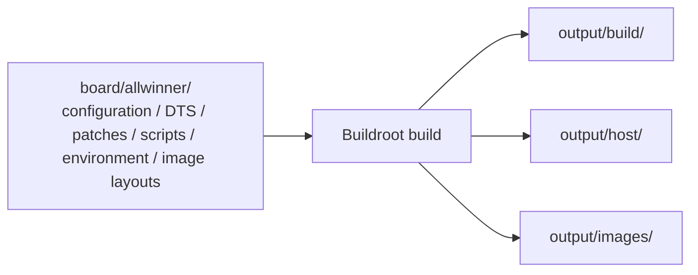

<div align="center">

# Shared Allwinner Board Support

<sub>Read this in other languages: [English](README_EN.md), [中文](README.md).</sub>

</div>

> [!NOTE]
> This directory contains platform support files shared by multiple Allwinner development boards in this Buildroot tree. Its entry point is `board/allwinner/`.

<p align="center">
  <a href="#directory-structure">Directory Structure</a> ·
  <a href="#integration-with-cra-electric-pass">CRA Integration</a> ·
  <a href="#generic-shared-allwinner-layer"><code>generic/</code></a> ·
  <a href="#suniv-f1c100s-shared-suniv-layer"><code>suniv-f1c100s/</code></a> ·
  <a href="#sun8i-v3-shared-v3ss3-layer"><code>sun8i-v3/</code></a> ·
  <a href="#source-and-generated-file-boundaries">File Boundaries</a> ·
  <a href="#coupled-changes">Coupled Changes</a> ·
  <a href="#build-and-validation">Build and Validation</a>
</p>

---

## Directory Structure

<table>
<tr>
<td width="33%" valign="top">

### `generic/`

Reusable boot, image, rootfs, and compatibility flows for multiple Allwinner boards.

</td>
<td width="33%" valign="top">

### `suniv-f1c100s/`

Shared Linux, U-Boot, device-tree, and patch support for the SUNIV platform used by F1C100S/F1C200S devices.

</td>
<td width="33%" valign="top">

### `sun8i-v3/`

Shared Linux configuration and SoC device trees for the Allwinner V3s/S3 platform.

</td>
</tr>
</table>

```text
allwinner/
├── generic/                 Reusable boot and image support for Allwinner boards
│   ├── uboot.env            Shared default U-Boot environment
│   ├── kernel.its           Shared FIT image description
│   ├── splash.bmp           Shared boot splash
│   ├── genimage-*.cfg       SD, SPI-NOR, and SPI-NAND image layouts
│   ├── scripts/             Shared image-generation scripts
│   ├── rootfs/              Shared root filesystem overlay
│   └── legacy/              Legacy boot environment and flashing-image layout
├── suniv-f1c100s/           Shared SUNIV support for F1C100S/F1C200S devices
│   ├── linux.defconfig      Shared Linux configuration baseline
│   ├── uboot.defconfig      Shared U-Boot configuration baseline
│   ├── devicetree/          Shared Linux and U-Boot SoC device trees
│   ├── patch/               Shared SUNIV Linux and U-Boot patches
│   └── rootfs/              Shared SUNIV root filesystem overlay
└── sun8i-v3/                Shared Allwinner V3s/S3 platform support
    ├── linux.defconfig      V3s/S3 Linux configuration baseline
    └── devicetree/          Shared V3s and S3 SoC device trees
```

---

## Integration with CRA Electric Pass

The source configuration for the current CRA board target is:

```text
board/cra/epass/cra_epass_defconfig
```

It assembles the system in the following layers:



### Effective References

| Shared file | Current role |
| :--- | :--- |
| `generic/rootfs/` | First rootfs overlay layer; installs the shared `preinit` script |
| `suniv-f1c100s/rootfs/` | Second rootfs overlay layer; installs SUNIV platform utilities |
| `suniv-f1c100s/patch/linux/` | Applies shared SUNIV kernel patches before the CRA Linux patches |
| `suniv-f1c100s/patch/u-boot/` | Applies shared SUNIV boot-support patches before the CRA U-Boot patches |
| `suniv-f1c100s/devicetree/linux/suniv-f1c100s.dtsi` | Supplies SoC controllers, clocks, interrupts, DMA, and peripheral base nodes to the CRA Linux DTS |
| `suniv-f1c100s/devicetree/uboot/suniv-f1c100s.dtsi` | Supplies SUNIV SoC base nodes to the CRA U-Boot DTS |

<details>
<summary><b>Shared files that exist but are not referenced directly</b></summary>

<br>

The following files exist in the shared directories, but the current CRA configuration provides replacement implementations and does not reference them directly:

```text
generic/uboot.env
generic/kernel.its
generic/genimage-*.cfg
generic/scripts/
generic/splash.bmp
suniv-f1c100s/linux.defconfig
suniv-f1c100s/uboot.defconfig
sun8i-v3/
```

</details>

---

## `generic/`: Shared Allwinner Layer

### `uboot.env`

This shared U-Boot environment targets multiple Allwinner boards and mainly provides:

- locating and booting `kernel.itb` from MMC0, MMC1, SPI-NOR, or SPI-NAND;
- scanning available boot entries across different boot media;
- loading and displaying `splash.bmp`;
- configuring DFU download targets for MMC, SPI flash, and MTD;
- falling back to FEL or DFU when no normal boot medium is available;
- defining shared image offsets and read lengths for SPI-NOR and SPI-NAND.

> [!IMPORTANT]
> It follows the shared image convention and does not match the NAND partitions, FIT contents, or boot flow currently used by CRA Electric Pass. Changes to the Electric Pass default environment belong in `board/cra/epass/uboot.env`.

### `kernel.its`

This file is the shared FIT (Flattened Image Tree) description. It packages the following components into `kernel.itb`:



Both the shared kernel load address and entry address are `0x80000000`.

### `genimage-*.cfg`

Three configuration files describe the shared image layouts:

| File | Target medium | Main layout |
| :--- | :---: | :--- |
| `genimage-sdcard.cfg` | SD card | Places U-Boot at `0x2000`, followed by a FAT boot partition and an ext4 rootfs partition |
| `genimage-nor.cfg` | 16 MiB SPI-NOR | Places U-Boot, the boot splash, kernel, and read-only rootfs at fixed offsets |
| `genimage-nand.cfg` | 128 MiB SPI-NAND | Places U-Boot, the boot splash, kernel, and read-only rootfs at fixed offsets |

#### Main Shared SPI Flash Offsets

| Content | Offset | Reserved size |
| :--- | :---: | :---: |
| U-Boot | `0x000000` | `0x080000` (512 KiB) |
| Boot splash | `0x080000` | `0x080000` (512 KiB) |
| Kernel/FIT | `0x100000` | `0x500000` (5 MiB) |
| rootfs | `0x600000` | Remaining space on the medium |

> [!WARNING]
> These values belong to the shared image scheme. Any layout change must also be checked against the U-Boot environment, Linux `bootargs`, device-tree partitions, image-generation scripts, and flashing configuration.

### `scripts/`

| File | Purpose |
| :--- | :--- |
| `mknanduboot.sh` | Rearranges SPL/U-Boot for a 2 KiB NAND page layout so that it can boot from SPI-NAND |
| `genimage.sh` | Builds the shared FIT, copies the boot splash, converts NAND U-Boot, and invokes `genimage` to create SD/NOR/NAND images |

These scripts run during Buildroot's post-image stage and depend on Buildroot environment variables such as `BINARIES_DIR` and `HOST_DIR`. They are not intended to run independently outside the build environment.

### `rootfs/preinit`

This script checks the kernel command line for an `overlayfsdev=` parameter:



If `overlayfsdev=` is absent, the script invokes the normal `init` directly. Merely including this file in the rootfs does not prove that a device uses overlayfs; the effective behavior also depends on the boot arguments and init flow.

### `legacy/`

`legacy/` preserves compatibility flows:

- `uboot.env` loads a separate `zImage` and DTB instead of using the current shared FIT flow;
- `genimage-flasher.cfg` creates a FAT flashing medium containing NOR/NAND system images.

> [!CAUTION]
> Do not mix these configurations into the current CRA build unless you are maintaining hardware that uses this compatibility boot scheme.

---

## `suniv-f1c100s/`: Shared SUNIV Layer

This directory provides shared support for the F1C100S/F1C200S SoC family. Most of the ARM926T, clock-controller, DMA, USB, audio, SPI flash, and on-chip peripheral foundations used by CRA Electric Pass come from this layer.

### Shared Device Trees

| File | Consumer | Purpose |
| :--- | :---: | :--- |
| `devicetree/linux/suniv-f1c100s.dtsi` | Linux 5.4 series | Defines SoC-level nodes for the CPU, clocks, interrupts, resets, DMA, GPIO, and on-chip controllers |
| `devicetree/uboot/suniv-f1c100s.dtsi` | U-Boot 2020.07 series | Defines the SUNIV SoC-level nodes required during the U-Boot boot stage |

> [!IMPORTANT]
> The shared `.dtsi` files describe SoC capabilities and should not contain board-specific information such as the CRA LCD, buttons, audio chip, or interface selection. CRA hardware connections belong in the `.dts` files or overlays under `board/cra/epass/devicetree/`.

The shared Linux device tree carries:

```text
SPDX-License-Identifier: (GPL-2.0+ OR X11)
```

### Shared Linux Patches

`patch/linux/` currently contains **16** numbered patches.

<details>
<summary><b>Expand to view the 16 shared Linux patches</b></summary>

<br>

| Number | Main change |
| :---: | :--- |
| `0001` | Adds SUNIV USB support |
| `0002` | Corrects CCU definitions |
| `0003` | Adds DMA controller support |
| `0004` | Adds support for the on-chip audio codec |
| `0005` | Adds packed-format support to sun4i CSI |
| `0006` | Adds device-tree support to `rfkill-gpio` |
| `0007` | Corrects the SPI-NAND bad-block marker size |
| `0008` | Adds CedarX driver support |
| `0009` | Adds compatibility for early GDF5 A-series NAND devices |
| `0010` | Adds AW9523B GPIO expander support |
| `0011` | Allows `phy-sun4i-usb` to use nested interrupts |
| `0012` | Adds AXP199 support |
| `0013` | Adds XT25F128 SPI-NOR support |
| `0014` | Adds GD5F1GQ5UExxG SPI-NAND support |
| `0015` | Adds compatibility handling for older W25N01G devices |
| `0016` | Adds an on-die ECC quirk switch for SPI-NAND |

</details>

> [!WARNING]
> The current CRA build applies these shared patches first and then applies `board/cra/epass/patch/linux/`. Later patches may depend on Kconfig options, drivers, or device-tree bindings introduced by earlier patches.

### Shared U-Boot Patch

`patch/u-boot/0001-v2020.07.11.patch` is a large SUNIV platform patch against the U-Boot `2020.07` baseline. It adds ARM926EJ-S/SUNIV boot support, SPL, DRAM, clocks, GPIO, PWM, SPI, NAND, and the associated device-tree support.

> [!WARNING]
> This patch is tightly coupled to a fixed U-Boot version. When upgrading U-Boot, recheck whether the patch still applies and whether upstream has incorporated equivalent functionality. Do not continue a build by ignoring failed hunks.

### `linux.defconfig`

This is the shared SUNIV Linux configuration baseline. Its header identifies it as generated by the Linux configuration system for Linux `5.4.92` using an ARM EABI toolchain.

### `uboot.defconfig`

This is the shared SUNIV U-Boot configuration baseline. It mainly enables:

- `CONFIG_MACH_SUNIV` and the ARM architecture;
- SPL and SUNXI SPI boot support;
- the shared `suniv-f1c100s-generic` device tree;
- a 408 MHz system clock and 168 MHz DRAM clock;
- MMC, SPI-NOR, SPI-NAND, and MTD;
- USB Mass Storage, DFU, and the MUSB Gadget stack;
- `generic/uboot.env` as the default environment;
- shared 800×480 LCD parameters.

> [!NOTE]
> The current CRA Electric Pass uses its own U-Boot configuration and environment. Changing this file does not change the Electric Pass firmware.

### `rootfs/usr/sbin/mtd`

This file is a precompiled **32-bit ARM ELF user-space program**, not a Shell script or source file. Because the current configuration includes `suniv-f1c100s/rootfs/`, it is copied to the following location in the target system:

```text
/usr/sbin/mtd
```

---

## `sun8i-v3/`: Shared V3s/S3 Layer

This directory targets the Allwinner V3s/S3 platform and contains:

| File | Description |
| :--- | :--- |
| `linux.defconfig` | A complete generated configuration for Linux `5.4.35`; its header identifies an ARM hard-float toolchain |
| `devicetree/linux/sun8i-v3s.dtsi` | Shared V3s SoC device tree |
| `devicetree/linux/sun8i-s3.dtsi` | Shared S3 SoC device tree |

> [!IMPORTANT]
> V3s/S3 and the SUNIV F1C100S/F1C200S target used by CRA Electric Pass belong to different configuration layers.

---

## Source and Generated-File Boundaries

The configuration files, DTS sources, patches, scripts, environment files, and image layouts in this directory are **build inputs** and belong under version control. Linux, U-Boot, DTB, and firmware images generated by a build are normally written to:

```text
output/build/
output/host/
output/images/
```



> [!CAUTION]
> These output directories are not substitutes for the source files in this directory. Direct changes under `output/build/linux-*` or `output/build/uboot-*` are lost after a clean or rebuild.

### File-Type Boundaries

| Type | Examples | Requirements |
| :--- | :--- | :--- |
| Text configuration | `*.defconfig`, `*.env`, `*.cfg` | Use UTF-8/LF and validate changes with the corresponding configuration or build tool |
| Device-tree source | `*.dts`, `*.dtsi` | Validate with the matching DTC, kernel, or U-Boot device-tree flow |
| Patch | `*.patch` | Line endings, path prefixes, order, and target source version all affect whether it applies |
| Shell script | `*.sh`, `preinit` | Preserve LF endings, the shebang, and executable permissions |
| Binary resource | `splash.bmp`, `usr/sbin/mtd` | Do not perform text replacement or line-ending conversion |

---

## Coupled Changes

> [!TIP]
> A change to a shared-layer file may also affect other Allwinner/SUNIV board configurations that reference the same layer.

| Modified location | Also verify |
| :--- | :--- |
| `generic/uboot.env` | Every board-level U-Boot configuration that references it, together with its boot media and image layout |
| `generic/kernel.its` | Kernel/DTB file names, load addresses, generation scripts, and U-Boot boot commands |
| `generic/genimage-*.cfg` | U-Boot environment offsets, MTD partitions, image sizes, and flashing tools |
| `generic/rootfs/preinit` | Kernel `bootargs`, JFFS2/overlayfs support, and the init flow |
| Shared SUNIV `.dtsi` | Every board DTS that includes it, not only CRA Electric Pass |
| Shared Linux patches | Linux version, shared defconfig, later CRA patches, and every SUNIV board that consumes them |
| Shared U-Boot patch | U-Boot version, SPL/DRAM/SPI boot support, and later CRA patches |
| SUNIV `rootfs/` | Every target that overlays this directory and its target ABI |

Changes that apply only to CRA hardware or its user interface should go in `board/cra/epass/` or the relevant application directory. A change belongs in this shared directory only when it genuinely applies to multiple Allwinner/SUNIV boards.

---

## Build and Validation

The current CRA Electric Pass build entry point is:

```sh
make cra_epass_defconfig
make
```

### Shared-Directory Change Checklist

- Every patch applies cleanly, in numbered order, to the pinned Linux or U-Boot version
- Linux and U-Boot device trees compile, and CRA board-level DTS references remain valid
- ARM binaries in the rootfs remain compatible with the current EABI soft-float userspace
- U-Boot, FIT, DTB/DTBO, UBI, and SD images are generated successfully
- Other board configurations that consume the modified shared files have not been broken unintentionally

> [!WARNING]
> Builds and static checks only generate and validate software artifacts; they are not equivalent to flashing a physical device. Before any operation involving boot media, NAND page layout, partitions, or U-Boot, separately confirm the hardware model, target medium, backup, and recovery path.

---

<div align="center">

<sub><b>board/allwinner/</b> · shared platform support for Allwinner targets in Buildroot</sub>

</div>
