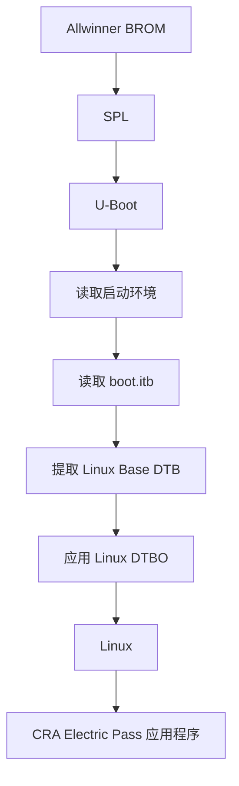
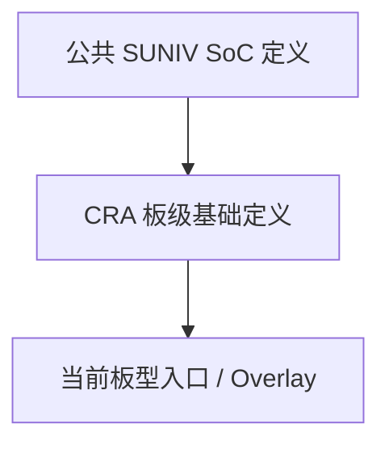
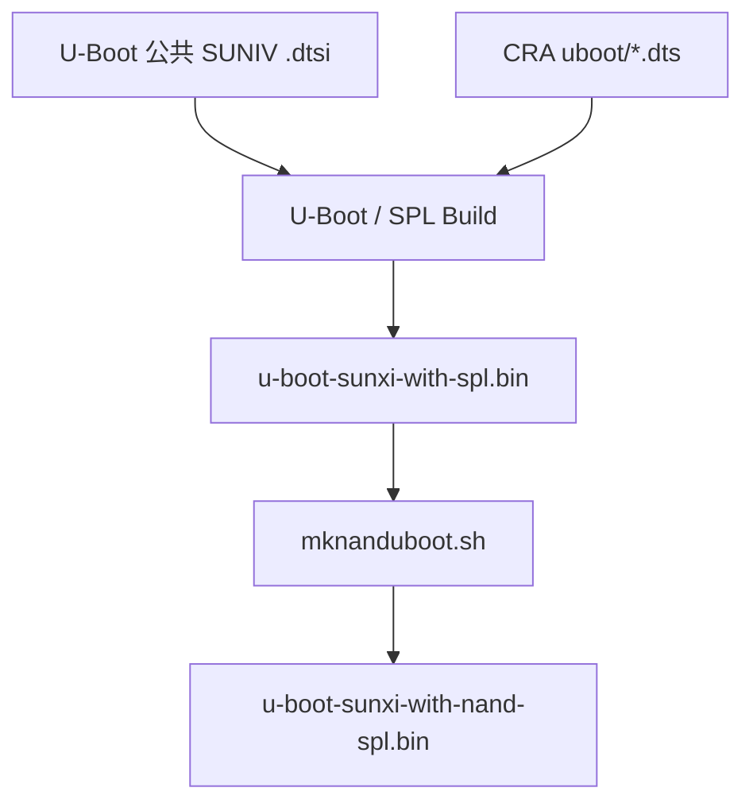
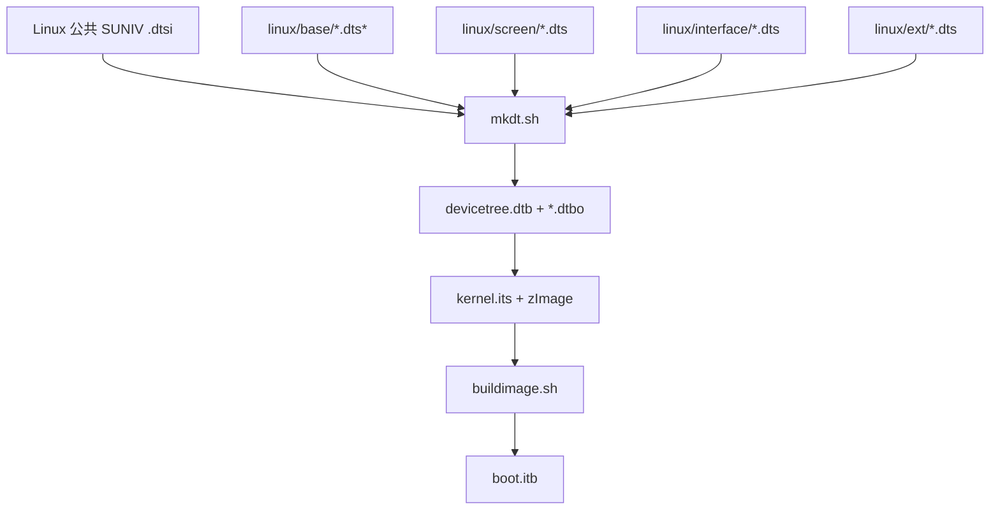
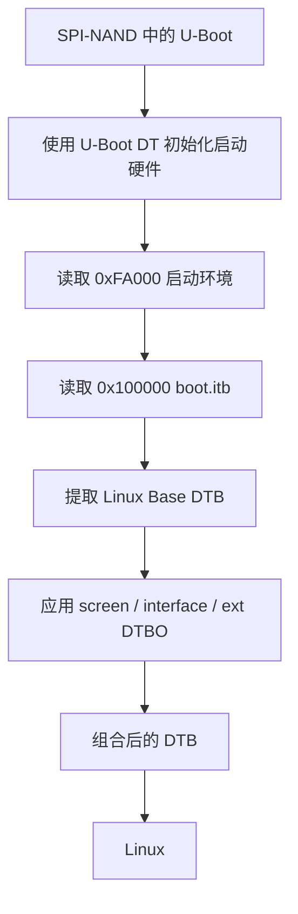

<div align="center">

# CRA Electric Pass 设备树

<sub>Read this in other languages: [English](README_EN.md), [中文](README.md).</sub>

</div>

> [!NOTE]
> 本目录保存 CRA Electric Pass 的板级设备树源码，分为 **U-Boot** 与 **Linux** 两套相互独立的配置。

<p align="center">
  <a href="#目录结构">目录结构</a> ·
  <a href="#启动阶段">启动阶段</a> ·
  <a href="#职责边界">职责边界</a> ·
  <a href="#公共-soc-定义">公共 SoC</a> ·
  <a href="#u-boot-设备树">U-Boot</a> ·
  <a href="#linux-设备树">Linux</a> ·
  <a href="#buildroot-构建关系">构建关系</a> ·
  <a href="#从源码到启动">完整链路</a> ·
  <a href="#修改入口">修改入口</a> ·
  <a href="#构建与验证">构建验证</a>
</p>

---

## 目录结构

<table>
<tr>
<td width="50%" valign="top">

### `uboot/`

**SPL / U-Boot 阶段**

负责启动前必须访问的硬件：

- SPI-NAND
- 启动串口
- USB DFU
- MMC
- 必要 SoC 资源

[查看详细说明](uboot/README.md)

</td>
<td width="50%" valign="top">

### `linux/`

**Linux 运行阶段**

负责完整板级硬件：

- LCD / 背光
- 屏幕 Overlay
- SoC 接口
- 外接设备
- Linux 驱动参数

[查看详细说明](linux/README.md)

</td>
</tr>
</table>

```text
devicetree/
├─ uboot/
│  ├─ suniv-f1c100s-generic.dts
│  └─ README.md
└─ linux/
   ├─ base/
   ├─ screen/
   ├─ interface/
   ├─ ext/
   └─ README.md
```

| 目录 | 使用阶段 | 主要职责 |
| :--- | :---: | :--- |
| `uboot/` | SPL / U-Boot | 启动闪存、串口、USB DFU、MMC 与启动期 SoC 资源 |
| `linux/` | Linux | 主板硬件、显示、屏幕、接口、外设与 Linux 驱动参数 |

---

## 启动阶段



<table>
<tr>
<td width="50%" valign="top">

### 启动加载器阶段

SPL / U-Boot 在 Linux 尚未运行时访问：

- SPI-NAND
- UART
- USB DFU
- MMC / SD
- 时钟与基础控制器

使用 `devicetree/uboot/`。

</td>
<td width="50%" valign="top">

### Linux 阶段

Linux 重新初始化硬件，并使用另一套更完整的设备树：

- 显示与背光
- 输入
- 存储
- 总线接口
- 外接设备

使用 `devicetree/linux/`。

</td>
</tr>
</table>

> [!IMPORTANT]
> 两套设备树不会自动同步。修改 `uboot/` 不会改变 Linux 运行期硬件配置；修改 `linux/` 也不会改变 SPL / U-Boot 初始化。

---

## 职责边界

| 硬件 / 功能 | U-Boot 设备树 | Linux 设备树 |
| :--- | :---: | :---: |
| SPI-NAND 启动读取 | 必须配置 | MTD、分区与运行时访问 |
| 启动串口控制台 | 必须配置 | Linux Console / 普通 UART |
| USB DFU | 必须配置 | Gadget / Host / 其他模式 |
| SD / MMC 启动访问 | 按启动需求 | Linux SD / MMC |
| LCD / 背光 | 当前不接管 | 完整配置 |
| ST7701 初始化 | 不负责 | Screen Overlay |
| LRADC 按键 | 不负责 | Linux Base |
| I²C / I²S / SPI1 / UART 扩展 | 通常不需要 | Interface Overlay |
| CardKB / ES8311 / LSM6DS3 | 不需要 | Ext Overlay |

当前 U-Boot：

```text
# CONFIG_VIDEO_SUNXI is not set
```

显示初始化由 Linux 阶段负责。

---

## 公共 SoC 定义

CRA 板级 DTS 不重新定义 F1C100S / F1C200S 的全部寄存器与内部控制器。

<table>
<tr>
<td width="50%" valign="top">

### U-Boot 公共定义

```text
board/allwinner/suniv-f1c100s/
devicetree/uboot/
suniv-f1c100s.dtsi
```

</td>
<td width="50%" valign="top">

### Linux 公共定义

```text
board/allwinner/suniv-f1c100s/
devicetree/linux/
suniv-f1c100s.dtsi
```

</td>
</tr>
</table>



公共 `.dtsi` 提供：

- 寄存器地址
- 时钟与复位
- 中断与 DMA
- GPIO / pinctrl
- 基础控制器节点

CRA 文件负责：

- 当前 PCB 的控制器选择
- 引脚复用
- 节点启用状态
- 板级参数

---

# U-Boot 设备树

板级入口：

```text
uboot/suniv-f1c100s-generic.dts
```

引用公共 SUNIV：

```dts
#include "suniv-f1c100s.dtsi"
```

### 当前启动资源

| 资源 | 状态 / 用途 |
| :--- | :--- |
| UART0 | 启动控制台 |
| UART1 | 启用 |
| SPI0 | SPI-NAND 启动 |
| SPI-NAND | 主启动存储 |
| USB OTG / PHY / SRAM | DFU / USB Gadget |
| MMC0 | 第一组 MMC |
| 第二组 MMC | 关闭，与 SPI0 引脚冲突 |

### Buildroot 引用

```text
BR2_TARGET_UBOOT_CUSTOM_DTS_PATH="
    board/allwinner/suniv-f1c100s/devicetree/uboot/suniv-f1c100s.dtsi
    board/cra/epass/devicetree/uboot/suniv-f1c100s-generic.dts"
```

配置文件：

```text
board/cra/epass/uboot.defconfig
```

默认设备树：

```text
CONFIG_DEFAULT_DEVICE_TREE="suniv-f1c100s-generic"
```

---

# Linux 设备树

基础入口：

```text
linux/base/epass.dtsi
linux/base/devicetree.dts
```

### Buildroot 引用

```text
BR2_LINUX_KERNEL_CUSTOM_DTS_PATH="
    board/allwinner/suniv-f1c100s/devicetree/linux/suniv-f1c100s.dtsi
    board/cra/epass/devicetree/linux/base/epass.dtsi
    board/cra/epass/devicetree/linux/base/devicetree.dts"
```

### 基础关系


### Overlay 层

<table>
<tr>
<td width="33%" valign="top">

### Screen

`linux/screen/`

**必须选择 1 个**

- BOE
- HSD
- Laowu

</td>
<td width="33%" valign="top">

### Interface

`linux/interface/`

**可选，可多个**

- ADC
- I²C
- I²S
- SPI
- UART
- USB

</td>
<td width="33%" valign="top">

### Ext

`linux/ext/`

**可选，可多个**

- CardKB
- ES8311
- LSM6DS3

</td>
</tr>
</table>

U-Boot 应用顺序：

```text
base → screen → interface → ext
```

---

## Buildroot 构建关系

| 组件 | 当前版本 |
| :--- | :---: |
| Linux | `5.4.99` |
| U-Boot | `2020.07` |

主配置：

```text
board/cra/epass/cra_epass_defconfig
```

该配置统一指定 Linux / U-Boot 版本、Patch、Defconfig、DTS 与镜像后处理脚本。

### 镜像后处理


| 脚本 | 作用 |
| :--- | :--- |
| `mknanduboot.sh` | 将 SPL / U-Boot 整理为 SPI-NAND 页布局 |
| `mkdt.sh` | 编译 Linux Base DTB 与全部 DTBO |
| `buildimage.sh` | 生成 UBI rootfs，并根据 `kernel.its` 打包 `boot.itb` |

---

## 从源码到启动

### U-Boot 构建链路



### Linux 设备树链路



### 实体设备启动链路



---

## 生成文件

| 文件 | 来源 | 用途 |
| :--- | :--- | :--- |
| `output/images/u-boot-sunxi-with-spl.bin` | U-Boot Build | 未完成 NAND 页布局处理 |
| `output/images/u-boot-sunxi-with-nand-spl.bin` | `mknanduboot.sh` | 实体 SPI-NAND 最终 U-Boot |
| `output/images/dt/base/devicetree.dtb` | `mkdt.sh` | Linux Base DTB |
| `output/images/dt/screen/*.dtbo` | `mkdt.sh` | Screen Overlay |
| `output/images/dt/interface/*.dtbo` | `mkdt.sh` | Interface Overlay |
| `output/images/dt/ext/*.dtbo` | `mkdt.sh` | Ext Overlay |
| `output/images/boot.itb` | `buildimage.sh` | Kernel + DTB + DTBO FIT |

> [!WARNING]
> 请勿直接修改 `output/build/` 或 `output/images/dt/`。这些目录属于构建产物，清理或重新构建后会被覆盖。

---

## 文件类型

| 后缀 | 含义 |
| :--- | :--- |
| `.dtsi` | 公共设备树源文件，可被其他 DTS 包含 |
| `.dts` | 设备树入口或 Overlay 源码 |
| `.dtb` | 编译后的基础设备树 |
| `.dtbo` | 编译后的设备树覆盖层 |
| `.its` | FIT 文本描述 |
| `.itb` | FIT 二进制镜像 |

推荐使用：

```dts
/* C 风格注释 */
```

---

# 修改入口

| 需求 | 应修改位置 |
| :--- | :--- |
| U-Boot 串口输出 | `uboot/`、`uboot.defconfig`、U-Boot patch |
| Linux UART | `linux/base/` 或 `linux/interface/` |
| SPL / U-Boot SPI-NAND | `uboot/`、U-Boot config、U-Boot patch |
| Linux MTD 分区 | `linux/base/` + bootargs + 镜像布局 |
| 屏幕初始化 | `linux/screen/` |
| LCD 时序 / 显示链路 | `linux/base/` + screen + kernel patch |
| 背光 / 按键 | `linux/base/` |
| I²C / I²S / SPI1 / UART | `linux/interface/` |
| 外接设备 | `linux/ext/` |
| U-Boot DFU | `uboot/` + U-Boot patch / config |
| Linux USB 模式 | `linux/interface/` + Linux patch |
| 应用程序 UI | `drm_app_neo`，不属于设备树 |

> [!IMPORTANT]
> 涉及启动存储、串口、USB、时钟或共用物理引脚时，应同时搜索两套设备树、配置、补丁与脚本中的全部引用。

---

## 文件名与标签联动

修改 DTS 文件名时同步检查：

```text
cra_epass_defconfig
BR2_*_CUSTOM_DTS_PATH
CONFIG_DEFAULT_DEVICE_TREE
mkdt.sh
kernel.its
uboot.env
uEnv.txt
flash.py
README
```

修改基础节点标签时，同步搜索所有 Overlay 引用：

```text
i2c0
i2s0
pio
st7701initseq
usb_otg
```

> [!CAUTION]
> 标签或文件名改动未同步到 Overlay、FIT 和启动环境时，DTBO 可能无法生成、打包或在 U-Boot 阶段正确应用。

---

## 构建与验证

### 完整构建

```sh
make cra_epass_defconfig
make
```

### 检查 FIT

```sh
output/host/bin/mkimage -l output/images/boot.itb
```

### 反编译 Linux Base DTB

```sh
dtc -I dtb -O dts \
    -o devicetree-linux.decoded.dts \
    output/images/dt/base/devicetree.dtb
```

### 反编译 U-Boot DTB

```sh
dtc -I dtb -O dts \
    -o devicetree-uboot.decoded.dts \
    output/build/uboot-2020.07/u-boot.dtb
```

### 检查项

- U-Boot DTB 只启用启动阶段需要的控制器
- Linux Base DTB 包含 DTBO 需要的 symbols
- `kernel.its` 引用的 DTB / DTBO 均存在
- FIT 节点名称与 `screen` / `interface` / `ext` 完全一致
- 没有同时启用冲突引脚
- `boot.itb` 不超过 U-Boot `checkfit` 的 **5 MiB**
- 最终 U-Boot 使用 `u-boot-sunxi-with-nand-spl.bin`

> [!NOTE]
> 设备树编译成功只代表语法、引用与结构满足工具链要求，不代表 PCB、电平、时序、驱动依赖与 Overlay 组合已经通过实机验证。

---

<div align="center">

<sub><b>CRA Electric Pass</b> · Device Tree architecture</sub>

</div>
