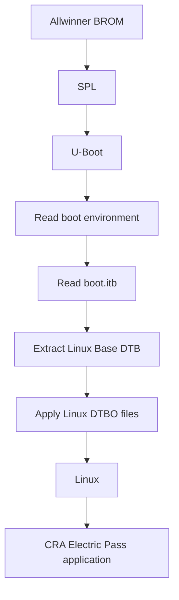
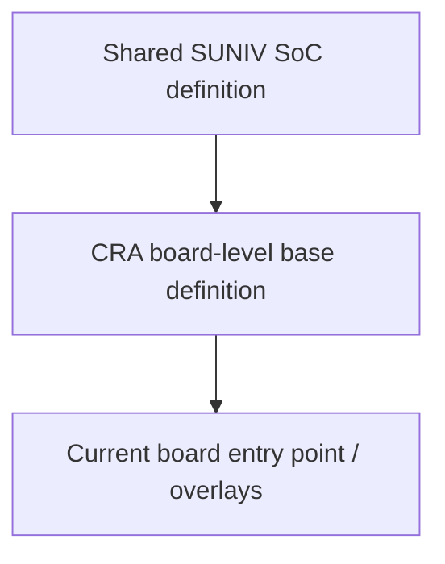
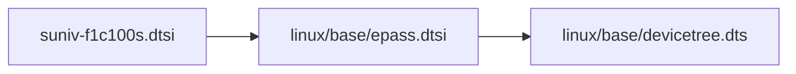
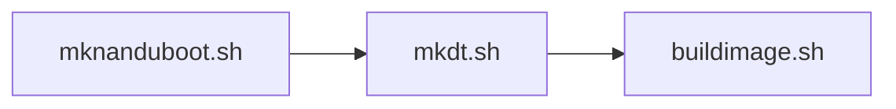
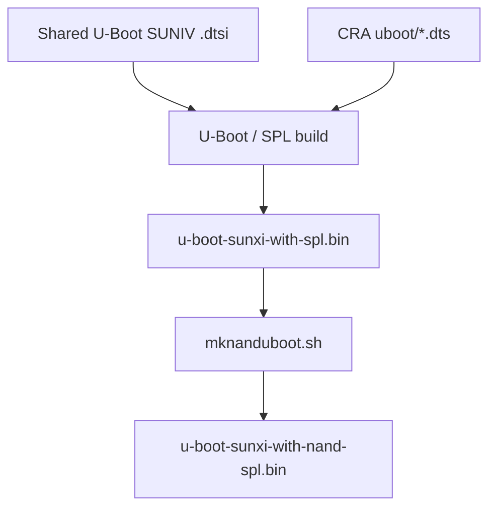
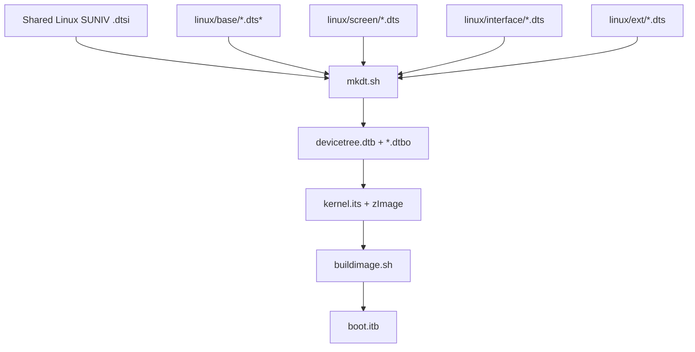
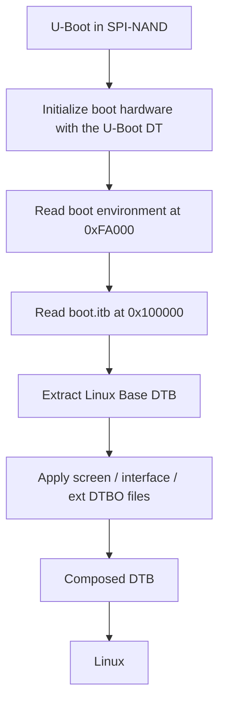

<div align="center">

# CRA Electric Pass Device Trees

<sub>Read this in other languages: [English](README_EN.md), [中文](README.md).</sub>

</div>

> [!NOTE]
> This directory contains the board-level device-tree sources for CRA Electric Pass, divided into two independent configurations for **U-Boot** and **Linux**.

<p align="center">
  <a href="#directory-structure">Directory Structure</a> ·
  <a href="#boot-stages">Boot Stages</a> ·
  <a href="#responsibility-boundaries">Responsibility Boundaries</a> ·
  <a href="#shared-soc-definitions">Shared SoC</a> ·
  <a href="#u-boot-device-tree">U-Boot</a> ·
  <a href="#linux-device-tree">Linux</a> ·
  <a href="#buildroot-build-relationships">Build Relationships</a> ·
  <a href="#from-source-to-boot">Complete Flow</a> ·
  <a href="#modification-entry-points">Modification Entry Points</a> ·
  <a href="#build-and-validation">Build and Validation</a>
</p>

---

## Directory Structure

<table>
<tr>
<td width="50%" valign="top">

### `uboot/`

**SPL / U-Boot stage**

Describes hardware that must be accessible before the kernel starts:

- SPI-NAND
- Boot UART
- USB DFU
- MMC
- Required SoC resources

[Details](uboot/README_EN.md)

</td>
<td width="50%" valign="top">

### `linux/`

**Linux runtime stage**

Describes the complete board hardware:

- LCD / backlight
- Screen overlays
- SoC interfaces
- External devices
- Linux driver parameters

[Details](linux/README_EN.md)

</td>
</tr>
</table>

```text
devicetree/
├─ uboot/
│  ├─ suniv-f1c100s-generic.dts
│  └─ README.md
└─ linux/
   ├─ base/
   ├─ screen/
   ├─ interface/
   ├─ ext/
   └─ README.md
```

| Directory | Stage | Main responsibility |
| :--- | :---: | :--- |
| `uboot/` | SPL / U-Boot | Boot flash, UART, USB DFU, MMC, and SoC resources required during boot |
| `linux/` | Linux | Main-board hardware, display, screens, interfaces, external devices, and Linux driver parameters |

---

## Boot Stages



<table>
<tr>
<td width="50%" valign="top">

### Bootloader Stage

Before Linux starts, SPL and U-Boot access:

- SPI-NAND
- UART
- USB DFU
- MMC / SD
- Clocks and base controllers

They use `devicetree/uboot/`.

</td>
<td width="50%" valign="top">

### Linux Stage

Linux reinitializes the hardware using a separate, more complete device tree:

- Display and backlight
- Input devices
- Storage
- Bus interfaces
- External devices

It uses `devicetree/linux/`.

</td>
</tr>
</table>

> [!IMPORTANT]
> The two device trees are not synchronized automatically. Changing `uboot/` does not alter the Linux runtime hardware configuration, and changing `linux/` does not alter SPL or U-Boot initialization.

---

## Responsibility Boundaries

| Hardware / Feature | U-Boot device tree | Linux device tree |
| :--- | :---: | :---: |
| SPI-NAND boot reads | Required | MTD, partitions, and runtime access |
| Boot UART console | Required | Linux console / general-purpose UART |
| USB DFU | Required | Gadget / Host / other modes |
| SD / MMC boot access | As required by the boot flow | Linux SD / MMC |
| LCD / backlight | Not currently managed | Complete configuration |
| ST7701 initialization | Not responsible | Screen overlay |
| LRADC buttons | Not responsible | Linux Base |
| I²C / I²S / SPI1 / UART expansion | Usually unnecessary | Interface overlay |
| CardKB / ES8311 / LSM6DS3 | Unnecessary | Ext overlay |

Current U-Boot configuration:

```text
# CONFIG_VIDEO_SUNXI is not set
```

Display initialization is handled during the Linux stage.

---

## Shared SoC Definitions

The CRA board DTS files do not redefine every register and internal controller in the F1C100S / F1C200S.

<table>
<tr>
<td width="50%" valign="top">

### Shared U-Boot Definition

```text
board/allwinner/suniv-f1c100s/
devicetree/uboot/
suniv-f1c100s.dtsi
```

</td>
<td width="50%" valign="top">

### Shared Linux Definition

```text
board/allwinner/suniv-f1c100s/
devicetree/linux/
suniv-f1c100s.dtsi
```

</td>
</tr>
</table>



The shared `.dtsi` files provide:

- Register addresses
- Clocks and resets
- Interrupts and DMA
- GPIO / pinctrl
- Base controller nodes

The CRA files define:

- Controller selection for the current PCB
- Pin multiplexing
- Node enablement state
- Board-level parameters

---

# U-Boot Device Tree

Board-level entry point:

```text
uboot/suniv-f1c100s-generic.dts
```

It includes the shared SUNIV definition:

```dts
#include "suniv-f1c100s.dtsi"
```

### Current Boot Resources

| Resource | State / Purpose |
| :--- | :--- |
| UART0 | Boot console |
| UART1 | Enabled |
| SPI0 | SPI-NAND boot |
| SPI-NAND | Primary boot storage |
| USB OTG / PHY / SRAM | DFU / USB Gadget |
| MMC0 | First MMC group |
| Second MMC group | Disabled because its pins conflict with SPI0 |

### Buildroot Reference

```text
BR2_TARGET_UBOOT_CUSTOM_DTS_PATH="
    board/allwinner/suniv-f1c100s/devicetree/uboot/suniv-f1c100s.dtsi
    board/cra/epass/devicetree/uboot/suniv-f1c100s-generic.dts"
```

Configuration file:

```text
board/cra/epass/uboot.defconfig
```

Default device tree:

```text
CONFIG_DEFAULT_DEVICE_TREE="suniv-f1c100s-generic"
```

---

# Linux Device Tree

Base entry points:

```text
linux/base/epass.dtsi
linux/base/devicetree.dts
```

### Buildroot Reference

```text
BR2_LINUX_KERNEL_CUSTOM_DTS_PATH="
    board/allwinner/suniv-f1c100s/devicetree/linux/suniv-f1c100s.dtsi
    board/cra/epass/devicetree/linux/base/epass.dtsi
    board/cra/epass/devicetree/linux/base/devicetree.dts"
```

### Base Relationship



### Overlay Layers

<table>
<tr>
<td width="33%" valign="top">

### Screen

`linux/screen/`

**Exactly one required**

- BOE
- HSD
- Laowu

</td>
<td width="33%" valign="top">

### Interface

`linux/interface/`

**Optional; multiple allowed**

- ADC
- I²C
- I²S
- SPI
- UART
- USB

</td>
<td width="33%" valign="top">

### Ext

`linux/ext/`

**Optional; multiple allowed**

- CardKB
- ES8311
- LSM6DS3

</td>
</tr>
</table>

U-Boot application order:

```text
base → screen → interface → ext
```

---

## Buildroot Build Relationships

| Component | Current version |
| :--- | :---: |
| Linux | `5.4.99` |
| U-Boot | `2020.07` |

Main configuration:

```text
board/cra/epass/cra_epass_defconfig
```

This configuration selects the Linux and U-Boot versions, patches, defconfigs, DTS files, and image post-processing scripts in one place.

### Image Post-Processing



| Script | Purpose |
| :--- | :--- |
| `mknanduboot.sh` | Rearranges SPL / U-Boot for the SPI-NAND page layout |
| `mkdt.sh` | Compiles the Linux Base DTB and all DTBO files |
| `buildimage.sh` | Generates the UBI rootfs and packages `boot.itb` according to `kernel.its` |

---

## From Source to Boot

### U-Boot Build Flow



### Linux Device-Tree Flow



### Physical-Device Boot Flow



---

## Generated Files

| File | Source | Purpose |
| :--- | :--- | :--- |
| `output/images/u-boot-sunxi-with-spl.bin` | U-Boot build | NAND page-layout processing has not yet been applied |
| `output/images/u-boot-sunxi-with-nand-spl.bin` | `mknanduboot.sh` | Final U-Boot image for the physical SPI-NAND |
| `output/images/dt/base/devicetree.dtb` | `mkdt.sh` | Linux Base DTB |
| `output/images/dt/screen/*.dtbo` | `mkdt.sh` | Screen overlays |
| `output/images/dt/interface/*.dtbo` | `mkdt.sh` | Interface overlays |
| `output/images/dt/ext/*.dtbo` | `mkdt.sh` | Ext overlays |
| `output/images/boot.itb` | `buildimage.sh` | Kernel + DTB + DTBO FIT image |

> [!WARNING]
> Do not edit `output/build/` or `output/images/dt/` directly. These directories contain generated build artifacts and are overwritten by cleaning or rebuilding.

---

## File Types

| Extension | Meaning |
| :--- | :--- |
| `.dtsi` | Shared device-tree source included by other DTS files |
| `.dts` | Device-tree entry point or overlay source |
| `.dtb` | Compiled base device tree |
| `.dtbo` | Compiled device-tree overlay |
| `.its` | FIT text description |
| `.itb` | FIT binary image |

Recommended comment style:

```dts
/* C-style comment */
```

---

# Modification Entry Points

| Requirement | Location to modify |
| :--- | :--- |
| U-Boot UART output | `uboot/`, `uboot.defconfig`, and U-Boot patches |
| Linux UART | `linux/base/` or `linux/interface/` |
| SPL / U-Boot SPI-NAND | `uboot/`, U-Boot configuration, and U-Boot patches |
| Linux MTD partitions | `linux/base/` + bootargs + image layout |
| Screen initialization | `linux/screen/` |
| LCD timings / display pipeline | `linux/base/` + screen + kernel patch |
| Backlight / buttons | `linux/base/` |
| I²C / I²S / SPI1 / UART | `linux/interface/` |
| External devices | `linux/ext/` |
| U-Boot DFU | `uboot/` + U-Boot patch / configuration |
| Linux USB mode | `linux/interface/` + Linux patch |
| Application UI | `drm_app_neo`; not part of the device tree |

> [!IMPORTANT]
> When a change involves boot storage, UART, USB, clocks, or shared physical pins, search both device trees, their configurations, patches, and scripts for every related reference.

---

## File-Name and Label Coupling

When renaming a DTS file, also check:

```text
cra_epass_defconfig
BR2_*_CUSTOM_DTS_PATH
CONFIG_DEFAULT_DEVICE_TREE
mkdt.sh
kernel.its
uboot.env
uEnv.txt
flash.py
README
```

When renaming a base-node label, search all overlays for references such as:

```text
i2c0
i2s0
pio
st7701initseq
usb_otg
```

> [!CAUTION]
> If a label or file-name change is not propagated to the overlays, FIT description, and boot environment, a DTBO may fail to compile, package, or apply correctly in U-Boot.

---

## Build and Validation

### Complete Build

```sh
make cra_epass_defconfig
make
```

### Inspect the FIT Image

```sh
output/host/bin/mkimage -l output/images/boot.itb
```

### Decompile the Linux Base DTB

```sh
dtc -I dtb -O dts \
    -o devicetree-linux.decoded.dts \
    output/images/dt/base/devicetree.dtb
```

### Decompile the U-Boot DTB

```sh
dtc -I dtb -O dts \
    -o devicetree-uboot.decoded.dts \
    output/build/uboot-2020.07/u-boot.dtb
```

### Checklist

- The U-Boot DTB enables only the controllers required during the boot stage
- The Linux Base DTB contains the symbols required by the DTBO files
- Every DTB / DTBO referenced by `kernel.its` exists
- FIT node names exactly match `screen`, `interface`, and `ext`
- Conflicting pins are not enabled simultaneously
- `boot.itb` does not exceed the **5 MiB** limit enforced by U-Boot `checkfit`
- The final U-Boot image is `u-boot-sunxi-with-nand-spl.bin`

> [!NOTE]
> A successful device-tree build confirms only that syntax, references, and structure satisfy the toolchain. It does not prove that the PCB wiring, logic levels, timings, driver dependencies, or overlay combinations have been validated on physical hardware.

---

<div align="center">

<sub><b>CRA Electric Pass</b> · Device Tree architecture</sub>

</div>
