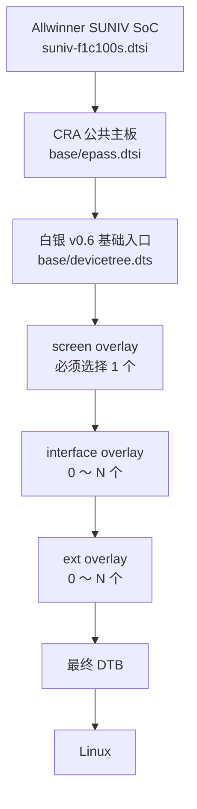
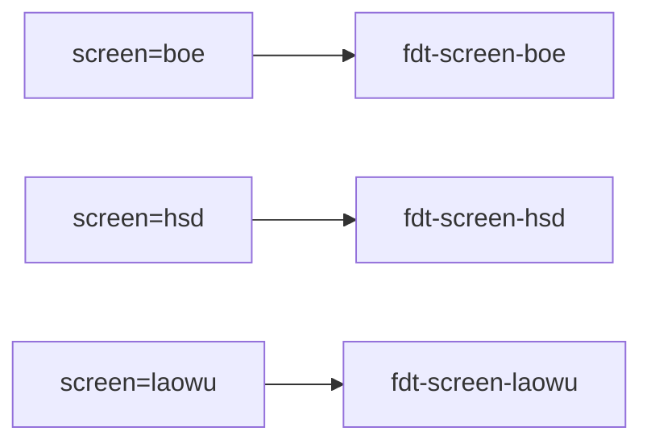
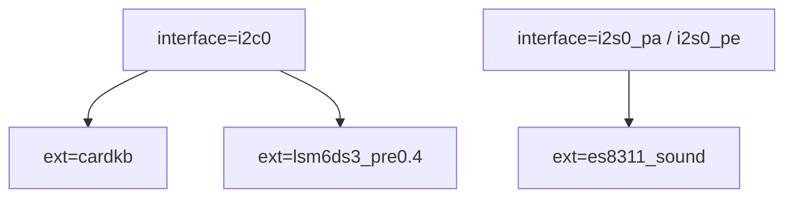
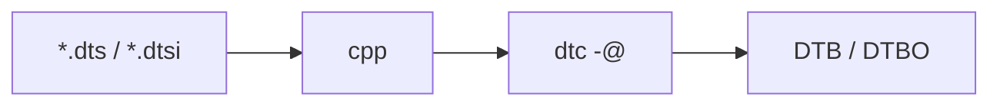
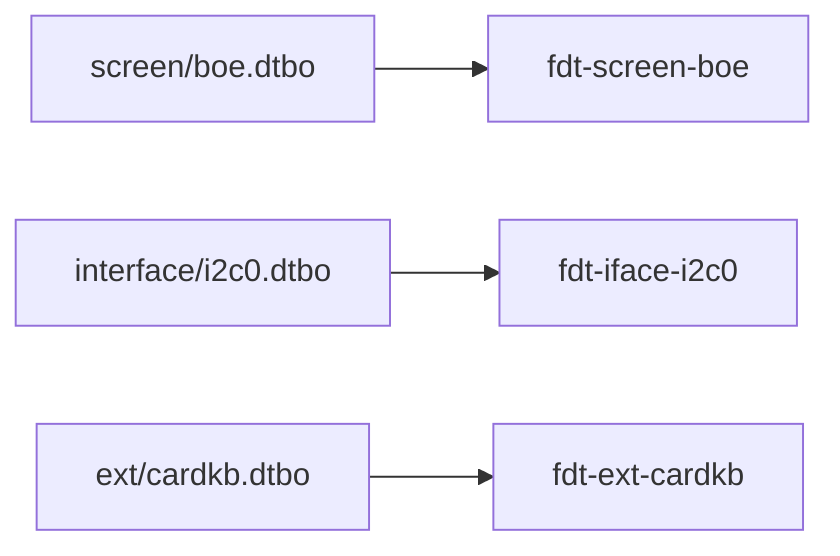
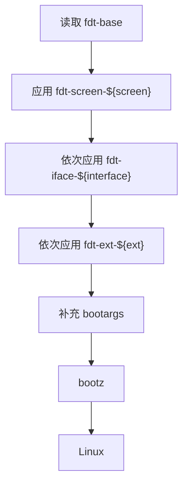
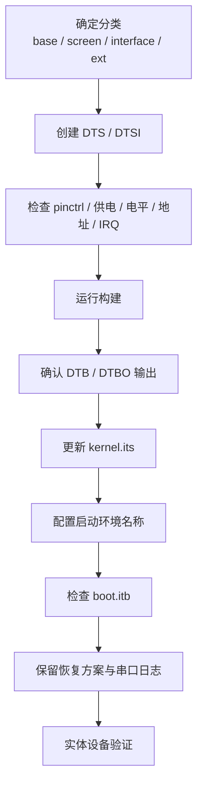

<div align="center">

# CRA Electric Pass Linux 设备树

<sub>Read this in other languages: [English](README_EN.md), [中文](README.md).</sub>

</div>

> [!NOTE]
> 本目录保存 CRA Electric Pass 在 Linux 阶段使用的基础设备树和设备树覆盖层。

> [!IMPORTANT]
> Linux 设备树与 SPL / U-Boot 自身使用的设备树相互独立。

SPL / U-Boot 设备树位于：

```text
board/cra/epass/devicetree/uboot/
```

<p align="center">
  <a href="#目录结构">目录结构</a> ·
  <a href="#设备树组合">组合关系</a> ·
  <a href="#基础设备树">Base</a> ·
  <a href="#屏幕覆盖层">Screen</a> ·
  <a href="#接口覆盖层">Interface</a> ·
  <a href="#外接设备覆盖层">Ext</a> ·
  <a href="#编译与-fit-打包">编译打包</a> ·
  <a href="#u-boot-启动组合">启动组合</a> ·
  <a href="#常见依赖与冲突">依赖冲突</a>
</p>

---

## 目录结构

<table>
<tr>
<td width="25%" valign="top">

### `base/`

**DTB**

主板固定硬件与基础节点。

[详细说明](base/README.md)

</td>
<td width="25%" valign="top">

### `screen/`

**DTBO**

LCD 型号与 ST7701 初始化。

[详细说明](screen/README.md)

</td>
<td width="25%" valign="top">

### `interface/`

**DTBO**

SoC 控制器、GPIO 复用与 USB 模式。

[详细说明](interface/README.md)

</td>
<td width="25%" valign="top">

### `ext/`

**DTBO**

连接在接口上的具体外部设备。

[详细说明](ext/README.md)

</td>
</tr>
</table>

```text
devicetree/linux/
├─ base/
│  ├─ epass.dtsi
│  └─ devicetree.dts
├─ screen/
│  ├─ boe.dts
│  ├─ hsd.dts
│  └─ laowu.dts
├─ interface/
│  ├─ adc_pa1.dts
│  ├─ adc_pa123.dts
│  ├─ i2c0.dts
│  ├─ i2s0_pa.dts
│  ├─ i2s0_pe.dts
│  ├─ spi1.dts
│  ├─ uart1.dts
│  ├─ uart2.dts
│  ├─ usbhost.dts
│  └─ usbhs.dts
└─ ext/
   ├─ cardkb.dts
   ├─ es8311_sound.dts
   └─ lsm6ds3_pre0.4.dts
```

| 目录 | 生成类型 | 职责 |
| :--- | :---: | :--- |
| `base/` | DTB | 主板固定硬件，并提供其他覆盖层引用的节点与标签 |
| `screen/` | DTBO | 选择 LCD 对应的 ST7701 初始化序列与显示差异 |
| `interface/` | DTBO | 启用 SoC 控制器、选择引脚复用或切换 USB 工作模式 |
| `ext/` | DTBO | 声明连接在已启用接口上的具体外设 |

---

## 设备树组合

Linux 最终使用的设备树由基础 DTB 与若干 DTBO 在 U-Boot 中动态组合。



固定应用顺序：

```text
base → screen → interface → ext
```

> [!WARNING]
> 后应用的覆盖层可能覆盖前面已经写入的属性。多个控制器即使占用同一物理引脚，设备树也可能正常合并，资源冲突通常要到 Linux 驱动探测阶段才会暴露。

---

## 基础设备树

Buildroot 配置通过：

```text
BR2_LINUX_KERNEL_DTS_SUPPORT=y
BR2_LINUX_KERNEL_CUSTOM_DTS_PATH="
    board/allwinner/suniv-f1c100s/devicetree/linux/suniv-f1c100s.dtsi
    board/cra/epass/devicetree/linux/base/epass.dtsi
    board/cra/epass/devicetree/linux/base/devicetree.dts"
```

向 Linux 构建系统提供三层基础定义。


| 文件 | 作用 |
| :--- | :--- |
| `suniv-f1c100s.dtsi` | F1C100S / F1C200S SoC 公共控制器定义 |
| `epass.dtsi` | 设备型号、显示、电源、背光、GPIO、SPI-NAND、串口、SD、USB、视频引擎与基础外设状态 |
| `devicetree.dts` | 基础入口，补充关机 GPIO、ST7701 初始化引脚与 LRADC 按键 |

生成文件：

```text
output/images/dt/base/devicetree.dtb
```

---

## 屏幕覆盖层

启动时必须选择一个与实体 LCD 匹配的屏幕覆盖层。

| 启动值 | 源文件 | 主要区别 |
| :--- | :--- | :--- |
| `screen=boe` | `screen/boe.dts` | BOE ST7701 初始化序列 |
| `screen=hsd` | `screen/hsd.dts` | HSD ST7701 初始化序列 |
| `screen=laowu` | `screen/laowu.dts` | HSD 初始化序列 + TCON0 红蓝通道交换 |

输出：

```text
output/images/dt/screen/boe.dtbo
output/images/dt/screen/hsd.dtbo
output/images/dt/screen/laowu.dtbo
```



> [!CAUTION]
> `screen` 为空或名称与 FIT 节点不匹配时，U-Boot 无法提取正确的屏幕覆盖层，显示初始化不可用，启动过程也可能失败。

---

## 接口覆盖层

`interface/` 负责启用 SoC 内部控制器与选择引脚布局，不声明总线上的具体外设。

| 启动值 | 作用 |
| :--- | :--- |
| `adc_pa1` | 在默认 PA0 基础上增加 PA1 ADC |
| `adc_pa123` | 启用 PA0～PA3 四路 ADC |
| `i2c0` | 启用硬件 I²C0 |
| `i2s0_pa` | 使用 PA 引脚布局启用 I²S0 |
| `i2s0_pe` | 使用 PE 引脚布局启用 I²S0 |
| `spi1` | 启用 SPI1 与预设 Spidev |
| `uart1` | 启用 UART1 |
| `uart2` | 启用 UART2 |
| `usbhost` | 将 USB OTG 固定为 Host |
| `usbhs` | 请求项目定制 USB High-Speed |

多个接口使用空格分隔：

```text
interface=i2c0 uart1
```

U-Boot 按书写顺序依次应用。

> [!IMPORTANT]
> 接口名称必须与源文件名及 FIT 节点后缀一致。

---

## 外接设备覆盖层

`ext/` 描述连接在主板接口上的具体外设。

| 启动值 | 外接设备 | 主要依赖 |
| :--- | :--- | :--- |
| `cardkb` | M5Stack Unit CardKB | `interface=i2c0` |
| `es8311_sound` | Everest ES8311 音频编解码器 | `i2s0_pa` 或 `i2s0_pe` |
| `lsm6ds3_pre0.4` | ST LSM6DS3 六轴惯性传感器 | `interface=i2c0`，并需处理 PE2 冲突 |

典型组合：

```text
interface=i2c0
ext=cardkb
```

多个外设同样使用空格分隔：

```text
ext=cardkb lsm6ds3_pre0.4
```



> [!WARNING]
> 启用外设前必须核对供电、电平、总线地址、物理接线和 GPIO 复用。DTBO 能编译并不表示该组合可在当前实体硬件上安全使用。

---

## 编译与 FIT 打包

### Device Tree 编译

统一构建脚本：

```text
board/cra/epass/scripts/mkdt.sh
```



C 预处理：

```sh
cpp -nostdinc \
    -I "${BUILD_DIR}/linux-5.4.99/include/" \
    -I "${BUILD_DIR}/linux-5.4.99/arch/arm/boot/dts" \
    -P -undef -x assembler-with-cpp
```

DTC：

```sh
dtc -@ -I dts -O dtb
```

`-@` 保留 Overlay 所需的符号与修复信息，使 DTBO 能引用基础设备树中的标签。

输出结构：

```text
output/images/dt/
├─ base/
│  └─ devicetree.dtb
├─ screen/
│  ├─ boe.dtbo
│  ├─ hsd.dtbo
│  └─ laowu.dtbo
├─ interface/
│  └─ *.dtbo
└─ ext/
   └─ *.dtbo
```

> [!WARNING]
> `mkdt.sh` 当前直接引用 `linux-5.4.99` 头文件路径。升级 Linux 版本时必须同步修改脚本中的两个 include 路径。

### FIT 打包

打包描述：

```text
board/cra/epass/scripts/kernel.its
```

最终镜像：

```text
output/images/boot.itb
```

| 文件类型 | FIT 节点命名 |
| :--- | :--- |
| Linux 内核 | `kernel` |
| 基础设备树 | `fdt-base` |
| 屏幕覆盖层 | `fdt-screen-<名称>` |
| 接口覆盖层 | `fdt-iface-<名称>` |
| 外接设备覆盖层 | `fdt-ext-<名称>` |

示例：



> [!IMPORTANT]
> `mkdt.sh` 会自动编译目录中的 `.dts`，`kernel.its` 不会自动发现新文件。新增、删除或重命名覆盖层后必须同步修改 `kernel.its`。

---

## U-Boot 启动组合

U-Boot 默认环境：

```text
board/cra/epass/uboot.env
```

启动时先提取基础设备树：

```text
imxtract $fitaddr fdt-base $dtbaddr
```

屏幕覆盖层：

```text
imxtract $fitaddr fdt-screen-${screen} $dtboaddr
fdt apply $dtboaddr
```

接口与外设覆盖层：

```text
for ov in ${interface}
    imxtract $fitaddr fdt-iface-${ov} $dtboaddr
    fdt apply $dtboaddr

for ov in ${ext}
    imxtract $fitaddr fdt-ext-${ov} $dtboaddr
    fdt apply $dtboaddr
```

完整链路：



---

## 启动环境

模板：

```text
board/cra/epass/uEnv.txt
```

当前默认：

```text
interface=
ext=
```

`screen=` 由现有 `flash.py` 在运行时写入生成的 `.bootenv.txt`。

完整示例：

```text
screen=hsd
interface=i2c0
ext=cardkb
```

| 字段 | 规则 |
| :--- | :--- |
| `screen` | 必须为有效屏幕名称 |
| `interface` | 0～多个，空格分隔 |
| `ext` | 0～多个，空格分隔 |
| 名称匹配 | 必须与 FIT 节点后缀完全一致 |

> [!CAUTION]
> 大小写、下划线、小数点都属于名称的一部分。启动环境与 `kernel.its` 节点后缀不一致时，U-Boot 无法提取对应 Overlay。

---

## 常见依赖与冲突

| 组合 | 说明 |
| :--- | :--- |
| `cardkb` + `i2c0` | CardKB 依赖硬件 I²C0 |
| `lsm6ds3_pre0.4` + `i2c0` | LSM6DS3 依赖硬件 I²C0 |
| `es8311_sound` + `i2s0_pa` / `i2s0_pe` | ES8311 音频数据依赖 I²S0 |
| `i2s0_pa` / `i2s0_pe` | 两种 I²S0 pinctrl 布局只能择一 |
| `adc_pa1` / `adc_pa123` | 两种 ADC 引脚范围通常只能择一 |
| `usbhost` + `usbhs` | 同时修改 USB 控制器，组合使用前必须验证 |
| `lsm6ds3_pre0.4` + 关机控制 | 都涉及 PE2 |
| ADC / UART1 / I²S0 PA | 部分配置复用 PA1～PA3 |
| UART2 / SPI1 | PE7、PE8 重叠 |


> [!IMPORTANT]
> 前一阶段成功不能替代后一阶段验证。U-Boot 不负责检查 GPIO、电平、供电和外设电气冲突。

---

## 添加新设备树配置



请勿直接编辑：

```text
output/images/dt/
```

该目录属于构建产物，重新运行 `mkdt.sh` 后会被删除并重新生成。

---

## 构建与检查

### 完整构建

```sh
make cra_epass_defconfig
make
```

重点检查：

```text
output/images/dt/base/devicetree.dtb
output/images/dt/screen/*.dtbo
output/images/dt/interface/*.dtbo
output/images/dt/ext/*.dtbo
output/images/boot.itb
```

### 查看 FIT 节点

```sh
output/host/bin/mkimage -l output/images/boot.itb
```

### 反编译基础 DTB

```sh
dtc -I dtb -O dts \
    -o devicetree.decoded.dts \
    output/images/dt/base/devicetree.dtb
```

### 检查项

- 基础 DTB 包含覆盖层需要引用的符号
- `kernel.its` 引用的文件实际存在
- `screen` 对应 FIT 节点存在
- `interface` 与 `ext` 名称映射正确
- 没有错误启用占用同一物理引脚的控制器
- `boot.itb` 总大小不超过 U-Boot `checkfit` 的 **5 MiB** 限制

---

<div align="center">

<sub><b>CRA Electric Pass</b> · Linux Device Tree architecture</sub>

</div>
