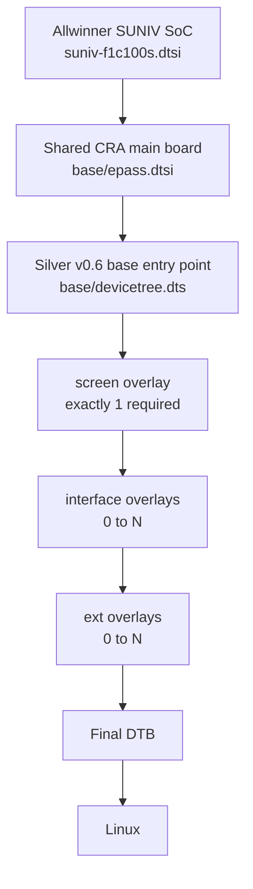
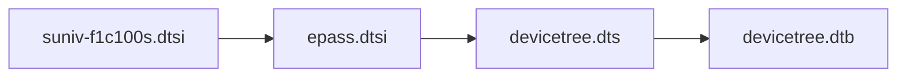
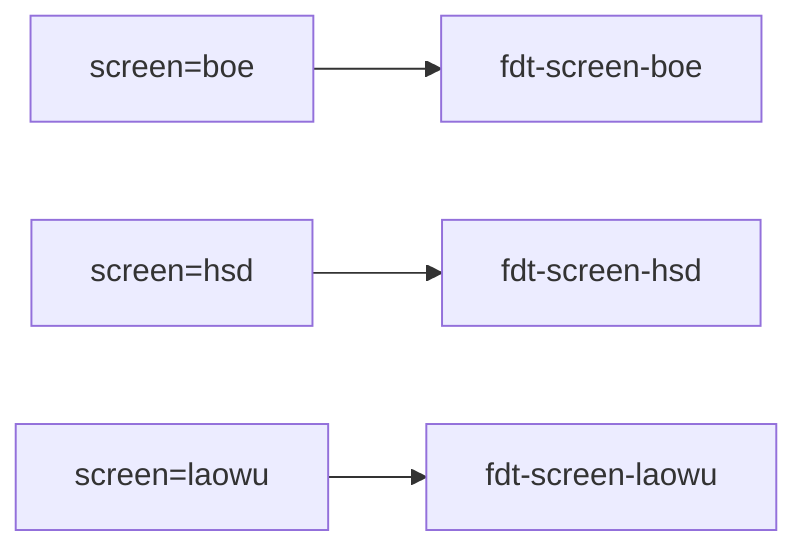
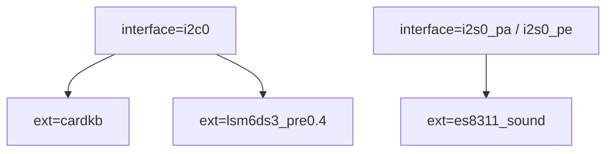
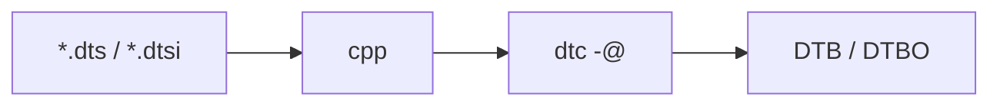
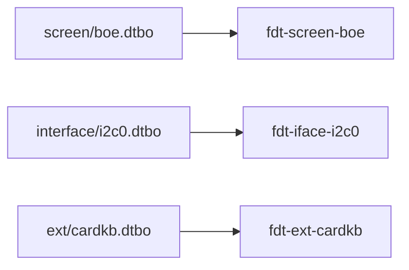
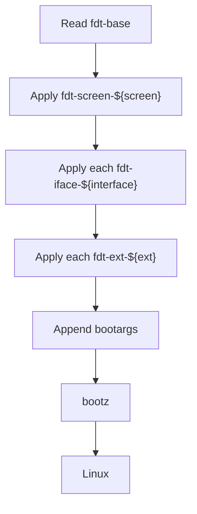
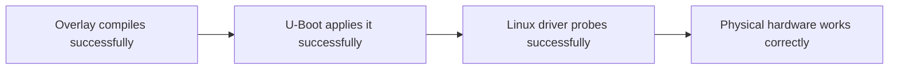
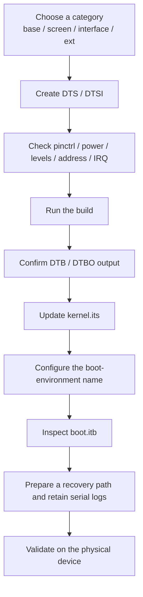

<div align="center">

# CRA Electric Pass Linux Device Trees

<sub>Read this in other languages: [English](README_EN.md), [中文](README.md).</sub>

</div>

> [!NOTE]
> This directory contains the base device tree and device-tree overlays used by CRA Electric Pass during the Linux stage.

> [!IMPORTANT]
> The Linux device tree is independent of the device trees used by SPL and U-Boot themselves.

The SPL / U-Boot device trees are located at:

```text
board/cra/epass/devicetree/uboot/
```

<p align="center">
  <a href="#directory-structure">Directory Structure</a> ·
  <a href="#device-tree-composition">Composition</a> ·
  <a href="#base-device-tree">Base</a> ·
  <a href="#screen-overlays">Screen</a> ·
  <a href="#interface-overlays">Interface</a> ·
  <a href="#external-device-overlays">Ext</a> ·
  <a href="#compilation-and-fit-packaging">Compilation and Packaging</a> ·
  <a href="#u-boot-boot-composition">Boot Composition</a> ·
  <a href="#common-dependencies-and-conflicts">Dependencies and Conflicts</a>
</p>

---

## Directory Structure

<table>
<tr>
<td width="25%" valign="top">

### `base/`

**DTB**

Fixed main-board hardware and base nodes.

[Details](base/README_EN.md)

</td>
<td width="25%" valign="top">

### `screen/`

**DTBO**

LCD model selection and ST7701 initialization.

[Details](screen/README_EN.md)

</td>
<td width="25%" valign="top">

### `interface/`

**DTBO**

SoC controllers, GPIO pin multiplexing, and USB modes.

[Details](interface/README_EN.md)

</td>
<td width="25%" valign="top">

### `ext/`

**DTBO**

Specific external devices connected to the interfaces.

[Details](ext/README_EN.md)

</td>
</tr>
</table>

```text
devicetree/linux/
├─ base/
│  ├─ epass.dtsi
│  └─ devicetree.dts
├─ screen/
│  ├─ boe.dts
│  ├─ hsd.dts
│  └─ laowu.dts
├─ interface/
│  ├─ adc_pa1.dts
│  ├─ adc_pa123.dts
│  ├─ i2c0.dts
│  ├─ i2s0_pa.dts
│  ├─ i2s0_pe.dts
│  ├─ spi1.dts
│  ├─ uart1.dts
│  ├─ uart2.dts
│  ├─ usbhost.dts
│  └─ usbhs.dts
└─ ext/
   ├─ cardkb.dts
   ├─ es8311_sound.dts
   └─ lsm6ds3_pre0.4.dts
```

| Directory | Generated type | Responsibility |
| :--- | :---: | :--- |
| `base/` | DTB | Describes fixed main-board hardware and provides the nodes and labels referenced by other overlays |
| `screen/` | DTBO | Selects the ST7701 initialization sequence and display-specific behavior for the LCD |
| `interface/` | DTBO | Enables SoC controllers, selects pin multiplexing, or switches USB operating modes |
| `ext/` | DTBO | Declares specific peripherals attached to interfaces that have already been enabled |

---

## Device-Tree Composition

U-Boot dynamically combines the base DTB with one or more DTBO files to produce the device tree used by Linux.



Fixed application order:

```text
base → screen → interface → ext
```

> [!WARNING]
> An overlay applied later may override properties written by an earlier one. Device trees can merge successfully even when multiple controllers claim the same physical pins; such resource conflicts often become visible only when Linux drivers probe the hardware.

---

## Base Device Tree

The Buildroot configuration supplies three layers of base definitions to the Linux build system through:

```text
BR2_LINUX_KERNEL_DTS_SUPPORT=y
BR2_LINUX_KERNEL_CUSTOM_DTS_PATH="
    board/allwinner/suniv-f1c100s/devicetree/linux/suniv-f1c100s.dtsi
    board/cra/epass/devicetree/linux/base/epass.dtsi
    board/cra/epass/devicetree/linux/base/devicetree.dts"
```



| File | Purpose |
| :--- | :--- |
| `suniv-f1c100s.dtsi` | Shared controller definitions for the F1C100S / F1C200S SoC |
| `epass.dtsi` | Device identity, display, power, backlight, GPIO, SPI-NAND, UART, SD, USB, video engine, and default peripheral states |
| `devicetree.dts` | Base entry point that adds the power-off GPIO, ST7701 initialization pins, and LRADC buttons |

Generated file:

```text
output/images/dt/base/devicetree.dtb
```

---

## Screen Overlays

At boot, exactly one screen overlay matching the physical LCD must be selected.

| Boot value | Source file | Main difference |
| :--- | :--- | :--- |
| `screen=boe` | `screen/boe.dts` | BOE ST7701 initialization sequence |
| `screen=hsd` | `screen/hsd.dts` | HSD ST7701 initialization sequence |
| `screen=laowu` | `screen/laowu.dts` | HSD initialization sequence plus TCON0 red/blue channel swapping |

Output:

```text
output/images/dt/screen/boe.dtbo
output/images/dt/screen/hsd.dtbo
output/images/dt/screen/laowu.dtbo
```



> [!CAUTION]
> If `screen` is empty or does not match a FIT node name, U-Boot cannot extract the correct screen overlay. Display initialization will be unavailable, and the boot process may also fail.

---

## Interface Overlays

`interface/` enables internal SoC controllers and selects pin layouts. It does not declare specific devices on those buses.

| Boot value | Purpose |
| :--- | :--- |
| `adc_pa1` | Adds PA1 as an ADC pin alongside the default PA0 |
| `adc_pa123` | Enables all four ADC pins from PA0 through PA3 |
| `i2c0` | Enables hardware I²C0 |
| `i2s0_pa` | Enables I²S0 with the PA pin layout |
| `i2s0_pe` | Enables I²S0 with the PE pin layout |
| `spi1` | Enables SPI1 and the predefined Spidev node |
| `uart1` | Enables UART1 |
| `uart2` | Enables UART2 |
| `usbhost` | Forces USB OTG into Host mode |
| `usbhs` | Requests the project's custom USB High-Speed mode |

Separate multiple interfaces with spaces:

```text
interface=i2c0 uart1
```

U-Boot applies them in the order listed.

> [!IMPORTANT]
> Each interface name must match both its source-file name and the corresponding FIT node suffix.

---

## External-Device Overlays

`ext/` describes specific peripherals connected to main-board interfaces.

| Boot value | External device | Main dependency |
| :--- | :--- | :--- |
| `cardkb` | M5Stack Unit CardKB | `interface=i2c0` |
| `es8311_sound` | Everest ES8311 audio codec | `i2s0_pa` or `i2s0_pe` |
| `lsm6ds3_pre0.4` | ST LSM6DS3 six-axis inertial sensor | `interface=i2c0`, with the PE2 conflict resolved |

Typical composition:

```text
interface=i2c0
ext=cardkb
```

Separate multiple external devices with spaces as well:

```text
ext=cardkb lsm6ds3_pre0.4
```



> [!WARNING]
> Before enabling a peripheral, verify its power supply, logic levels, bus address, physical wiring, and GPIO pin multiplexing. A DTBO that compiles successfully is not necessarily safe to use on the current physical hardware.

---

## Compilation and FIT Packaging

### Device-Tree Compilation

Unified build script:

```text
board/cra/epass/scripts/mkdt.sh
```



C preprocessing:

```sh
cpp -nostdinc \
    -I "${BUILD_DIR}/linux-5.4.99/include/" \
    -I "${BUILD_DIR}/linux-5.4.99/arch/arm/boot/dts" \
    -P -undef -x assembler-with-cpp
```

DTC:

```sh
dtc -@ -I dts -O dtb
```

`-@` preserves the symbols and fixup information required by overlays, allowing DTBO files to reference labels in the base device tree.

Output structure:

```text
output/images/dt/
├─ base/
│  └─ devicetree.dtb
├─ screen/
│  ├─ boe.dtbo
│  ├─ hsd.dtbo
│  └─ laowu.dtbo
├─ interface/
│  └─ *.dtbo
└─ ext/
   └─ *.dtbo
```

> [!WARNING]
> `mkdt.sh` currently references the Linux `5.4.99` header paths directly. When upgrading Linux, update both include paths in the script.

### FIT Packaging

Packaging description:

```text
board/cra/epass/scripts/kernel.its
```

Final image:

```text
output/images/boot.itb
```

| File type | FIT node naming |
| :--- | :--- |
| Linux kernel | `kernel` |
| Base device tree | `fdt-base` |
| Screen overlay | `fdt-screen-<name>` |
| Interface overlay | `fdt-iface-<name>` |
| External-device overlay | `fdt-ext-<name>` |

Example:



> [!IMPORTANT]
> `mkdt.sh` automatically compiles the `.dts` files in these directories, but `kernel.its` does not discover new files automatically. Update `kernel.its` whenever an overlay is added, removed, or renamed.

---

## U-Boot Boot Composition

Default U-Boot environment:

```text
board/cra/epass/uboot.env
```

U-Boot first extracts the base device tree:

```text
imxtract $fitaddr fdt-base $dtbaddr
```

Screen overlay:

```text
imxtract $fitaddr fdt-screen-${screen} $dtboaddr
fdt apply $dtboaddr
```

Interface and external-device overlays:

```text
for ov in ${interface}
    imxtract $fitaddr fdt-iface-${ov} $dtboaddr
    fdt apply $dtboaddr

for ov in ${ext}
    imxtract $fitaddr fdt-ext-${ov} $dtboaddr
    fdt apply $dtboaddr
```

Complete flow:



---

## Boot Environment

Template:

```text
board/cra/epass/uEnv.txt
```

Current defaults:

```text
interface=
ext=
```

The existing `flash.py` writes `screen=` to the generated `.bootenv.txt` at runtime.

Complete example:

```text
screen=hsd
interface=i2c0
ext=cardkb
```

| Field | Rule |
| :--- | :--- |
| `screen` | Must be a valid screen name |
| `interface` | Zero or more values separated by spaces |
| `ext` | Zero or more values separated by spaces |
| Name matching | Must exactly match the corresponding FIT node suffix |

> [!CAUTION]
> Letter case, underscores, and periods are all part of a name. If the boot environment does not match the suffix used in `kernel.its`, U-Boot cannot extract the corresponding overlay.

---

## Common Dependencies and Conflicts

| Combination | Description |
| :--- | :--- |
| `cardkb` + `i2c0` | CardKB depends on hardware I²C0 |
| `lsm6ds3_pre0.4` + `i2c0` | LSM6DS3 depends on hardware I²C0 |
| `es8311_sound` + `i2s0_pa` / `i2s0_pe` | ES8311 audio data depends on I²S0 |
| `i2s0_pa` / `i2s0_pe` | Only one of the two I²S0 pinctrl layouts may normally be selected |
| `adc_pa1` / `adc_pa123` | Only one of the two ADC pin ranges may normally be selected |
| `usbhost` + `usbhs` | Both modify the USB controller and must be validated before use together |
| `lsm6ds3_pre0.4` + power-off control | Both use PE2 |
| ADC / UART1 / I²S0 PA | Some configurations share PA1 through PA3 |
| UART2 / SPI1 | PE7 and PE8 overlap |



> [!IMPORTANT]
> Success at one stage does not replace validation at the next. U-Boot does not check GPIO assignments, logic levels, power supplies, or electrical conflicts between peripherals.

---

## Adding a New Device-Tree Configuration



Do not edit the following directory directly:

```text
output/images/dt/
```

It contains generated build artifacts and is deleted and recreated whenever `mkdt.sh` runs.

---

## Build and Inspection

### Complete Build

```sh
make cra_epass_defconfig
make
```

Check these outputs:

```text
output/images/dt/base/devicetree.dtb
output/images/dt/screen/*.dtbo
output/images/dt/interface/*.dtbo
output/images/dt/ext/*.dtbo
output/images/boot.itb
```

### List FIT Nodes

```sh
output/host/bin/mkimage -l output/images/boot.itb
```

### Decompile the Base DTB

```sh
dtc -I dtb -O dts \
    -o devicetree.decoded.dts \
    output/images/dt/base/devicetree.dtb
```

### Checklist

- The base DTB contains the symbols required by the overlays
- Every file referenced by `kernel.its` exists
- The FIT node selected by `screen` exists
- The `interface` and `ext` names map to the correct FIT nodes
- Controllers that occupy the same physical pins are not enabled together by mistake
- The total size of `boot.itb` does not exceed the **5 MiB** limit enforced by U-Boot `checkfit`

---

<div align="center">

<sub><b>CRA Electric Pass</b> · Linux Device Tree architecture</sub>

</div>
