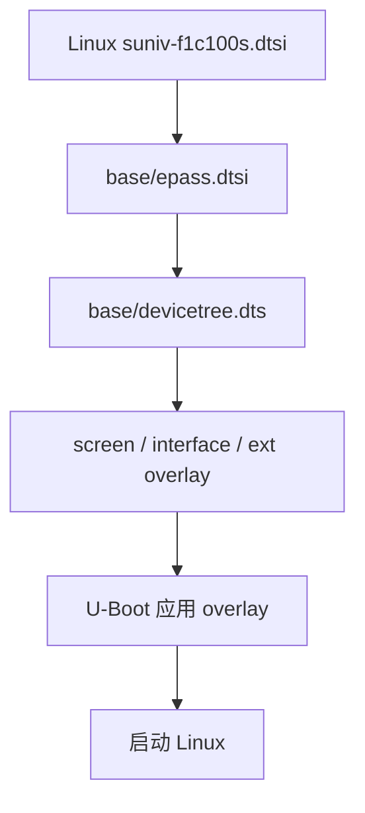
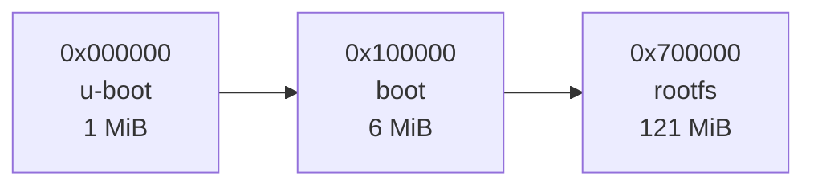

<div align="center">

# CRA Electric Pass 基础设备树

<sub>Read this in other languages: [English](README_EN.md), [中文](README.md).</sub>

</div>

> [!NOTE]
> 本目录保存 CRA Electric Pass 的 Linux 基础设备树。

<p align="center">
  <a href="#文件说明">文件说明</a> ·
  <a href="#组合关系">组合关系</a> ·
  <a href="#epassdtsi"><code>epass.dtsi</code></a> ·
  <a href="#devicetreedts"><code>devicetree.dts</code></a> ·
  <a href="#overlay">Overlay</a> ·  
  <a href="#构建与验证">构建验证</a>
</p>

---

## 文件说明

<table>
<tr>
<td width="50%" valign="top">

### `epass.dtsi`

电子通行证公共硬件描述。

覆盖：

- 设备型号
- LCD 显示链路
- 电源与背光
- GPIO 复用
- SPI-NAND
- 串口、SD、USB
- 视频引擎
- 基础外设状态

</td>
<td width="50%" valign="top">

### `devicetree.dts`

当前实体板的最终基础设备树入口。

在 `epass.dtsi` 基础上补充：

- 关机 GPIO
- ST7701 初始化引脚
- LRADC 按键参数

</td>
</tr>
</table>

生成的基础设备树：

```text
output/images/dt/base/devicetree.dtb
```

---

## 组合关系



`suniv-f1c100s.dtsi` 提供 F1C100S/F1C200S SoC 内部控制器定义。

---

## `epass.dtsi`

### 设备身份

```dts
model = "CRA Electric Pass";
compatible = "cra,electric-pass",
             "allwinner,suniv-f1c200s",
             "allwinner,suniv-f1c100s";
```

| 字段 | 作用 |
| :--- | :--- |
| `model` | 用户可读的设备型号 |
| `compatible` | 按从专用到通用的顺序供内核匹配硬件 |

---

### 启动参数

`chosen/bootargs` 仅作占位值。

实际内核命令行由 U-Boot 传入，包含：

- 串口控制台
- UBI / UBIFS 根文件系统
- NAND 分区参数

---

### 显示系统


面板通过 `cra,epass-panel` 匹配项目中的定制 `panel-simple` 内核补丁。

| 项目 | 当前配置 |
| :--- | :--- |
| 底层时序 | 384×640 |
| 刷新率 | 60 Hz |
| 应用可视界面 | 约 360×640 |
| 面板驱动匹配 | `cra,epass-panel` |

`st7701initseq` 在基础设备树中默认关闭。启动时由对应 screen overlay 启用，并提供 BOE、HSD 或 Laowu 面板初始化序列。

---

### 电源与背光

| 项目 | 配置 |
| :--- | :--- |
| `vcc3v3` | 3.3V 固定电源，供 SD 等外设使用 |
| `lradc_vref` | 3.0V LRADC 参考电压 |
| 背光 | `pwm-backlight` |
| PWM 控制器 | PWM0 |
| PWM 周期 | `10000ns` |
| PWM 频率 | 约 100kHz |
| 默认亮度索引 | `6` |
| 默认亮度值 | `128` |

---

### GPIO 复用

| 引脚组 | 用途 |
| :--- | :--- |
| `spi1_pins` | PE7、PE8、PE9、PE10 |
| `rtp_pins_0` | PA0 |
| `rtp_pins_01` | PA0、PA1 |
| `lcd_rgb565_no_de_pins` | LCD RGB565 数据、时钟和同步信号 |
| `i2s_pins_pe` | I²S PE 引脚布局 |
| `i2s_pins_pa` | I²S PA 引脚布局 |

> [!WARNING]
> GPIO 复用配置必须与 PCB 实际走线保持一致。

---

### SPI-NAND 分区

板载 SPI-NAND 按 **128 MiB** 布局：

| 分区 | 起始地址 | 大小 | 用途 |
| :--- | ---: | ---: | :--- |
| `u-boot` | `0x000000` | 1 MiB | SPL、U-Boot 和启动环境 |
| `boot` | `0x100000` | 6 MiB | Linux 内核、基础设备树和 overlay |
| `rootfs` | `0x700000` | 121 MiB | UBIFS 根文件系统、程序和资源 |



> [!CAUTION]
> 修改分区时，应同步检查设备树、U-Boot 命令行、镜像生成脚本和烧录地址。

---

### 默认外设状态

| 外设 | 默认状态 | 说明 |
| :--- | :---: | :--- |
| PWM0 | 启用 | 控制屏幕背光 |
| SPI0 | 启用 | 连接板载 SPI-NAND |
| SPI1 | 关闭 | 由 interface overlay 按需启用 |
| UART0 | 启用 | 系统调试串口 |
| UART1 / UART2 | 关闭 | 由 interface overlay 按需启用 |
| MMC0 | 启用 | 4-bit SD/MMC，3.3V |
| USB OTG / PHY | 启用 | USB Device、RNDIS 及可选 Host |
| Cedar / ION / DE / FE / BE | 启用 | 视频解码、显示内存和显示引擎 |
| TVE0 | 关闭 | 不使用模拟电视输出 |
| LRADC | 启用 | 读取电阻按键 |
| I²C0 | 关闭 | 由 interface 或 ext overlay 按需启用 |

---

## `devicetree.dts`

### 关机控制

```dts
gpios = <&pio 4 2 GPIO_ACTIVE_HIGH>;
timeout-ms = <3000>;
```

| 项目 | 当前配置 |
| :--- | :--- |
| GPIO | PE2 |
| 有效电平 | 高电平 |
| 触发动作 | 硬件断电 |
| 等待时间 | 3000 ms |

> [!WARNING]
> 关机 GPIO 配置错误时，Linux 可以完成关机流程，但设备可能无法真正断电。

---

### ST7701 初始化接口

| 信号 | GPIO |
| :--- | :--- |
| SDA | PE4 |
| SCL | PD19 |
| CS | PE11 |

这些引脚仅负责向 ST7701 写入初始化命令。LCD 像素数据通过 RGB565 总线传输。

---

### LRADC 按键

五个按键共用 LRADC 通道 0，通过不同电阻形成不同目标电压。

| Linux 按键码 | 目标电压 |
| :--- | ---: |
| `KEY_0` | 0V |
| `KEY_1` | 1.396826V |
| `KEY_2` | 1.111111V |
| `KEY_3` | 0.825396V |
| `KEY_4` | 0.444444V |

`voltage` 的单位为微伏。

> [!CAUTION]
> 不要随意修改 LRADC 电压参数。数值偏差可能造成按键无响应、错键或临界电压抖动。

---

## Overlay

基础设备树负责整机骨架，功能扩展由 overlay 选择。

<table>
<tr>
<td width="33%" valign="top">

### `screen/`

屏幕初始化：

- BOE
- HSD
- Laowu

</td>
<td width="33%" valign="top">

### `interface/`

接口功能：

- ADC
- I²C
- I²S
- SPI
- UART
- USB

</td>
<td width="33%" valign="top">

### `ext/`

扩展设备：

- CardKB
- ES8311
- LSM6DS3

</td>
</tr>
</table>

---

## 构建与验证

### 1. 完整构建

```sh
make cra_epass_defconfig
make -j$(nproc)
```

### 2. 验证设备型号

```sh
output/host/bin/fdtget \
    output/images/dt/base/devicetree.dtb \
    / model
```

预期输出：

```text
CRA Electric Pass
```

### 3. 检查 FIT 镜像

```sh
output/host/bin/dumpimage -l output/images/boot.itb
```

基础设备树应以 `fdt-base` 出现。

> [!NOTE]
> 构建与验证只生成和检查软件产物，不会自动写入实体设备。

---

<div align="center">

<sub><b>CRA Electric Pass</b> · Linux base device tree</sub>

</div>
