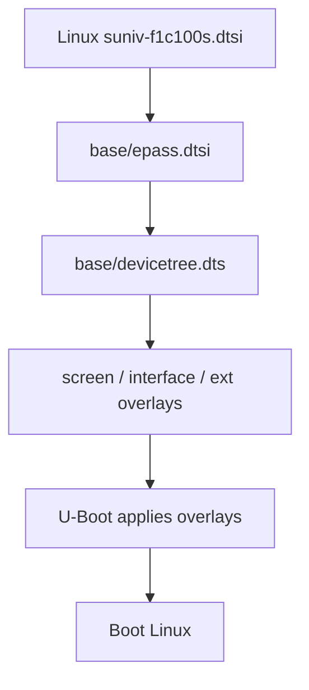
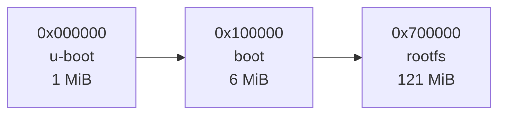

<div align="center">

# CRA Electric Pass Base Device Tree

<sub>Read this in other languages: [English](README_EN.md), [中文](README.md).</sub>

</div>

> [!NOTE]
> This directory contains the base Linux device tree for CRA Electric Pass.

<p align="center">
  <a href="#file-overview">File Overview</a> ·
  <a href="#composition">Composition</a> ·
  <a href="#epassdtsi"><code>epass.dtsi</code></a> ·
  <a href="#devicetreedts"><code>devicetree.dts</code></a> ·
  <a href="#overlay">Overlay</a> ·
  <a href="#build-and-validation">Build and Validation</a>
</p>

---

## File Overview

<table>
<tr>
<td width="50%" valign="top">

### `epass.dtsi`

Shared hardware description for the Electric Pass.

It covers:

- Device identity
- LCD display pipeline
- Power and backlight
- GPIO pin multiplexing
- SPI-NAND
- UART, SD, and USB
- Video engine
- Default peripheral states

</td>
<td width="50%" valign="top">

### `devicetree.dts`

The final base device-tree entry point for the current physical board.

It extends `epass.dtsi` with:

- Power-off GPIO
- ST7701 initialization pins
- LRADC button parameters

</td>
</tr>
</table>

Generated base device tree:

```text
output/images/dt/base/devicetree.dtb
```

---

## Composition



`suniv-f1c100s.dtsi` provides the definitions for the controllers integrated into the F1C100S/F1C200S SoC.

---

## `epass.dtsi`

### Device Identity

```dts
model = "CRA Electric Pass";
compatible = "cra,electric-pass",
             "allwinner,suniv-f1c200s",
             "allwinner,suniv-f1c100s";
```

| Property | Purpose |
| :--- | :--- |
| `model` | Human-readable device model |
| `compatible` | Allows the kernel to match the hardware from the most specific identifier to the most general one |

---

### Boot Arguments

`chosen/bootargs` contains only a placeholder value.

The actual kernel command line is supplied by U-Boot and includes:

- Serial console
- UBI / UBIFS root filesystem
- NAND partition parameters

---

### Display System


The panel is matched by `cra,epass-panel` through the project's custom `panel-simple` kernel patch.

| Item | Current configuration |
| :--- | :--- |
| Native timing | 384×640 |
| Refresh rate | 60 Hz |
| Application-visible area | Approximately 360×640 |
| Panel driver match | `cra,epass-panel` |

`st7701initseq` is disabled by default in the base device tree. At boot, the selected screen overlay enables it and supplies the initialization sequence for a BOE, HSD, or Laowu panel.

---

### Power and Backlight

| Item | Configuration |
| :--- | :--- |
| `vcc3v3` | Fixed 3.3 V supply for the SD interface and other peripherals |
| `lradc_vref` | 3.0 V LRADC reference voltage |
| Backlight | `pwm-backlight` |
| PWM controller | PWM0 |
| PWM period | `10000 ns` |
| PWM frequency | Approximately 100 kHz |
| Default brightness index | `6` |
| Default brightness value | `128` |

---

### GPIO Pin Multiplexing

| Pin group | Purpose |
| :--- | :--- |
| `spi1_pins` | PE7, PE8, PE9, and PE10 |
| `rtp_pins_0` | PA0 |
| `rtp_pins_01` | PA0 and PA1 |
| `lcd_rgb565_no_de_pins` | LCD RGB565 data, clock, and synchronization signals |
| `i2s_pins_pe` | I²S pin layout on port E |
| `i2s_pins_pa` | I²S pin layout on port A |

> [!WARNING]
> GPIO pin-multiplexing settings must match the actual PCB routing.

---

### SPI-NAND Partitions

The onboard SPI-NAND uses a **128 MiB** layout:

| Partition | Start address | Size | Purpose |
| :--- | ---: | ---: | :--- |
| `u-boot` | `0x000000` | 1 MiB | SPL, U-Boot, and the boot environment |
| `boot` | `0x100000` | 6 MiB | Linux kernel, base device tree, and overlays |
| `rootfs` | `0x700000` | 121 MiB | UBIFS root filesystem, applications, and resources |



> [!CAUTION]
> When modifying the partitions, also update and verify the device tree, U-Boot command line, image-generation scripts, and flashing addresses.

---

### Default Peripheral States

| Peripheral | Default state | Description |
| :--- | :---: | :--- |
| PWM0 | Enabled | Controls the screen backlight |
| SPI0 | Enabled | Connected to the onboard SPI-NAND |
| SPI1 | Disabled | Enabled by an interface overlay when required |
| UART0 | Enabled | System debug UART |
| UART1 / UART2 | Disabled | Enabled by an interface overlay when required |
| MMC0 | Enabled | 4-bit SD/MMC at 3.3 V |
| USB OTG / PHY | Enabled | USB Device, RNDIS, and optional Host support |
| Cedar / ION / DE / FE / BE | Enabled | Video decoding, display memory, and display engine |
| TVE0 | Disabled | Analog TV output is not used |
| LRADC | Enabled | Reads resistor-ladder buttons |
| I²C0 | Disabled | Enabled by an interface or ext overlay when required |

---

## `devicetree.dts`

### Power-Off Control

```dts
gpios = <&pio 4 2 GPIO_ACTIVE_HIGH>;
timeout-ms = <3000>;
```

| Item | Current configuration |
| :--- | :--- |
| GPIO | PE2 |
| Active level | High |
| Triggered action | Hardware power cut |
| Timeout | 3000 ms |

> [!WARNING]
> If the power-off GPIO is configured incorrectly, Linux may complete its shutdown sequence while the device remains powered.

---

### ST7701 Initialization Interface

| Signal | GPIO |
| :--- | :--- |
| SDA | PE4 |
| SCL | PD19 |
| CS | PE11 |

These pins are used only to send initialization commands to the ST7701. LCD pixel data is transmitted over the RGB565 bus.

---

### LRADC Buttons

Five buttons share LRADC channel 0 and use different resistor values to produce distinct target voltages.

| Linux key code | Target voltage |
| :--- | ---: |
| `KEY_0` | 0 V |
| `KEY_1` | 1.396826 V |
| `KEY_2` | 1.111111 V |
| `KEY_3` | 0.825396 V |
| `KEY_4` | 0.444444 V |

The `voltage` property is expressed in microvolts.

> [!CAUTION]
> Do not change the LRADC voltage parameters without verifying the resistor network. Incorrect values may cause missed presses, incorrect key events, or instability near voltage thresholds.

---

## Overlay

The base device tree defines the overall system structure, while overlays select optional functions.

<table>
<tr>
<td width="33%" valign="top">

### `screen/`

Panel initialization:

- BOE
- HSD
- Laowu

</td>
<td width="33%" valign="top">

### `interface/`

Interfaces:

- ADC
- I²C
- I²S
- SPI
- UART
- USB

</td>
<td width="33%" valign="top">

### `ext/`

Expansion devices:

- CardKB
- ES8311
- LSM6DS3

</td>
</tr>
</table>

---

## Build and Validation

### 1. Run a Complete Build

```sh
make cra_epass_defconfig
make -j$(nproc)
```

### 2. Verify the Device Model

```sh
output/host/bin/fdtget \
    output/images/dt/base/devicetree.dtb \
    / model
```

Expected output:

```text
CRA Electric Pass
```

### 3. Inspect the FIT Image

```sh
output/host/bin/dumpimage -l output/images/boot.itb
```

The base device tree should appear as `fdt-base`.

> [!NOTE]
> Building and validation only generate and inspect software artifacts; they do not write anything to a physical device automatically.

---

<div align="center">

<sub><b>CRA Electric Pass</b> · Linux base device tree</sub>

</div>
