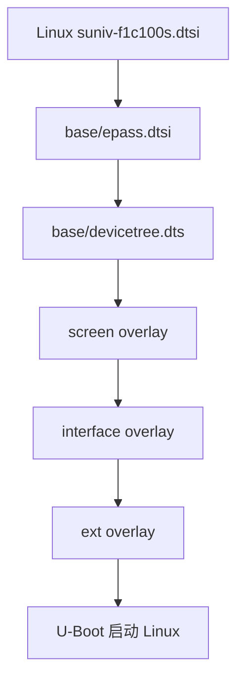
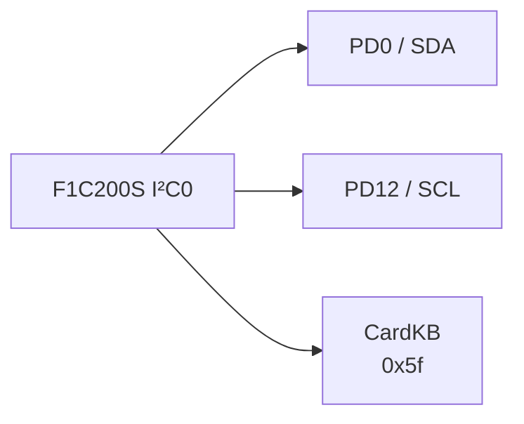
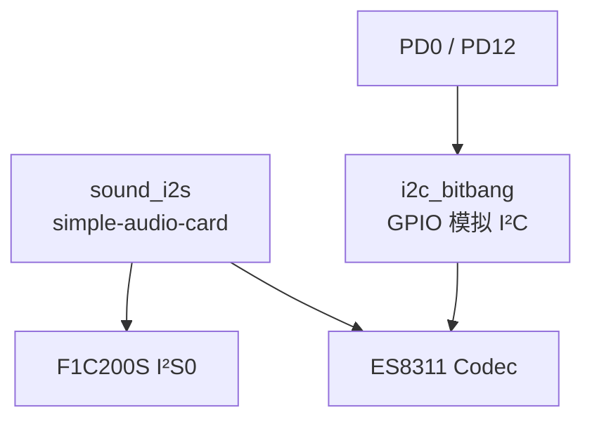
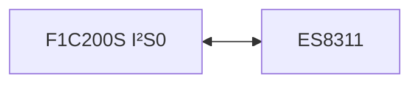
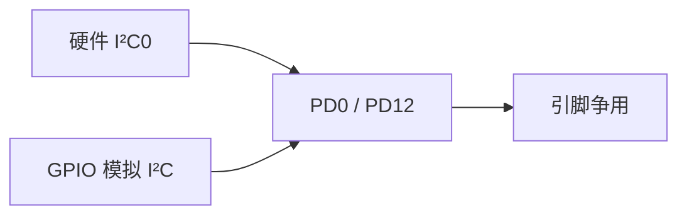
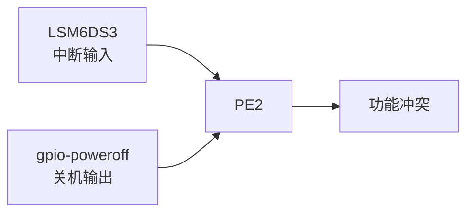
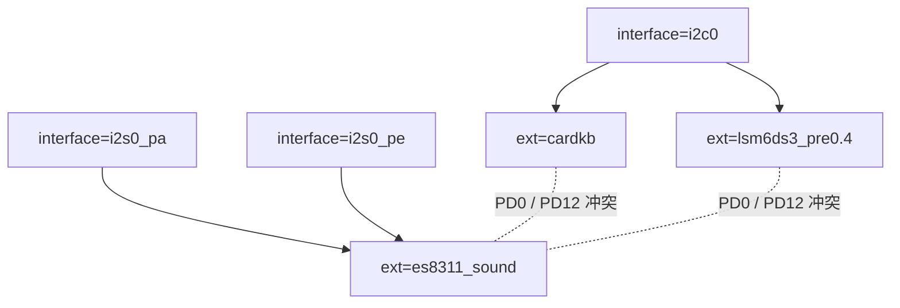
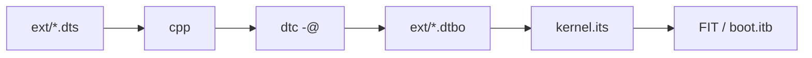

<div align="center">

# CRA Electric Pass 外接设备覆盖层

<sub>Read this in other languages: [English](README_EN.md), [中文](README.md).</sub>

</div>

> [!NOTE]
> 本目录保存 CRA Electric Pass 的 Linux 外接设备树覆盖层，用于描述连接在主板接口上的可选硬件。覆盖层仅在 U-Boot 启动阶段按需附加到基础设备树。

<p align="center">
  <a href="#文件说明">文件说明</a> ·
  <a href="#设备树层级">设备树层级</a> ·
  <a href="#覆盖层基本语法">Overlay 语法</a> ·
  <a href="#cardkbdts"><code>cardkb</code></a> ·
  <a href="#es8311_sounddts"><code>es8311_sound</code></a> ·
  <a href="#lsm6ds3_pre04dts"><code>lsm6ds3_pre0.4</code></a> ·
  <a href="#依赖与冲突">依赖与冲突</a> ·
  <a href="#构建与启动">构建与启动</a>
</p>

---

## 文件说明

<table>
<tr>
<td width="33%" valign="top">

### `cardkb.dts`

**M5Stack Unit CardKB**

- 总线：硬件 I²C0
- 地址：`0x5f`
- 引脚：PD0 / PD12
- 输入方式：轮询
- Linux 子系统：Input

</td>
<td width="33%" valign="top">

### `es8311_sound.dts`

**Everest ES8311**

- 控制：GPIO 模拟 I²C
- 地址：`0x18`
- 音频：I²S0
- I²C 引脚：PD0 / PD12
- Linux 子系统：ALSA / ASoC

</td>
<td width="33%" valign="top">

### `lsm6ds3_pre0.4.dts`

**ST LSM6DS3**

- 总线：硬件 I²C0
- 地址：`0x6a`
- 中断：PE2
- 适用：不适用
- Linux 子系统：IIO

</td>
</tr>
</table>

| 文件 | 外接设备 | 总线与地址 |
| :--- | :--- | :--- |
| `cardkb.dts` | M5Stack Unit CardKB 小键盘 | 硬件 I²C0 · `0x5f` |
| `es8311_sound.dts` | Everest ES8311 音频编解码器 | GPIO 模拟 I²C · `0x18`；音频数据使用 I²S0 |
| `lsm6ds3_pre0.4.dts` | ST LSM6DS3 六轴惯性传感器 | 硬件 I²C0 · `0x6a`；PE2 中断 |

---

## 设备树层级



| 目录 | 职责 |
| :--- | :--- |
| `base/` | 描述主板上始终存在的基础硬件 |
| `screen/` | 选择实际安装的 LCD 面板及其时序 |
| `interface/` | 启用 SoC 控制器并配置引脚复用，如 I²C0、I²S0、SPI1、UART |
| `ext/` | 在总线条件已具备的基础上声明具体外部设备 |

> [!IMPORTANT]
> `ext/` 覆盖层通常依赖对应的 `interface/` 覆盖层。CardKB 需要先启用 `interface/i2c0.dts`。

---

## 覆盖层基本语法

本目录中的文件均为 Device Tree Overlay：

```dts
/dts-v1/;
/plugin/;

/ {
    fragment@1 {
        target = <&some_node>;
        __overlay__ {
            /* 新增或覆盖的设备树内容 */
        };
    };
};
```

| 字段 | 作用 |
| :--- | :--- |
| `/dts-v1/;` | 声明设备树源码版本 |
| `/plugin/;` | 声明当前文件为可附加覆盖层 |
| `fragment@1` | 覆盖片段，编号用于区分片段 |
| `target` | 通过标签引用基础设备树节点 |
| `target-path` | 通过节点路径指定修改目标 |
| `__overlay__` | 添加或覆盖的属性与子节点 |
| `compatible` | Linux 驱动匹配字符串 |
| `reg` | I²C 等总线设备地址 |
| `status = "okay"` | 显式启用节点 |

标签写法：

```dts
es8311: es8311@18
```

其他节点可通过：

```dts
&es8311
```

引用该设备。

---

# `cardkb.dts`

## 设备节点

```dts
fragment@1 {
    target = <&i2c0>;
    __overlay__ {
        cardkb:cardkb@5f {
            compatible = "m5stack,cardkb";
            reg = <0x5f>;
            polling-interval = <50>;
        };
    };
};
```

### 总线关系



基础设备树中的 I²C0 默认关闭：

```dts
&i2c0 {
    pinctrl-names = "default";
    pinctrl-0 = <&i2c0_pd_pins>;
    status = "disabled";
};
```

启用组合：

```text
interface=i2c0
ext=cardkb
```

| 信号 | GPIO |
| :--- | :--- |
| SDA | PD0 |
| SCL | PD12 |
| I²C 地址 | `0x5f` |

---

## 轮询参数

```dts
polling-interval = <50>;
```

当前轮询周期为 **50 ms**，约 **20 Hz**。

| 调整方向 | 影响 |
| :--- | :--- |
| 减小 | 输入延迟降低，I²C 访问与 CPU 唤醒次数增加 |
| 增大 | 系统负担降低，按键响应变慢 |
| 当前值 | 适合普通按键输入 |

---

## Linux 驱动

内核补丁：

```text
board/cra/epass/patch/linux/0009-m5stack-cardkb-driver.patch
```

相关配置：

```text
CONFIG_INPUT_EVDEV=y
CONFIG_CRA_EP_CARDKB=m
```

驱动从 I²C 读取键值，将其转换为 Linux 标准按键事件，并注册为 `/dev/input/event*` 输入设备。

> [!NOTE]
> `=m` 表示驱动以模块形式编译。设备树节点出现后，Linux 可依据 `compatible = "m5stack,cardkb"` 匹配对应驱动。

---

# `es8311_sound.dts`

## 功能结构



设备树结构：

```text
/
├── sound_i2s
└── i2c_bitbang
    └── es8311@18
```

| 链路 | 作用 |
| :--- | :--- |
| I²C | 配置 ES8311 寄存器 |
| I²S | 传输数字音频数据 |
| `simple-audio-card` | 将 F1C200S I²S0 与 ES8311 组合为 ALSA 声卡 |

---

## 声卡节点

```dts
sound_i2s {
    compatible = "simple-audio-card";
    status = "okay";
    simple-audio-card,name = "es8311";
    simple-audio-card,format = "i2s";
    simple-audio-card,mclk-fs = <256>;
};
```

| 字段 | 配置 |
| :--- | :--- |
| 声卡驱动 | `simple-audio-card` |
| 声卡名称 | `es8311` |
| 数据格式 | I²S |
| MCLK 比例 | 采样率 × 256 |

48 kHz 示例：

```text
48000 × 256 = 12.288MHz
```

### CPU DAI / Codec DAI

```dts
simple-audio-card,cpu {
    sound-dai = <&i2s0>;
};

simple-audio-card,codec {
    sound-dai = <&es8311>;
};
```



---

## I²S0 接口依赖

基础设备树默认不启用 I²S0。使用 ES8311 时需按 PCB 走线选择：

```text
interface=i2s0_pa
```

或：

```text
interface=i2s0_pe
```

| 接口 | 引脚 |
| :--- | :--- |
| `i2s0_pa` | PE3、PA2、PA3、PA1 |
| `i2s0_pe` | PE3、PE5、PE6、PA1 |

> [!WARNING]
> 两组 I²S0 引脚不能同时启用。两种布局均占用 PA1；`i2s0_pa` 还会使用 PA2、PA3，与部分 ADC 接口配置存在冲突。

---

## GPIO 模拟 I²C

```dts
i2c_bitbang {
    compatible = "i2c-gpio";
    sda-gpios = <&pio 3 0 (GPIO_ACTIVE_HIGH|GPIO_OPEN_DRAIN)>;
    scl-gpios = <&pio 3 12 (GPIO_ACTIVE_HIGH|GPIO_OPEN_DRAIN)>;
    i2c-gpio,delay-us = <5>;
    status = "okay";
};
```

| 项目 | 配置 |
| :--- | :--- |
| SDA | PD0 |
| SCL | PD12 |
| GPIO 模式 | Open Drain |
| 半周期延时 | 5 μs |
| 估算频率 | 约 100 kHz |

内核配置：

```text
CONFIG_I2C_GPIO=y
```

---

## ES8311 节点

```dts
es8311: es8311@18 {
    compatible = "everest,es8311";
    status = "okay";
    reg = <0x18>;
    pinctrl-names = "default";
    #sound-dai-cells = <0>;
};
```

| 字段 | 作用 |
| :--- | :--- |
| `reg = <0x18>` | ES8311 7 位 I²C 地址 |
| `compatible = "everest,es8311"` | 匹配 ES8311 ASoC Codec 驱动 |
| `es8311:` | 提供给声卡节点引用的标签 |
| `#sound-dai-cells = <0>` | 引用 DAI 时无需附加参数 |

---

## Linux 驱动

相关内核配置：

```text
CONFIG_SOUND=m
CONFIG_SND=m
CONFIG_SND_SOC=m
CONFIG_SND_SUN4I_I2S=m
CONFIG_SND_SOC_ES8311=m
CONFIG_SND_SIMPLE_CARD=m
CONFIG_I2C_GPIO=y
```

相关补丁：

```text
board/cra/epass/patch/linux/0010-i2s-and-es-driver.patch
```

该补丁还包含 ES8156、ES8375、ES8389 等 Codec 驱动；当前内核配置仅选择 ES8311。

---

## 与硬件 I²C0 的冲突

硬件 I²C0 与 `es8311_sound` 的 GPIO 模拟 I²C 都占用：

```text
PD0  = SDA
PD12 = SCL
```

因此以下组合禁止同时使用：

```text
interface=i2c0
ext=es8311_sound
```



> [!CAUTION]
> 当前 `es8311_sound` 不能直接与依赖硬件 I²C0 的 CardKB 或 LSM6DS3 同时启用。若需要共存，应重新设计设备树总线关系。

---

# `lsm6ds3_pre0.4.dts`

## 设备节点

```dts
fragment@1 {
    target = <&i2c0>;
    __overlay__ {
        lsm6ds3:lsm6ds3@6a {
            compatible = "st,lsm6ds3";
            reg = <0x6a>;
            interrupt-parent = <&pio>;
            interrupts = <4 2 2>;
        };
    };
};
```

LSM6DS3 提供：

- 三轴加速度计
- 三轴陀螺仪

Linux 通过 **IIO（Industrial I/O）** 子系统管理该设备。

---

## I²C0 依赖

| 项目 | 配置 |
| :--- | :--- |
| 控制器 | 硬件 I²C0 |
| 地址 | `0x6a` |
| SDA | PD0 |
| SCL | PD12 |

CardKB 地址为 `0x5f`，LSM6DS3 地址为 `0x6a`。仅从地址角度看，两者可以共用同一条硬件 I²C0 总线。

---

## 中断配置

```dts
interrupt-parent = <&pio>;
interrupts = <4 2 2>;
```

| 数值 | 含义 |
| :---: | :--- |
| `4` | GPIO E 组 |
| `2` | 第 2 号引脚 |
| `2` | 下降沿触发 |

即：

```text
PE2 = LSM6DS3 中断输入
```

后续可使用 `IRQ_TYPE_EDGE_FALLING` 替代末尾裸数值 `2。

---

## Linux 驱动

```text
CONFIG_IIO=y
CONFIG_IIO_ST_LSM6DSX=m
```

LSM6DS3 使用 Linux 5.4.99 已有的 ST LSM6DSX IIO 驱动，不依赖项目新增传感器驱动补丁。

---

## PE2 冲突

`lsm6ds3_pre0.4` 没啥用了。

当前基础设备树已将 PE2 用于关机控制：

```dts
poweroff: gpio-poweroff {
    compatible = "gpio-poweroff";
    gpios = <&pio 4 2 GPIO_ACTIVE_HIGH>; // PE2
    timeout-ms = <3000>;
};
```



可能出现：

- LSM6DS3 中断 GPIO 申请失败
- `gpio-poweroff` 无法申请 PE2
- Linux 关机后设备无法断电
- 引脚方向或电平状态与硬件不符

> [!CAUTION]
> `lsm6ds3_pre0.4` 即使能够正常编译和附加，也不得在当前电通上启用。

---

## 依赖与冲突

| 扩展 | 必需接口 | 使用引脚 | 主要冲突 |
| :--- | :--- | :--- | :--- |
| `cardkb` | `i2c0` | PD0、PD12 | 与 `es8311_sound` 的 GPIO 模拟 I²C 冲突 |
| `es8311_sound` | `i2s0_pa` 或 `i2s0_pe` | I²C：PD0、PD12；I²S：由接口决定 | 与硬件 I²C0 冲突；I²S 与部分 ADC 配置冲突 |
| `lsm6ds3_pre0.4` | `i2c0` | I²C：PD0、PD12；中断：PE2 | PE2 与 `gpio-poweroff` 冲突 |

### 组合关系



---

## 构建与启动

### 编译流程

`board/cra/epass/scripts/mkdt.sh` 会遍历本目录中的所有 `.dts`：

```bash
cpp -nostdinc \
    -I "${BUILD_DIR}/linux-5.4.99/include/" \
    -I "${BUILD_DIR}/linux-5.4.99/arch/arm/boot/dts" \
    -P -undef -x assembler-with-cpp

dtc -@ -I dts -O dtb
```

生成：

```text
output/images/dt/ext/cardkb.dtbo
output/images/dt/ext/es8311_sound.dtbo
output/images/dt/ext/lsm6ds3_pre0.4.dtbo
```

`-@` 会保留覆盖层所需的符号与修复信息，使 U-Boot 能解析基础设备树中的 `&i2c0`、`&pio`、`&i2s0` 等标签。

### FIT 打包

`board/cra/epass/scripts/kernel.its` 将覆盖层打包为：

```text
fdt-ext-cardkb
fdt-ext-es8311_sound
fdt-ext-lsm6ds3_pre0.4
```



---

## 启动时选择

`board/cra/epass/uEnv.txt` 默认：

```text
interface=
ext=
```

即默认不启用接口覆盖层和外接设备覆盖层。

U-Boot 的应用顺序：


示例：

```text
interface=i2c0
ext=cardkb
```

覆盖层名称必须与 FIT 节点后缀完全一致。

> [!WARNING]
> 启用覆盖层前应确认实体板接线、供电、电平和引脚复用。

---

## 编译警告

覆盖层单独编译时，`dtc` 可能对 `reg`、`#address-cells` 或父总线信息给出警告。独立编译阶段无法获得基础设备树目标节点的完整上下文。

验证覆盖层时应检查：

- `.dts` 能成功生成 `.dtbo`
- 覆盖层能正确附加到基础 `.dtb`
- U-Boot 按 `interface` → `ext` 顺序应用
- Linux 驱动成功匹配
- 实体硬件的引脚、电平、地址和中断与设备树一致

> [!IMPORTANT]
> 编译成功只说明语法和生成流程通过，不代表该覆盖层可在当前硬件上安全启用。

---

<div align="center">

<sub><b>CRA Electric Pass</b> · Linux external device</sub>

</div>
