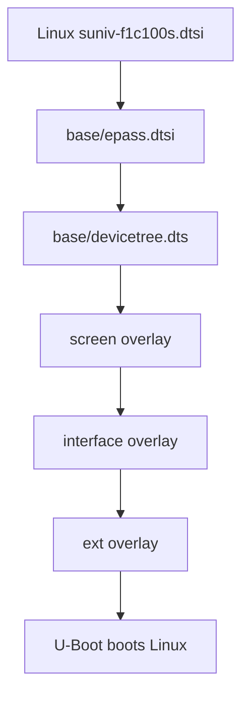
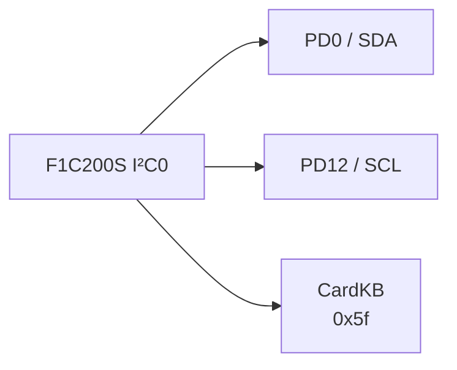
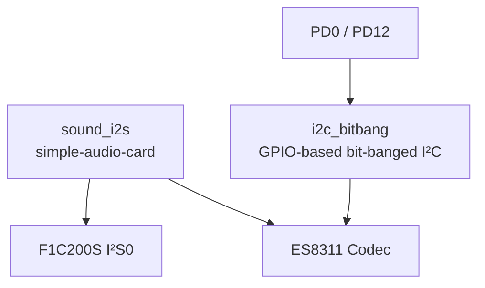
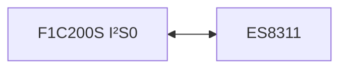
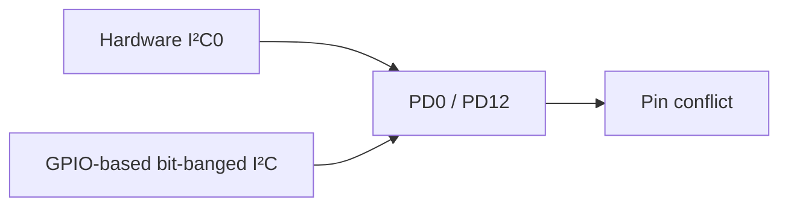
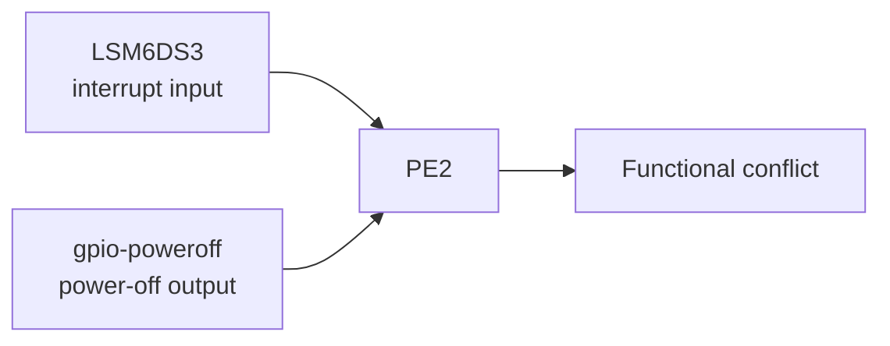
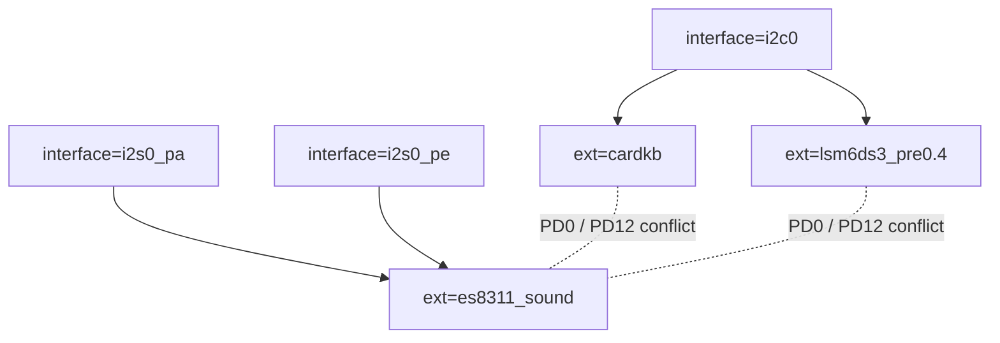
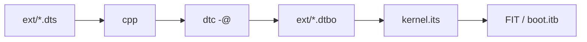

<div align="center">

# CRA Electric Pass External-Device Overlays

<sub>Read this in other languages: [English](README_EN.md), [中文](README.md).</sub>

</div>

> [!NOTE]
> This directory contains Linux device-tree overlays for optional hardware connected to CRA Electric Pass board interfaces. U-Boot applies these overlays to the base device tree only when they are selected at boot.

<p align="center">
  <a href="#file-overview">File Overview</a> ·
  <a href="#device-tree-hierarchy">Device-Tree Hierarchy</a> ·
  <a href="#overlay-basics">Overlay Syntax</a> ·
  <a href="#cardkbdts"><code>cardkb</code></a> ·
  <a href="#es8311_sounddts"><code>es8311_sound</code></a> ·
  <a href="#lsm6ds3_pre04dts"><code>lsm6ds3_pre0.4</code></a> ·
  <a href="#dependencies-and-conflicts">Dependencies and Conflicts</a> ·
  <a href="#build-and-boot">Build and Boot</a>
</p>

---

## File Overview

<table>
<tr>
<td width="33%" valign="top">

### `cardkb.dts`

**M5Stack Unit CardKB**

- Bus: hardware I²C0
- Address: `0x5f`
- Pins: PD0 / PD12
- Input method: polling
- Linux subsystem: Input

</td>
<td width="33%" valign="top">

### `es8311_sound.dts`

**Everest ES8311**

- Control: GPIO-based bit-banged I²C
- Address: `0x18`
- Audio: I²S0
- I²C pins: PD0 / PD12
- Linux subsystem: ALSA / ASoC

</td>
<td width="33%" valign="top">

### `lsm6ds3_pre0.4.dts`

**ST LSM6DS3**

- Bus: hardware I²C0
- Address: `0x6a`
- Interrupt: PE2
- Applicability: not applicable
- Linux subsystem: IIO

</td>
</tr>
</table>

| File | External device | Bus and address |
| :--- | :--- | :--- |
| `cardkb.dts` | M5Stack Unit CardKB keypad | Hardware I²C0 · `0x5f` |
| `es8311_sound.dts` | Everest ES8311 audio codec | GPIO-based bit-banged I²C · `0x18`; audio data uses I²S0 |
| `lsm6ds3_pre0.4.dts` | ST LSM6DS3 six-axis inertial sensor | Hardware I²C0 · `0x6a`; interrupt on PE2 |

---

## Device-Tree Hierarchy



| Directory | Responsibility |
| :--- | :--- |
| `base/` | Describes the base hardware that is always present on the main board |
| `screen/` | Selects the installed LCD panel and its timings |
| `interface/` | Enables SoC controllers and configures pin multiplexing for I²C0, I²S0, SPI1, UART, and other interfaces |
| `ext/` | Declares specific external devices after the required bus has been enabled |

> [!IMPORTANT]
> An `ext/` overlay usually depends on the corresponding `interface/` overlay. CardKB requires `interface/i2c0.dts` to be enabled first.

---

## Overlay Basics

Every file in this directory is a Device Tree Overlay:

```dts
/dts-v1/;
/plugin/;

/ {
    fragment@1 {
        target = <&some_node>;
        __overlay__ {
            /* Device-tree contents to add or override */
        };
    };
};
```

| Field | Purpose |
| :--- | :--- |
| `/dts-v1/;` | Declares the device-tree source version |
| `/plugin/;` | Declares that the current file is an attachable overlay |
| `fragment@1` | An overlay fragment; its number distinguishes it from other fragments |
| `target` | References a node in the base device tree by label |
| `target-path` | Selects the target node by path |
| `__overlay__` | Contains properties and child nodes to add or override |
| `compatible` | Linux driver matching string |
| `reg` | Address of an I²C or similar bus device |
| `status = "okay"` | Explicitly enables a node |

Label declaration:

```dts
es8311: es8311@18
```

Other nodes can reference the device with:

```dts
&es8311
```

---

# `cardkb.dts`

## Device Node

```dts
fragment@1 {
    target = <&i2c0>;
    __overlay__ {
        cardkb:cardkb@5f {
            compatible = "m5stack,cardkb";
            reg = <0x5f>;
            polling-interval = <50>;
        };
    };
};
```

### Bus Relationship



I²C0 is disabled by default in the base device tree:

```dts
&i2c0 {
    pinctrl-names = "default";
    pinctrl-0 = <&i2c0_pd_pins>;
    status = "disabled";
};
```

Enable it with:

```text
interface=i2c0
ext=cardkb
```

| Signal | GPIO |
| :--- | :--- |
| SDA | PD0 |
| SCL | PD12 |
| I²C address | `0x5f` |

---

## Polling Parameters

```dts
polling-interval = <50>;
```

The current polling interval is **50 ms**, or approximately **20 Hz**.

| Adjustment | Effect |
| :--- | :--- |
| Decrease | Reduces input latency but increases I²C traffic and CPU wakeups |
| Increase | Reduces system load but slows key response |
| Current value | Suitable for ordinary keypad input |

---

## Linux Driver

Kernel patch:

```text
board/cra/epass/patch/linux/0009-m5stack-cardkb-driver.patch
```

Related configuration:

```text
CONFIG_INPUT_EVDEV=y
CONFIG_CRA_EP_CARDKB=m
```

The driver reads key values over I²C, converts them into standard Linux key events, and registers an input device at `/dev/input/event*`.

> [!NOTE]
> `=m` means that the driver is built as a module. After the device-tree node appears, Linux can match it to the driver through `compatible = "m5stack,cardkb"`.

---

# `es8311_sound.dts`

## Functional Structure



Device-tree structure:

```text
/
├── sound_i2s
└── i2c_bitbang
    └── es8311@18
```

| Link | Purpose |
| :--- | :--- |
| I²C | Configures ES8311 registers |
| I²S | Transfers digital audio data |
| `simple-audio-card` | Combines the F1C200S I²S0 controller and ES8311 into an ALSA sound card |

---

## Sound-Card Node

```dts
sound_i2s {
    compatible = "simple-audio-card";
    status = "okay";
    simple-audio-card,name = "es8311";
    simple-audio-card,format = "i2s";
    simple-audio-card,mclk-fs = <256>;
};
```

| Field | Configuration |
| :--- | :--- |
| Sound-card driver | `simple-audio-card` |
| Sound-card name | `es8311` |
| Data format | I²S |
| MCLK ratio | Sample rate × 256 |

Example at 48 kHz:

```text
48000 × 256 = 12.288 MHz
```

### CPU DAI / Codec DAI

```dts
simple-audio-card,cpu {
    sound-dai = <&i2s0>;
};

simple-audio-card,codec {
    sound-dai = <&es8311>;
};
```



---

## I²S0 Interface Dependency

I²S0 is not enabled by default in the base device tree. When using the ES8311, select the pin layout that matches the PCB routing:

```text
interface=i2s0_pa
```

or:

```text
interface=i2s0_pe
```

| Interface | Pins |
| :--- | :--- |
| `i2s0_pa` | PE3, PA2, PA3, and PA1 |
| `i2s0_pe` | PE3, PE5, PE6, and PA1 |

> [!WARNING]
> The two I²S0 pin groups cannot be enabled simultaneously. Both layouts use PA1; `i2s0_pa` also uses PA2 and PA3, which conflict with some ADC interface configurations.

---

## GPIO-Based Bit-Banged I²C

```dts
i2c_bitbang {
    compatible = "i2c-gpio";
    sda-gpios = <&pio 3 0 (GPIO_ACTIVE_HIGH|GPIO_OPEN_DRAIN)>;
    scl-gpios = <&pio 3 12 (GPIO_ACTIVE_HIGH|GPIO_OPEN_DRAIN)>;
    i2c-gpio,delay-us = <5>;
    status = "okay";
};
```

| Item | Configuration |
| :--- | :--- |
| SDA | PD0 |
| SCL | PD12 |
| GPIO mode | Open Drain |
| Half-period delay | 5 μs |
| Estimated frequency | Approximately 100 kHz |

Kernel configuration:

```text
CONFIG_I2C_GPIO=y
```

---

## ES8311 Node

```dts
es8311: es8311@18 {
    compatible = "everest,es8311";
    status = "okay";
    reg = <0x18>;
    pinctrl-names = "default";
    #sound-dai-cells = <0>;
};
```

| Field | Purpose |
| :--- | :--- |
| `reg = <0x18>` | ES8311 7-bit I²C address |
| `compatible = "everest,es8311"` | Matches the ES8311 ASoC codec driver |
| `es8311:` | Provides a label for the sound-card node to reference |
| `#sound-dai-cells = <0>` | No additional arguments are required when referencing the DAI |

---

## Linux Driver

Related kernel configuration:

```text
CONFIG_SOUND=m
CONFIG_SND=m
CONFIG_SND_SOC=m
CONFIG_SND_SUN4I_I2S=m
CONFIG_SND_SOC_ES8311=m
CONFIG_SND_SIMPLE_CARD=m
CONFIG_I2C_GPIO=y
```

Related patch:

```text
board/cra/epass/patch/linux/0010-i2s-and-es-driver.patch
```

The patch also contains codec drivers for the ES8156, ES8375, ES8389, and other devices. The current kernel configuration selects only the ES8311.

---

## Conflict with Hardware I²C0

Hardware I²C0 and the GPIO-based bit-banged I²C bus in `es8311_sound` both use:

```text
PD0  = SDA
PD12 = SCL
```

The following combination must therefore not be enabled:

```text
interface=i2c0
ext=es8311_sound
```



> [!CAUTION]
> The current `es8311_sound` overlay cannot be enabled together with CardKB or LSM6DS3, both of which depend on hardware I²C0. Supporting these devices simultaneously requires redesigning the device-tree bus topology.

---

# `lsm6ds3_pre0.4.dts`

## Device Node

```dts
fragment@1 {
    target = <&i2c0>;
    __overlay__ {
        lsm6ds3:lsm6ds3@6a {
            compatible = "st,lsm6ds3";
            reg = <0x6a>;
            interrupt-parent = <&pio>;
            interrupts = <4 2 2>;
        };
    };
};
```

The LSM6DS3 provides:

- Three-axis accelerometer
- Three-axis gyroscope

Linux manages the device through the **IIO (Industrial I/O)** subsystem.

---

## I²C0 Dependency

| Item | Configuration |
| :--- | :--- |
| Controller | Hardware I²C0 |
| Address | `0x6a` |
| SDA | PD0 |
| SCL | PD12 |

CardKB uses address `0x5f`, while the LSM6DS3 uses `0x6a`. Based on their addresses alone, both devices can share the same hardware I²C0 bus.

---

## Interrupt Configuration

```dts
interrupt-parent = <&pio>;
interrupts = <4 2 2>;
```

| Value | Meaning |
| :---: | :--- |
| `4` | GPIO port E |
| `2` | Pin 2 |
| `2` | Falling-edge trigger |

In other words:

```text
PE2 = LSM6DS3 interrupt input
```

The trailing numeric value `2` can be replaced with `IRQ_TYPE_EDGE_FALLING` in a future cleanup.

---

## Linux Driver

```text
CONFIG_IIO=y
CONFIG_IIO_ST_LSM6DSX=m
```

The LSM6DS3 uses the ST LSM6DSX IIO driver already included in Linux 5.4.99 and does not depend on a project-specific sensor-driver patch.

---

## PE2 Conflict

`lsm6ds3_pre0.4` is no longer useful for the current hardware.

The base device tree now assigns PE2 to power-off control:

```dts
poweroff: gpio-poweroff {
    compatible = "gpio-poweroff";
    gpios = <&pio 4 2 GPIO_ACTIVE_HIGH>; // PE2
    timeout-ms = <3000>;
};
```



Possible consequences include:

- Failure to request the LSM6DS3 interrupt GPIO
- Failure by `gpio-poweroff` to request PE2
- The device remaining powered after Linux shuts down
- A pin direction or logic level that does not match the hardware

> [!CAUTION]
> Even if `lsm6ds3_pre0.4` compiles and applies successfully, it must not be enabled on the current Electric Pass hardware.

---

## Dependencies and Conflicts

| Extension | Required interface | Pins used | Main conflicts |
| :--- | :--- | :--- | :--- |
| `cardkb` | `i2c0` | PD0, PD12 | Conflicts with the GPIO-based bit-banged I²C bus in `es8311_sound` |
| `es8311_sound` | `i2s0_pa` or `i2s0_pe` | I²C: PD0, PD12; I²S: selected by the interface | Conflicts with hardware I²C0; I²S conflicts with some ADC configurations |
| `lsm6ds3_pre0.4` | `i2c0` | I²C: PD0, PD12; interrupt: PE2 | PE2 conflicts with `gpio-poweroff` |

### Composition



---

## Build and Boot

### Compilation Flow

`board/cra/epass/scripts/mkdt.sh` processes every `.dts` file in this directory:

```bash
cpp -nostdinc \
    -I "${BUILD_DIR}/linux-5.4.99/include/" \
    -I "${BUILD_DIR}/linux-5.4.99/arch/arm/boot/dts" \
    -P -undef -x assembler-with-cpp

dtc -@ -I dts -O dtb
```

Generated files:

```text
output/images/dt/ext/cardkb.dtbo
output/images/dt/ext/es8311_sound.dtbo
output/images/dt/ext/lsm6ds3_pre0.4.dtbo
```

`-@` preserves the symbols and fixup information required by overlays, allowing U-Boot to resolve labels such as `&i2c0`, `&pio`, and `&i2s0` in the base device tree.

### FIT Packaging

`board/cra/epass/scripts/kernel.its` packages the overlays as:

```text
fdt-ext-cardkb
fdt-ext-es8311_sound
fdt-ext-lsm6ds3_pre0.4
```



---

## Selection at Boot

The defaults in `board/cra/epass/uEnv.txt` are:

```text
interface=
ext=
```

No interface or external-device overlay is enabled by default.

U-Boot applies overlays in this order:


Example:

```text
interface=i2c0
ext=cardkb
```

The overlay name must exactly match the suffix of its FIT node.

> [!WARNING]
> Before enabling an overlay, verify the wiring, power supply, logic levels, and pin multiplexing on the physical board.

---

## Compilation Warnings

When an overlay is compiled separately, `dtc` may emit warnings about `reg`, `#address-cells`, or parent-bus information. The standalone compilation step does not have the full context of the target node in the base device tree.

Overlay validation should confirm that:

- Each `.dts` file can be compiled into a `.dtbo`
- The overlay applies correctly to the base `.dtb`
- U-Boot applies overlays in `interface` → `ext` order
- The Linux driver binds successfully
- The pins, logic levels, addresses, and interrupts match the physical hardware

> [!IMPORTANT]
> A successful build confirms only that the syntax and generation flow are valid. It does not mean that the overlay is safe to enable on the current hardware.

---

<div align="center">

<sub><b>CRA Electric Pass</b> · Linux external device</sub>

</div>
