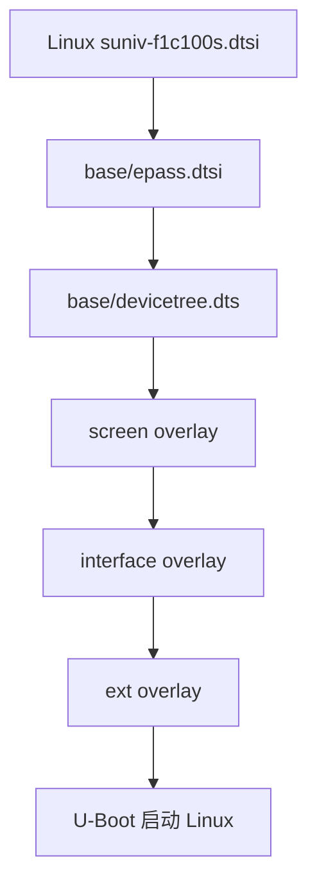
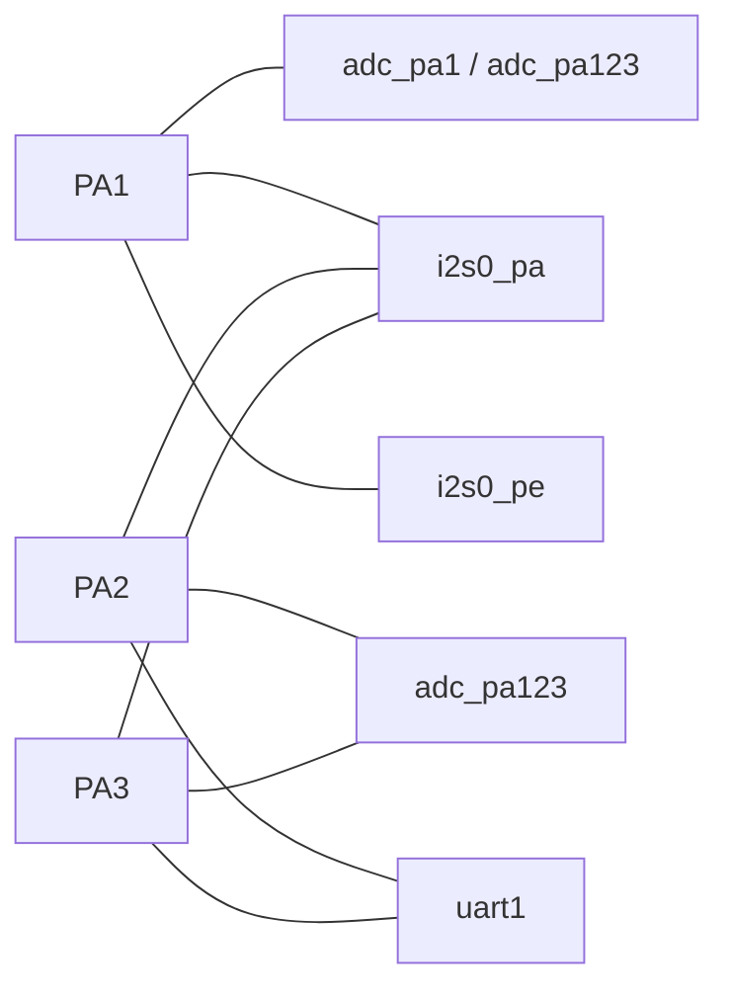
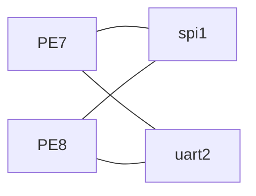
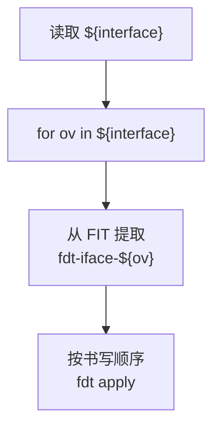

<div align="center">

# CRA Electric Pass 硬件接口覆盖层

<sub>Read this in other languages: [English](README_EN.md), [中文](README.md).</sub>

</div>

> [!NOTE]
> 本目录保存 CRA Electric Pass 的 Linux 硬件接口设备树覆盖层，用于按需启用 F1C200S 内部控制器、选择 GPIO 复用功能，以及切换 USB 工作模式。

<p align="center">
  <a href="#接口总览">接口总览</a> ·
  <a href="#设备树层级">设备树层级</a> ·
  <a href="#引脚与冲突总览">引脚冲突</a> ·
  <a href="#adc">ADC</a> ·
  <a href="#i²c0">I²C0</a> ·
  <a href="#i²s0">I²S0</a> ·
  <a href="#spi1">SPI1</a> ·
  <a href="#uart">UART</a> ·
  <a href="#usb">USB</a> ·
  <a href="#构建与启动">构建与启动</a>
</p>

---

## 接口总览

<table>
<tr>
<td width="33%" valign="top">

### ADC

`adc_pa1`  
`adc_pa123`

RTP / GPADC 引脚扩展。

**PA0 ～ PA3**

</td>
<td width="33%" valign="top">

### Serial Bus

`i2c0`  
`i2s0_pa`  
`i2s0_pe`  
`spi1`

I²C、I²S、SPI 总线。

</td>
<td width="33%" valign="top">

### UART / USB

`uart1`  
`uart2`  
`usbhost`  
`usbhs`

串口与 USB 模式切换。

</td>
</tr>
</table>

| 覆盖层 | 目标控制器 | 作用 | 使用引脚 |
| :--- | :--- | :--- | :--- |
| `adc_pa1.dts` | RTP / GPADC | 在默认 PA0 基础上增加 PA1 ADC 引脚 | PA0、PA1 |
| `adc_pa123.dts` | RTP / GPADC | 启用全部四个 ADC 引脚 | PA0、PA1、PA2、PA3 |
| `i2c0.dts` | I²C0 | 启用硬件 I²C0 | PD0、PD12 |
| `i2s0_pa.dts` | I²S0 | 启用 PA 布局 I²S0 | PE3、PA1、PA2、PA3 |
| `i2s0_pe.dts` | I²S0 | 启用 PE 布局 I²S0 | PE3、PE5、PE6、PA1 |
| `spi1.dts` | SPI1 | 启用 SPI1 与预设 Spidev | PE7、PE8、PE9、PE10 |
| `uart1.dts` | UART1 | 启用 UART1 TX/RX | PA2、PA3 |
| `uart2.dts` | UART2 | 启用 UART2 TX/RX | PE7、PE8 |
| `usbhost.dts` | USB OTG | 固定为 Host 模式 | USB 专用引脚 |
| `usbhs.dts` | USB OTG | 请求项目自定义 High-Speed 模式 | USB 专用引脚 |

---

## 设备树层级

`interface` 提供总线与接口，`ext` 声明挂载在这些接口上的具体外设。



| 目录 | 职责 |
| :--- | :--- |
| `base/` | 主板固定硬件、可选控制器默认状态与预设 pinctrl |
| `screen/` | LCD 面板与显示时序 |
| `interface/` | 控制器启用、GPIO 复用、USB 模式 |
| `ext/` | CardKB、ES8311、LSM6DS3 等具体外设 |

典型组合：

```text
interface=i2c0
ext=cardkb
```

其中 `i2c0` 启用硬件 I²C0，`cardkb` 在该总线上声明地址 `0x5f` 的 CardKB。

---

## 覆盖层基本结构

```dts
/dts-v1/;
/plugin/;

/ {
    fragment@1 {
        target = <&some_controller>;
        __overlay__ {
            status = "okay";
        };
    };
};
```

| 字段 | 含义 |
| :--- | :--- |
| `/dts-v1/;` | 设备树源码格式 |
| `/plugin/;` | Device Tree Overlay |
| `fragment@1` | 覆盖片段 |
| `target` | 通过标签指定基础节点 |
| `__overlay__` | 新增或覆盖的属性 |
| `status = "okay"` | 启用控制器 |
| `pinctrl-0` | 默认引脚组 |
| `pinctrl-names = "default"` | 声明默认 pinctrl 状态 |

---

## 引脚与冲突总览

### PA 引脚



### PE 引脚



### 冲突表

| 组合 | 冲突 |
| :--- | :--- |
| `adc_pa1` + `i2s0_pa` | PA1 |
| `adc_pa1` + `i2s0_pe` | PA1 |
| `adc_pa123` + `i2s0_pa` | PA1、PA2、PA3 |
| `adc_pa123` + `i2s0_pe` | PA1 |
| `adc_pa123` + `uart1` | PA2、PA3 |
| `i2s0_pa` + `uart1` | PA2、PA3 |
| `spi1` + `uart2` | PE7、PE8 |
| `i2c0` + `es8311_sound` | PD0、PD12 被硬件 I²C0 与 GPIO 模拟 I²C 同时占用 |
| `usbhost` + USB Gadget | Host 与 Gadget 角色互斥 |
| `usbhs` | High-Speed 信号完整性风险；对应内核补丁存在未初始化变量 |

> [!CAUTION]
> U-Boot 不会自动检测 GPIO 冲突。多个覆盖层可以生成一个语法有效、但硬件资源互相争用的最终设备树。

互斥选择：

```text
adc_pa1 / adc_pa123
i2s0_pa / i2s0_pe
```

---

# ADC

## `adc_pa1.dts`

基础 `&rtp` 默认已经使用 PA0：

```dts
&rtp {
    status = "okay";
    pinctrl-0 = <&rtp_pins_0>;
    pinctrl-names = "default";
};
```

```dts
rtp_pins_0: rtp-pins-0 {
    pins = "PA0";
    function = "rtp";
};
```

`adc_pa1.dts` 将引脚组切换为：

```dts
fragment@1 {
    target = <&rtp>;
    __overlay__ {
        pinctrl-0 = <&rtp_pins_01>;
    };
};
```

```dts
rtp_pins_01: rtp-pins-01 {
    pins = "PA0", "PA1";
    function = "rtp";
};
```

即：

```text
PA0 + PA1
```

> [!NOTE]
> 文件名中的 `pa1` 表示在默认 PA0 基础上新增 PA1，并非只启用 PA1。

相关内核配置：

```text
CONFIG_MFD_SUN4I_GPADC=y
CONFIG_SUN4I_GPADC=y
```

相关补丁：

```text
board/cra/epass/patch/linux/0000-f1c100s-gpadc-regs.patch
board/cra/epass/patch/linux/0005-gpadc-low-freq.patch
```

| 组合 | 状态 |
| :--- | :--- |
| `adc_pa1` + `i2s0_pa` | PA1 冲突 |
| `adc_pa1` + `i2s0_pe` | PA1 冲突 |
| `adc_pa1` + `uart1` | 无直接引脚冲突 |

---

## `adc_pa123.dts`

```dts
fragment@1 {
    target = <&rtp>;
    __overlay__ {
        pinctrl-0 = <&rtp_pins>;
    };
};
```

完整 RTP 引脚组：

```dts
rtp_pins: rtp-pins {
    pins = "PA0", "PA1", "PA2", "PA3";
    function = "rtp";
};
```

最终占用：

```text
PA0、PA1、PA2、PA3
```

| 组合 | 冲突 |
| :--- | :--- |
| `adc_pa123` + `i2s0_pa` | PA1、PA2、PA3 |
| `adc_pa123` + `i2s0_pe` | PA1 |
| `adc_pa123` + `uart1` | PA2、PA3 |

> [!IMPORTANT]
> `adc_pa1` 与 `adc_pa123` 都修改 `&rtp` 的 `pinctrl-0`。同时应用时不会合并引脚组，后应用的值覆盖前一个。

---

# I²C0

## `i2c0.dts`

```dts
fragment@1 {
    target = <&i2c0>;
    __overlay__ {
        status = "okay";
    };
};
```

基础设备树已预设：

```dts
&i2c0 {
    pinctrl-names = "default";
    pinctrl-0 = <&i2c0_pd_pins>;
    status = "disabled";
};
```

| 信号 | GPIO |
| :--- | :--- |
| SDA | PD0 |
| SCL | PD12 |

RGB LCD 引脚组不占用 PD0、PD12，屏幕工作时仍可使用硬件 I²C0。

相关内核配置：

```text
CONFIG_I2C_CHARDEV=y
CONFIG_I2C_MV64XXX=y
```

启用后通常生成：

```text
/dev/i2c-0
```

实际编号以 `/dev/i2c-*` 与启动日志为准。

> [!NOTE]
> `i2c0.dts` 只启用控制器，不声明总线设备。CardKB、LSM6DS3 等仍需对应 `ext` 覆盖层。

### 电气要求

I²C 为开漏总线。当前 `i2c0_pd_pins` 未声明内部上拉，SDA / SCL 需要 PCB 或外接模块提供合适上拉。

### 与 ES8311 的冲突

`ext/es8311_sound.dts` 使用 PD0、PD12 建立 GPIO 模拟 I²C。

禁止组合：

```text
interface=i2c0
ext=es8311_sound
```

> [!WARNING]
> 同一组 PD0 / PD12 不能同时由硬件 I²C0 与 GPIO 模拟 I²C 控制。

---

# I²S0

<table>
<tr>
<td width="50%" valign="top">

### `i2s0_pa`

```text
PE3
PA1
PA2
PA3
```

与 ADC、UART1 的重叠较多。

</td>
<td width="50%" valign="top">

### `i2s0_pe`

```text
PE3
PE5
PE6
PA1
```

避开 UART1 的 PA2 / PA3，但仍占用 PA1。

</td>
</tr>
</table>

## `i2s0_pa.dts`

```dts
fragment@1 {
    target = <&i2s0>;
    __overlay__ {
        status = "okay";
        pinctrl-0 = <&i2s_pins_pa>;
        pinctrl-names = "default";
    };
};
```

I²S0 只负责数字音频传输。完整 ALSA 声卡还需要 Codec 与声卡节点，例如：

```text
ext=es8311_sound
```

相关内核配置：

```text
CONFIG_SND_SOC=m
CONFIG_SND_SUN4I_I2S=m
CONFIG_SND_SIMPLE_CARD=m
```

相关补丁：

```text
board/cra/epass/patch/linux/0010-i2s-and-es-driver.patch
```

冲突：

```text
i2s0_pa + adc_pa1   = PA1
i2s0_pa + adc_pa123 = PA1、PA2、PA3
i2s0_pa + uart1     = PA2、PA3
```

---

## `i2s0_pe.dts`

```dts
fragment@1 {
    target = <&i2s0>;
    __overlay__ {
        status = "okay";
        pinctrl-0 = <&i2s_pins_pe>;
        pinctrl-names = "default";
    };
};
```

使用：

```text
PE3、PE5、PE6、PA1
```

冲突：

```text
i2s0_pe + adc_pa1   = PA1
i2s0_pe + adc_pa123 = PA1
```

> [!IMPORTANT]
> `i2s0_pa` 与 `i2s0_pe` 是同一 I²S0 控制器的两种 pinctrl 布局。若同时填写，最终 `pinctrl-0` 取决于覆盖层应用顺序。

---

# SPI1

## `spi1.dts`

```dts
fragment@1 {
    target = <&spi1>;
    __overlay__ {
        status = "okay";
    };
};
```

基础设备树：

```dts
&spi1 {
    pinctrl-names = "default";
    pinctrl-0 = <&spi1_pins>;
    status = "disabled";

    spidev@0 {
        compatible = "rohm,dh2228fv";
        spi-max-frequency = <80000000>;
        reg = <0>;
    };
};
```

| 项目 | 配置 |
| :--- | :--- |
| 引脚 | PE7、PE8、PE9、PE10 |
| 片选 | CS0 |
| 最大声明频率 | 80 MHz |
| 用户态设备 | 通常为 `/dev/spidev1.0` |

`spi1_pins` 还为该组引脚配置了上拉。

> [!WARNING]
> 80 MHz 是设备树声明上限，不代表外部芯片、连接器或飞线能稳定工作在该频率。实际调试应从较低频率开始。

### `rohm,dh2228fv`

该字符串用于匹配 Spidev 驱动，并不表示主板实际连接 Rohm DH2228FV。

原项目借用：

```dts
compatible = "rohm,dh2228fv";
```

避免直接使用：

```dts
compatible = "spidev";
```

触发 `buggy DT` 警告。

相关内核配置：

```text
CONFIG_SPI=y
CONFIG_SPI_SUN6I=y
CONFIG_SPI_SPIDEV=y
```

冲突：

```text
spi1 + uart2 = PE7、PE8
```

---

# UART

## `uart1.dts`

```dts
fragment@1 {
    target = <&uart1>;
    __overlay__ {
        status = "okay";
    };
};
```

基础配置：

```dts
&uart1 {
    pinctrl-names = "default";
    pinctrl-0 = <&uart1_pa_pins>;
    status = "disabled";
};
```

| 项目 | 配置 |
| :--- | :--- |
| TX / RX | PA2、PA3 |
| RTS / CTS | 未启用 |
| 设备节点 | 通常 `/dev/ttyS1` |

UART0 已使用 PE0、PE1 作为系统控制台。`uart1` 启用的是第二路串口，不替代启动控制台。

相关内核配置：

```text
CONFIG_SERIAL_8250=y
CONFIG_SERIAL_8250_CONSOLE=y
CONFIG_SERIAL_8250_NR_UARTS=3
CONFIG_SERIAL_8250_RUNTIME_UARTS=3
CONFIG_SERIAL_8250_DW=y
```

> [!CAUTION]
> UART1 为 SoC **3.3 V 逻辑电平 UART**，不得直接连接传统正负电压 RS-232 接口。

冲突：

```text
uart1 + adc_pa123 = PA2、PA3
uart1 + i2s0_pa   = PA2、PA3
```

`uart1` 与 `adc_pa1` 无直接引脚冲突。

---

## `uart2.dts`

```dts
fragment@1 {
    target = <&uart2>;
    __overlay__ {
        status = "okay";
    };
};
```

基础配置：

```dts
&uart2 {
    pinctrl-names = "default";
    pinctrl-0 = <&uart2_pe_pins>;
    status = "disabled";
};
```

| 项目 | 配置 |
| :--- | :--- |
| TX / RX | PE7、PE8 |
| 设备节点 | 通常 `/dev/ttyS2` |

冲突：

```text
uart2 + spi1 = PE7、PE8
```

UART2 与两种 I²S0 布局没有直接引脚重叠。

---

# USB

<table>
<tr>
<td width="50%" valign="top">

### `usbhost`

**角色选择**

```text
OTG → Host
```

固定为 USB 主机模式。

</td>
<td width="50%" valign="top">

### `usbhs`

**速度选择**

```text
Full-Speed → High-Speed request
```

通过 CRA 自定义属性控制。

</td>
</tr>
</table>

## `usbhost.dts`

```dts
fragment@1 {
    target = <&usb_otg>;
    __overlay__ {
        dr_mode = "host";
    };
};
```

基础设备树默认：

```dts
&otg_sram {
    status = "okay";
};

&usb_otg {
    dr_mode = "otg";
    status = "okay";
};

&usbphy {
    status = "okay";
};
```

即：


启用后，以下 Gadget 功能不能继续按原方式工作：

- RNDIS USB 网卡
- USB ACM 串口 Gadget
- USB Mass Storage Gadget
- FunctionFS Gadget

> [!WARNING]
> `usbhost.dts` 不负责提供 VBUS 5 V。若 PCB 没有主动供电能力，仅设置 `dr_mode = "host"` 不会自动产生 5 V。

---

## `usbhs.dts`

```dts
fragment@1 {
    target = <&usb_otg>;
    __overlay__ {
        cra,usb-hs-enabled;
    };
};
```

`cra,usb-hs-enabled` 是自定义布尔属性。

| 属性状态 | 项目行为 |
| :--- | :--- |
| 存在 | 请求启用 USB High-Speed |
| 不存在 | 项目补丁关闭 High-Speed，使用 Full-Speed |

角色与速度相互独立：

```text
usbhost = 角色选择
usbhs   = 速度选择
```

理论组合：

```text
interface=usbhost usbhs
```

表示固定 Host 并请求 High-Speed。

### USB 速度

| 模式 | 标称速率 |
| :--- | ---: |
| Full-Speed | 12 Mbit/s |
| High-Speed | 480 Mbit/s |

High-Speed 对差分走线、阻抗、长度匹配和信号完整性要求更高。

### 内核补丁问题

对应补丁将原初始化：

```c
power = MUSB_POWER_ISOUPDATE;
```

注释掉，但后续直接执行：

```c
power |= MUSB_POWER_HSENAB;
```

或：

```c
power &= ~MUSB_POWER_HSENAB;
```

局部变量 `power` 在位运算前未初始化，写入 MUSB `POWER` 寄存器的其他位可能来自未定义栈数据。默认 Full-Speed 与 High-Speed 分支均受影响。

> [!CAUTION]
> C 代码问题，不是 `usbhs.dts` 语法问题。修复前不能只为提高标称速度启用 `usbhs`。

设备树与内核补丁统一使用：

```dts
cra,usb-hs-enabled;
```

驱动读取：

```c
of_property_read_bool(np, "cra,usb-hs-enabled")
```

两侧名称必须保持一致。

---

## 构建与启动

### 编译

`board/cra/epass/scripts/mkdt.sh` 遍历本目录所有 `.dts`：

```bash
cpp -nostdinc \
    -I "${BUILD_DIR}/linux-5.4.99/include/" \
    -I "${BUILD_DIR}/linux-5.4.99/arch/arm/boot/dts" \
    -P -undef -x assembler-with-cpp

dtc -@ -I dts -O dtb
```

生成：

```text
output/images/dt/interface/adc_pa1.dtbo
output/images/dt/interface/adc_pa123.dtbo
output/images/dt/interface/i2c0.dtbo
output/images/dt/interface/i2s0_pa.dtbo
output/images/dt/interface/i2s0_pe.dtbo
output/images/dt/interface/spi1.dtbo
output/images/dt/interface/uart1.dtbo
output/images/dt/interface/uart2.dtbo
output/images/dt/interface/usbhost.dtbo
output/images/dt/interface/usbhs.dtbo
```

`-@` 保留 Overlay 所需的符号与修复信息，使 U-Boot 能解析 `&rtp`、`&i2c0`、`&i2s0`、`&spi1`、`&uart1`、`&uart2`、`&usb_otg` 等基础标签。

### FIT 打包

`board/cra/epass/scripts/kernel.its` 将覆盖层打包为：

```text
fdt-iface-<接口名称>
```

示例：

```text
fdt-iface-i2c0
fdt-iface-spi1
fdt-iface-uart1
```


---

## 启动时选择

`board/cra/epass/uEnv.txt` 默认：

```text
interface=
ext=
```

默认不启用任何可选接口或外接设备。

多个接口以空格分隔：

```text
interface=i2c0 uart1
```

U-Boot 处理顺序：



> [!IMPORTANT]
> 接口名称必须与 FIT 节点后缀完全一致。多个覆盖层修改同一属性时，后应用值可能覆盖前值；GPIO 物理冲突不会由 U-Boot 自动阻止。

---

<div align="center">

<sub><b>CRA Electric Pass</b> · Linux hardware interface</sub>

</div>
