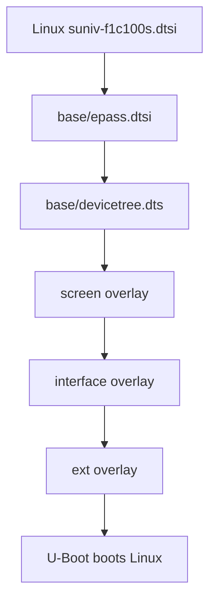
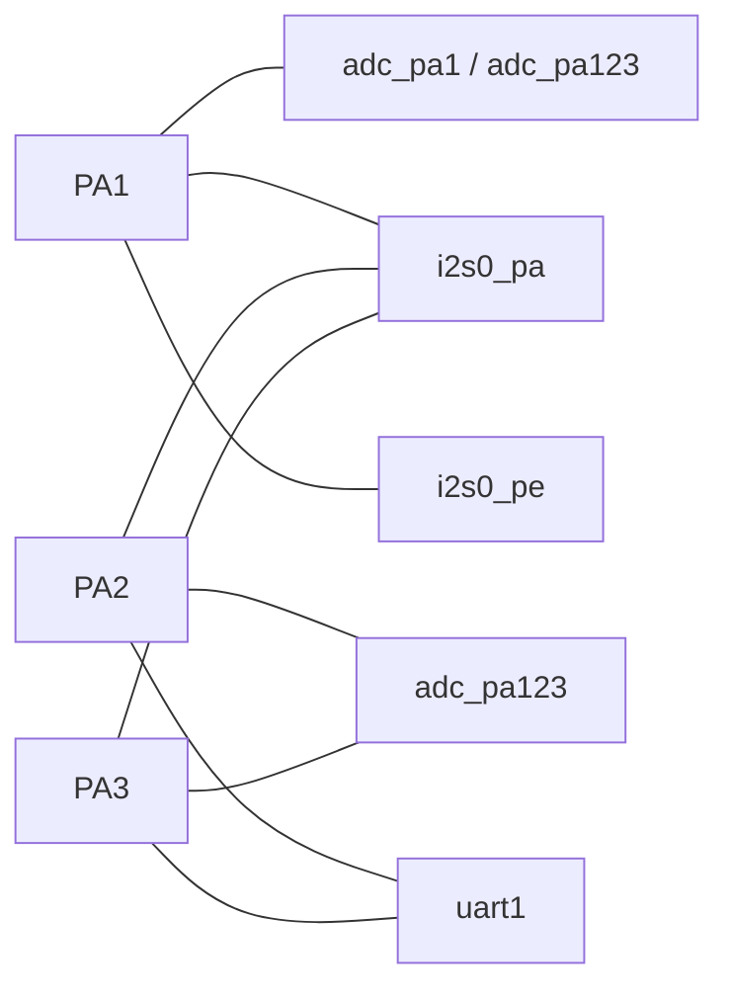
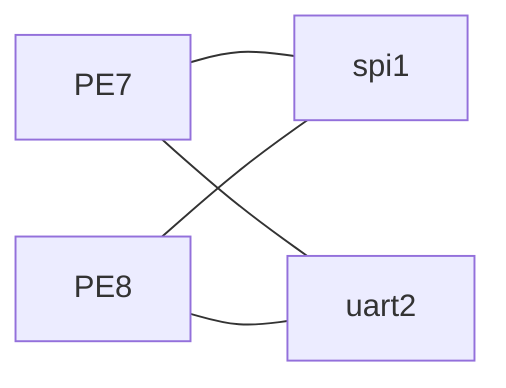
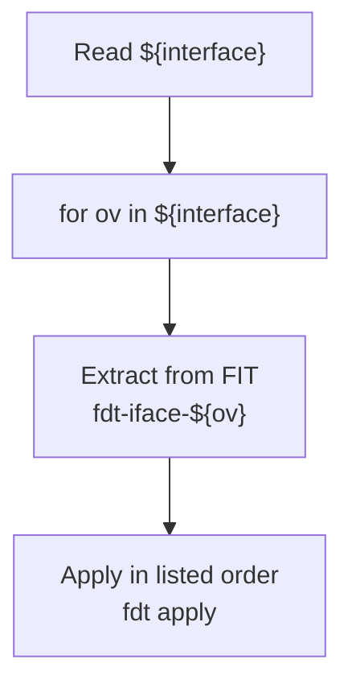

<div align="center">

# CRA Electric Pass Hardware Interface Overlays

<sub>Read this in other languages: [English](README_EN.md), [中文](README.md).</sub>

</div>

> [!NOTE]
> This directory contains the Linux device-tree overlays for CRA Electric Pass hardware interfaces. They enable F1C200S controllers on demand, select GPIO pin-multiplexing functions, and switch USB operating modes.

<p align="center">
  <a href="#interface-overview">Interface Overview</a> ·
  <a href="#device-tree-hierarchy">Device-Tree Hierarchy</a> ·
  <a href="#pin-and-conflict-overview">Pin Conflicts</a> ·
  <a href="#adc">ADC</a> ·
  <a href="#i²c0">I²C0</a> ·
  <a href="#i²s0">I²S0</a> ·
  <a href="#spi1">SPI1</a> ·
  <a href="#uart">UART</a> ·
  <a href="#usb">USB</a> ·
  <a href="#build-and-boot">Build and Boot</a>
</p>

---

## Interface Overview

<table>
<tr>
<td width="33%" valign="top">

### ADC

`adc_pa1`  
`adc_pa123`

RTP / GPADC pin expansion.

**PA0–PA3**

</td>
<td width="33%" valign="top">

### Serial Buses

`i2c0`  
`i2s0_pa`  
`i2s0_pe`  
`spi1`

I²C, I²S, and SPI buses.

</td>
<td width="33%" valign="top">

### UART / USB

`uart1`  
`uart2`  
`usbhost`  
`usbhs`

UART interfaces and USB mode selection.

</td>
</tr>
</table>

| Overlay | Target controller | Purpose | Pins used |
| :--- | :--- | :--- | :--- |
| `adc_pa1.dts` | RTP / GPADC | Adds PA1 as an ADC pin alongside the default PA0 | PA0, PA1 |
| `adc_pa123.dts` | RTP / GPADC | Enables all four ADC pins | PA0, PA1, PA2, PA3 |
| `i2c0.dts` | I²C0 | Enables hardware I²C0 | PD0, PD12 |
| `i2s0_pa.dts` | I²S0 | Enables I²S0 with the PA pin layout | PE3, PA1, PA2, PA3 |
| `i2s0_pe.dts` | I²S0 | Enables I²S0 with the PE pin layout | PE3, PE5, PE6, PA1 |
| `spi1.dts` | SPI1 | Enables SPI1 and the predefined Spidev node | PE7, PE8, PE9, PE10 |
| `uart1.dts` | UART1 | Enables UART1 TX/RX | PA2, PA3 |
| `uart2.dts` | UART2 | Enables UART2 TX/RX | PE7, PE8 |
| `usbhost.dts` | USB OTG | Forces Host mode | Dedicated USB pins |
| `usbhs.dts` | USB OTG | Requests the project's custom High-Speed mode | Dedicated USB pins |

---

## Device-Tree Hierarchy

`interface` provides buses and interfaces, while `ext` declares the specific peripherals attached to them.



| Directory | Responsibility |
| :--- | :--- |
| `base/` | Fixed main-board hardware, default states for optional controllers, and predefined pinctrl groups |
| `screen/` | LCD panel selection and display timings |
| `interface/` | Controller enablement, GPIO pin multiplexing, and USB modes |
| `ext/` | Specific peripherals such as CardKB, ES8311, and LSM6DS3 |

Typical composition:

```text
interface=i2c0
ext=cardkb
```

Here, `i2c0` enables hardware I²C0, while `cardkb` declares a CardKB device at address `0x5f` on that bus.

---

## Basic Overlay Structure

```dts
/dts-v1/;
/plugin/;

/ {
    fragment@1 {
        target = <&some_controller>;
        __overlay__ {
            status = "okay";
        };
    };
};
```

| Field | Meaning |
| :--- | :--- |
| `/dts-v1/;` | Device-tree source format |
| `/plugin/;` | Device Tree Overlay declaration |
| `fragment@1` | Overlay fragment |
| `target` | Selects a base node by label |
| `__overlay__` | Properties to add or override |
| `status = "okay"` | Enables the controller |
| `pinctrl-0` | Default pin group |
| `pinctrl-names = "default"` | Declares the default pinctrl state |

---

## Pin and Conflict Overview

### PA Pins



### PE Pins



### Conflict Table

| Combination | Conflict |
| :--- | :--- |
| `adc_pa1` + `i2s0_pa` | PA1 |
| `adc_pa1` + `i2s0_pe` | PA1 |
| `adc_pa123` + `i2s0_pa` | PA1, PA2, PA3 |
| `adc_pa123` + `i2s0_pe` | PA1 |
| `adc_pa123` + `uart1` | PA2, PA3 |
| `i2s0_pa` + `uart1` | PA2, PA3 |
| `spi1` + `uart2` | PE7, PE8 |
| `i2c0` + `es8311_sound` | PD0 and PD12 are claimed by both hardware I²C0 and GPIO-based bit-banged I²C |
| `usbhost` + USB Gadget | Host and Gadget roles are mutually exclusive |
| `usbhs` | High-Speed signal-integrity risk; the corresponding kernel patch contains an uninitialized variable |

> [!CAUTION]
> U-Boot does not detect GPIO conflicts automatically. Multiple overlays can produce a syntactically valid final device tree while still contending for the same hardware resources.

Mutually exclusive selections:

```text
adc_pa1 / adc_pa123
i2s0_pa / i2s0_pe
```

---

# ADC

## `adc_pa1.dts`

The base `&rtp` node already uses PA0 by default:

```dts
&rtp {
    status = "okay";
    pinctrl-0 = <&rtp_pins_0>;
    pinctrl-names = "default";
};
```

```dts
rtp_pins_0: rtp-pins-0 {
    pins = "PA0";
    function = "rtp";
};
```

`adc_pa1.dts` changes the pin group to:

```dts
fragment@1 {
    target = <&rtp>;
    __overlay__ {
        pinctrl-0 = <&rtp_pins_01>;
    };
};
```

```dts
rtp_pins_01: rtp-pins-01 {
    pins = "PA0", "PA1";
    function = "rtp";
};
```

In other words:

```text
PA0 + PA1
```

> [!NOTE]
> The `pa1` in the file name means that PA1 is added to the default PA0 configuration; it does not mean that only PA1 is enabled.

Related kernel configuration:

```text
CONFIG_MFD_SUN4I_GPADC=y
CONFIG_SUN4I_GPADC=y
```

Related patches:

```text
board/cra/epass/patch/linux/0000-f1c100s-gpadc-regs.patch
board/cra/epass/patch/linux/0005-gpadc-low-freq.patch
```

| Combination | Status |
| :--- | :--- |
| `adc_pa1` + `i2s0_pa` | PA1 conflict |
| `adc_pa1` + `i2s0_pe` | PA1 conflict |
| `adc_pa1` + `uart1` | No direct pin conflict |

---

## `adc_pa123.dts`

```dts
fragment@1 {
    target = <&rtp>;
    __overlay__ {
        pinctrl-0 = <&rtp_pins>;
    };
};
```

Complete RTP pin group:

```dts
rtp_pins: rtp-pins {
    pins = "PA0", "PA1", "PA2", "PA3";
    function = "rtp";
};
```

Final pin assignment:

```text
PA0, PA1, PA2, PA3
```

| Combination | Conflict |
| :--- | :--- |
| `adc_pa123` + `i2s0_pa` | PA1, PA2, PA3 |
| `adc_pa123` + `i2s0_pe` | PA1 |
| `adc_pa123` + `uart1` | PA2, PA3 |

> [!IMPORTANT]
> Both `adc_pa1` and `adc_pa123` modify the `pinctrl-0` property of `&rtp`. Applying both does not merge the pin groups; the value applied later overrides the earlier one.

---

# I²C0

## `i2c0.dts`

```dts
fragment@1 {
    target = <&i2c0>;
    __overlay__ {
        status = "okay";
    };
};
```

The base device tree already defines:

```dts
&i2c0 {
    pinctrl-names = "default";
    pinctrl-0 = <&i2c0_pd_pins>;
    status = "disabled";
};
```

| Signal | GPIO |
| :--- | :--- |
| SDA | PD0 |
| SCL | PD12 |

The RGB LCD pin group does not use PD0 or PD12, so hardware I²C0 remains available while the display is active.

Related kernel configuration:

```text
CONFIG_I2C_CHARDEV=y
CONFIG_I2C_MV64XXX=y
```

After it is enabled, the controller normally appears as:

```text
/dev/i2c-0
```

Confirm the actual bus number with `/dev/i2c-*` and the boot log.

> [!NOTE]
> `i2c0.dts` only enables the controller; it does not declare devices on the bus. CardKB, LSM6DS3, and other peripherals still require their corresponding `ext` overlays.

### Electrical Requirements

I²C is an open-drain bus. The current `i2c0_pd_pins` group does not request internal pull-ups, so suitable SDA and SCL pull-up resistors must be provided by the PCB or attached module.

### Conflict with ES8311

`ext/es8311_sound.dts` uses PD0 and PD12 to create a GPIO-based bit-banged I²C bus.

Forbidden combination:

```text
interface=i2c0
ext=es8311_sound
```

> [!WARNING]
> Hardware I²C0 and GPIO-based bit-banged I²C cannot control the same PD0 and PD12 pins simultaneously.

---

# I²S0

<table>
<tr>
<td width="50%" valign="top">

### `i2s0_pa`

```text
PE3
PA1
PA2
PA3
```

Overlaps extensively with ADC and UART1.

</td>
<td width="50%" valign="top">

### `i2s0_pe`

```text
PE3
PE5
PE6
PA1
```

Avoids the PA2 and PA3 pins used by UART1, but still occupies PA1.

</td>
</tr>
</table>

## `i2s0_pa.dts`

```dts
fragment@1 {
    target = <&i2s0>;
    __overlay__ {
        status = "okay";
        pinctrl-0 = <&i2s_pins_pa>;
        pinctrl-names = "default";
    };
};
```

I²S0 carries only digital audio data. A complete ALSA sound card also requires a codec and sound-card node, for example:

```text
ext=es8311_sound
```

Related kernel configuration:

```text
CONFIG_SND_SOC=m
CONFIG_SND_SUN4I_I2S=m
CONFIG_SND_SIMPLE_CARD=m
```

Related patch:

```text
board/cra/epass/patch/linux/0010-i2s-and-es-driver.patch
```

Conflicts:

```text
i2s0_pa + adc_pa1   = PA1
i2s0_pa + adc_pa123 = PA1, PA2, PA3
i2s0_pa + uart1     = PA2, PA3
```

---

## `i2s0_pe.dts`

```dts
fragment@1 {
    target = <&i2s0>;
    __overlay__ {
        status = "okay";
        pinctrl-0 = <&i2s_pins_pe>;
        pinctrl-names = "default";
    };
};
```

Pins used:

```text
PE3, PE5, PE6, PA1
```

Conflicts:

```text
i2s0_pe + adc_pa1   = PA1
i2s0_pe + adc_pa123 = PA1
```

> [!IMPORTANT]
> `i2s0_pa` and `i2s0_pe` are two pinctrl layouts for the same I²S0 controller. If both are listed, the final `pinctrl-0` value depends on the order in which the overlays are applied.

---

# SPI1

## `spi1.dts`

```dts
fragment@1 {
    target = <&spi1>;
    __overlay__ {
        status = "okay";
    };
};
```

Base device tree:

```dts
&spi1 {
    pinctrl-names = "default";
    pinctrl-0 = <&spi1_pins>;
    status = "disabled";

    spidev@0 {
        compatible = "rohm,dh2228fv";
        spi-max-frequency = <80000000>;
        reg = <0>;
    };
};
```

| Item | Configuration |
| :--- | :--- |
| Pins | PE7, PE8, PE9, PE10 |
| Chip select | CS0 |
| Declared maximum frequency | 80 MHz |
| User-space device | Normally `/dev/spidev1.0` |

`spi1_pins` also enables pull-ups for this pin group.

> [!WARNING]
> 80 MHz is the upper limit declared in the device tree; it does not guarantee that an external device, connector, or jumper wiring can operate reliably at that frequency. Begin hardware bring-up at a lower frequency.

### `rohm,dh2228fv`

This string is used to match the Spidev driver. It does not indicate that a Rohm DH2228FV is physically connected to the board.

The original project uses:

```dts
compatible = "rohm,dh2228fv";
```

instead of:

```dts
compatible = "spidev";
```

to avoid the `buggy DT` warning.

Related kernel configuration:

```text
CONFIG_SPI=y
CONFIG_SPI_SUN6I=y
CONFIG_SPI_SPIDEV=y
```

Conflict:

```text
spi1 + uart2 = PE7, PE8
```

---

# UART

## `uart1.dts`

```dts
fragment@1 {
    target = <&uart1>;
    __overlay__ {
        status = "okay";
    };
};
```

Base configuration:

```dts
&uart1 {
    pinctrl-names = "default";
    pinctrl-0 = <&uart1_pa_pins>;
    status = "disabled";
};
```

| Item | Configuration |
| :--- | :--- |
| TX / RX | PA2, PA3 |
| RTS / CTS | Not enabled |
| Device node | Normally `/dev/ttyS1` |

UART0 already uses PE0 and PE1 as the system console. Enabling `uart1` adds a second UART and does not replace the boot console.

Related kernel configuration:

```text
CONFIG_SERIAL_8250=y
CONFIG_SERIAL_8250_CONSOLE=y
CONFIG_SERIAL_8250_NR_UARTS=3
CONFIG_SERIAL_8250_RUNTIME_UARTS=3
CONFIG_SERIAL_8250_DW=y
```

> [!CAUTION]
> UART1 uses **3.3 V logic-level UART** signaling from the SoC. Do not connect it directly to a traditional positive/negative-voltage RS-232 interface.

Conflicts:

```text
uart1 + adc_pa123 = PA2, PA3
uart1 + i2s0_pa   = PA2, PA3
```

`uart1` has no direct pin conflict with `adc_pa1`.

---

## `uart2.dts`

```dts
fragment@1 {
    target = <&uart2>;
    __overlay__ {
        status = "okay";
    };
};
```

Base configuration:

```dts
&uart2 {
    pinctrl-names = "default";
    pinctrl-0 = <&uart2_pe_pins>;
    status = "disabled";
};
```

| Item | Configuration |
| :--- | :--- |
| TX / RX | PE7, PE8 |
| Device node | Normally `/dev/ttyS2` |

Conflict:

```text
uart2 + spi1 = PE7, PE8
```

UART2 does not directly overlap with either I²S0 pin layout.

---

# USB

<table>
<tr>
<td width="50%" valign="top">

### `usbhost`

**Role selection**

```text
OTG → Host
```

Forces USB Host mode.

</td>
<td width="50%" valign="top">

### `usbhs`

**Speed selection**

```text
Full-Speed → High-Speed request
```

Controlled through a custom CRA property.

</td>
</tr>
</table>

## `usbhost.dts`

```dts
fragment@1 {
    target = <&usb_otg>;
    __overlay__ {
        dr_mode = "host";
    };
};
```

Base device-tree defaults:

```dts
&otg_sram {
    status = "okay";
};

&usb_otg {
    dr_mode = "otg";
    status = "okay";
};

&usbphy {
    status = "okay";
};
```

In other words:


After this overlay is enabled, the following Gadget functions can no longer operate in their original manner:

- RNDIS USB networking
- USB ACM serial Gadget
- USB Mass Storage Gadget
- FunctionFS Gadget

> [!WARNING]
> `usbhost.dts` does not provide 5 V VBUS power. If the PCB has no active power-source capability, setting `dr_mode = "host"` alone will not generate 5 V.

---

## `usbhs.dts`

```dts
fragment@1 {
    target = <&usb_otg>;
    __overlay__ {
        cra,usb-hs-enabled;
    };
};
```

`cra,usb-hs-enabled` is a custom Boolean property.

| Property state | Project behavior |
| :--- | :--- |
| Present | Requests USB High-Speed operation |
| Absent | The project patch disables High-Speed and uses Full-Speed |

Role and speed are independent:

```text
usbhost = role selection
usbhs   = speed selection
```

Theoretical combination:

```text
interface=usbhost usbhs
```

This forces Host mode and requests High-Speed operation.

### USB Speeds

| Mode | Nominal data rate |
| :--- | ---: |
| Full-Speed | 12 Mbit/s |
| High-Speed | 480 Mbit/s |

High-Speed requires stricter control of differential routing, impedance, length matching, and signal integrity.

### Kernel Patch Issue

The corresponding patch comments out the original initialization:

```c
power = MUSB_POWER_ISOUPDATE;
```

but later executes:

```c
power |= MUSB_POWER_HSENAB;
```

or:

```c
power &= ~MUSB_POWER_HSENAB;
```

The local variable `power` is not initialized before the bitwise operation, so other bits written to the MUSB `POWER` register may come from undefined stack data. Both the default Full-Speed path and the High-Speed path are affected.

> [!CAUTION]
> This is a C-code issue, not a syntax problem in `usbhs.dts`. Until the code is fixed, do not enable `usbhs` solely to increase the nominal USB speed.

Both the device tree and kernel patch use:

```dts
cra,usb-hs-enabled;
```

The driver reads it with:

```c
of_property_read_bool(np, "cra,usb-hs-enabled")
```

The property name must remain identical on both sides.

---

## Build and Boot

### Compilation

`board/cra/epass/scripts/mkdt.sh` processes every `.dts` file in this directory:

```bash
cpp -nostdinc \
    -I "${BUILD_DIR}/linux-5.4.99/include/" \
    -I "${BUILD_DIR}/linux-5.4.99/arch/arm/boot/dts" \
    -P -undef -x assembler-with-cpp

dtc -@ -I dts -O dtb
```

Generated files:

```text
output/images/dt/interface/adc_pa1.dtbo
output/images/dt/interface/adc_pa123.dtbo
output/images/dt/interface/i2c0.dtbo
output/images/dt/interface/i2s0_pa.dtbo
output/images/dt/interface/i2s0_pe.dtbo
output/images/dt/interface/spi1.dtbo
output/images/dt/interface/uart1.dtbo
output/images/dt/interface/uart2.dtbo
output/images/dt/interface/usbhost.dtbo
output/images/dt/interface/usbhs.dtbo
```

`-@` preserves the symbols and fixup information required by overlays, allowing U-Boot to resolve base labels such as `&rtp`, `&i2c0`, `&i2s0`, `&spi1`, `&uart1`, `&uart2`, and `&usb_otg`.

### FIT Packaging

`board/cra/epass/scripts/kernel.its` packages each overlay as:

```text
fdt-iface-<interface-name>
```

Examples:

```text
fdt-iface-i2c0
fdt-iface-spi1
fdt-iface-uart1
```


---

## Selection at Boot

The defaults in `board/cra/epass/uEnv.txt` are:

```text
interface=
ext=
```

No optional interface or external device is enabled by default.

Separate multiple interfaces with spaces:

```text
interface=i2c0 uart1
```

U-Boot processes them as follows:



> [!IMPORTANT]
> An interface name must exactly match its FIT node suffix. When multiple overlays modify the same property, the later value may override the earlier one. U-Boot does not prevent physical GPIO conflicts automatically.

---

<div align="center">

<sub><b>CRA Electric Pass</b> · Linux hardware interface</sub>

</div>
