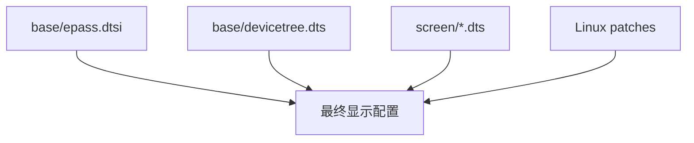
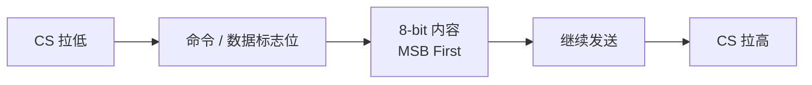
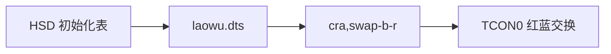
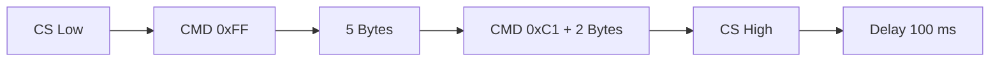
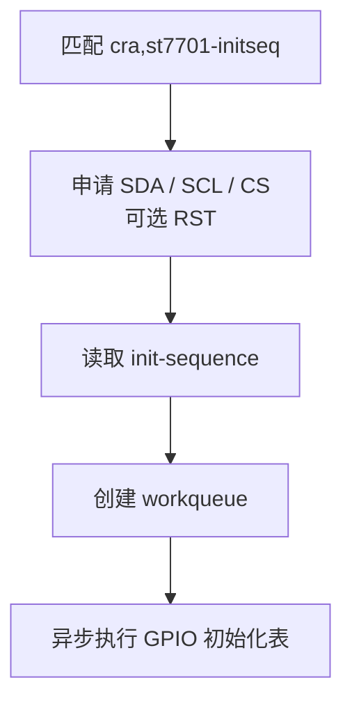
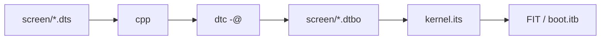

<div align="center">

# CRA Electric Pass 屏幕设备树覆盖层

<sub>Read this in other languages: [English](README_EN.md), [中文](README.md).</sub>

</div>

> [!NOTE]
> 本目录保存 CRA Electric Pass 的 Linux LCD 屏幕设备树覆盖层，用于在启动时选择与实体屏幕匹配的 ST7701 初始化序列。

<p align="center">
  <a href="#屏幕配置总览">屏幕总览</a> ·
  <a href="#显示系统">显示系统</a> ·
  <a href="#公共基础配置">公共配置</a> ·
  <a href="#overlay-结构">Overlay</a> ·
  <a href="#st7701-初始化序列">ST7701</a> ·
  <a href="#三种屏幕配置">屏幕差异</a> ·
  <a href="#编译与启动">编译启动</a> ·
  <a href="#故障排查">故障排查</a>
</p>

---

## 屏幕配置总览

<table>
<tr>
<td width="33%" valign="top">

### BOE

```text
screen=boe
```

- 独立 ST7701 初始化表
- 无红蓝交换
- Gamma / 电源 / GIP 参数独立
- 额外发送 `0x35 0x00`

</td>
<td width="33%" valign="top">

### HSD

```text
screen=hsd
```

- 独立 ST7701 初始化表
- 无红蓝交换
- 当前 `flash.py` 主入口默认参数

</td>
<td width="33%" valign="top">

### Laowu

```text
screen=laowu
```

- 初始化表与 HSD 相同
- 启用 TCON0 红蓝通道交换
- 使用 `cra,swap-b-r`

</td>
</tr>
</table>

| 文件 | 初始化序列 | 额外处理 | 启动参数 |
| :--- | :--- | :--- | :--- |
| `boe.dts` | BOE 专用 ST7701 初始化序列 | 无 | `screen=boe` |
| `hsd.dts` | HSD 专用 ST7701 初始化序列 | 无 | `screen=hsd` |
| `laowu.dts` | 与 HSD 相同 | TCON0 红蓝交换 | `screen=laowu` |

---

## 显示系统

### 显示链路


### 配置分布



| 位置 | 负责内容 |
| :--- | :--- |
| `base/epass.dtsi` | panel、PWM 背光、RGB565 引脚组、TCON0、默认关闭的 `st7701initseq` |
| `base/devicetree.dts` | ST7701 初始化 SDA / SCL / CS GPIO |
| `screen/*.dts` | 启用初始化节点、写入面板初始化表、必要时启用红蓝交换 |
| `0002-panel-simple.patch` | 公共分辨率、时序、RGB565 格式 |
| `0004-swap_rb_as_config.patch` | TCON0 红蓝通道交换 |
| `0006-initalize-st7701.patch` | GPIO 模拟 ST7701 初始化驱动 |

---

## 公共基础配置

### RGB 显示总线

`base/epass.dtsi` 中的 `lcd_rgb565_no_de_pins` 使用：

```text
PD1 ～ PD11
PD13 ～ PD18
PD20
PD21
```

这些引脚承载：

- RGB565 数据
- Pixel Clock
- HSYNC
- VSYNC

`no_de` 表示该引脚组不使用独立 Data Enable 引脚。

公共面板匹配：

```dts
compatible = "cra,epass-panel", "simple-panel";
```

> [!IMPORTANT]
> `cra,epass-panel` 为内核补丁注册的项目专用匹配字符串。

---

### ST7701 初始化引脚

| 信号 | GPIO | 作用 |
| :--- | :--- | :--- |
| SDA | PE4 | 串行命令 / 数据 |
| SCL | PD19 | 串行时钟 |
| CS | PE11 | 片选 |
| RST | 未声明 | 驱动支持可选复位脚，当前板级设备树未使用 |

初始化通信由自定义驱动直接翻转 GPIO 完成，不使用 F1C200S 硬件 SPI 控制器。

### 单次传输格式



| 标志位 | 含义 |
| :---: | :--- |
| `0` | Command |
| `1` | Data |

> [!WARNING]
> PE4、PD19、PE11 在当前方案中属于 ST7701 初始化链路，不应直接当作普通 SPI 接口复用。

---

### 背光

背光由 `base/epass.dtsi` 的 `pwm-backlight` 统一管理。

| 项目 | 当前配置 |
| :--- | :--- |
| PWM 控制器 | PWM0 |
| PWM 周期 | `10000 ns` |
| 频率 | 约 `100 kHz` |
| 亮度表 | `0 4 8 16 32 64 128 196 220 255` |
| 默认亮度索引 | `6` |
| 默认亮度值 | `128` |

---

## 公共显示模式

三种屏幕覆盖层最终都使用 `cra,epass-panel`。

公共模式由：

```text
board/cra/epass/patch/linux/0002-panel-simple.patch
```

提供。

| 参数 | 数值 |
| :--- | ---: |
| Pixel Clock | 24000 kHz |
| H Active | 384 |
| H Sync Start | 444 |
| H Sync End | 450 |
| H Total | 528 |
| V Active | 640 |
| V Sync Start | 656 |
| V Sync End | 660 |
| V Total | 669 |
| 声明刷新率 | 60 Hz |
| 总线格式 | `MEDIA_BUS_FMT_RGB565_1X16` |
| 每颜色分量位数 | 6 bpc |

按照当前像素时钟与总计值计算：

```text
24,000,000 ÷ (528 × 669) ≈ 67.9 Hz
```

> [!NOTE]
> 设备树中声明为 60 Hz，但按当前参数直接计算约为 67.9 Hz。调整显示时序时应同时核对像素时钟与水平 / 垂直总计。

---

## Overlay 结构

三个文件都属于 Device Tree Overlay：

```dts
#include <dt-bindings/display/st7701initseq.h>

/dts-v1/;
/plugin/;

/ {
    fragment@1 {
        target = <&st7701initseq>;
        __overlay__ {
            status = "okay";
            init-sequence = <...>;
        };
    };

    fragment@2 {
        target = <&panel>;
        __overlay__ {
            compatible = "cra,epass-panel", "simple-panel";
        };
    };
};
```

### `fragment@1`

目标：

```text
&st7701initseq
```

作用：

- 将 `status = "disabled"` 改为 `okay`
- 写入当前屏幕对应 `init-sequence`
- 触发 CRA ST7701 初始化驱动

### `fragment@2`

目标：

```text
&panel
```

三个覆盖层目前都写入同一个：

```dts
compatible = "cra,epass-panel", "simple-panel";
```

因此当前三种屏幕共用：

- 分辨率
- 同步时序
- RGB565 总线格式

主要差异集中在 ST7701 初始化寄存器。

> [!NOTE]
> `base/epass.dtsi` 已声明相同 `compatible`，所以当前 `fragment@2` 不改变最终值。它保留了后续为不同屏幕拆分独立面板描述的空间。

---

### Laowu 专用 `fragment@3`

仅 `laowu.dts` 包含：

```dts
fragment@3 {
    target = <&tcon0>;
    __overlay__ {
        cra,swap-b-r;
    };
};
```



`cra,swap-b-r` 由：

```text
board/cra/epass/patch/linux/0004-swap_rb_as_config.patch
```

读取。

> [!IMPORTANT]
> 屏幕显示正常但红蓝互换时，先检查 `screen=hsd` / `screen=laowu` 是否选错，再考虑应用层颜色处理。

---

# ST7701 初始化序列

`init-sequence` 不是普通字节数组。

宏定义来自：

```text
include/dt-bindings/display/st7701initseq.h
```

| 宏 | 参数 | 作用 |
| :--- | :--- | :--- |
| `ST7701INIT_BEGIN_WRITE` | 无 | CS 拉低，开始一组传输 |
| `ST7701INIT_WRITE_COMMAND_8` | 1 个命令 | 写入 8 位命令 |
| `ST7701INIT_WRITE_C8_D8` | 命令 + 1 数据 | 写命令与一个数据字节 |
| `ST7701INIT_WRITE_C8_D16` | 命令 + 2 数据 | 写命令与两个数据字节 |
| `ST7701INIT_WRITE_BYTES` | 长度 + 数据 | 连续写入指定数量字节 |
| `ST7701INIT_END_WRITE` | 无 | CS 拉高 |
| `ST7701INIT_DELAY` | 毫秒 | 延时 |

### 示例

```dts
ST7701INIT_BEGIN_WRITE

ST7701INIT_WRITE_COMMAND_8 0xFF
ST7701INIT_WRITE_BYTES 5
0x77 0x01 0x00 0x00 0x10

ST7701INIT_WRITE_C8_D16 0xC1 0x07 0x02

ST7701INIT_END_WRITE
ST7701INIT_DELAY 100
```

执行顺序：



> [!CAUTION]
> `WRITE_BYTES` 长度错误、漏参数或指令边界错位都可能造成错误初始化。

---

## 初始化序列覆盖范围

初始化表主要涉及：

- ST7701 扩展命令页
- 电源与模拟参数
- 正 / 负极性 Gamma
- Source / Gate 输出
- GIP 映射
- 扫描方向
- 显示方向
- 像素格式
- Sleep Out
- Display On
- 阶段延时

三种配置都包含：

```text
0x11       退出休眠
0x29       开启显示
0x3A 0x50  当前像素格式
```

> [!WARNING]
> 厂商扩展页中的寄存器不能仅凭通用 MIPI DCS 命令名称推断作用。修改前应参考对应面板与 ST7701 数据手册，并保留已验证初始化表。

---

# 三种屏幕配置

## BOE

`boe.dts` 使用独立初始化表。

与 HSD / Laowu 相比，其：

- Gamma 参数不同
- 电源参数不同
- 扩展寄存器不同
- GIP 映射不同

主要等待：

```text
120 ms
10 ms
20 ms
```

显示开启后额外发送：

```text
0x35 0x00
```

---

## HSD

`hsd.dts` 使用另一套 ST7701 初始化表，不启用红蓝交换。

主要等待：

```text
150 ms
100 ms
20 ms
```

当前 `flash.py` 主入口：

```python
flash("hsd", {...})
```

> [!NOTE]
> 这里的默认仅来自当前烧录脚本调用参数，不代表所有实体设备都安装 HSD 屏幕。

---

## Laowu

`laowu.dts` 与 `hsd.dts` 的初始化序列逐项相同。

唯一源码差异：

```dts
cra,swap-b-r;
```

即：

```text
hsd    = HSD 初始化表
laowu = HSD 初始化表 + TCON0 红蓝交换
```

> [!IMPORTANT]
> 修改 HSD 初始化序列时，应同步核对 `laowu.dts`，避免两份原本一致的寄存器表发生意外分叉。

---

## 三种配置对比

| 项目 | BOE | HSD | Laowu |
| :--- | :---: | :---: | :---: |
| 独立初始化表 | 是 | 是 | 与 HSD 相同 |
| 红蓝交换 | 否 | 否 | 是 |
| 公共 panel compatible | 是 | 是 | 是 |
| 公共 DRM 时序 | 是 | 是 | 是 |
| `0x35 0x00` | 有 | 无 | 无 |
| 主要等待 | 120 / 10 / 20 ms | 150 / 100 / 20 ms | 150 / 100 / 20 ms |

---

## 内核初始化驱动

ST7701 初始化能力来自：

```text
board/cra/epass/patch/linux/0006-initalize-st7701.patch
```

该补丁新增：

```text
include/dt-bindings/display/st7701initseq.h
drivers/staging/cra/Kconfig
drivers/staging/cra/Makefile
drivers/staging/cra/st7701init.c
```

内核配置：

```text
CONFIG_CRA_EP_STAGING=y
CONFIG_CRA_EP_ST7701_INIT=y
```

驱动匹配：

```dts
compatible = "cra,st7701-initseq";
```

执行流程：



---

# 编译与启动

## 编译

Buildroot 镜像后处理脚本调用：

```text
board/cra/epass/scripts/mkdt.sh
```

预处理：

```sh
cpp -nostdinc \
    -I "${BUILD_DIR}/linux-5.4.99/include/" \
    -I "${BUILD_DIR}/linux-5.4.99/arch/arm/boot/dts" \
    -P -undef -x assembler-with-cpp
```

编译：

```sh
dtc -@ -I dts -O dtb
```

输出：

```text
output/images/dt/screen/boe.dtbo
output/images/dt/screen/hsd.dtbo
output/images/dt/screen/laowu.dtbo
```

### FIT 打包

`kernel.its` 将它们打包为：

```text
fdt-screen-boe
fdt-screen-hsd
fdt-screen-laowu
```



> [!IMPORTANT]
> 新增 `.dts` 文件后还需要同步修改 `board/cra/epass/scripts/kernel.its`，否则新的 `.dtbo` 不会进入 FIT。

---

## 启动时选择屏幕

烧录环境中写入：

```text
screen=hsd
```

U-Boot 提取：

```text
imxtract $fitaddr fdt-screen-${screen} $dtboaddr
```

随后：

```text
fdt apply $dtboaddr
```

完整关系：


有效值：

```text
boe
hsd
laowu
```

| 场景 | 屏幕来源 |
| :--- | :--- |
| 使用现有 `flash.py` | `flash()` / `flash2()` 第一个参数 |
| 手动启动环境 | 必须自行提供 `screen=` |
| `screen` 为空或拼写错误 | U-Boot 无法提取对应 `fdt-screen-*` |

---

# 故障排查

| 现象 | 优先检查 |
| :--- | :--- |
| 背光亮但无图像 | `screen=`、ST7701 初始化、RGB 时钟、同步信号 |
| 完全不亮 | PWM 背光、电源、面板连接 |
| 红蓝互换 | `hsd` / `laowu`、`cra,swap-b-r` |
| 颜色层次异常 | RGB565 接线、像素格式、Gamma、面板型号 |
| 图像滚动 / 撕裂 | DRM 时序、ST7701 扫描配置、像素时钟 |
| 图像方向错误 | 初始化表中的扫描方向 |
| 偶发白屏 | 初始化顺序、延时、供电、异步初始化时机 |
| 编译找不到宏 | `0006-initalize-st7701.patch` 是否已应用 |
| `.dtbo` 已生成但 U-Boot 找不到 | `kernel.its` 是否包含对应节点 |

日志检查：

```sh
dmesg | grep -i st7701
dmesg | grep -i cra
```

---

<div align="center">

<sub><b>CRA Electric Pass</b> · Linux screen</sub>

</div>
