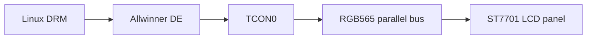
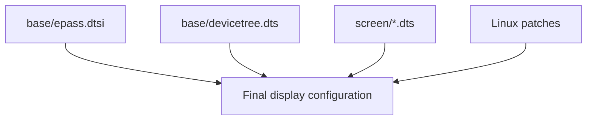
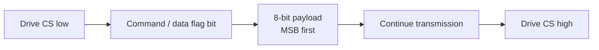
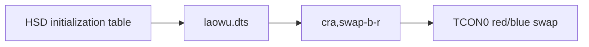
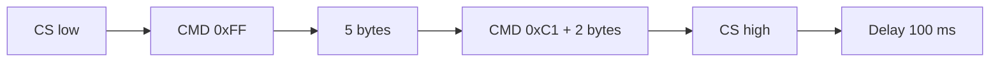
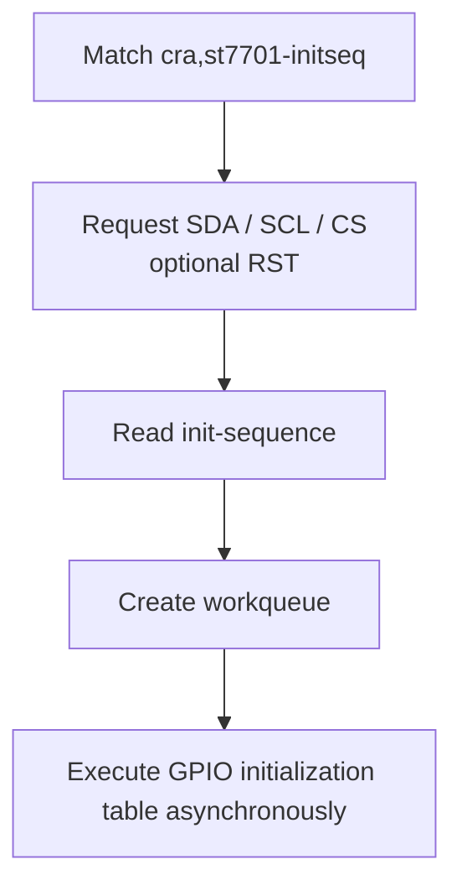
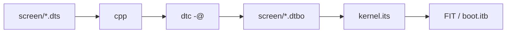

<div align="center">

# CRA Electric Pass Screen Device-Tree Overlays

<sub>Read this in other languages: [English](README_EN.md), [中文](README.md).</sub>

</div>

> [!NOTE]
> This directory contains the Linux LCD screen device-tree overlays for CRA Electric Pass. They select the ST7701 initialization sequence that matches the physical panel during boot.

<p align="center">
  <a href="#screen-configuration-overview">Screen Overview</a> ·
  <a href="#display-system">Display System</a> ·
  <a href="#shared-base-configuration">Shared Configuration</a> ·
  <a href="#overlay-structure">Overlay</a> ·
  <a href="#st7701-initialization-sequence">ST7701</a> ·
  <a href="#three-screen-configurations">Screen Differences</a> ·
  <a href="#build-and-boot">Build and Boot</a> ·
  <a href="#troubleshooting">Troubleshooting</a>
</p>

---

## Screen Configuration Overview

<table>
<tr>
<td width="33%" valign="top">

### BOE

```text
screen=boe
```

- Dedicated ST7701 initialization table
- No red/blue channel swap
- Independent Gamma, power, and GIP parameters
- Additionally sends `0x35 0x00`

</td>
<td width="33%" valign="top">

### HSD

```text
screen=hsd
```

- Dedicated ST7701 initialization table
- No red/blue channel swap
- Current default argument of the main `flash.py` entry point

</td>
<td width="33%" valign="top">

### Laowu

```text
screen=laowu
```

- Uses the same initialization table as HSD
- Enables TCON0 red/blue channel swapping
- Uses `cra,swap-b-r`

</td>
</tr>
</table>

| File | Initialization sequence | Additional handling | Boot argument |
| :--- | :--- | :--- | :--- |
| `boe.dts` | BOE-specific ST7701 initialization sequence | None | `screen=boe` |
| `hsd.dts` | HSD-specific ST7701 initialization sequence | None | `screen=hsd` |
| `laowu.dts` | Same as HSD | TCON0 red/blue channel swap | `screen=laowu` |

---

## Display System

### Display Pipeline



### Configuration Distribution



| Location | Responsibility |
| :--- | :--- |
| `base/epass.dtsi` | Panel, PWM backlight, RGB565 pin group, TCON0, and the disabled-by-default `st7701initseq` node |
| `base/devicetree.dts` | ST7701 initialization SDA / SCL / CS GPIOs |
| `screen/*.dts` | Enables the initialization node, supplies the panel initialization table, and enables red/blue swapping when required |
| `0002-panel-simple.patch` | Shared resolution, timings, and RGB565 format |
| `0004-swap_rb_as_config.patch` | TCON0 red/blue channel swapping |
| `0006-initalize-st7701.patch` | GPIO-driven ST7701 initialization driver |

---

## Shared Base Configuration

### RGB Display Bus

`lcd_rgb565_no_de_pins` in `base/epass.dtsi` uses:

```text
PD1–PD11
PD13–PD18
PD20
PD21
```

These pins carry:

- RGB565 data
- Pixel Clock
- HSYNC
- VSYNC

`no_de` indicates that this pin group does not use a dedicated Data Enable signal.

Shared panel match:

```dts
compatible = "cra,epass-panel", "simple-panel";
```

> [!IMPORTANT]
> `cra,epass-panel` is a project-specific matching string registered by a kernel patch.

---

### ST7701 Initialization Pins

| Signal | GPIO | Purpose |
| :--- | :--- | :--- |
| SDA | PE4 | Serial command / data |
| SCL | PD19 | Serial clock |
| CS | PE11 | Chip select |
| RST | Not declared | The driver supports an optional reset pin, but the current board device tree does not use it |

The custom driver performs initialization by toggling GPIOs directly rather than using the F1C200S hardware SPI controller.

### Single-Transfer Format



| Flag bit | Meaning |
| :---: | :--- |
| `0` | Command |
| `1` | Data |

> [!WARNING]
> PE4, PD19, and PE11 belong to the ST7701 initialization link in the current design and should not be repurposed directly as a general-purpose SPI interface.

---

### Backlight

The backlight is managed centrally by the `pwm-backlight` node in `base/epass.dtsi`.

| Item | Current configuration |
| :--- | :--- |
| PWM controller | PWM0 |
| PWM period | `10000 ns` |
| Frequency | Approximately `100 kHz` |
| Brightness table | `0 4 8 16 32 64 128 196 220 255` |
| Default brightness index | `6` |
| Default brightness value | `128` |

---

## Shared Display Mode

All three screen overlays ultimately use `cra,epass-panel`.

The shared mode is provided by:

```text
board/cra/epass/patch/linux/0002-panel-simple.patch
```

| Parameter | Value |
| :--- | ---: |
| Pixel Clock | 24000 kHz |
| H Active | 384 |
| H Sync Start | 444 |
| H Sync End | 450 |
| H Total | 528 |
| V Active | 640 |
| V Sync Start | 656 |
| V Sync End | 660 |
| V Total | 669 |
| Declared refresh rate | 60 Hz |
| Bus format | `MEDIA_BUS_FMT_RGB565_1X16` |
| Bits per color component | 6 bpc |

Using the current pixel clock and total values:

```text
24,000,000 ÷ (528 × 669) ≈ 67.9 Hz
```

> [!NOTE]
> The device tree declares 60 Hz, but the current parameters yield approximately 67.9 Hz when calculated directly. When adjusting display timings, verify the pixel clock together with the horizontal and vertical totals.

---

## Overlay Structure

All three files are Device Tree Overlays:

```dts
#include <dt-bindings/display/st7701initseq.h>

/dts-v1/;
/plugin/;

/ {
    fragment@1 {
        target = <&st7701initseq>;
        __overlay__ {
            status = "okay";
            init-sequence = <...>;
        };
    };

    fragment@2 {
        target = <&panel>;
        __overlay__ {
            compatible = "cra,epass-panel", "simple-panel";
        };
    };
};
```

### `fragment@1`

Target:

```text
&st7701initseq
```

Purpose:

- Changes `status = "disabled"` to `okay`
- Supplies the `init-sequence` for the selected panel
- Invokes the CRA ST7701 initialization driver

### `fragment@2`

Target:

```text
&panel
```

All three overlays currently set the same value:

```dts
compatible = "cra,epass-panel", "simple-panel";
```

The three screen configurations therefore share:

- Resolution
- Synchronization timings
- RGB565 bus format

Their main differences are in the ST7701 initialization registers.

> [!NOTE]
> `base/epass.dtsi` already declares the same `compatible` value, so `fragment@2` does not currently alter the final value. It leaves room for separate panel descriptions to be introduced for different screens later.

---

### Laowu-Specific `fragment@3`

Only `laowu.dts` contains:

```dts
fragment@3 {
    target = <&tcon0>;
    __overlay__ {
        cra,swap-b-r;
    };
};
```



`cra,swap-b-r` is read by:

```text
board/cra/epass/patch/linux/0004-swap_rb_as_config.patch
```

> [!IMPORTANT]
> If the image is otherwise correct but red and blue are swapped, first verify whether `screen=hsd` or `screen=laowu` was selected incorrectly before applying color correction in user space.

---

# ST7701 Initialization Sequence

`init-sequence` is not a plain byte array.

Its macros are defined in:

```text
include/dt-bindings/display/st7701initseq.h
```

| Macro | Parameters | Purpose |
| :--- | :--- | :--- |
| `ST7701INIT_BEGIN_WRITE` | None | Drives CS low and begins a transfer group |
| `ST7701INIT_WRITE_COMMAND_8` | One command | Writes an 8-bit command |
| `ST7701INIT_WRITE_C8_D8` | Command + 1 data byte | Writes a command and one data byte |
| `ST7701INIT_WRITE_C8_D16` | Command + 2 data bytes | Writes a command and two data bytes |
| `ST7701INIT_WRITE_BYTES` | Length + data | Writes the specified number of consecutive bytes |
| `ST7701INIT_END_WRITE` | None | Drives CS high |
| `ST7701INIT_DELAY` | Milliseconds | Delays execution |

### Example

```dts
ST7701INIT_BEGIN_WRITE

ST7701INIT_WRITE_COMMAND_8 0xFF
ST7701INIT_WRITE_BYTES 5
0x77 0x01 0x00 0x00 0x10

ST7701INIT_WRITE_C8_D16 0xC1 0x07 0x02

ST7701INIT_END_WRITE
ST7701INIT_DELAY 100
```

Execution order:



> [!CAUTION]
> An incorrect `WRITE_BYTES` length, a missing parameter, or a misaligned instruction boundary can all cause incorrect initialization.

---

## Initialization-Sequence Coverage

The initialization tables primarily configure:

- ST7701 extended command pages
- Power and analog parameters
- Positive and negative Gamma
- Source and Gate outputs
- GIP mapping
- Scan direction
- Display orientation
- Pixel format
- Sleep Out
- Display On
- Inter-stage delays

All three configurations include:

```text
0x11       Exit sleep mode
0x29       Turn the display on
0x3A 0x50  Current pixel format
```

> [!WARNING]
> The purpose of registers on vendor-specific extended pages cannot be inferred solely from generic MIPI DCS command names. Before making changes, consult the corresponding panel documentation and the ST7701 datasheet, and preserve the verified initialization tables.

---

# Three Screen Configurations

## BOE

`boe.dts` uses a dedicated initialization table.

Compared with HSD / Laowu, it has different:

- Gamma parameters
- Power parameters
- Extended registers
- GIP mapping

Main delays:

```text
120 ms
10 ms
20 ms
```

After enabling the display, it additionally sends:

```text
0x35 0x00
```

---

## HSD

`hsd.dts` uses a different ST7701 initialization table and does not enable red/blue swapping.

Main delays:

```text
150 ms
100 ms
20 ms
```

Current main entry point in `flash.py`:

```python
flash("hsd", {...})
```

> [!NOTE]
> This default comes only from the current flashing-script argument. It does not imply that every physical device uses an HSD panel.

---

## Laowu

The initialization sequence in `laowu.dts` is identical to the one in `hsd.dts`.

The only source-level difference is:

```dts
cra,swap-b-r;
```

In other words:

```text
hsd    = HSD initialization table
laowu = HSD initialization table + TCON0 red/blue swap
```

> [!IMPORTANT]
> When modifying the HSD initialization sequence, verify `laowu.dts` at the same time so that the two previously identical register tables do not diverge unintentionally.

---

## Configuration Comparison

| Item | BOE | HSD | Laowu |
| :--- | :---: | :---: | :---: |
| Dedicated initialization table | Yes | Yes | Same as HSD |
| Red/blue swap | No | No | Yes |
| Shared panel compatible | Yes | Yes | Yes |
| Shared DRM timings | Yes | Yes | Yes |
| `0x35 0x00` | Present | Absent | Absent |
| Main delays | 120 / 10 / 20 ms | 150 / 100 / 20 ms | 150 / 100 / 20 ms |

---

## Kernel Initialization Driver

ST7701 initialization support comes from:

```text
board/cra/epass/patch/linux/0006-initalize-st7701.patch
```

The patch adds:

```text
include/dt-bindings/display/st7701initseq.h
drivers/staging/cra/Kconfig
drivers/staging/cra/Makefile
drivers/staging/cra/st7701init.c
```

Kernel configuration:

```text
CONFIG_CRA_EP_STAGING=y
CONFIG_CRA_EP_ST7701_INIT=y
```

Driver match:

```dts
compatible = "cra,st7701-initseq";
```

Execution flow:



---

# Build and Boot

## Compilation

The Buildroot post-image script invokes:

```text
board/cra/epass/scripts/mkdt.sh
```

Preprocessing:

```sh
cpp -nostdinc \
    -I "${BUILD_DIR}/linux-5.4.99/include/" \
    -I "${BUILD_DIR}/linux-5.4.99/arch/arm/boot/dts" \
    -P -undef -x assembler-with-cpp
```

Compilation:

```sh
dtc -@ -I dts -O dtb
```

Output:

```text
output/images/dt/screen/boe.dtbo
output/images/dt/screen/hsd.dtbo
output/images/dt/screen/laowu.dtbo
```

### FIT Packaging

`kernel.its` packages them as:

```text
fdt-screen-boe
fdt-screen-hsd
fdt-screen-laowu
```



> [!IMPORTANT]
> After adding a new `.dts` file, also update `board/cra/epass/scripts/kernel.its`; otherwise, the new `.dtbo` will not be included in the FIT image.

---

## Selecting the Screen at Boot

The flashing environment writes:

```text
screen=hsd
```

U-Boot extracts:

```text
imxtract $fitaddr fdt-screen-${screen} $dtboaddr
```

and then runs:

```text
fdt apply $dtboaddr
```

Complete relationship:


Valid values:

```text
boe
hsd
laowu
```

| Scenario | Source of the screen value |
| :--- | :--- |
| Using the existing `flash.py` | First argument to `flash()` / `flash2()` |
| Manual boot environment | You must provide `screen=` explicitly |
| `screen` is empty or misspelled | U-Boot cannot extract the corresponding `fdt-screen-*` node |

---

# Troubleshooting

| Symptom | Check first |
| :--- | :--- |
| Backlight is on but no image appears | `screen=`, ST7701 initialization, RGB clock, and synchronization signals |
| Screen remains completely dark | PWM backlight, power supply, and panel connection |
| Red and blue are swapped | `hsd` / `laowu` selection and `cra,swap-b-r` |
| Abnormal color gradation | RGB565 wiring, pixel format, Gamma, and panel model |
| Image rolls or tears | DRM timings, ST7701 scan configuration, and pixel clock |
| Incorrect image orientation | Scan direction in the initialization table |
| Intermittent white screen | Initialization order, delays, power supply, and asynchronous initialization timing |
| Macros cannot be found during compilation | Whether `0006-initalize-st7701.patch` has been applied |
| `.dtbo` is generated but U-Boot cannot find it | Whether `kernel.its` contains the corresponding node |

Log checks:

```sh
dmesg | grep -i st7701
dmesg | grep -i cra
```

---

<div align="center">

<sub><b>CRA Electric Pass</b> · Linux screen</sub>

</div>
