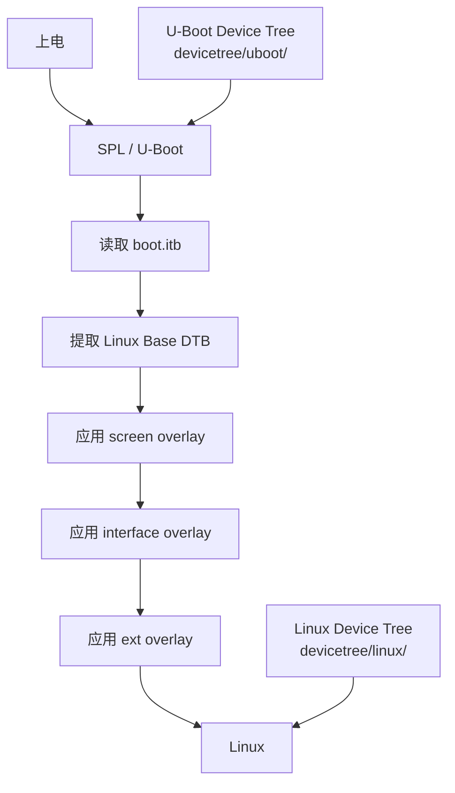
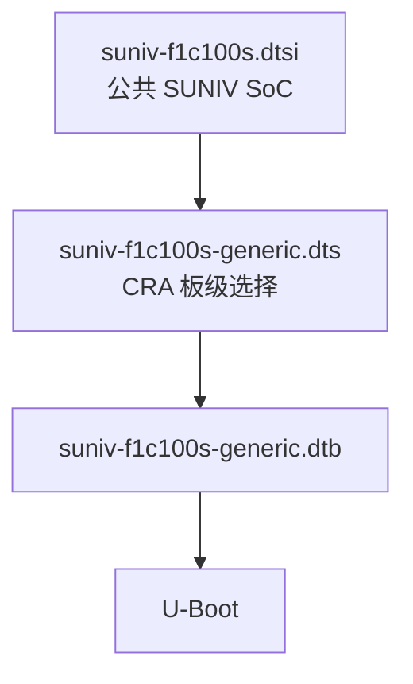
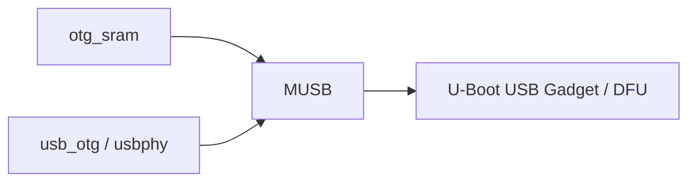
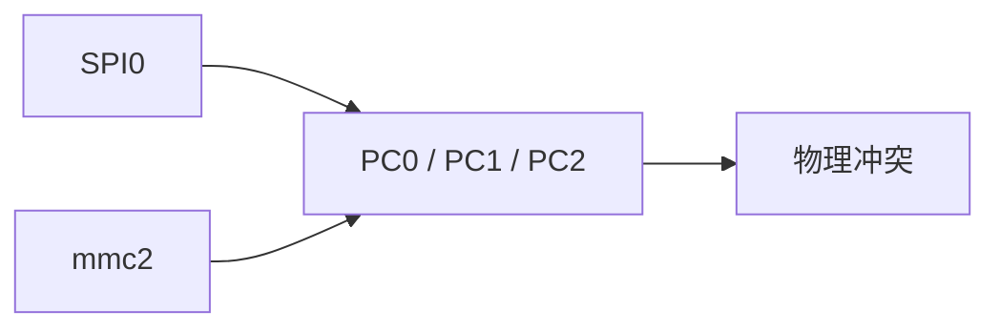
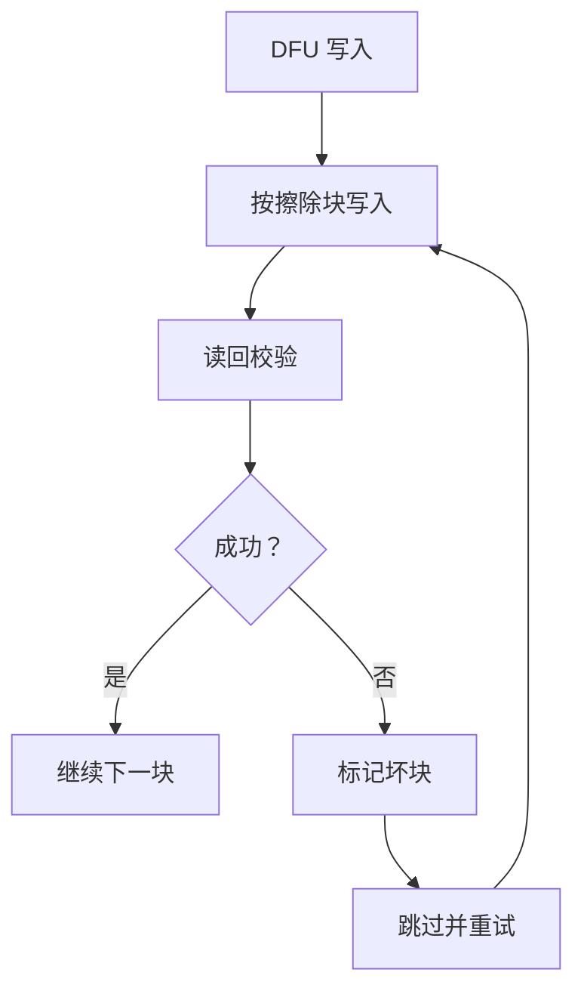
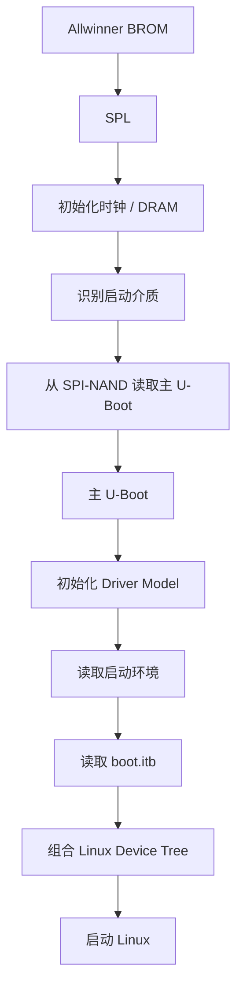
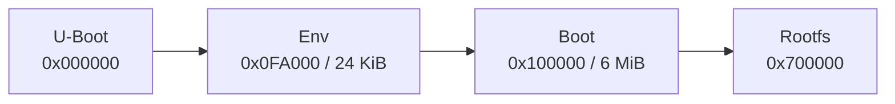
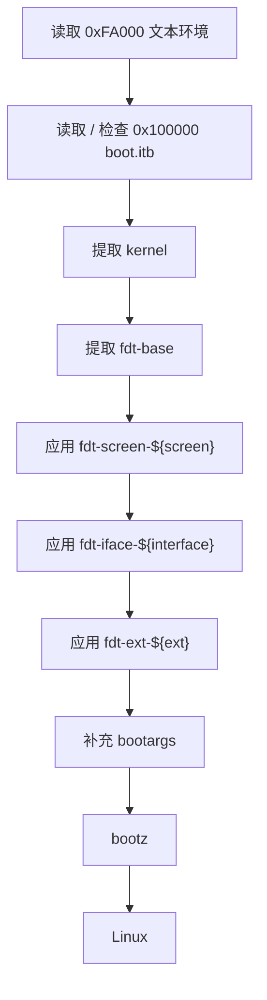

<div align="center">

# CRA Electric Pass U-Boot 设备树

<sub>Read this in other languages: [English](README_EN.md), [中文](README.md).</sub>

</div>

> [!NOTE]
> 本目录保存 CRA Electric Pass 在 **SPL 与 U-Boot 阶段**使用的板级设备树。

<p align="center">
  <a href="#文件说明">文件说明</a> ·
  <a href="#与-linux-设备树的区别">U-Boot / Linux</a> ·
  <a href="#设备树组合">组合关系</a> ·
  <a href="#启动外设">启动外设</a> ·
  <a href="#u-boot-配置与补丁">配置补丁</a> ·
  <a href="#spl-与主-u-boot">SPL</a> ·
  <a href="#默认启动环境">启动环境</a> ·
  <a href="#编译与检查">编译检查</a>
</p>

---

## 文件说明

| 文件 | 作用 |
| :--- | :--- |
| `suniv-f1c100s-generic.dts` | CRA Electric Pass 当前使用的 U-Boot 板级设备树入口 |

板级 DTS 本身负责板级选择与外设启用状态。F1C100S / F1C200S 的寄存器、时钟、复位、中断和基础控制器节点来自：

```text
board/allwinner/suniv-f1c100s/devicetree/uboot/suniv-f1c100s.dtsi
```

---

## 与 Linux 设备树的区别

CRA Electric Pass 启动过程中使用两套独立设备树。



| U-Boot 设备树 | Linux 设备树 |
| :--- | :--- |
| 供 SPL / U-Boot 驱动使用 | 供 Linux 内核驱动使用 |
| 描述启动前需要访问的硬件 | 描述完整运行期硬件 |
| SPI-NAND、DFU、串口、MMC 等启动资源 | LCD、背光、按键、接口、外设等 |
| 编译进 U-Boot 自身 | DTB / DTBO 打包进 `boot.itb` |

> [!IMPORTANT]
> 修改 Linux DTS 不会自动改变 U-Boot 阶段配置；修改 U-Boot DTS 也不会自动改变 Linux 最终设备树。

当前 U-Boot 明确关闭：

```text
# CONFIG_VIDEO_SUNXI is not set
```

显示由 Linux 阶段接管。

---

## 设备树组合

Buildroot 配置：

```text
BR2_TARGET_UBOOT_CUSTOM_DTS_PATH=
    board/allwinner/suniv-f1c100s/devicetree/uboot/suniv-f1c100s.dtsi
    board/cra/epass/devicetree/uboot/suniv-f1c100s-generic.dts
```

构建前复制到：

```text
output/build/uboot-2020.07/arch/arm/dts/
```

板级 DTS 通过：

```dts
#include "suniv-f1c100s.dtsi"
```

引用公共 SUNIV SoC 描述。



默认设备树：

```text
CONFIG_DEFAULT_DEVICE_TREE="suniv-f1c100s-generic"
```

---

## 公共 SUNIV 设备树

`suniv-f1c100s.dtsi` 定义 SoC 内部资源：

| 节点 | 地址 / 参数 | 作用 |
| :--- | :--- | :--- |
| `osc24M` | 24 MHz | 主晶振 |
| `osc32k` | 32768 Hz | 低速时钟 |
| `cpu` | ARM926EJ-S | CPU |
| `sram-controller` | `0x01c00000` | SRAM 控制器 |
| `spi0` | `0x01c05000` | SPI0 |
| `ccu` | `0x01c20000` | 时钟 / 复位 |
| `intc` | `0x01c20400` | 中断控制器 |
| `pio` | `0x01c20800` | GPIO / pinctrl |
| `timer` | `0x01c20c00` | 定时器 |
| `watchdog` | `0x01c20ca0` | 看门狗 |
| `uart0` | `0x01c25000` | UART0 |
| `uart1` | `0x01c25400` | UART1 |
| `uart2` | `0x01c25800` | UART2 |
| `usb_otg` | `0x01c13000` | USB OTG |
| `usbphy` | `0x01c13400` | USB PHY |
| `mmc0` | `0x01c0f000` | MMC0 |
| `mmc2` | `0x01c10000` | 第二组 MMC 资源 |

公共文件中多数外设默认：

```dts
status = "disabled";
```

板级 DTS 只启用启动阶段需要的节点。

> [!NOTE]
> 公共文件版权信息为 `Copyright 2018 Icenowy Zheng`。

---

# 启动外设

## 串口与控制台

### Alias

```dts
aliases {
    serial0 = &uart0;
    spi0 = &spi0;
};
```

| Alias | 目标 | 作用 |
| :--- | :--- | :--- |
| `serial0` | `uart0` | 逻辑串口 0 |
| `spi0` | `spi0` | SPI0 稳定别名 |

### Console

```dts
chosen {
    stdout-path = "serial0:115200n8";
};
```

| 参数 | 当前值 |
| :--- | :--- |
| 串口 | UART0 |
| 波特率 | 115200 |
| 数据位 | 8 |
| 校验 | None |
| 停止位 | 1 |

UART0：

```text
PE0 = TX
PE1 = RX
```

`0001-uart-pull.patch` 为 PE0 / PE1 启用上拉。

### UART1

```dts
&uart1 {
    pinctrl-names = "default";
    pinctrl-0 = <&uart1_pins_a>;
    status = "okay";
};
```

使用：

```text
PA2
PA3
```

> [!NOTE]
> U-Boot 与 Linux 的 pinctrl 相互独立。进入 Linux 后，PA2 / PA3 会重新按 Linux 设备树配置。

---

## USB SRAM

```dts
&otg_sram {
    status = "okay";
};
```

USB OTG 需要内部 SRAM D 区。板级 DTS 在启用 USB OTG 时同步启用该 SRAM 区域。



---

## SPI0 与启动闪存

### SPI0

```dts
&spi0 {
    pinctrl-names = "default";
    pinctrl-0 = <&spi0_pins_a>;
    status = "okay";
};
```

使用：

```text
PC0
PC1
PC2
PC3
```

SPI-NAND 最大请求频率：

```dts
spi-max-frequency = <80000000>;
```

> [!NOTE]
> 80 MHz 是请求上限。实际频率由 SUNIV SPI 父时钟与分频结果决定。

`0004-f1c-spi-fix.patch` 修正 SUNIV SPI 父时钟、分频和最大频率处理。

### SPI-NAND

```dts
spi-nand@0 {
    reg = <0>;
    compatible = "spi-nand";
    spi-max-frequency = <80000000>;
};
```

当前启动存储：

```text
SPI0 / CS0 → SPI-NAND
```

项目额外支持：

| ID | 型号 |
| :--- | :--- |
| `c2 12` | Macronix MX35LF1GE4AB |
| `c2 14` | Macronix MX35LF1G24AD |

补丁：

```text
0003-spi-nand-mx35lf1g.patch
```

---

## MMC

### MMC0

```dts
&mmc0 {
    status = "okay";
};
```

使用：

```text
PF0 ～ PF5
```

### MMC2

```dts
&mmc2 {
    status = "disabled";
};
```

该标签实际对应：

```text
寄存器：0x01c10000
时钟：MMC1
复位：MMC1
引脚：PC0、PC1、PC2
功能：mmc1
```

### 与 SPI0 的冲突



SPI0 使用 `PC0～PC3`，MMC2 使用 `PC0～PC2`。

> [!CAUTION]
> 当前配置保持 `mmc2` 关闭，确保 PC0～PC3 专供 SPI0 启动闪存。不能只把 `mmc2` 改成 `okay` 后直接使用。

---

## USB OTG 与 DFU

```dts
&usb_otg {
    status = "okay";
};

&usbphy {
    status = "okay";
};
```

启用：

- SUNIV USB OTG
- USB PHY
- U-Boot USB Gadget
- DFU

相关 Kconfig：

```text
CONFIG_CMD_DFU=y
CONFIG_DFU_MTD=y
CONFIG_USB_MUSB_GADGET=y
CONFIG_USB_GADGET_DOWNLOAD=y
```

### Full-Speed

`0002-musb-force-fs.patch` 强制 U-Boot USB 工作于 Full-Speed。

### NAND DFU 写入

`0005-dfu-verify-block.patch` 增加：

- 按擦除块分段写入
- 写后读回校验
- 失败块标记为坏块
- 跳过坏块后继续写入
- 空间耗尽返回 `-ENOSPC`



> [!IMPORTANT]
> 当前 U-Boot DFU 同时承担 SPI-NAND 坏块处理与写入校验。

---

# U-Boot 配置与补丁

## U-Boot 版本

```text
U-Boot 2020.07
```

配置入口：

```text
board/cra/epass/cra_epass_defconfig
board/cra/epass/uboot.defconfig
```

### 关键配置

| 配置 | 当前值 | 作用 |
| :--- | :---: | :--- |
| `CONFIG_ARCH_SUNXI` | `y` | SUNXI 平台 |
| `CONFIG_MACH_SUNIV` | `y` | F1C100S / F1C200S |
| `CONFIG_SYS_TEXT_BASE` | `0x81700000` | 主 U-Boot 运行地址 |
| `CONFIG_SPL` | `y` | 启用 SPL |
| `CONFIG_DRAM_CLK` | `204` | DRAM 时钟 |
| `CONFIG_SYS_CLK_FREQ` | `604000000` | CPU / 系统目标时钟 |
| `CONFIG_SPL_SPI_SUNXI` | `y` | SPL 从 SUNXI SPI 启动 |
| `CONFIG_BOOTDELAY` | `0` | 无常规倒计时 |
| `CONFIG_BOOTCOMMAND` | `run distro_bootcmd;` | 默认启动流程 |
| `CONFIG_MTD_SPI_NAND` | `y` | SPI-NAND |
| `CONFIG_CMD_DFU` | `y` | DFU |
| `CONFIG_DFU_MTD` | `y` | DFU 操作 MTD |
| `CONFIG_NET` | 关闭 | 不启用 U-Boot 网络栈 |

---

## 补丁层次

Buildroot 顺序应用：


基础补丁目录：

```text
board/allwinner/suniv-f1c100s/patch/u-boot/
```

CRA 补丁目录：

```text
board/cra/epass/patch/uboot/
```

### SUNIV 基础补丁

```text
0001-v2020.07.11.patch
```

主要补充 ARM926EJ-S SUNXI 启动、SUNIV SPL、时钟、DRAM、GPIO、UART、MMC、SPI、USB PHY、SPI-NAND SPL 启动与 CCU 等支持。

### CRA 板级补丁

| 补丁 | 作用 |
| :--- | :--- |
| `0001-uart-pull.patch` | UART0 PE0 / PE1 上拉 |
| `0002-musb-force-fs.patch` | U-Boot USB 强制 Full-Speed |
| `0003-spi-nand-mx35lf1g.patch` | Macronix SPI-NAND ID |
| `0004-f1c-spi-fix.patch` | SUNIV SPI 时钟 / 分频修正 |
| `0005-dfu-verify-block.patch` | DFU 坏块跳过与写后校验 |

---

# SPL 与主 U-Boot

启动分为两级：



主 U-Boot 在 SPI-NAND 中的偏移：

```text
CONFIG_SYS_SPI_NAND_U_BOOT_OFFS = 0xD000
```

即 52 KiB。

Buildroot 首先生成：

```text
output/images/u-boot-sunxi-with-spl.bin
```

随后 `mknanduboot.sh` 按 2 KiB NAND 页布局重排 SPL，并把主 U-Boot 放到 `0xD000`，生成：

```text
output/images/u-boot-sunxi-with-nand-spl.bin
```

> [!CAUTION]
> 实体设备烧录使用 `u-boot-sunxi-with-nand-spl.bin`。普通 `u-boot-sunxi-with-spl.bin` 不是当前 SPI-NAND 最终布局镜像。

---

# 默认启动环境

默认环境文件：

```text
board/cra/epass/uboot.env
```

启用方式：

```text
CONFIG_USE_DEFAULT_ENV_FILE=y
CONFIG_DEFAULT_ENV_FILE="../../../board/cra/epass/uboot.env"
```

## 内存地址

| 变量 | 地址 | 用途 |
| :--- | ---: | :--- |
| `kernaddr` | `0x80008000` | Linux zImage |
| `dtbaddr` | `0x80C00000` | Linux Base DTB |
| `dtboaddr` | `0x80D00000` | 临时 DTBO |
| `envtxtaddr` | `0x80E00000` | 文本启动环境 |
| `fitaddr` | `0x81000000` | `boot.itb` |

FIT 最大允许：

```text
0x500000 = 5 MiB
```

用于避免 FIT 数据覆盖位于 `0x81700000` 的主 U-Boot。

---

## SPI-NAND 布局

| 区域 | 偏移 | 大小 |
| :--- | ---: | ---: |
| U-Boot | `0x000000` | 1 MiB |
| 文本启动环境 | `0x0FA000` | 24 KiB |
| Boot | `0x100000` | 6 MiB |
| Rootfs | `0x700000` | 剩余空间 |

环境区域：

```text
0xFA000 + 0x6000 = 0x100000
```

刚好到达 Boot 分区起点。



---

## Linux 启动流程

默认 `distro_bootcmd`：



> [!WARNING]
> FIT 头无效、FIT 大小为 0 或 FDT 检查失败时，启动逻辑会进入 `rundfu`。

---

# 编译与检查

## 首次配置

```sh
make cra_epass_defconfig
```

项目重建脚本：

```sh
./rebuild-uboot.sh
```

内部执行：

```sh
make uboot-clean-for-rebuild
make uboot -j8
make -j8
```

最后一次 `make` 会继续运行镜像后处理，生成 SPI-NAND 最终 U-Boot 与其他系统镜像。

> [!IMPORTANT]
> 所有由 Linux / Buildroot 执行的 `.sh` 必须保持 LF 换行。CRLF 会导致 Bash 出现 `$'\r': command not found` 等错误。

## 构建产物

重点检查：

```text
output/images/u-boot-sunxi-with-spl.bin
output/images/u-boot-sunxi-with-nand-spl.bin
output/images/boot.itb
output/images/rootfs_ubi.img
```

> [!NOTE]
> 仅看到 `u-boot-sunxi-with-spl.bin` 不代表 NAND 启动镜像已经完成，还需要确认 `mknanduboot.sh` 成功生成 `u-boot-sunxi-with-nand-spl.bin`。

---

## 常见问题

| 现象 | 优先检查 |
| :--- | :--- |
| U-Boot 无串口输出 | UART0 PE0 / PE1、115200n8、上拉补丁、供电 |
| SPL 找不到主 U-Boot | SPI-NAND 型号、ID、`0xD000`、NAND SPL 镜像 |
| U-Boot 找不到 SPI-NAND | SPI0 pinctrl、`spi-nand@0`、驱动、芯片 ID |
| DTC 报单元地址不匹配 | `spi-nand@0` 与 `reg = <0>` 是否一致 |
| 启用第二组 MMC 后 SPI 启动异常 | `mmc2` 与 SPI0 共用 PC0～PC2 |
| USB DFU 无法枚举 | `usb_otg`、`usbphy`、`otg_sram`、FS 补丁 |
| DFU 写入跳块 | NAND 坏块、写失败、校验失败 |
| `boot.itb` 无效后进入 DFU | FIT 头、大小、Boot 内容、5 MiB 限制 |
| 修改 U-Boot DTS 未生效 | 是否 clean + rebuild，Buildroot 是否重新复制 DTS |
| 修改 Linux DTS 后 U-Boot 不变 | 两套设备树相互独立 |
| U-Boot 无开机图 | 当前关闭 `CONFIG_VIDEO_SUNXI` |

---

<div align="center">

<sub><b>CRA Electric Pass</b> · U-Boot Device Tree and boot flow</sub>

</div>
