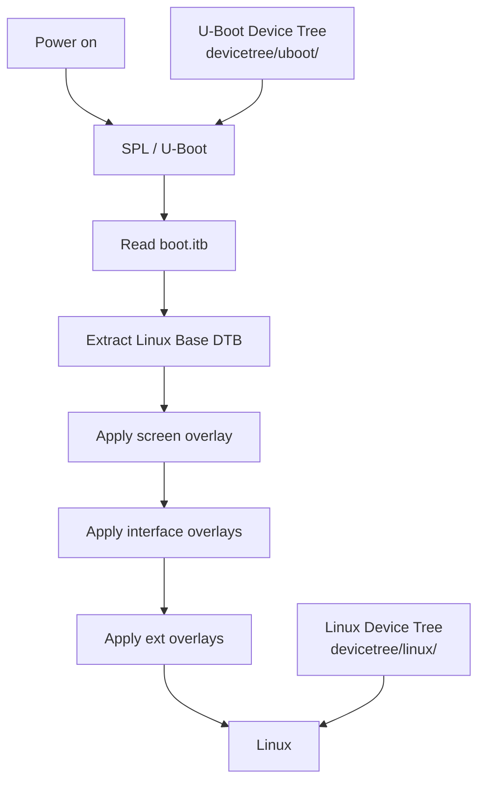
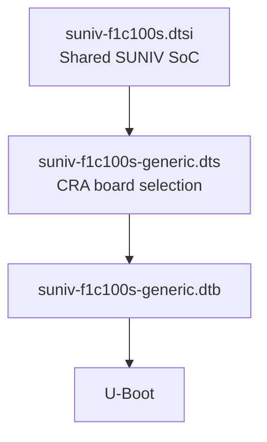
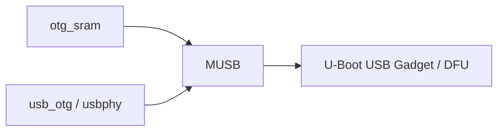
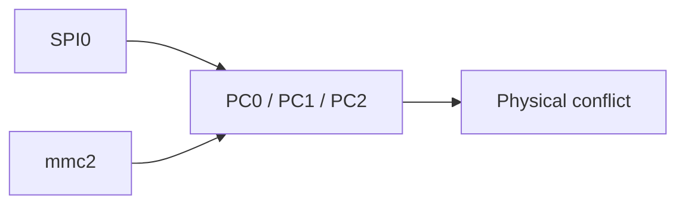
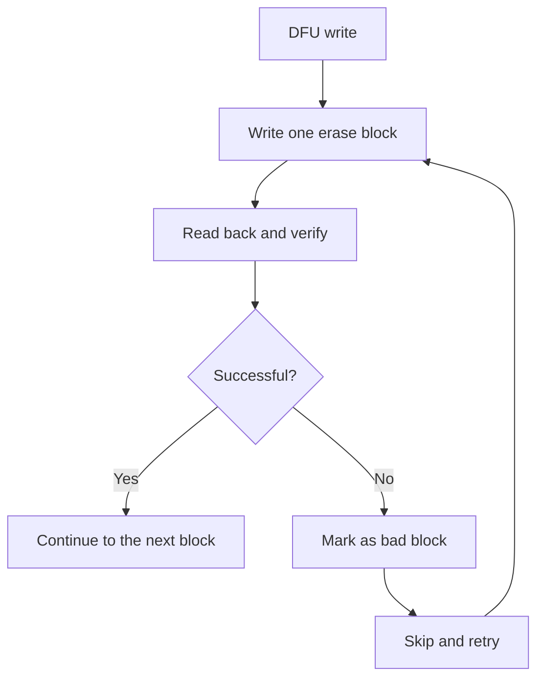
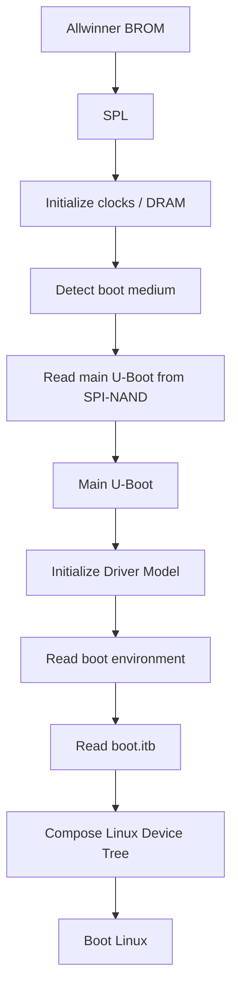
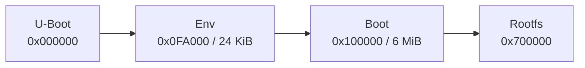
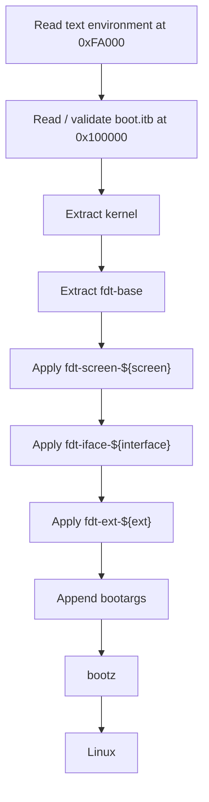

<div align="center">

# CRA Electric Pass U-Boot Device Tree

<sub>Read this in other languages: [English](README_EN.md), [中文](README.md).</sub>

</div>

> [!NOTE]
> This directory contains the board-level device tree used by CRA Electric Pass during the **SPL and U-Boot stages**.

<p align="center">
  <a href="#file-overview">File Overview</a> ·
  <a href="#differences-from-the-linux-device-tree">U-Boot / Linux</a> ·
  <a href="#device-tree-composition">Composition</a> ·
  <a href="#boot-peripherals">Boot Peripherals</a> ·
  <a href="#u-boot-configuration-and-patches">Configuration and Patches</a> ·
  <a href="#spl-and-main-u-boot">SPL</a> ·
  <a href="#default-boot-environment">Boot Environment</a> ·
  <a href="#build-and-inspection">Build and Inspection</a>
</p>

---

## File Overview

| File | Purpose |
| :--- | :--- |
| `suniv-f1c100s-generic.dts` | Current U-Boot board-level device-tree entry point for CRA Electric Pass |

The board DTS selects the board and enables the required peripherals. Register addresses, clocks, resets, interrupts, and base controller nodes for the F1C100S / F1C200S come from:

```text
board/allwinner/suniv-f1c100s/devicetree/uboot/suniv-f1c100s.dtsi
```

---

## Differences from the Linux Device Tree

CRA Electric Pass uses two independent device trees during boot.



| U-Boot device tree | Linux device tree |
| :--- | :--- |
| Used by SPL and U-Boot drivers | Used by Linux kernel drivers |
| Describes hardware needed before the kernel starts | Describes the complete runtime hardware |
| Covers boot resources such as SPI-NAND, DFU, UART, and MMC | Covers the LCD, backlight, buttons, interfaces, and external peripherals |
| Compiled into U-Boot itself | DTB and DTBO files are packaged into `boot.itb` |

> [!IMPORTANT]
> Changing the Linux DTS does not automatically change the U-Boot-stage configuration, and changing the U-Boot DTS does not automatically change the final Linux device tree.

The current U-Boot configuration explicitly disables:

```text
# CONFIG_VIDEO_SUNXI is not set
```

Linux takes over display initialization.

---

## Device-Tree Composition

Buildroot configuration:

```text
BR2_TARGET_UBOOT_CUSTOM_DTS_PATH=
    board/allwinner/suniv-f1c100s/devicetree/uboot/suniv-f1c100s.dtsi
    board/cra/epass/devicetree/uboot/suniv-f1c100s-generic.dts
```

Before the build, these files are copied to:

```text
output/build/uboot-2020.07/arch/arm/dts/
```

The board DTS includes the shared SUNIV SoC description with:

```dts
#include "suniv-f1c100s.dtsi"
```



Default device tree:

```text
CONFIG_DEFAULT_DEVICE_TREE="suniv-f1c100s-generic"
```

---

## Shared SUNIV Device Tree

`suniv-f1c100s.dtsi` defines the SoC's internal resources:

| Node | Address / Parameter | Purpose |
| :--- | :--- | :--- |
| `osc24M` | 24 MHz | Main oscillator |
| `osc32k` | 32768 Hz | Low-frequency clock |
| `cpu` | ARM926EJ-S | CPU |
| `sram-controller` | `0x01c00000` | SRAM controller |
| `spi0` | `0x01c05000` | SPI0 |
| `ccu` | `0x01c20000` | Clocks / resets |
| `intc` | `0x01c20400` | Interrupt controller |
| `pio` | `0x01c20800` | GPIO / pinctrl |
| `timer` | `0x01c20c00` | Timer |
| `watchdog` | `0x01c20ca0` | Watchdog |
| `uart0` | `0x01c25000` | UART0 |
| `uart1` | `0x01c25400` | UART1 |
| `uart2` | `0x01c25800` | UART2 |
| `usb_otg` | `0x01c13000` | USB OTG |
| `usbphy` | `0x01c13400` | USB PHY |
| `mmc0` | `0x01c0f000` | MMC0 |
| `mmc2` | `0x01c10000` | Second MMC resource group |

Most peripherals in the shared file default to:

```dts
status = "disabled";
```

The board DTS enables only the nodes required during the boot stage.

> [!NOTE]
> The shared file carries the notice `Copyright 2018 Icenowy Zheng`.

---

# Boot Peripherals

## UART and Console

### Aliases

```dts
aliases {
    serial0 = &uart0;
    spi0 = &spi0;
};
```

| Alias | Target | Purpose |
| :--- | :--- | :--- |
| `serial0` | `uart0` | Logical UART 0 |
| `spi0` | `spi0` | Stable alias for SPI0 |

### Console

```dts
chosen {
    stdout-path = "serial0:115200n8";
};
```

| Parameter | Current value |
| :--- | :--- |
| UART | UART0 |
| Baud rate | 115200 |
| Data bits | 8 |
| Parity | None |
| Stop bits | 1 |

UART0:

```text
PE0 = TX
PE1 = RX
```

`0001-uart-pull.patch` enables pull-ups on PE0 and PE1.

### UART1

```dts
&uart1 {
    pinctrl-names = "default";
    pinctrl-0 = <&uart1_pins_a>;
    status = "okay";
};
```

Pins used:

```text
PA2
PA3
```

> [!NOTE]
> U-Boot and Linux have independent pinctrl configurations. After Linux starts, PA2 and PA3 are configured again according to the Linux device tree.

---

## USB SRAM

```dts
&otg_sram {
    status = "okay";
};
```

USB OTG requires the internal SRAM D region. The board DTS enables this SRAM region together with USB OTG.



---

## SPI0 and Boot Flash

### SPI0

```dts
&spi0 {
    pinctrl-names = "default";
    pinctrl-0 = <&spi0_pins_a>;
    status = "okay";
};
```

Pins used:

```text
PC0
PC1
PC2
PC3
```

Maximum requested SPI-NAND frequency:

```dts
spi-max-frequency = <80000000>;
```

> [!NOTE]
> 80 MHz is the requested upper limit. The actual frequency depends on the SUNIV SPI parent clock and divider result.

`0004-f1c-spi-fix.patch` corrects SUNIV SPI parent-clock selection, clock division, and maximum-frequency handling.

### SPI-NAND

```dts
spi-nand@0 {
    reg = <0>;
    compatible = "spi-nand";
    spi-max-frequency = <80000000>;
};
```

Current boot storage:

```text
SPI0 / CS0 → SPI-NAND
```

Additional devices supported by the project:

| ID | Model |
| :--- | :--- |
| `c2 12` | Macronix MX35LF1GE4AB |
| `c2 14` | Macronix MX35LF1G24AD |

Patch:

```text
0003-spi-nand-mx35lf1g.patch
```

---

## MMC

### MMC0

```dts
&mmc0 {
    status = "okay";
};
```

Pins used:

```text
PF0–PF5
```

### MMC2

```dts
&mmc2 {
    status = "disabled";
};
```

This label actually corresponds to:

```text
Registers: 0x01c10000
Clock: MMC1
Reset: MMC1
Pins: PC0, PC1, PC2
Function: mmc1
```

### Conflict with SPI0



SPI0 uses `PC0–PC3`, while MMC2 uses `PC0–PC2`.

> [!CAUTION]
> The current configuration keeps `mmc2` disabled so that PC0 through PC3 remain dedicated to the SPI0 boot flash. Do not simply change `mmc2` to `okay` and attempt to use it.

---

## USB OTG and DFU

```dts
&usb_otg {
    status = "okay";
};

&usbphy {
    status = "okay";
};
```

This enables:

- SUNIV USB OTG
- USB PHY
- U-Boot USB Gadget
- DFU

Related Kconfig options:

```text
CONFIG_CMD_DFU=y
CONFIG_DFU_MTD=y
CONFIG_USB_MUSB_GADGET=y
CONFIG_USB_GADGET_DOWNLOAD=y
```

### Full-Speed

`0002-musb-force-fs.patch` forces U-Boot USB to operate at Full-Speed.

### NAND DFU Writes

`0005-dfu-verify-block.patch` adds:

- Erase-block-sized write segments
- Read-back verification after each write
- Bad-block marking when a write fails
- Skipping bad blocks and continuing the write
- Returning `-ENOSPC` when the available space is exhausted



> [!IMPORTANT]
> The current U-Boot DFU flow handles both SPI-NAND bad blocks and write verification.

---

# U-Boot Configuration and Patches

## U-Boot Version

```text
U-Boot 2020.07
```

Configuration entry points:

```text
board/cra/epass/cra_epass_defconfig
board/cra/epass/uboot.defconfig
```

### Key Configuration

| Configuration | Current value | Purpose |
| :--- | :---: | :--- |
| `CONFIG_ARCH_SUNXI` | `y` | SUNXI platform |
| `CONFIG_MACH_SUNIV` | `y` | F1C100S / F1C200S |
| `CONFIG_SYS_TEXT_BASE` | `0x81700000` | Main U-Boot runtime address |
| `CONFIG_SPL` | `y` | Enables SPL |
| `CONFIG_DRAM_CLK` | `204` | DRAM clock |
| `CONFIG_SYS_CLK_FREQ` | `604000000` | Target CPU / system clock |
| `CONFIG_SPL_SPI_SUNXI` | `y` | SPL boots from SUNXI SPI |
| `CONFIG_BOOTDELAY` | `0` | No normal boot countdown |
| `CONFIG_BOOTCOMMAND` | `run distro_bootcmd;` | Default boot flow |
| `CONFIG_MTD_SPI_NAND` | `y` | SPI-NAND support |
| `CONFIG_CMD_DFU` | `y` | DFU command |
| `CONFIG_DFU_MTD` | `y` | DFU access to MTD |
| `CONFIG_NET` | Disabled | U-Boot network stack is not enabled |

---

## Patch Layers

Buildroot applies the patches in this order:


Base patch directory:

```text
board/allwinner/suniv-f1c100s/patch/u-boot/
```

CRA patch directory:

```text
board/cra/epass/patch/uboot/
```

### Base SUNIV Patch

```text
0001-v2020.07.11.patch
```

This patch primarily adds ARM926EJ-S SUNXI boot support, SUNIV SPL support, clocks, DRAM, GPIO, UART, MMC, SPI, USB PHY, SPI-NAND SPL boot support, CCU support, and related functionality.

### CRA Board Patches

| Patch | Purpose |
| :--- | :--- |
| `0001-uart-pull.patch` | Enables pull-ups on UART0 PE0 / PE1 |
| `0002-musb-force-fs.patch` | Forces U-Boot USB to Full-Speed |
| `0003-spi-nand-mx35lf1g.patch` | Adds Macronix SPI-NAND IDs |
| `0004-f1c-spi-fix.patch` | Corrects SUNIV SPI clocks and division |
| `0005-dfu-verify-block.patch` | Adds bad-block skipping and read-back verification to DFU |

---

# SPL and Main U-Boot

Booting occurs in two stages:



Main U-Boot offset in SPI-NAND:

```text
CONFIG_SYS_SPI_NAND_U_BOOT_OFFS = 0xD000
```

This is 52 KiB.

Buildroot first generates:

```text
output/images/u-boot-sunxi-with-spl.bin
```

`mknanduboot.sh` then rearranges the SPL for a 2 KiB NAND page layout, places main U-Boot at `0xD000`, and generates:

```text
output/images/u-boot-sunxi-with-nand-spl.bin
```

> [!CAUTION]
> The physical device is flashed with `u-boot-sunxi-with-nand-spl.bin`. The ordinary `u-boot-sunxi-with-spl.bin` does not use the final SPI-NAND layout for this device.

---

# Default Boot Environment

Default environment file:

```text
board/cra/epass/uboot.env
```

Enabled through:

```text
CONFIG_USE_DEFAULT_ENV_FILE=y
CONFIG_DEFAULT_ENV_FILE="../../../board/cra/epass/uboot.env"
```

## Memory Addresses

| Variable | Address | Purpose |
| :--- | ---: | :--- |
| `kernaddr` | `0x80008000` | Linux zImage |
| `dtbaddr` | `0x80C00000` | Linux Base DTB |
| `dtboaddr` | `0x80D00000` | Temporary DTBO |
| `envtxtaddr` | `0x80E00000` | Text boot environment |
| `fitaddr` | `0x81000000` | `boot.itb` |

Maximum FIT size:

```text
0x500000 = 5 MiB
```

This prevents FIT data from overwriting main U-Boot at `0x81700000`.

---

## SPI-NAND Layout

| Region | Offset | Size |
| :--- | ---: | ---: |
| U-Boot | `0x000000` | 1 MiB |
| Text boot environment | `0x0FA000` | 24 KiB |
| Boot | `0x100000` | 6 MiB |
| Rootfs | `0x700000` | Remaining space |

Environment region:

```text
0xFA000 + 0x6000 = 0x100000
```

It ends exactly at the start of the Boot partition.



---

## Linux Boot Flow

Default `distro_bootcmd`:



> [!WARNING]
> If the FIT header is invalid, the FIT size is zero, or FDT validation fails, the boot logic enters `rundfu`.

---

# Build and Inspection

## Initial Configuration

```sh
make cra_epass_defconfig
```

Project rebuild script:

```sh
./rebuild-uboot.sh
```

It runs:

```sh
make uboot-clean-for-rebuild
make uboot -j8
make -j8
```

The final `make` continues through image post-processing and generates the final SPI-NAND U-Boot image together with the other system images.

> [!IMPORTANT]
> Every `.sh` file executed by Linux or Buildroot must use LF line endings. CRLF causes Bash errors such as `$'\r': command not found`.

## Build Artifacts

Check these files:

```text
output/images/u-boot-sunxi-with-spl.bin
output/images/u-boot-sunxi-with-nand-spl.bin
output/images/boot.itb
output/images/rootfs_ubi.img
```

> [!NOTE]
> The presence of `u-boot-sunxi-with-spl.bin` alone does not mean that the NAND boot image is complete. Confirm that `mknanduboot.sh` successfully generated `u-boot-sunxi-with-nand-spl.bin`.

---

## Common Issues

| Symptom | Check first |
| :--- | :--- |
| No UART output from U-Boot | UART0 PE0 / PE1, 115200n8, pull-up patch, and power supply |
| SPL cannot find main U-Boot | SPI-NAND model, device ID, `0xD000`, and the NAND SPL image |
| U-Boot cannot find SPI-NAND | SPI0 pinctrl, `spi-nand@0`, driver, and chip ID |
| DTC reports a unit-address mismatch | Whether `spi-nand@0` matches `reg = <0>` |
| SPI boot fails after enabling the second MMC group | `mmc2` and SPI0 share PC0 through PC2 |
| USB DFU does not enumerate | `usb_otg`, `usbphy`, `otg_sram`, and the Full-Speed patch |
| DFU skips blocks while writing | NAND bad blocks, write failures, or verification failures |
| Invalid `boot.itb` causes entry into DFU | FIT header, size, Boot contents, and the 5 MiB limit |
| U-Boot DTS changes have no effect | Whether a clean rebuild was performed and Buildroot recopied the DTS |
| Linux DTS changes do not affect U-Boot | The two device trees are independent |
| U-Boot shows no boot splash | `CONFIG_VIDEO_SUNXI` is currently disabled |

---

<div align="center">

<sub><b>CRA Electric Pass</b> · U-Boot Device Tree and boot flow</sub>

</div>
