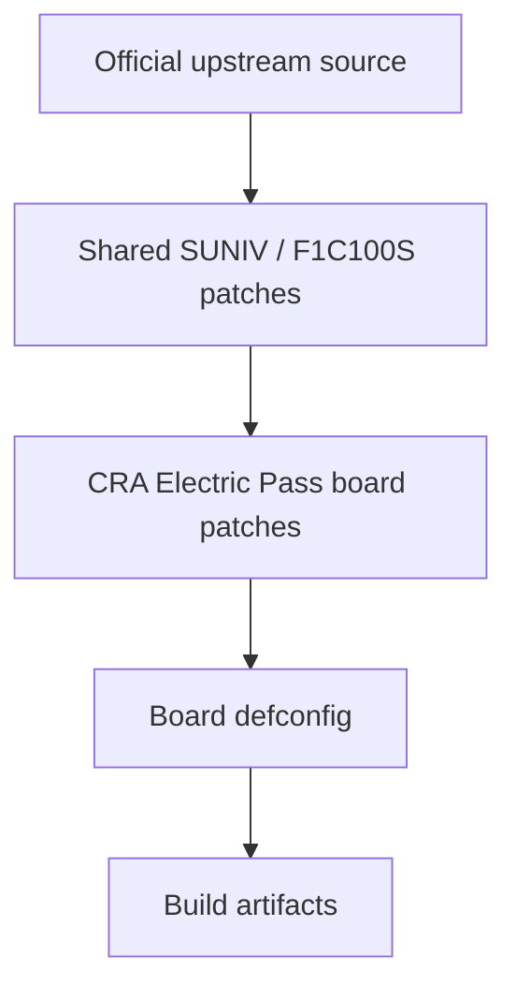
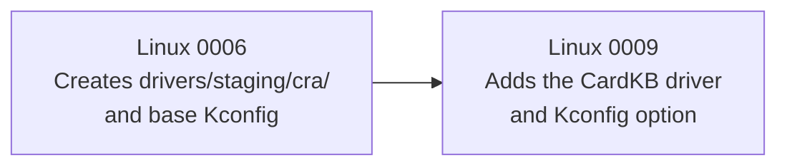
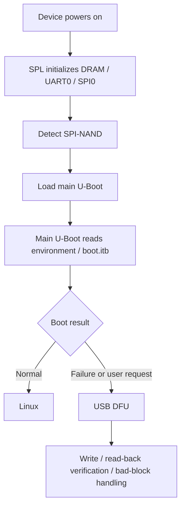
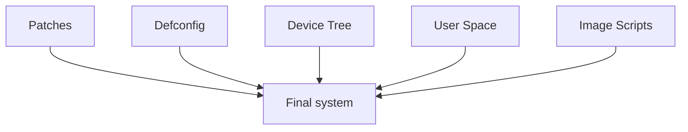

<div align="center">

# CRA Electric Pass Board Patches

<sub>Read this in other languages: [English](README_EN.md), [中文](README.md).</sub>

</div>

> [!NOTE]
> This directory contains the board-specific source patches that CRA Electric Pass applies to **Linux 5.4.99** and **U-Boot** during the Buildroot build.

<p align="center">
  <a href="#directory-structure">Directory Structure</a> ·
  <a href="#patch-architecture">Patch Architecture</a> ·
  <a href="#application-order">Application Order</a> ·
  <a href="#linux-patches">Linux</a> ·
  <a href="#u-boot-patches">U-Boot</a> ·
  <a href="#cross-directory-coupling">Coupling</a> ·
  <a href="#correct-rebuild-procedure">Rebuild Procedure</a> ·
  <a href="#windows-and-line-endings">Windows / LF</a> ·
  <a href="#validation-status">Validation Status</a>
</p>

---

## Directory Structure

<table>
<tr>
<td width="50%" valign="top">

### `linux/`

**Target: Linux 5.4.99**

Contains **13 patches**

Covers:

- Display and panel initialization
- ADC
- USB
- Private DRM interface
- CardKB
- I²S / ES8311
- GPIO UAPI

[Linux patch details](linux/README_EN.md)

</td>
<td width="50%" valign="top">

### `uboot/`

**Target: U-Boot**

Contains **5 patches**

Covers:

- UART0
- USB DFU
- SPI-NAND
- SUNIV SPI clocks
- NAND post-write verification

[U-Boot patch details](uboot/README_EN.md)

</td>
</tr>
</table>

```text
patch/
├─ linux/
│  ├─ 0000-f1c100s-gpadc-regs.patch
│  ├─ 0001-epass-icon.patch
│  ├─ 0002-panel-simple.patch
│  ├─ 0003-f1c100s-defe-debe-fix.patch
│  ├─ 0004-swap_rb_as_config.patch
│  ├─ 0005-gpadc-low-freq.patch
│  ├─ 0006-initalize-st7701.patch
│  ├─ 0007-srgn-drm-atomic-ioctl.patch
│  ├─ 0008-force-usb-fs-dt-switch.patch
│  ├─ 0009-m5stack-cardkb-driver.patch
│  ├─ 0010-i2s-and-es-driver.patch
│  ├─ 0011-fbcon-cra-width-hack.patch
│  ├─ 0012-gpio-backport-pulls.patch
│  └─ README.md
├─ uboot/
│  ├─ 0001-uart-pull.patch
│  ├─ 0002-musb-force-fs.patch
│  ├─ 0003-spi-nand-mx35lf1g.patch
│  ├─ 0004-f1c-spi-fix.patch
│  ├─ 0005-dfu-verify-block.patch
│  └─ README.md
└─ README.md
```

| Subdirectory | Target source | Patch count | Details |
| :--- | :--- | ---: | :--- |
| `linux/` | Linux 5.4.99 | 13 | [Linux patch details](linux/README_EN.md) |
| `uboot/` | U-Boot | 5 | [U-Boot patch details](uboot/README_EN.md) |

---

## Patch Architecture

Both Linux and U-Boot use a two-tier patch structure in CRA Electric Pass.



Buildroot configuration entry point:

```text
board/cra/epass/cra_epass_defconfig
```

### Linux

```make
BR2_LINUX_KERNEL_CUSTOM_VERSION_VALUE="5.4.99"
BR2_LINUX_KERNEL_PATCH="board/allwinner/suniv-f1c100s/patch/linux board/cra/epass/patch/linux"
BR2_LINUX_KERNEL_CUSTOM_CONFIG_FILE="board/cra/epass/linux.defconfig"
```

### U-Boot

```make
BR2_TARGET_UBOOT_CUSTOM_VERSION_VALUE="2020.07"
BR2_TARGET_UBOOT_PATCH="board/allwinner/suniv-f1c100s/patch/u-boot board/cra/epass/patch/uboot"
BR2_TARGET_UBOOT_CUSTOM_CONFIG_FILE="board/cra/epass/uboot.defconfig"
```

> [!IMPORTANT]
> The shared patches provide the SoC-level foundation, while the patches in this directory implement CRA Electric Pass board features and legacy adaptations. The two tiers have contextual dependencies, so the CRA patches cannot be applied directly to the original source without the shared SUNIV patches.

---

## Application Order

Buildroot applies patches sequentially in lexical file-name order:

```text
0000
0001
0002
...
0012
```

The numbering determines both ordering and dependencies between patches.

For example:



> [!WARNING]
> Renaming, moving, or inserting a patch may change the application order. After modifying an earlier patch, verify that every later patch still matches the resulting source context.

### Patch Validation Is Not a Single Step


Each stage requires independent validation.

---

# Linux Patches

The Linux patches primarily cover:

| Feature | Related patches |
| :--- | :--- |
| GPADC registers / sampling / filtering | `0000`, `0005` |
| Framebuffer boot logo | `0001` |
| 384×640 panel timings | `0002` |
| DEFE / DEBE, scaling, and YUV | `0003` |
| Red/blue channel swapping | `0004` |
| ST7701 GPIO initialization | `0006` |
| Private DRM interface for `drm_app_neo` | `0007` |
| MUSB Full-Speed / High-Speed selection | `0008` |
| M5Stack CardKB | `0009` |
| I²S / ES-series codecs | `0010` |
| Framebuffer console width workaround | `0011` |
| GPIO bias / runtime configuration | `0012` |

### Feature Groups

<table>
<tr>
<td width="33%" valign="top">

### Display

`0001` `0002` `0003`  
`0004` `0006` `0007` `0011`

LCD, ST7701, DEFE/DEBE, DRM, and fbcon.

</td>
<td width="33%" valign="top">

### Input / Audio / ADC

`0000` `0005`  
`0009` `0010`

GPADC, CardKB, I²S, and ES8311.

</td>
<td width="33%" valign="top">

### USB / GPIO

`0008` `0012`

USB speed control and the GPIO UAPI backport.

</td>
</tr>
</table>

### High-Risk Maintenance Areas

| Patch | Risk |
| :--- | :--- |
| `0003` | Closely tied to the current resolution, YUV path, and vendor BSP parameters |
| `0007` | Private DRM UAPI, direct register access, and user-memory mapping |
| `0008` | Known initialization issue in the MUSB local variable `power` |
| `0011` | Modifies the generic framebuffer console |
| `0012` | Backports GPIO Core / UAPI functionality |

> [!CAUTION]
> The high-risk parts of the Linux patch set cannot be considered safe at runtime merely because the patches apply successfully.

Detailed implementations, dependencies, and known issues:

```text
linux/README_EN.md
```

---

# U-Boot Patches

| Feature | Related patch |
| :--- | :--- |
| UART0 TX / RX pull-ups | `0001` |
| Force MUSB Gadget to Full-Speed | `0002` |
| Detect Macronix SPI-NAND in SPL | `0003` |
| SUNIV SPI parent clock / divider | `0004` |
| DFU post-write verification and bad-block handling | `0005` |

### Position in the Boot Flow



Specifically:

- `0001`: stabilizes UART0 levels during early boot
- `0003`: helps SPL detect Macronix SPI-NAND
- `0004`: corrects the SUNIV SPI clock / divider
- `0002`: forces U-Boot MUSB to Full-Speed
- `0005`: reads data back after DFU writes and handles bad blocks

Detailed implementation, NAND layout, and DFU behavior:

```text
uboot/README_EN.md
```

---

## Cross-Directory Coupling

This directory cannot be maintained independently of the configurations, device trees, user space, and image scripts.



---

### Defconfig

```text
board/cra/epass/linux.defconfig
board/cra/epass/uboot.defconfig
```

> [!IMPORTANT]
> A Kconfig feature added by a patch must be selected by the corresponding defconfig. The presence of code in the source tree does not mean that it will be included in the final kernel or U-Boot image.

---

### Device Tree

```text
board/cra/epass/devicetree/linux/
board/cra/epass/devicetree/uboot/
```

The following identifiers must remain consistent with the driver implementations:

```text
cra,epass-panel
cra,st7701-initseq
cra,swap-b-r
cra,usb-hs-enabled
```

Also verify references to:

- SPI0
- SPI-NAND
- `spi-max-frequency`
- CardKB
- ES8311
- Other expansion nodes

---

### Private DRM ABI

Linux:

```text
0007-srgn-drm-atomic-ioctl.patch
```

and user space:

```text
drm_app_neo/src/driver/srgn_drm.h
drm_app_neo/src/driver/drm_warpper.c
drm_app_neo/src/render/
drm_app_neo/src/overlay/
```

together define the kernel/user-space ABI.


> [!CAUTION]
> IOCTL numbers, structure layouts, field widths, and command semantics must remain identical on both sides. A unilateral change can break the ABI.

---

### Image Scripts

```text
board/cra/epass/scripts/mknanduboot.sh
board/cra/epass/scripts/mkdt.sh
board/cra/epass/scripts/buildimage.sh
```

| Script | Responsibility |
| :--- | :--- |
| `mknanduboot.sh` | NAND SPL / U-Boot layout |
| `mkdt.sh` | Linux DTB / DTBO compilation |
| `buildimage.sh` | UBI and `boot.itb` |

> [!NOTE]
> Patches modify source code only. Device-tree compilation, NAND binary layout, and final system-image generation are separate build stages.

---

## Correct Rebuild Procedure

### After Modifying a Linux Patch

```bash
make cra_epass_defconfig
make linux-dirclean
make linux
```

### After Modifying a U-Boot Patch

```bash
make cra_epass_defconfig
make uboot-dirclean
make uboot
```

### Complete System

```bash
make
```

### Why `*-dirclean` Is Required


Running only:

```bash
make linux-rebuild
make uboot-rebuild
```

does not normally rerun a patch stage that has already completed.

> [!WARNING]
> Modifying a patch file does not mean that the source under `output/build/` has been updated.

> [!NOTE]
> These commands only generate files; they do not flash a physical device automatically.

---

## Validation Status

The following checks have been completed:

- All 13 Linux patches parse correctly as unified diffs
- All 5 U-Boot patches parse correctly as unified diffs
- Every patch uses LF line endings
- The shared SUNIV Linux patches and CRA Linux patches apply in sequence to a clean Linux 5.4.99 tree
- Linux Kconfig recognizes the `CONFIG_CRA_EP_*` options
- The shared SUNIV U-Boot patches and CRA U-Boot patches apply in Buildroot order
- The current U-Boot patches have passed compilation validation


> [!IMPORTANT]
> The existing checks confirm that the current patch sequence, naming, and configuration relationships remain suitable for builds. They do not replace a complete system build or physical-hardware validation.

---

<div align="center">

<sub><b>CRA Electric Pass</b> · Linux 5.4.99 & U-Boot board patch set</sub>

</div>
