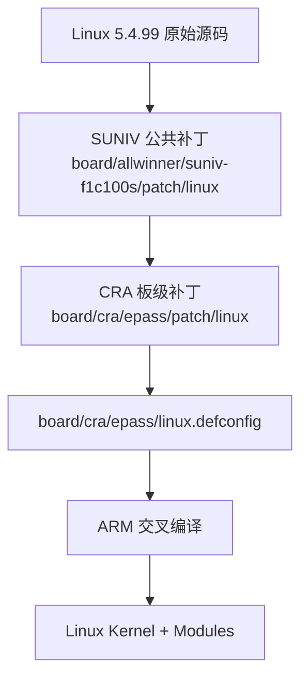
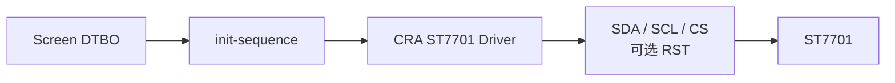
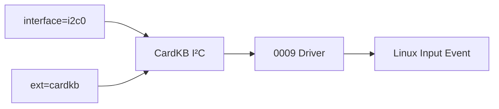
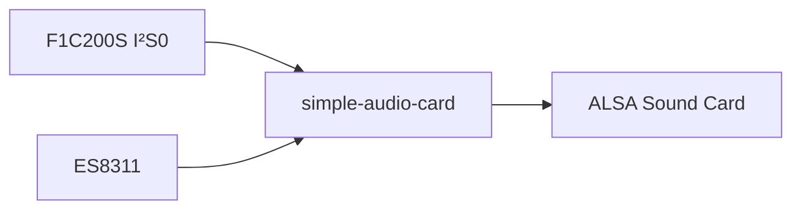
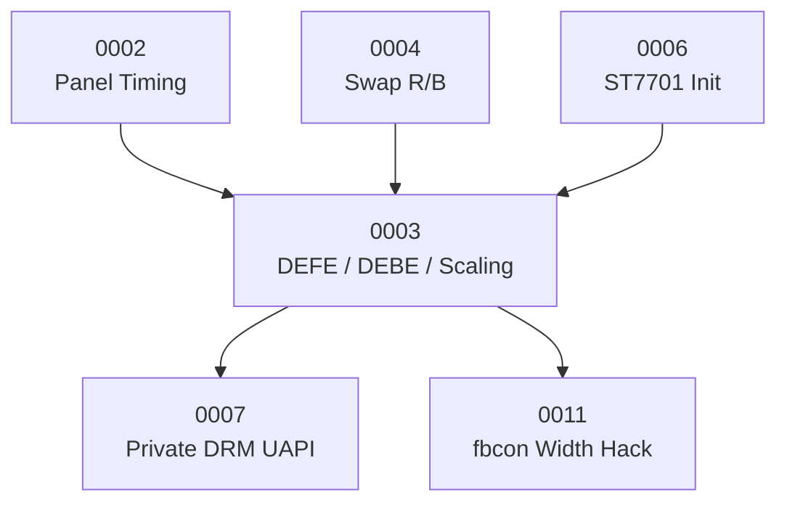
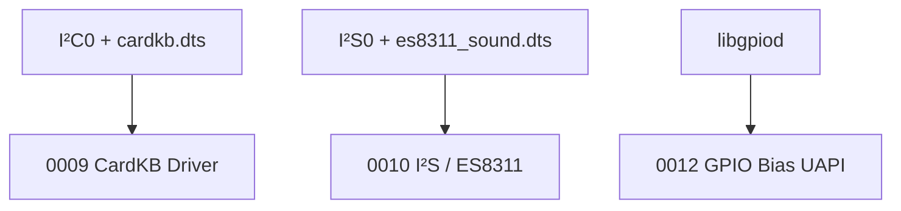

<div align="center">

# CRA Electric Pass Linux 内核补丁

<sub>Read this in other languages: [English](README_EN.md), [中文](README.md).</sub>

</div>

> [!NOTE]
> 本目录保存 CRA Electric Pass 针对 **Linux 5.4.99** 增加的板级补丁。补丁由 Buildroot 按顺序应用，用于补充 F1C100S / F1C200S 的显示、ADC、USB、音频、键盘和 GPIO 用户空间接口等功能。

<p align="center">
  <a href="#补丁应用链">应用链</a> ·
  <a href="#补丁总览">补丁总览</a> ·
  <a href="#显示系统">显示</a> ·
  <a href="#adc">ADC</a> ·
  <a href="#usb">USB</a> ·
  <a href="#输入与音频">输入 / 音频</a> ·
  <a href="#gpio">GPIO</a> ·
  <a href="#功能依赖">依赖关系</a> ·
  <a href="#构建方法">构建方法</a> ·
  <a href="#验证状态">验证状态</a>
</p>

---

## 补丁应用链

Buildroot 配置：

```make
BR2_LINUX_KERNEL_PATCH="board/allwinner/suniv-f1c100s/patch/linux board/cra/epass/patch/linux"
```

实际顺序：



> [!IMPORTANT]
> 本目录补丁建立在公共 SUNIV 补丁已经成功应用的基础上。编号顺序同时代表补丁依赖顺序。

---

## 补丁总览

<table>
<tr>
<td width="33%" valign="top">

### 显示系统

`0001` · `0002` · `0003` · `0004`  
`0006` · `0007` · `0011`

覆盖启动 Logo、LCD 时序、DEFE/DEBE、ST7701、颜色交换、私有 DRM 接口与 fbcon。

</td>
<td width="33%" valign="top">

### 外设与接口

`0000` · `0005` · `0008`  
`0009` · `0010` · `0012`

覆盖 ADC、USB、CardKB、I²S/ES8311 与 GPIO UAPI。

</td>
<td width="33%" valign="top">

### 维护重点

- Linux 5.4.99 固定基线
- 补丁顺序敏感
- DTS / Kconfig 联动
- DRM UAPI 与用户空间 ABI 联动
- 实机验证不可省略

</td>
</tr>
</table>

```text
patch/linux/
├─ 0000-f1c100s-gpadc-regs.patch
├─ 0001-epass-icon.patch
├─ 0002-panel-simple.patch
├─ 0003-f1c100s-defe-debe-fix.patch
├─ 0004-swap_rb_as_config.patch
├─ 0005-gpadc-low-freq.patch
├─ 0006-initalize-st7701.patch
├─ 0007-srgn-drm-atomic-ioctl.patch
├─ 0008-force-usb-fs-dt-switch.patch
├─ 0009-m5stack-cardkb-driver.patch
├─ 0010-i2s-and-es-driver.patch
├─ 0011-fbcon-cra-width-hack.patch
├─ 0012-gpio-backport-pulls.patch
└─ README.md
```

| 编号 | 主要功能 | 影响范围 |
| :---: | :--- | :--- |
| `0000` | 修正 F1C100S GPADC 寄存器位定义 | MFD / ADC |
| `0001` | 替换 Linux 启动 Logo | framebuffer |
| `0002` | 注册 CRA 384×640 LCD 面板时序 | DRM panel-simple |
| `0003` | 修正 DEFE / DEBE、缩放与 YUV 显示 | SUN4I DRM |
| `0004` | 设备树控制红蓝通道交换 | SUN4I TCON |
| `0005` | 调整 GPADC 采样与滤波 | ADC |
| `0006` | 新增 ST7701 GPIO 初始化驱动 | staging / display |
| `0007` | 新增项目私有 DRM 快速提交接口 | DRM UAPI / 主程序 |
| `0008` | 设备树控制 USB Full / High-Speed | MUSB |
| `0009` | 新增 M5Stack CardKB I²C 驱动 | staging / input |
| `0010` | 增加 ES 系列 Codec 并调整 I²S | ALSA SoC |
| `0011` | 缩减 framebuffer Console 可用宽度 | fbcon |
| `0012` | 回移 GPIO Bias / Reconfigure UAPI | GPIO / libgpiod |

---

# 显示系统

## `0001` · CRA 启动 Logo

目标文件：

```text
drivers/video/logo/logo_linux_clut224.ppm
```

用于替换 Linux framebuffer 启动阶段显示的默认 Logo。

---

## `0002` · CRA LCD 面板时序

目标文件：

```text
drivers/gpu/drm/panel/panel-simple.c
```

注册项目专用匹配：

```dts
compatible = "cra,epass-panel";
```

### 当前公共显示模式

| 参数 | 数值 |
| :--- | ---: |
| 物理输出 | 384×640 |
| Pixel Clock | 24 MHz |
| 刷新率 | 约 60 Hz |
| Bus Format | RGB565 |
| 色深描述 | 6 bpc |

对应设备树：

```text
board/cra/epass/devicetree/linux/base/
board/cra/epass/devicetree/linux/screen/
```

---

## `0003` · F1C100S DEFE / DEBE 显示修正

主要文件：

```text
drivers/gpu/drm/sun4i/sun4i_backend.c
drivers/gpu/drm/sun4i/sun4i_frontend.c
drivers/gpu/drm/sun4i/sun4i_frontend.h
drivers/gpu/drm/sun4i/sunxi_detab.h
```

主要内容：

- 修正 DEBE packed-YUV framebuffer 地址单位
- 配置 DEFE scaler
- 增加缩放滤波系数表
- 增加 YUV → RGB CSC 参数
- 调整 frontend 寄存器访问与初始化
- 为项目视频图层提供底层显示支持

> [!CAUTION]
> 该补丁与当前 384×640 输出、YUV422 数据路径和厂商 BSP 参数绑定较深，不适合作为通用 SUN4I DRM 实现直接移植。

---

## `0004` · 红蓝通道交换

目标文件：

```text
drivers/gpu/drm/sun4i/sun4i_tcon.c
drivers/gpu/drm/sun4i/sun4i_tcon.h
```

设备树开关：

```dts
cra,swap-b-r;
```

当前使用位置：

```text
board/cra/epass/devicetree/linux/screen/laowu.dts
```


> [!IMPORTANT]
> 属性名称与驱动读取逻辑严格绑定。修改 `cra,swap-b-r` 时必须同步修改设备树与内核补丁。

---

## `0006` · ST7701 初始化驱动

新增：

```text
include/dt-bindings/display/st7701initseq.h
drivers/staging/cra/Kconfig
drivers/staging/cra/Makefile
drivers/staging/cra/st7701init.c
```

Kconfig：

```text
CONFIG_CRA_EP_STAGING
CONFIG_CRA_EP_ST7701_INIT
```

驱动匹配：

```dts
compatible = "cra,st7701-initseq";
```

### 工作方式



具体初始化命令不写死在驱动中，而由屏幕设备树的 `init-sequence` 提供。

> [!WARNING]
> 当前实现对必需 GPIO、序列长度和异常操作码的边界检查仍不充分。修改初始化数组时必须核对宏参数数量与数据边界。

---

## `0007` · 私有 DRM Atomic 接口

主要文件：

```text
drivers/gpu/drm/sun4i/sun4i_backend.c
drivers/gpu/drm/sun4i/sun4i_drv.c
drivers/gpu/drm/sun4i/sun4i_drv.h
include/uapi/drm/srgn_drm.h
```

新增：

```text
DRM_IOCTL_SRGN_ATOMIC_COMMIT
DRM_IOCTL_SRGN_RESET_FB_CACHE
```

支持：

- RGB framebuffer
- YUV framebuffer
- 图层坐标
- Global Alpha
- 用户虚拟地址 → 物理地址缓存清理

### 用户空间依赖


涉及用户空间：

```text
drm_app_neo/src/driver/srgn_drm.h
drm_app_neo/src/driver/drm_warpper.c
drm_app_neo/src/render/
drm_app_neo/src/overlay/
```

> [!CAUTION]
> IOCTL 编号、结构体布局、字段宽度共同构成内核 / 用户空间 ABI。该补丁不能只在内核侧单独重命名或修改。

> [!WARNING]
> 当前实现直接操作显示寄存器，并通过用户虚拟地址获取物理页地址。锁、VMA 状态恢复、缓存生命周期与进程隔离仍存在维护风险，是本目录风险最高的补丁之一。

---

## `0011` · framebuffer Console 宽度规避

目标：

```text
drivers/video/fbdev/core/fbcon.c
```

通过：

```text
CRA_FB_CONSOLE_WIDTH_HACK
```

将 framebuffer 文本控制台宽度减少三个字符单元，避开屏幕最右侧约 24 像素异常区域。

| 影响 | 状态 |
| :--- | :--- |
| Linux 文本 Console | 会影响 |
| LVGL | 不影响 |
| `drm_app_neo` UI | 不影响 |

> [!NOTE]
> 这是对通用 `fbcon` 的全局修改。若显示时序问题被彻底解决，应重新评估该补丁是否仍有必要。

---

# ADC

## `0000` · F1C100S GPADC 寄存器修正

目标：

```text
include/linux/mfd/sun4i-gpadc.h
```

调整 F1C100S / F1C200S 的：

- 校准位
- 双点模式
- 工作模式
- ADC 选择
- 通道选择

与 `0005` 共同构成当前 ADC 适配基础。

---

## `0005` · GPADC 采样参数

目标：

```text
drivers/iio/adc/sun4i-gpadc-iio.c
```

修改：

- ADC Sampling Divider
- Filter Type

用途：

```text
电池电压
外部低速 ADC 输入
```


> [!NOTE]
> `low-freq` 只是补丁名对修改目标的概括。最终采样率仍由芯片时钟、分频公式与驱动配置共同决定。

---

# USB

## `0008` · USB 速度设备树开关

主要文件：

```text
drivers/usb/musb/sunxi.c
drivers/usb/musb/musb_core.c
```

设备树属性：

```dts
cra,usb-hs-enabled;
```

对应 Overlay：

```text
board/cra/epass/devicetree/linux/interface/usbhs.dts
```

| 属性 | 行为 |
| :--- | :--- |
| 不存在 | 限制为 USB Full-Speed |
| 存在 | 请求 MUSB High-Speed |

### 已知代码问题

当前补丁中的局部变量 `power` 在位运算前没有可靠初始化。

```c
power |= MUSB_POWER_HSENAB;
```

或：

```c
power &= ~MUSB_POWER_HSENAB;
```

可能使 MUSB `POWER` 寄存器其他位带入未定义值。

> [!CAUTION]
> 修复变量初始化并验证 PCB High-Speed 信号完整性之前，不应把 `usbhs` 作为默认配置。

---

# 输入与音频

## `0009` · M5Stack CardKB

新增：

```text
drivers/staging/cra/cardkb.c
```

Kconfig：

```text
CONFIG_CRA_EP_CARDKB
```

当前：

```text
CONFIG_CRA_EP_CARDKB=m
```

工作链路：



驱动定期轮询 CardKB，将字符码转换为 Linux Input 子系统按键事件。

---

## `0010` · I²S 与 ES 系列音频

主要内容：

- SUNIV I²S 模块时钟父时钟联动
- 调整 Playback / Capture DMA `maxburst`
- ES8156
- ES8311
- ES8375
- ES8389

当前启用：

```text
CONFIG_SND_SUN4I_I2S=m
CONFIG_SND_SOC_ES8311=m
CONFIG_SND_SIMPLE_CARD=m
```

当前设备树主要使用 ES8311。



---

# GPIO

## `0012` · GPIO 偏置接口回移

将较新 Linux 的部分 GPIO Character Device 功能回移到 Linux 5.4.99。

包括：

- Pull-Up
- Pull-Down
- Bias Disable
- Runtime Reconfigure
- `GPIOHANDLE_SET_CONFIG_IOCTL`
- GPIO Bias 状态报告
- Pin Range
- fwnode 支持

主要面向：

```text
GPIO UAPI
libgpiod
```

---

## 功能依赖

### 显示链路



### ADC


### 扩展设备



---

## 构建方法

修改补丁后，在 Buildroot 根目录执行：

```bash
make cra_epass_defconfig
make linux-dirclean
make linux
```

完整系统继续：

```bash
make
```

### 为什么需要 `linux-dirclean`


> [!WARNING]
> `make linux-rebuild` 通常不会重新执行已经越过的 Patch 阶段。

这些命令只构建产物，不会自动写入实体设备。

---

## 验证状态

当前已完成：

- 所有 Linux patch 可作为统一 diff 正确解析
- CRA Linux / U-Boot patch 已统一为 LF
- 可在干净 Linux 5.4.99 上先应用 SUNIV patch，再完整应用 CRA patch
- `make ARCH=arm olddefconfig` 能识别 `CONFIG_CRA_EP_*`
- CRA staging 驱动目录、面板 `compatible` 与 USB 属性可正确进入应用补丁后的源码


> [!IMPORTANT]
> 当前验证证明补丁序列与 Kconfig 关系有效，不替代完整内核编译、启动验证和实体硬件测试。

---

<div align="center">

<sub><b>CRA Electric Pass</b> · Linux 5.4.99 board patch set</sub>

</div>
