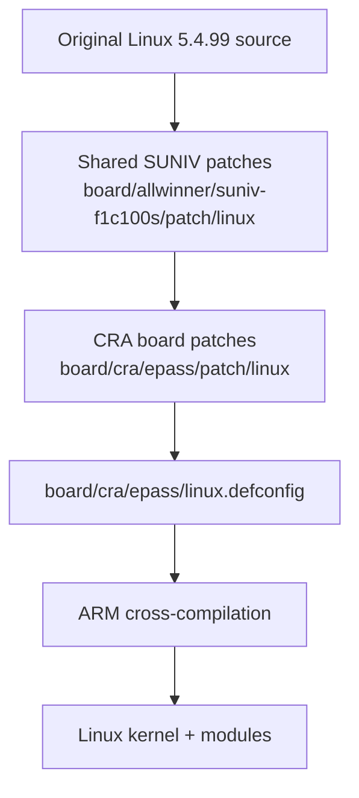
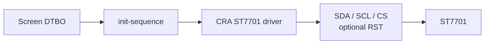
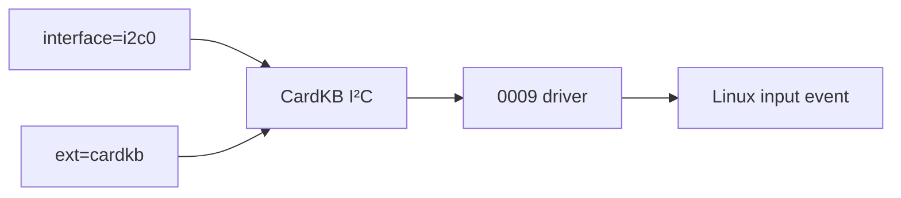
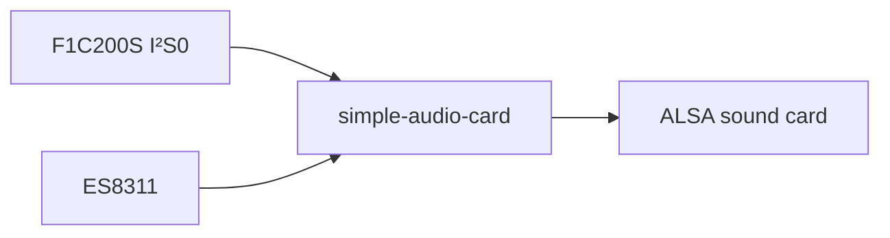
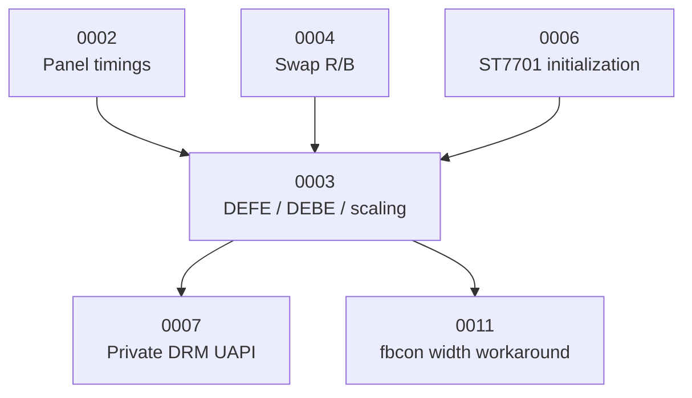
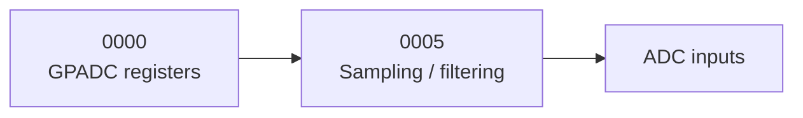
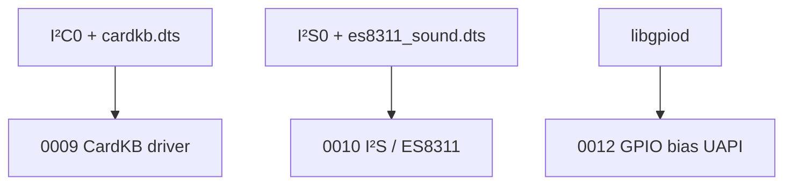

<div align="center">

# CRA Electric Pass Linux Kernel Patches

<sub>Read this in other languages: [English](README_EN.md), [中文](README.md).</sub>

</div>

> [!NOTE]
> This directory contains board-specific patches added by CRA Electric Pass for **Linux 5.4.99**. Buildroot applies them in sequence to add display, ADC, USB, audio, keyboard, and GPIO user-space interface support for the F1C100S / F1C200S.

<p align="center">
  <a href="#patch-application-chain">Application Chain</a> ·
  <a href="#patch-overview">Patch Overview</a> ·
  <a href="#display-system">Display</a> ·
  <a href="#adc">ADC</a> ·
  <a href="#usb">USB</a> ·
  <a href="#input-and-audio">Input / Audio</a> ·
  <a href="#gpio">GPIO</a> ·
  <a href="#feature-dependencies">Dependencies</a> ·
  <a href="#build-procedure">Build Procedure</a> ·
  <a href="#validation-status">Validation Status</a>
</p>

---

## Patch Application Chain

Buildroot configuration:

```make
BR2_LINUX_KERNEL_PATCH="board/allwinner/suniv-f1c100s/patch/linux board/cra/epass/patch/linux"
```

Effective order:



> [!IMPORTANT]
> The patches in this directory assume that the shared SUNIV patches have already been applied successfully. Their numbering also defines their dependency order.

---

## Patch Overview

<table>
<tr>
<td width="33%" valign="top">

### Display System

`0001` · `0002` · `0003` · `0004`  
`0006` · `0007` · `0011`

Covers the boot logo, LCD timings, DEFE/DEBE, ST7701 initialization, color swapping, the private DRM interface, and fbcon.

</td>
<td width="33%" valign="top">

### Peripherals and Interfaces

`0000` · `0005` · `0008`  
`0009` · `0010` · `0012`

Covers ADC, USB, CardKB, I²S/ES8311, and the GPIO UAPI.

</td>
<td width="33%" valign="top">

### Maintenance Priorities

- Fixed Linux 5.4.99 baseline
- Patch order is significant
- DTS and Kconfig must remain synchronized
- DRM UAPI and user-space ABI must remain synchronized
- Physical-device validation is mandatory

</td>
</tr>
</table>

```text
patch/linux/
├─ 0000-f1c100s-gpadc-regs.patch
├─ 0001-epass-icon.patch
├─ 0002-panel-simple.patch
├─ 0003-f1c100s-defe-debe-fix.patch
├─ 0004-swap_rb_as_config.patch
├─ 0005-gpadc-low-freq.patch
├─ 0006-initalize-st7701.patch
├─ 0007-srgn-drm-atomic-ioctl.patch
├─ 0008-force-usb-fs-dt-switch.patch
├─ 0009-m5stack-cardkb-driver.patch
├─ 0010-i2s-and-es-driver.patch
├─ 0011-fbcon-cra-width-hack.patch
├─ 0012-gpio-backport-pulls.patch
└─ README.md
```

| Number | Main purpose | Scope |
| :---: | :--- | :--- |
| `0000` | Corrects F1C100S GPADC register bit definitions | MFD / ADC |
| `0001` | Replaces the Linux boot logo | Framebuffer |
| `0002` | Registers the CRA 384×640 LCD panel timings | DRM panel-simple |
| `0003` | Corrects DEFE / DEBE, scaling, and YUV display | SUN4I DRM |
| `0004` | Controls red/blue channel swapping through the device tree | SUN4I TCON |
| `0005` | Adjusts GPADC sampling and filtering | ADC |
| `0006` | Adds a GPIO-driven ST7701 initialization driver | Staging / display |
| `0007` | Adds a project-private fast DRM commit interface | DRM UAPI / main application |
| `0008` | Controls USB Full-Speed / High-Speed through the device tree | MUSB |
| `0009` | Adds an M5Stack CardKB I²C driver | Staging / input |
| `0010` | Adds ES-series codecs and adjusts I²S | ALSA SoC |
| `0011` | Reduces the usable framebuffer console width | fbcon |
| `0012` | Backports the GPIO bias / reconfiguration UAPI | GPIO / libgpiod |

---

# Display System

## `0001` · CRA Boot Logo

Target file:

```text
drivers/video/logo/logo_linux_clut224.ppm
```

Replaces the default logo shown during the Linux framebuffer boot stage.

---

## `0002` · CRA LCD Panel Timings

Target file:

```text
drivers/gpu/drm/panel/panel-simple.c
```

Registers the project-specific match:

```dts
compatible = "cra,epass-panel";
```

### Current Shared Display Mode

| Parameter | Value |
| :--- | ---: |
| Physical output | 384×640 |
| Pixel Clock | 24 MHz |
| Refresh rate | Approximately 60 Hz |
| Bus Format | RGB565 |
| Color-depth description | 6 bpc |

Corresponding device trees:

```text
board/cra/epass/devicetree/linux/base/
board/cra/epass/devicetree/linux/screen/
```

---

## `0003` · F1C100S DEFE / DEBE Display Corrections

Main files:

```text
drivers/gpu/drm/sun4i/sun4i_backend.c
drivers/gpu/drm/sun4i/sun4i_frontend.c
drivers/gpu/drm/sun4i/sun4i_frontend.h
drivers/gpu/drm/sun4i/sunxi_detab.h
```

Main changes:

- Corrects the DEBE packed-YUV framebuffer address units
- Configures the DEFE scaler
- Adds scaling-filter coefficient tables
- Adds YUV-to-RGB CSC parameters
- Adjusts frontend register access and initialization
- Provides low-level display support for the project's video layer

> [!CAUTION]
> This patch is closely tied to the current 384×640 output, YUV422 data path, and vendor BSP parameters. It is not suitable for direct reuse as a general-purpose SUN4I DRM implementation.

---

## `0004` · Red/Blue Channel Swapping

Target files:

```text
drivers/gpu/drm/sun4i/sun4i_tcon.c
drivers/gpu/drm/sun4i/sun4i_tcon.h
```

Device-tree switch:

```dts
cra,swap-b-r;
```

Current location:

```text
board/cra/epass/devicetree/linux/screen/laowu.dts
```


> [!IMPORTANT]
> The property name is strictly coupled to the driver's lookup logic. If `cra,swap-b-r` is renamed, update both the device tree and the kernel patch.

---

## `0006` · ST7701 Initialization Driver

Adds:

```text
include/dt-bindings/display/st7701initseq.h
drivers/staging/cra/Kconfig
drivers/staging/cra/Makefile
drivers/staging/cra/st7701init.c
```

Kconfig:

```text
CONFIG_CRA_EP_STAGING
CONFIG_CRA_EP_ST7701_INIT
```

Driver match:

```dts
compatible = "cra,st7701-initseq";
```

### Operation



The initialization commands are not hard-coded in the driver; each screen device tree supplies them through `init-sequence`.

> [!WARNING]
> The current implementation still lacks sufficient boundary checks for required GPIOs, sequence length, and invalid opcodes. When changing an initialization array, verify every macro's parameter count and data boundaries.

---

## `0007` · Private DRM Atomic Interface

Main files:

```text
drivers/gpu/drm/sun4i/sun4i_backend.c
drivers/gpu/drm/sun4i/sun4i_drv.c
drivers/gpu/drm/sun4i/sun4i_drv.h
include/uapi/drm/srgn_drm.h
```

Adds:

```text
DRM_IOCTL_SRGN_ATOMIC_COMMIT
DRM_IOCTL_SRGN_RESET_FB_CACHE
```

Supports:

- RGB framebuffers
- YUV framebuffers
- Layer coordinates
- Global Alpha
- User virtual address to physical address cache invalidation

### User-Space Dependency


Related user-space files:

```text
drm_app_neo/src/driver/srgn_drm.h
drm_app_neo/src/driver/drm_warpper.c
drm_app_neo/src/render/
drm_app_neo/src/overlay/
```

> [!CAUTION]
> IOCTL numbers, structure layouts, and field widths together define the kernel/user-space ABI. This patch cannot be renamed or changed only on the kernel side.

> [!WARNING]
> The current implementation accesses display registers directly and resolves physical pages from user virtual addresses. Locking, VMA state restoration, cache lifetime, and process isolation remain maintenance risks. This is one of the highest-risk patches in this directory.

---

## `0011` · Framebuffer Console Width Workaround

Target:

```text
drivers/video/fbdev/core/fbcon.c
```

Through:

```text
CRA_FB_CONSOLE_WIDTH_HACK
```

the patch reduces the framebuffer text-console width by three character cells to avoid an abnormal region of approximately 24 pixels at the right edge of the display.

| Affected component | Status |
| :--- | :--- |
| Linux text console | Affected |
| LVGL | Not affected |
| `drm_app_neo` UI | Not affected |

> [!NOTE]
> This is a global modification to the generic `fbcon` implementation. If the display-timing issue is fully resolved, reassess whether the patch is still necessary.

---

# ADC

## `0000` · F1C100S GPADC Register Corrections

Target:

```text
include/linux/mfd/sun4i-gpadc.h
```

Adjusts the following F1C100S / F1C200S definitions:

- Calibration bit
- Dual-point mode
- Operating mode
- ADC selection
- Channel selection

Together with `0005`, this patch forms the basis of the current ADC adaptation.

---

## `0005` · GPADC Sampling Parameters

Target:

```text
drivers/iio/adc/sun4i-gpadc-iio.c
```

Changes:

- ADC Sampling Divider
- Filter Type

Used for:

```text
Battery voltage
External low-speed ADC input
```


> [!NOTE]
> `low-freq` is only a concise description of the patch's purpose. The final sampling rate still depends on the chip clock, divider formula, and driver configuration.

---

# USB

## `0008` · Device-Tree Switch for USB Speed

Main files:

```text
drivers/usb/musb/sunxi.c
drivers/usb/musb/musb_core.c
```

Device-tree property:

```dts
cra,usb-hs-enabled;
```

Corresponding overlay:

```text
board/cra/epass/devicetree/linux/interface/usbhs.dts
```

| Property | Behavior |
| :--- | :--- |
| Absent | Limits USB to Full-Speed |
| Present | Requests MUSB High-Speed |

### Known Code Issue

The local variable `power` in the current patch is not reliably initialized before bitwise operations.

```c
power |= MUSB_POWER_HSENAB;
```

or:

```c
power &= ~MUSB_POWER_HSENAB;
```

This may introduce undefined values into other bits of the MUSB `POWER` register.

> [!CAUTION]
> Until the variable initialization is fixed and the PCB's High-Speed signal integrity has been validated, `usbhs` should not be used as the default configuration.

---

# Input and Audio

## `0009` · M5Stack CardKB

Adds:

```text
drivers/staging/cra/cardkb.c
```

Kconfig:

```text
CONFIG_CRA_EP_CARDKB
```

Current value:

```text
CONFIG_CRA_EP_CARDKB=m
```

Data flow:



The driver polls CardKB periodically, converts character codes into Linux Input subsystem key events, and reports them to user space.

---

## `0010` · I²S and ES-Series Audio

Main changes:

- Couples the SUNIV I²S module clock to its parent clock
- Adjusts Playback / Capture DMA `maxburst`
- Adds ES8156
- Adds ES8311
- Adds ES8375
- Adds ES8389

Currently enabled:

```text
CONFIG_SND_SUN4I_I2S=m
CONFIG_SND_SOC_ES8311=m
CONFIG_SND_SIMPLE_CARD=m
```

The current device tree primarily uses the ES8311.



---

# GPIO

## `0012` · GPIO Bias Interface Backport

Backports selected GPIO Character Device features from newer Linux releases to Linux 5.4.99.

These include:

- Pull-Up
- Pull-Down
- Bias Disable
- Runtime Reconfigure
- `GPIOHANDLE_SET_CONFIG_IOCTL`
- GPIO bias status reporting
- Pin Range
- fwnode support

Primarily intended for:

```text
GPIO UAPI
libgpiod
```

---

## Feature Dependencies

### Display Flow



### ADC



### External Devices



---

## Build Procedure

After modifying a patch, run the following commands from the Buildroot root directory:

```bash
make cra_epass_defconfig
make linux-dirclean
make linux
```

To continue with the complete system build:

```bash
make
```

### Why `linux-dirclean` Is Required


> [!WARNING]
> `make linux-rebuild` does not normally rerun a patch stage that has already completed.

These commands only generate build artifacts; they do not write anything to a physical device automatically.

---

## Validation Status

The following checks have been completed:

- Every Linux patch parses correctly as a unified diff
- CRA Linux and U-Boot patches use LF line endings
- The shared SUNIV patches can be applied first to a clean Linux 5.4.99 tree, followed by the complete CRA patch series
- `make ARCH=arm olddefconfig` recognizes the `CONFIG_CRA_EP_*` options
- The CRA staging-driver directory, panel `compatible` string, and USB property appear correctly in the patched source tree


> [!IMPORTANT]
> The current validation confirms that the patch sequence and Kconfig relationships are valid. It does not replace a complete kernel build, boot validation, or physical-hardware testing.

---

<div align="center">

<sub><b>CRA Electric Pass</b> · Linux 5.4.99 board patch set</sub>

</div>
