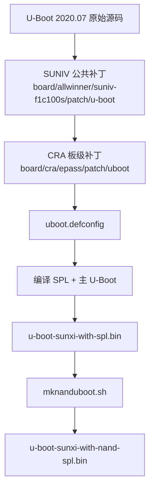
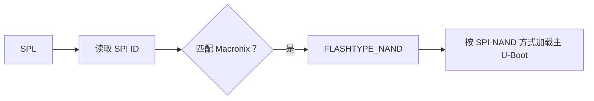
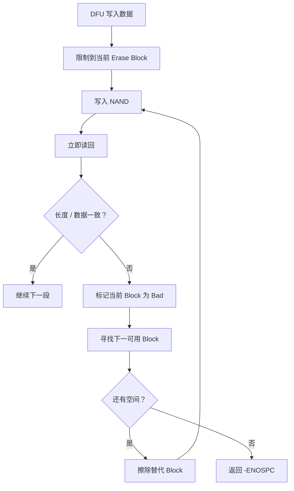
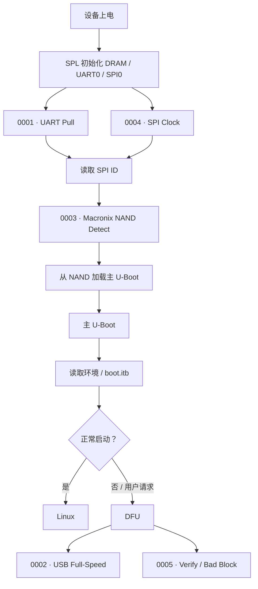
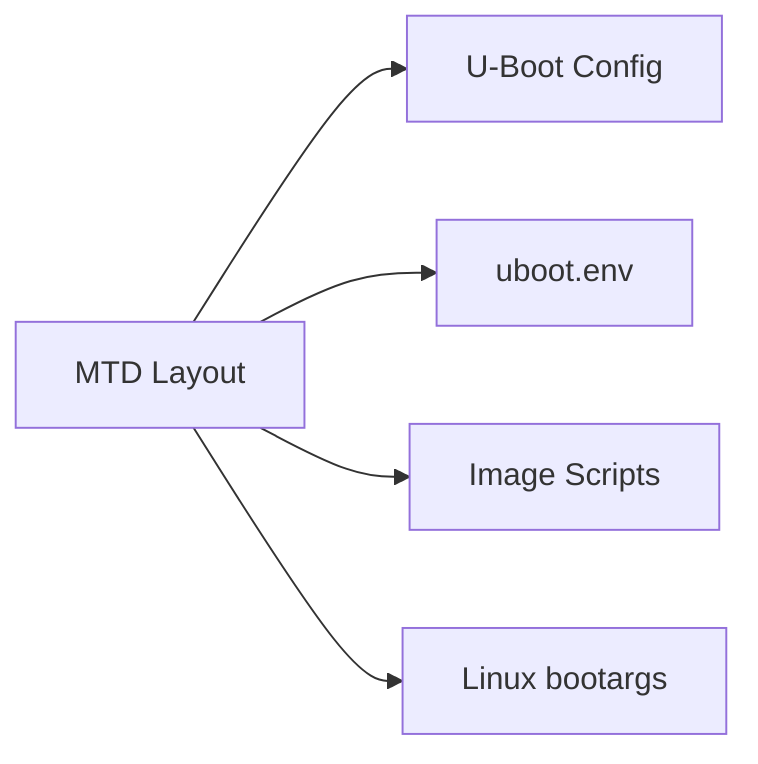

<div align="center">

# CRA Electric Pass U-Boot 补丁

<sub>Read this in other languages: [English](README_EN.md), [中文](README.md).</sub>

</div>

> [!NOTE]
> 本目录保存 CRA Electric Pass 针对 **U-Boot** 增加的板级补丁，主要覆盖启动串口、USB DFU、SPI-NAND 识别、SUNIV SPI 时钟与 NAND 写后校验。

<p align="center">
  <a href="#构建关系">构建关系</a> ·
  <a href="#补丁总览">补丁总览</a> ·
  <a href="#spl-阶段">SPL</a> ·
  <a href="#主-u-boot-阶段">主 U-Boot</a> ·
  <a href="#启动链路">启动链路</a> ·
  <a href="#配置与设备树">配置 / DTS</a> ·
  <a href="#nand-镜像">NAND 镜像</a> ·
  <a href="#构建方法">构建方法</a> ·
  <a href="#验证状态">验证状态</a>
</p>

---

## 构建关系

Buildroot 配置：

```make
BR2_TARGET_UBOOT_CUSTOM_VERSION_VALUE="2020.07"
BR2_TARGET_UBOOT_PATCH="board/allwinner/suniv-f1c100s/patch/u-boot board/cra/epass/patch/uboot"
BR2_TARGET_UBOOT_CUSTOM_CONFIG_FILE="board/cra/epass/uboot.defconfig"
```

实际构建链路：



> [!IMPORTANT]
> 本目录补丁建立在公共 SUNIV U-Boot 补丁之上。补丁编号同时承担应用顺序与依赖顺序。

---

## 补丁总览

<table>
<tr>
<td width="33%" valign="top">

### 启动基础

`0001` · `0003` · `0004`

覆盖：

- UART0 默认电平
- SPI-NAND SPL 识别
- SUNIV SPI 时钟 / 分频

直接关系到 SPL 能否稳定读取主 U-Boot。

</td>
<td width="33%" valign="top">

### USB / DFU

`0002` · `0005`

覆盖：

- U-Boot USB Full-Speed
- MTD DFU 写后校验
- NAND 坏块跳过与重试

</td>
<td width="33%" valign="top">

### 维护重点

- SPL 与主 U-Boot 同时受影响
- SPI 时钟假设需与时钟树保持一致
- NAND ID 需同时考虑 SPL / MTD
- DFU 坏块策略不能过度激进
- 修改 Patch 后必须重新走 Patch 阶段

</td>
</tr>
</table>

```text
patch/uboot/
├─ 0001-uart-pull.patch
├─ 0002-musb-force-fs.patch
├─ 0003-spi-nand-mx35lf1g.patch
├─ 0004-f1c-spi-fix.patch
├─ 0005-dfu-verify-block.patch
└─ README.md
```

| 编号 | 主要功能 | 影响阶段 |
| :---: | :--- | :--- |
| `0001` | UART0 TX / RX 上拉 | SPL / U-Boot 早期串口 |
| `0002` | 强制 MUSB Gadget 使用 Full-Speed | 主 U-Boot USB / DFU |
| `0003` | 识别 Macronix SPI-NAND | SPL NAND 启动 |
| `0004` | 修正 SUNIV SPI 父时钟与分频 | SPL / 主 U-Boot SPI |
| `0005` | MTD DFU 写后校验与坏块处理 | 主 U-Boot DFU |

---

# SPL 阶段

## `0001` · UART0 引脚上拉

目标文件：

```text
arch/arm/mach-sunxi/board.c
```

UART0 使用：

```text
PE0 = TX
PE1 = RX
```

补丁新增：

```c
sunxi_gpio_set_pull(SUNXI_GPE(0), SUNXI_GPIO_PULL_UP);
```

原代码已经为 PE1 配置上拉，本补丁使 TX / RX 都具有一致的默认电平。

### 不受影响的内容

- UART 波特率
- UART 控制器编号
- Linux `console=ttyS0,115200`
- Linux 启动后的 UART 驱动

> [!NOTE]
> 该补丁只处理启动早期 GPIO Bias，不改变串口协议参数。

---

## `0003` · Macronix SPI-NAND SPL 识别

目标：

```text
arch/arm/mach-sunxi/spl_spi_sunxi.c
```

SPL 在 DRAM 初始化后需要判断 SPI0 上连接的是 SPI-NOR 还是 SPI-NAND，再选择主 U-Boot 的读取方式。

新增 ID：

| Manufacturer / Device ID | 型号 |
| :--- | :--- |
| `c2 12` | MX35LF1GE4AB |
| `c2 14` | MX35LF1G24AD |

匹配成功后：

```c
FLASHTYPE_NAND
```



> [!IMPORTANT]
> 本补丁只负责 **SPL 阶段的类型识别**。主 U-Boot 中的 SPI-NAND 读写、MTD、坏块处理仍依赖公共 SUNIV 补丁、Kconfig、设备树与厂商驱动。

---

## `0004` · SUNIV SPI 时钟修正

目标：

```text
drivers/spi/spi-sunxi.c
```

原逻辑把 24 MHz 同时当作 SPI Parent Clock 与 SPI 最大速率，并在设备树未给出频率时默认使用 1 MHz。该逻辑与 SUNIV / F1C100S / F1C200S 实际时钟结构不匹配。

补丁增加：

```c
u32 mod_clk_hz;
u32 max_speed_hz;
```

当前 SUNIV 假设：

| 参数 | 当前值 |
| :--- | ---: |
| SPI Divider Parent Clock | 200 MHz |
| SPI Bus 最大频率 | 100 MHz |
| 当前 SPI-NAND DTS 上限 | 80 MHz |

200 MHz 来源：

```text
PLL_PERIPH / 3
```

当前设备树：

```dts
spi-max-frequency = <80000000>;
```

驱动通过向上取整计算 CDR1 / CDR2 分频，确保实际 SPI 时钟不超过请求值。


> [!CAUTION]
> 修改 SPL 时钟、AHB 时钟或 `PLL_PERIPH` 后，应重新核对这里硬编码的 200 MHz 假设。错误的 Parent Clock 会直接影响 SPL 启动读取稳定性。

---

# 主 U-Boot 阶段

## `0002` · MUSB 强制 Full-Speed

目标：

```text
drivers/usb/musb-new/musb_core.c
drivers/usb/musb-new/musb_gadget.c
```

补丁不再设置：

```text
MUSB_POWER_HSENAB
```

并在 Gadget Wakeup / Resume 流程中继续清除该位。

影响：

- DFU
- U-Boot USB 下载
- 其他基于 MUSB Gadget 的 U-Boot 功能


> [!NOTE]
> 该补丁只影响 U-Boot。Linux USB 速度由 Linux MUSB 驱动及 `cra,usb-hs-enabled` 控制。

当前补丁只修改 U-Boot 2020.07 实际使用的：

```text
drivers/usb/musb-new/
```

---

## `0005` · DFU 写后校验与坏块处理

目标：

```text
drivers/dfu/dfu_mtd.c
```

增强后的写入流程：



补丁增加：

- 按 Erase Block 分段
- 写后立即读回
- 长度校验
- 数据比较
- 写入 / 校验失败后标坏
- 跳过已知坏块
- 替代块重试
- 空间耗尽返回 `-ENOSPC`

### 需要注意

| 行为 | 风险 |
| :--- | :--- |
| 一次失败即标坏 | 暂时性通信故障可能被当成介质永久损坏 |
| Erase Block 大小校验缓冲区 | 增加 U-Boot Heap 占用 |

> [!WARNING]
> DFU 写入应保证供电、USB 连接和 SPI 时序稳定。电源抖动、USB 中断或 SPI 过快都可能触发错误标坏。

---

## 启动链路

五个补丁在启动流程中的位置：



---

## 配置与设备树

### U-Boot 配置

位置：

```text
board/cra/epass/uboot.defconfig
```

相关选项：

```text
CONFIG_SPL=y
CONFIG_SPL_SPI_SUNXI=y
CONFIG_CMD_DFU=y
CONFIG_DFU_MTD=y
CONFIG_MTD=y
CONFIG_DM_MTD=y
CONFIG_MTD_SPI_NAND=y
CONFIG_SPI=y
CONFIG_DM_SPI=y
CONFIG_USB_MUSB_GADGET=y
CONFIG_USB_GADGET_DOWNLOAD=y
```

> [!IMPORTANT]
> Patch 能成功应用不代表代码一定会被编译。Kconfig 未启用对应功能时，相关补丁逻辑可能不会进入最终镜像。

### U-Boot Device Tree

位置：

```text
board/cra/epass/devicetree/uboot/
```

SPI0 / `spi-nand@0` 负责声明：

- SPI0 pinctrl
- SPI-NAND CS
- 80 MHz 最大请求频率
- NAND 节点状态

### MTD 分区

当前配置：

```text
spi-nand0=cranand
mtdparts=cranand:1M(u-boot)ro,6M(boot),-(rootfs)
```

修改分区布局时同步检查：

```text
board/cra/epass/uboot.defconfig
board/cra/epass/uboot.env
board/cra/epass/scripts/
Linux bootargs
```



---

# NAND 镜像

Buildroot 首先生成：

```text
u-boot-sunxi-with-spl.bin
```

随后：

```text
board/cra/epass/scripts/mknanduboot.sh
```

按 **2 KiB NAND Page Layout** 重新排列 SPL，并将主 U-Boot 放到：

```text
0xD000
```

最终生成：

```text
output/images/u-boot-sunxi-with-nand-spl.bin
```


> [!CAUTION]
> Patch 编译成功不代表 NAND 镜像后处理成功。实体设备使用的是 `u-boot-sunxi-with-nand-spl.bin`，必须单独检查最终输出。

---

## 构建方法

修改本目录 Patch 后：

```bash
make cra_epass_defconfig
make uboot-dirclean
make uboot
```

如需继续生成完整镜像：

```bash
make
```

### 为什么使用 `uboot-dirclean`


仅执行：

```bash
make uboot-rebuild
```

通常不会重新执行已经完成的 Patch 阶段。

> [!CAUTION]
> 构建命令不会自动写入实体设备。烧录 `u-boot-sunxi-with-nand-spl.bin` 会修改最早期启动区域，应作为单独操作处理。

---

## 验证状态

当前已完成：

- 5 个 CRA U-Boot Patch 均可作为统一 Diff 解析
- CRA Linux / U-Boot Patch 已统一 LF
- SUNIV 公共 Patch + CRA 5 个 Patch 可按 Buildroot 顺序应用
- `0002-musb-force-fs.patch` 只修改 U-Boot 2020.07 实际存在的 `drivers/usb/musb-new/`
- 当前 U-Boot 配置可识别 CRA、SPI-NAND、DFU、MTD、SPL、MUSB 相关选项
- 当前 5 个 Patch 已完成 U-Boot 编译验证


> [!IMPORTANT]
> 现有检查证明 Patch 序列和编译关系有效，不替代实体设备启动、串口、SPI-NAND 长时间读写与 DFU 异常恢复测试。

---

<div align="center">

<sub><b>CRA Electric Pass</b> · U-Boot board patch set</sub>

</div>
