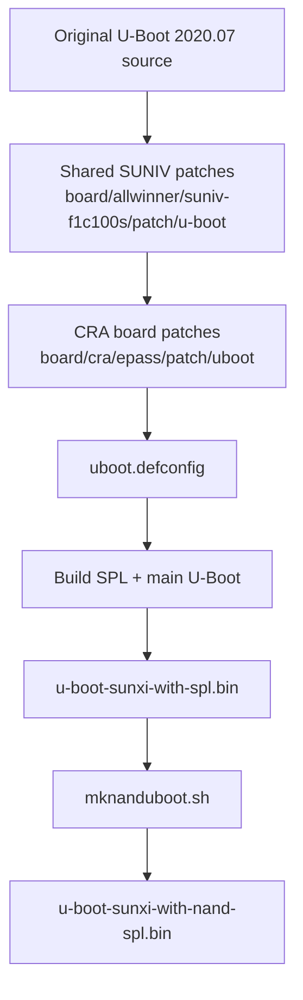
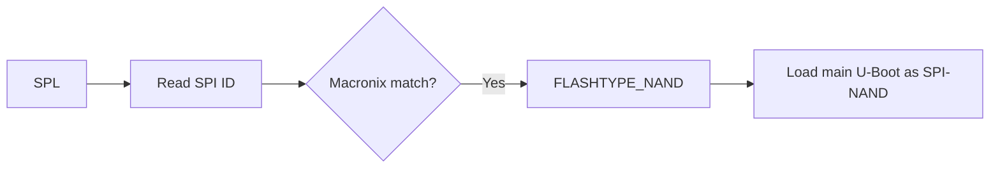
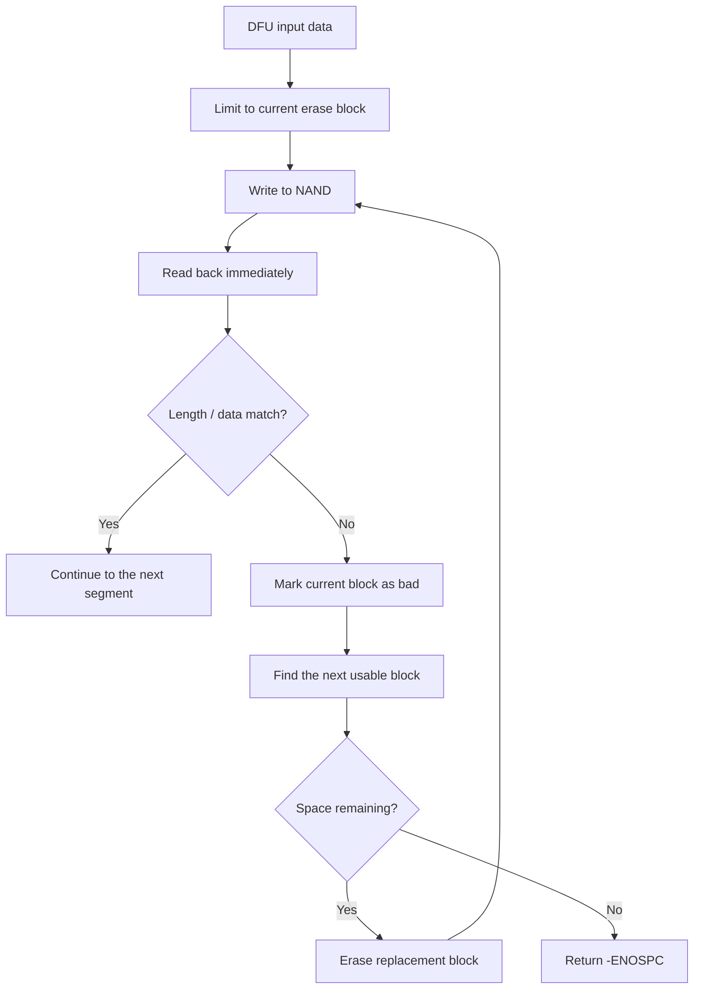
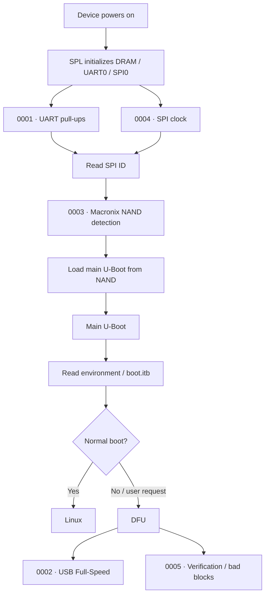
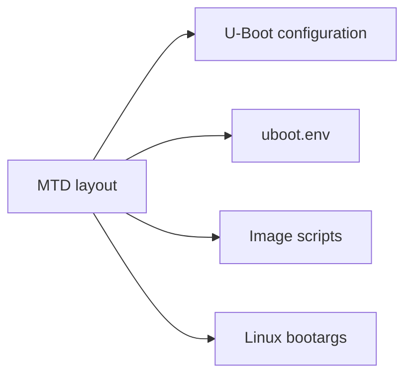

<div align="center">

# CRA Electric Pass U-Boot Patches

<sub>Read this in other languages: [English](README_EN.md), [中文](README.md).</sub>

</div>

> [!NOTE]
> This directory contains the board-specific patches added by CRA Electric Pass for **U-Boot**. They primarily cover the boot UART, USB DFU, SPI-NAND detection, SUNIV SPI clocks, and NAND post-write verification.

<p align="center">
  <a href="#build-relationships">Build Relationships</a> ·
  <a href="#patch-overview">Patch Overview</a> ·
  <a href="#spl-stage">SPL</a> ·
  <a href="#main-u-boot-stage">Main U-Boot</a> ·
  <a href="#boot-flow">Boot Flow</a> ·
  <a href="#configuration-and-device-tree">Configuration / DTS</a> ·
  <a href="#nand-image">NAND Image</a> ·
  <a href="#build-procedure">Build Procedure</a> ·
  <a href="#validation-status">Validation Status</a>
</p>

---

## Build Relationships

Buildroot configuration:

```make
BR2_TARGET_UBOOT_CUSTOM_VERSION_VALUE="2020.07"
BR2_TARGET_UBOOT_PATCH="board/allwinner/suniv-f1c100s/patch/u-boot board/cra/epass/patch/uboot"
BR2_TARGET_UBOOT_CUSTOM_CONFIG_FILE="board/cra/epass/uboot.defconfig"
```

Effective build flow:



> [!IMPORTANT]
> The patches in this directory are applied on top of the shared SUNIV U-Boot patch set. Their numbers define both application order and dependency order.

---

## Patch Overview

<table>
<tr>
<td width="33%" valign="top">

### Boot Fundamentals

`0001` · `0003` · `0004`

Covers:

- UART0 default levels
- SPI-NAND detection in SPL
- SUNIV SPI clocking and division

These patches directly affect whether SPL can read main U-Boot reliably.

</td>
<td width="33%" valign="top">

### USB / DFU

`0002` · `0005`

Covers:

- U-Boot USB Full-Speed operation
- MTD DFU post-write verification
- NAND bad-block skipping and retries

</td>
<td width="33%" valign="top">

### Maintenance Priorities

- Both SPL and main U-Boot are affected
- SPI clock assumptions must remain consistent with the clock tree
- NAND IDs must be considered in both SPL and MTD
- The DFU bad-block policy must not be overly aggressive
- The patch stage must be rerun after a patch is modified

</td>
</tr>
</table>

```text
patch/uboot/
├─ 0001-uart-pull.patch
├─ 0002-musb-force-fs.patch
├─ 0003-spi-nand-mx35lf1g.patch
├─ 0004-f1c-spi-fix.patch
├─ 0005-dfu-verify-block.patch
└─ README.md
```

| Number | Main purpose | Affected stage |
| :---: | :--- | :--- |
| `0001` | Pull-ups on UART0 TX / RX | SPL / early U-Boot UART |
| `0002` | Forces MUSB Gadget to use Full-Speed | Main U-Boot USB / DFU |
| `0003` | Detects Macronix SPI-NAND | SPL NAND boot |
| `0004` | Corrects the SUNIV SPI parent clock and dividers | SPL / main U-Boot SPI |
| `0005` | MTD DFU post-write verification and bad-block handling | Main U-Boot DFU |

---

# SPL Stage

## `0001` · UART0 Pin Pull-Ups

Target file:

```text
arch/arm/mach-sunxi/board.c
```

UART0 uses:

```text
PE0 = TX
PE1 = RX
```

The patch adds:

```c
sunxi_gpio_set_pull(SUNXI_GPE(0), SUNXI_GPIO_PULL_UP);
```

The original code already configures a pull-up for PE1. This patch gives both TX and RX consistent default levels.

### Unaffected Settings

- UART baud rate
- UART controller index
- Linux `console=ttyS0,115200`
- Linux UART driver after the kernel starts

> [!NOTE]
> This patch changes only the GPIO bias during early boot; it does not alter UART protocol parameters.

---

## `0003` · Macronix SPI-NAND Detection in SPL

Target:

```text
arch/arm/mach-sunxi/spl_spi_sunxi.c
```

After DRAM initialization, SPL must determine whether SPI0 is connected to SPI-NOR or SPI-NAND before selecting the method used to load main U-Boot.

Added IDs:

| Manufacturer / Device ID | Model |
| :--- | :--- |
| `c2 12` | MX35LF1GE4AB |
| `c2 14` | MX35LF1G24AD |

After a successful match:

```c
FLASHTYPE_NAND
```



> [!IMPORTANT]
> This patch handles only **flash-type detection during SPL**. SPI-NAND reads and writes, MTD, and bad-block handling in main U-Boot still depend on the shared SUNIV patches, Kconfig, the device tree, and the vendor driver.

---

## `0004` · SUNIV SPI Clock Correction

Target:

```text
drivers/spi/spi-sunxi.c
```

The original logic treats 24 MHz as both the SPI parent clock and the maximum SPI rate, and defaults to 1 MHz when the device tree does not specify a frequency. This does not match the actual SUNIV / F1C100S / F1C200S clock structure.

The patch adds:

```c
u32 mod_clk_hz;
u32 max_speed_hz;
```

Current SUNIV assumptions:

| Parameter | Current value |
| :--- | ---: |
| SPI divider parent clock | 200 MHz |
| Maximum SPI bus frequency | 100 MHz |
| Current SPI-NAND DTS limit | 80 MHz |

The 200 MHz value comes from:

```text
PLL_PERIPH / 3
```

Current device tree:

```dts
spi-max-frequency = <80000000>;
```

The driver rounds the CDR1 / CDR2 divider calculation upward to ensure that the actual SPI clock does not exceed the requested value.


> [!CAUTION]
> After changing the SPL clock, AHB clock, or `PLL_PERIPH`, recheck the hard-coded 200 MHz assumption. An incorrect parent clock directly affects SPL boot-read reliability.

---

# Main U-Boot Stage

## `0002` · Force MUSB to Full-Speed

Targets:

```text
drivers/usb/musb-new/musb_core.c
drivers/usb/musb-new/musb_gadget.c
```

The patch no longer sets:

```text
MUSB_POWER_HSENAB
```

and continues to clear the bit during the Gadget wake-up / resume flow.

Affected functions:

- DFU
- U-Boot USB download
- Other U-Boot features based on MUSB Gadget


> [!NOTE]
> This patch affects only U-Boot. Linux USB speed is controlled by the Linux MUSB driver and `cra,usb-hs-enabled`.

The current patch modifies only the path actually used by U-Boot 2020.07:

```text
drivers/usb/musb-new/
```

---

## `0005` · DFU Post-Write Verification and Bad-Block Handling

Target:

```text
drivers/dfu/dfu_mtd.c
```

Enhanced write flow:



The patch adds:

- Erase-block-sized segmentation
- Immediate read-back after writing
- Length verification
- Data comparison
- Bad-block marking after a write or verification failure
- Skipping known bad blocks
- Retrying on a replacement block
- Returning `-ENOSPC` when space is exhausted

### Important Considerations

| Behavior | Risk |
| :--- | :--- |
| A block is marked bad after one failure | A transient communication failure may be treated as permanent media damage |
| An erase-block-sized verification buffer | Increases U-Boot heap usage |

> [!WARNING]
> Ensure stable power, USB connectivity, and SPI timing during DFU. Power fluctuations, USB interruptions, or an excessive SPI rate can cause blocks to be marked bad incorrectly.

---

## Boot Flow

Placement of the five patches in the boot process:



---

## Configuration and Device Tree

### U-Boot Configuration

Location:

```text
board/cra/epass/uboot.defconfig
```

Related options:

```text
CONFIG_SPL=y
CONFIG_SPL_SPI_SUNXI=y
CONFIG_CMD_DFU=y
CONFIG_DFU_MTD=y
CONFIG_MTD=y
CONFIG_DM_MTD=y
CONFIG_MTD_SPI_NAND=y
CONFIG_SPI=y
CONFIG_DM_SPI=y
CONFIG_USB_MUSB_GADGET=y
CONFIG_USB_GADGET_DOWNLOAD=y
```

> [!IMPORTANT]
> A patch applying successfully does not guarantee that its code will be compiled. If Kconfig does not enable the corresponding feature, the patched logic may not be included in the final image.

### U-Boot Device Tree

Location:

```text
board/cra/epass/devicetree/uboot/
```

The SPI0 and `spi-nand@0` nodes declare:

- SPI0 pinctrl
- SPI-NAND chip select
- Maximum requested frequency of 80 MHz
- NAND node status

### MTD Partitions

Current configuration:

```text
spi-nand0=cranand
mtdparts=cranand:1M(u-boot)ro,6M(boot),-(rootfs)
```

When changing the partition layout, also check:

```text
board/cra/epass/uboot.defconfig
board/cra/epass/uboot.env
board/cra/epass/scripts/
Linux bootargs
```



---

# NAND Image

Buildroot first generates:

```text
u-boot-sunxi-with-spl.bin
```

Then:

```text
board/cra/epass/scripts/mknanduboot.sh
```

rearranges SPL for a **2 KiB NAND page layout** and places main U-Boot at:

```text
0xD000
```

The final output is:

```text
output/images/u-boot-sunxi-with-nand-spl.bin
```


> [!CAUTION]
> A successful patch build does not guarantee that NAND image post-processing succeeded. The physical device uses `u-boot-sunxi-with-nand-spl.bin`; verify this final output separately.

---

## Build Procedure

After modifying a patch in this directory:

```bash
make cra_epass_defconfig
make uboot-dirclean
make uboot
```

To continue generating the complete image set:

```bash
make
```

### Why Use `uboot-dirclean`


Running only:

```bash
make uboot-rebuild
```

does not normally rerun a patch stage that has already completed.

> [!CAUTION]
> Build commands do not write anything to a physical device automatically. Flashing `u-boot-sunxi-with-nand-spl.bin` modifies the earliest boot region and must be treated as a separate operation.

---

## Validation Status

The following checks have been completed:

- All five CRA U-Boot patches parse correctly as unified diffs
- CRA Linux and U-Boot patches use LF line endings
- The shared SUNIV patches and all five CRA patches apply in Buildroot order
- `0002-musb-force-fs.patch` modifies only the `drivers/usb/musb-new/` path that exists in U-Boot 2020.07
- The current U-Boot configuration recognizes the relevant CRA, SPI-NAND, DFU, MTD, SPL, and MUSB options
- All five patches have passed a U-Boot compilation check


> [!IMPORTANT]
> The existing checks confirm that the patch sequence and build relationships are valid. They do not replace physical-device boot testing, UART validation, long-duration SPI-NAND read/write testing, or DFU failure-recovery testing.

---

<div align="center">

<sub><b>CRA Electric Pass</b> · U-Boot board patch set</sub>

</div>
