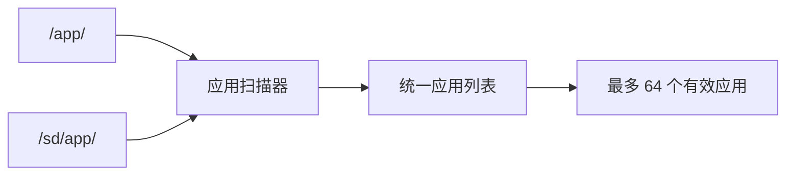
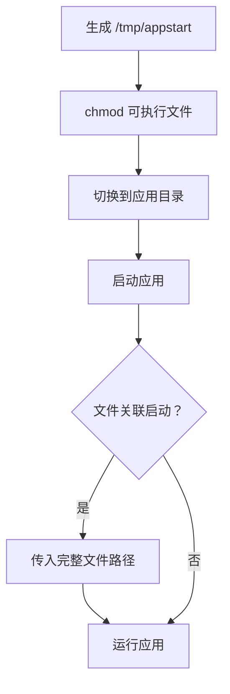
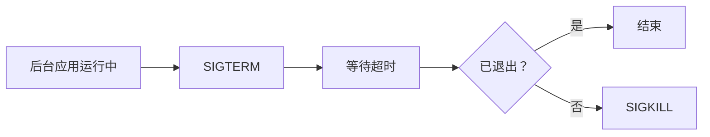
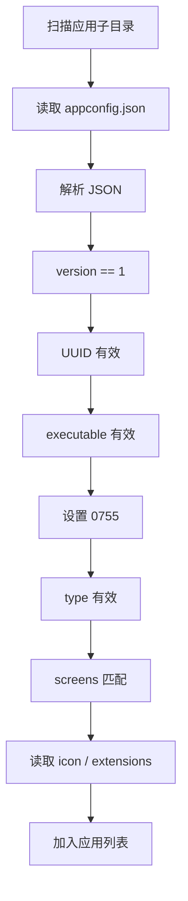

<div align="center">

# CRA Electric Pass 扩展应用目录

<sub>Read this in other languages: [English](README_EN.md), [中文](README.md).</sub>

</div>

> [!NOTE]
> 本目录在 Buildroot 合并 rootfs overlay 后对应设备内部 NAND 上的 `/app/`，用于保存第三方扩展应用。

> [!IMPORTANT]
> CRA Electric Pass 主程序安装在 `/root/epass_drm_app`。主程序与 `/app/` 扩展应用属于不同层级，不应将主项目复制或改造成 `/app/` 下的第三方应用。

<p align="center">
  <a href="#目录定位">目录定位</a> ·
  <a href="#应用扫描">应用扫描</a> ·
  <a href="#应用目录结构">目录结构</a> ·
  <a href="#appconfigjson"><code>appconfig.json</code></a> ·
  <a href="#应用类型">应用类型</a> ·
  <a href="#屏幕与图标">屏幕 / 图标</a> ·
  <a href="#文件关联">文件关联</a> ·
  <a href="#加载流程">加载流程</a> ·
  <a href="#mtp-安装">MTP</a> ·
  <a href="#安全边界">安全边界</a>
</p>

---

## 目录定位

设备端对应：

```text
/app/
```

### 主程序与扩展应用

<table>
<tr>
<td width="50%" valign="top">

### 主程序

```text
/root/epass_drm_app
```

由 Buildroot 软件包安装。

属于系统核心应用。

</td>
<td width="50%" valign="top">

### 扩展应用

```text
/app/
```

由使用者或发行内容提供。

属于第三方扩展层。

</td>
</tr>
</table>

---

## 应用扫描

主程序扫描两个位置：

```text
/app/       内部 NAND
/sd/app/    SD 卡
```

源码常量：

```c
#define APPS_MAX 64
#define APPS_CONFIG_VERSION 1
#define APPS_CONFIG_FILENAME "appconfig.json"
#define APPS_PARSE_LOG "/root/apps.log"
#define APPS_DIR "/app/"
#define APPS_DIR_SD "/sd/app/"
```



> [!NOTE]
> 内部 NAND 与 SD 卡应用会进入同一个应用列表。

---

## 应用目录结构

扫描器只检查 `/app/` 下的**子目录**。

直接放置在 `/app/` 根目录中的单个可执行文件不会被识别。

推荐结构：

```text
/app/
└── example_app/
    ├── appconfig.json
    ├── example_app
    ├── icon.png
    └── 其他应用资源
```

| 文件 | 作用 |
| :--- | :--- |
| `appconfig.json` | 应用元数据与启动配置 |
| `example_app` | ARM Linux 可执行程序 |
| `icon.png` | 可选图标 |
| 其他资源 | 由应用自行读取 |

### 目标运行环境

应用可执行文件需要适配：

```text
ARM926T
EABI
soft-float
Linux
```

以下程序不能直接运行：

- Windows `.exe`
- x86 / x86-64 Linux 程序
- ABI 或架构不兼容的 ARM 程序

---

# `appconfig.json`

配置文件名固定为：

```text
appconfig.json
```

当前格式版本：

```text
1
```

### 完整示例

```json
{
  "version": 1,
  "name": "Example App",
  "uuid": "12345678-1234-1234-1234-123456789abc",
  "executable": {
    "file": "example_app"
  },
  "type": "fg",
  "screens": [
    "360x640"
  ],
  "description": "示例应用",
  "icon": "icon.png",
  "extensions": [
    ".txt"
  ]
}
```

---

## 字段说明

| 字段 | 必需 | 说明 |
| :--- | :---: | :--- |
| `version` | 是 | 配置格式版本，当前必须为 `1` |
| `name` | 否 | 显示名称；缺失或为空时使用目录名 |
| `uuid` | 是 | 应用唯一标识，必须是有效 UUID |
| `executable` | 是 | 应用目录内的可执行文件 |
| `type` | 是 | 启动类型 |
| `screens` | 是 | 支持的屏幕分辨率 |
| `description` | 否 | 应用说明；缺失时使用“无描述” |
| `icon` | 否 | 相对应用目录的图标路径 |
| `extensions` | 否 | 可处理的文件扩展名 |

### `executable`

推荐格式：

```json
"executable": {
  "file": "example_app"
}
```

兼容旧格式：

```json
"executable": "example_app"
```

> [!TIP]
> 新应用优先使用对象格式，便于后续扩展启动参数或其他可执行属性。

---

# 应用类型

`type` 支持：

| 值 | 类型 | 启动方式 |
| :--- | :--- | :--- |
| `fg` | 普通前台应用 | 应用列表直接启动，也可处理关联文件 |
| `bg` | 后台应用 | 主界面运行期间启动 / 停止 |
| `fg_ext` | 文件关联型前台应用 | 不能从应用列表直接启动，只通过关联文件调用 |

---

## 前台应用

启动时主程序生成：

```text
/tmp/appstart
```

脚本执行：



具体步骤：

1. 设置执行权限；
2. `cd` 到应用目录；
3. 启动对应可执行文件；
4. 文件关联启动时传入完整文件路径。

主程序随后退出当前 UI，由系统启动流程执行临时脚本。应用结束后可重新启动 CRA Electric Pass 主界面。

---

## 后台应用

后台应用运行在独立进程组。

主程序记录 PID，并按以下流程停止：



同一后台应用已经运行时，不会重复启动第二个实例。

---

## 屏幕与图标

### 屏幕兼容性

当前主程序分辨率：

```text
360x640
```

应用至少需要声明：

```json
"screens": [
  "360x640"
]
```

解析器还保留：

```text
480x854
720x1280
```

但只有主程序当前编译启用的分辨率会被视为兼容。

> [!IMPORTANT]
> `screens` 没有匹配当前固件时，应用不会进入应用列表。

---

### 图标

示例：

```json
"icon": "icon.png"
```

主程序会检查文件：

- 是否存在
- 是否可读

无有效图标时使用：

```text
/root/res/defaulticon.png
```

---

# 文件关联

`extensions` 用于声明应用可处理的文件扩展名：

```json
"extensions": [
  ".txt",
  ".json"
]
```

规则：

- 扩展名包含开头的 `.`
- 文件管理器打开匹配文件时，将**完整文件路径**作为一个命令行参数传给应用
- 当前映射最多保存 **128 个条目**


> [!WARNING]
> 多个应用注册同一扩展名时，应检查实际加载顺序和映射实现，避免处理程序不明确。

---

# 加载流程

主程序按顺序检查：



检查项：

1. 应用子目录可访问；
2. `appconfig.json` 存在且可读；
3. JSON 解析成功；
4. `version == 1`；
5. `uuid` 存在且格式有效；
6. 可执行文件字段存在；
7. 可执行文件存在且可读；
8. 可设置执行权限为 `0755`；
9. `type` 有效；
10. `screens` 与当前固件兼容；
11. 图标和扩展名信息有效。

失败应用不会进入列表。

日志：

```text
/root/apps.log
```

---

# MTP 安装

uMTP Responder 将 `/app` 暴露为：

```text
storage "/app" "app" "rw"
```


设备进入 MTP 模式后，可以从电脑：

- 复制应用
- 更新应用
- 删除应用目录

> [!TIP]
> MTP 操作完成后，应让主程序重新扫描应用列表或重启主程序，避免继续使用旧解析结果。

---

# 安全边界

当前加载机制会验证配置格式与文件可读性，但**不会验证**：

- 数字签名
- SHA-256
- 发布者身份
- 程序来源
- 系统接口调用范围
- 危险或破坏性行为

加载成功后，主程序会设置：

```text
0755
```

并直接启动程序。

> [!CAUTION]
> `/app/` 是可执行第三方代码的目录，不应把“能够被扫描并启动”理解为“可信或安全”。

### 安装与发布要求

- 不安装来源不明的二进制文件；
- 不直接复制 Windows / x86 桌面程序；
- 未确认硬件访问范围前不运行第三方程序；
- 更新前备份应用数据与设备资源；
- 应用包记录源码、构建环境、目标架构、版本与校验值；
- CRA Electric Pass 主程序本身不迁移到 `/app/`。

---

## 相关源码

| 功能 | 路径 |
| :--- | :--- |
| 应用目录与配置常量 | `drm_app_neo/src/config.h` |
| 扫描与配置解析 | `drm_app_neo/src/apps/apps_cfg_parse.c` |
| 启动与进程管理 | `drm_app_neo/src/apps/apps.c` |
| 应用数据结构 | `drm_app_neo/src/apps/apps_types.h` |
| MTP Storage 配置 | `buildroot-epass/board/cra/epass/rootfs/etc/umtprd/` |

---

## 应用开发检查表

| 项目 | 要求 |
| :--- | :--- |
| 目录 | 每个应用独立子目录 |
| 配置文件 | `appconfig.json` |
| 配置版本 | `1` |
| UUID | 有效且唯一 |
| 可执行文件 | ARM926T EABI soft-float Linux |
| `type` | `fg` / `bg` / `fg_ext` |
| `screens` | 至少匹配当前 `360x640` |
| 图标 | 可选，使用相对路径 |
| 文件关联 | 扩展名以 `.` 开头 |
| 安全信息 | 建议记录版本、来源、构建环境和校验值 |

---

<div align="center">

<sub><b>CRA Electric Pass</b> · Third-party application directory and package format</sub>

</div>
