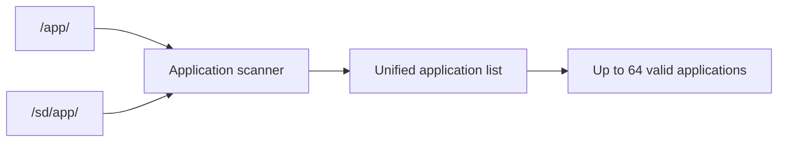
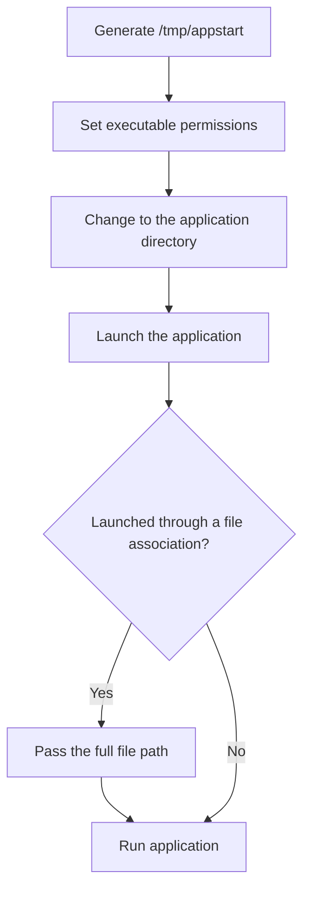
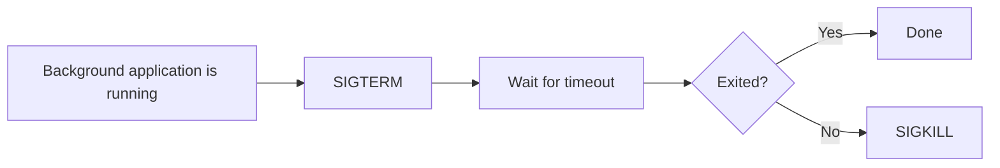
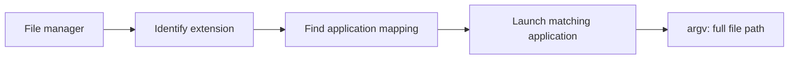
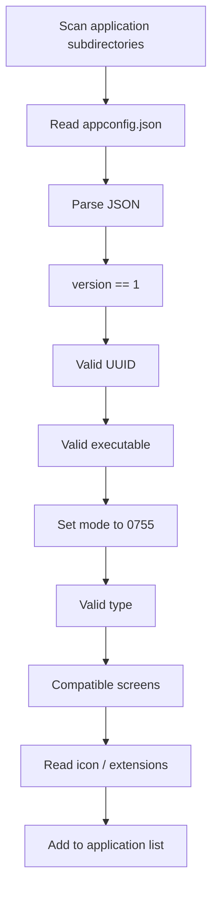
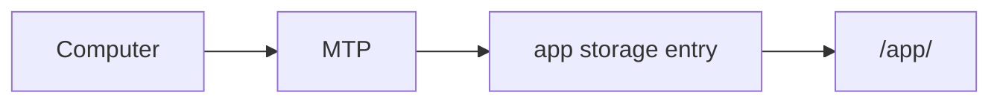

<div align="center">

# CRA Electric Pass Extension Application Directory

<sub>Read this in other languages: [English](README_EN.md), [中文](README.md).</sub>

</div>

> [!NOTE]
> After Buildroot merges the rootfs overlay, this directory corresponds to `/app/` on the device's internal NAND and stores third-party extension applications.

> [!IMPORTANT]
> The CRA Electric Pass main application is installed at `/root/epass_drm_app`. The main application and the extension applications under `/app/` belong to different layers. Do not copy or convert the main project into a third-party application under `/app/`.

<p align="center">
  <a href="#directory-role">Directory Role</a> ·
  <a href="#application-scanning">Application Scanning</a> ·
  <a href="#application-directory-structure">Directory Structure</a> ·
  <a href="#appconfigjson"><code>appconfig.json</code></a> ·
  <a href="#application-types">Application Types</a> ·
  <a href="#screens-and-icons">Screens / Icons</a> ·
  <a href="#file-associations">File Associations</a> ·
  <a href="#loading-flow">Loading Flow</a> ·
  <a href="#mtp-installation">MTP</a> ·
  <a href="#security-boundary">Security Boundary</a>
</p>

---

## Directory Role

Corresponding path on the device:

```text
/app/
```

### Main and Extension Applications

<table>
<tr>
<td width="50%" valign="top">

### Main Application

```text
/root/epass_drm_app
```

Installed by a Buildroot package.

Part of the core system.

</td>
<td width="50%" valign="top">

### Extension Applications

```text
/app/
```

Provided by users or content distributions.

Part of the third-party extension layer.

</td>
</tr>
</table>

---

## Application Scanning

The main application scans two locations:

```text
/app/       Internal NAND
/sd/app/    SD card
```

Source constants:

```c
#define APPS_MAX 64
#define APPS_CONFIG_VERSION 1
#define APPS_CONFIG_FILENAME "appconfig.json"
#define APPS_PARSE_LOG "/root/apps.log"
#define APPS_DIR "/app/"
#define APPS_DIR_SD "/sd/app/"
```



> [!NOTE]
> Applications from the internal NAND and SD card are added to the same application list.

---

## Application Directory Structure

The scanner checks only **subdirectories** under `/app/`.

A standalone executable placed directly in the `/app/` root is not recognized.

Recommended structure:

```text
/app/
└── example_app/
    ├── appconfig.json
    ├── example_app
    ├── icon.png
    └── Other application resources
```

| File | Purpose |
| :--- | :--- |
| `appconfig.json` | Application metadata and launch configuration |
| `example_app` | ARM Linux executable |
| `icon.png` | Optional icon |
| Other resources | Read and managed by the application itself |

### Target Runtime Environment

Application executables must target:

```text
ARM926T
EABI
soft-float
Linux
```

The following programs cannot run directly:

- Windows `.exe` files
- x86 / x86-64 Linux programs
- ARM programs built for an incompatible architecture or ABI

---

# `appconfig.json`

The configuration file name is fixed:

```text
appconfig.json
```

Current format version:

```text
1
```

### Complete Example

```json
{
  "version": 1,
  "name": "Example App",
  "uuid": "12345678-1234-1234-1234-123456789abc",
  "executable": {
    "file": "example_app"
  },
  "type": "fg",
  "screens": [
    "360x640"
  ],
  "description": "Example application",
  "icon": "icon.png",
  "extensions": [
    ".txt"
  ]
}
```

---

## Field Reference

| Field | Required | Description |
| :--- | :---: | :--- |
| `version` | Yes | Configuration format version; currently must be `1` |
| `name` | No | Display name; the directory name is used when this field is missing or empty |
| `uuid` | Yes | Unique application identifier; must be a valid UUID |
| `executable` | Yes | Executable file within the application directory |
| `type` | Yes | Launch type |
| `screens` | Yes | Supported screen resolutions |
| `description` | No | Application description; “No description” is used when omitted |
| `icon` | No | Icon path relative to the application directory |
| `extensions` | No | File extensions that the application can handle |

### `executable`

Recommended format:

```json
"executable": {
  "file": "example_app"
}
```

Legacy format:

```json
"executable": "example_app"
```

> [!TIP]
> New applications should use the object format so that launch arguments or other executable properties can be added later.

---

# Application Types

`type` supports:

| Value | Type | Launch behavior |
| :--- | :--- | :--- |
| `fg` | Standard foreground application | Can be launched directly from the application list or used to handle associated files |
| `bg` | Background application | Started and stopped while the main interface is running |
| `fg_ext` | File-associated foreground application | Cannot be launched directly from the application list; invoked only through an associated file |

---

## Foreground Applications

When launching a foreground application, the main application generates:

```text
/tmp/appstart
```

Script flow:



The script:

1. Sets executable permissions.
2. Changes to the application directory.
3. Launches the configured executable.
4. Passes the full file path when launched through a file association.

The main application then exits its current UI, and the system startup flow executes the temporary script. After the extension application exits, the CRA Electric Pass main interface can be started again.

---

## Background Applications

Background applications run in separate process groups.

The main application records the PID and stops the process as follows:



If the same background application is already running, a second instance is not started.

---

## Screens and Icons

### Screen Compatibility

The current main-application resolution is:

```text
360x640
```

An application must declare at least:

```json
"screens": [
  "360x640"
]
```

The parser also retains:

```text
480x854
720x1280
```

but only resolutions enabled in the current main-application build are considered compatible.

> [!IMPORTANT]
> If `screens` does not match the current firmware, the application is not added to the application list.

---

### Icons

Example:

```json
"icon": "icon.png"
```

The main application checks whether the file:

- Exists
- Is readable

If no valid icon is available, it uses:

```text
/root/res/defaulticon.png
```

---

# File Associations

`extensions` declares the file extensions an application can handle:

```json
"extensions": [
  ".txt",
  ".json"
]
```

Rules:

- Each extension includes the leading `.`
- When the file manager opens a matching file, it passes the **full file path** to the application as one command-line argument
- The current mapping stores at most **128 entries**



> [!WARNING]
> If multiple applications register the same extension, inspect the effective load order and mapping implementation to avoid an ambiguous handler.

---

# Loading Flow

The main application checks the following in order:



Checks:

1. The application subdirectory is accessible.
2. `appconfig.json` exists and is readable.
3. JSON parsing succeeds.
4. `version == 1`.
5. `uuid` exists and has a valid format.
6. The executable field exists.
7. The executable exists and is readable.
8. Its mode can be set to `0755`.
9. `type` is valid.
10. `screens` is compatible with the current firmware.
11. Icon and extension information is valid.

An application that fails any check is not added to the list.

Log file:

```text
/root/apps.log
```

---

# MTP Installation

uMTP Responder exposes `/app` as:

```text
storage "/app" "app" "rw"
```



When the device enters MTP mode, a computer can:

- Copy applications
- Update applications
- Delete application directories

> [!TIP]
> After completing MTP operations, rescan the application list or restart the main application to avoid using stale parsing results.

---

# Security Boundary

The current loading mechanism validates configuration format and file readability, but it **does not validate**:

- Digital signatures
- SHA-256 hashes
- Publisher identity
- Program provenance
- Scope of system-interface access
- Dangerous or destructive behavior

After an application is accepted, the main application sets its mode to:

```text
0755
```

and launches it directly.

> [!CAUTION]
> `/app/` contains executable third-party code. An application being discoverable and launchable does not mean that it is trusted or safe.

### Installation and Distribution Requirements

- Do not install binaries from unknown sources.
- Do not copy Windows or x86 desktop programs directly.
- Do not run third-party programs before confirming the scope of their hardware access.
- Back up application data and device resources before updating.
- Record each application's source, build environment, target architecture, version, and checksum.
- Do not move the CRA Electric Pass main application into `/app/`.

---

## Related Source Files

| Function | Path |
| :--- | :--- |
| Application directories and configuration constants | `drm_app_neo/src/config.h` |
| Scanning and configuration parsing | `drm_app_neo/src/apps/apps_cfg_parse.c` |
| Launch and process management | `drm_app_neo/src/apps/apps.c` |
| Application data structures | `drm_app_neo/src/apps/apps_types.h` |
| MTP storage configuration | `buildroot-epass/board/cra/epass/rootfs/etc/umtprd/` |

---

## Application Development Checklist

| Item | Requirement |
| :--- | :--- |
| Directory | One dedicated subdirectory per application |
| Configuration file | `appconfig.json` |
| Configuration version | `1` |
| UUID | Valid and unique |
| Executable | ARM926T EABI soft-float Linux |
| `type` | `fg` / `bg` / `fg_ext` |
| `screens` | Must include the current `360x640` resolution |
| Icon | Optional; use a relative path |
| File associations | Extensions begin with `.` |
| Security information | Record the version, source, build environment, and checksum |

---

<div align="center">

<sub><b>CRA Electric Pass</b> · Third-party application directory and package format</sub>

</div>
