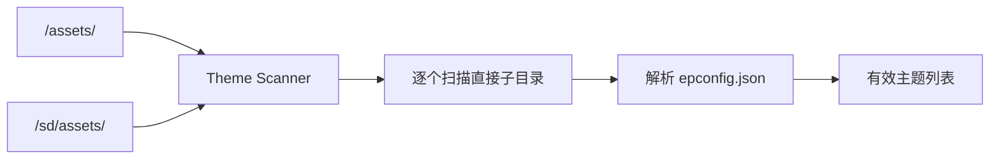
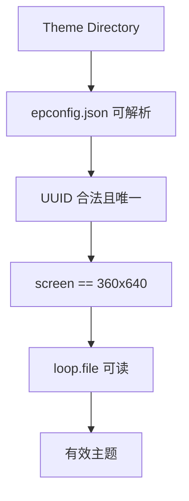
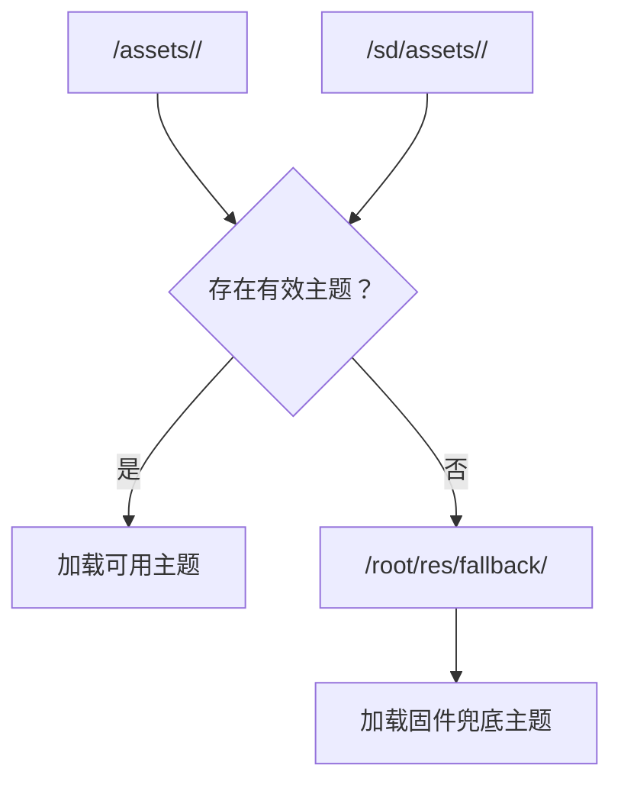
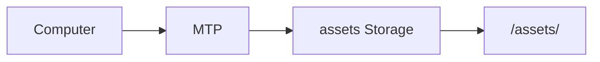

<div align="center">

# CRA Electric Pass 主题素材目录

<sub>Read this in other languages: [English](README_EN.md), [中文](README.md).</sub>

</div>

> [!NOTE]
> 本目录在 Buildroot 合并 rootfs overlay 后对应设备内部 NAND 上的 `/assets/`，用于保存可安装的主题素材。

> [!IMPORTANT]
> `/assets/` 不是主程序源码目录，也不用于保存 `/root/res/` 中随固件固定发布的界面资源。

<p align="center">
  <a href="#目录定位">目录定位</a> ·
  <a href="#主题扫描">主题扫描</a> ·
  <a href="#主题目录结构">目录结构</a> ·
  <a href="#主题最低要求">最低要求</a> ·
  <a href="#主题来源优先级">来源优先级</a> ·
  <a href="#fallback-主题">Fallback</a> ·
  <a href="#mtp-管理">MTP</a> ·
  <a href="#安全边界">安全边界</a>
</p>

---

## 目录定位

设备端对应：

```text
/assets/
```

CRA Electric Pass 的主题资源分为三层：

<table>
<tr>
<td width="33%" valign="top">

### NAND

```text
/assets/
```

内部 NAND 中的可安装主题。

可以来自 rootfs overlay，也可以在设备运行后继续写入。

</td>
<td width="33%" valign="top">

### SD Card

```text
/sd/assets/
```

SD 卡中的外部主题。

仅在 SD 卡已挂载并以相应模式运行时参与扫描。

</td>
<td width="33%" valign="top">

### Firmware Fallback

```text
/root/res/fallback/
```

固件内置兜底主题。

不属于可安装主题目录。

</td>
</tr>
</table>

---

## 主题扫描

主程序配置：

```c
#define THEME_DIR "/assets/"
#define THEME_DIR_SD "/sd/assets/"
```

对应源码：

```text
drm_app_neo/src/config.h
```

扫描器只检查：

```text
/assets/<theme>/
/sd/assets/<theme>/
```

也就是两个主题根目录的**直接子目录**。



> [!WARNING]
> 直接把 `epconfig.json`、视频或图标放在 `/assets/` 根目录不会形成一个有效主题。每个主题必须拥有自己的子目录。

---

## 主题目录结构

推荐结构：

```text
/assets/
└── example_theme/
    ├── epconfig.json
    ├── loop.mp4
    ├── icon.png
    └── 其他可选资源
```

| 文件 | 作用 |
| :--- | :--- |
| `epconfig.json` | 主题元数据与资源配置 |
| `loop.mp4` | 循环播放的视频资源 |
| `icon.png` | 可选主题图标 |
| 其他资源 | 入场视频、过渡图像、Overlay UI 等 |

> [!NOTE]
> 图标、入场视频、过渡图像和叠加 UI 是否必需，由当前主题配置决定。

---

## 主题最低要求

一个主题至少需要满足以下条件：

| 项目 | 要求 |
| :--- | :--- |
| `epconfig.json` | 可以正常解析 |
| 配置版本 | 与当前固件支持版本匹配 |
| `uuid` | 合法且唯一 |
| `screen` | 与当前固件一致 |
| `loop.file` | 指向可读的循环视频 |

当前项目屏幕：

```text
360x640
```

因此主题配置中的屏幕定义必须与当前固件匹配。



主题解析失败信息写入：

```text
/root/asset.log
```

> [!TIP]
> 调试主题未出现、资源未加载或配置被拒绝时，优先检查 `/root/asset.log`。

---

## 主题来源优先级

主题来源关系：



| 路径 | 含义 |
| :--- | :--- |
| `/assets/` | 内部 NAND 主题 |
| `/sd/assets/` | SD 卡主题 |
| `/root/res/fallback/` | 无有效外部主题时的固件兜底主题 |

---

## Fallback 主题

只有：

```text
/assets/
/sd/assets/
```

都没有可用主题时，程序才会使用：

```text
/root/res/fallback/
```

> [!IMPORTANT]
> Fallback 属于固件固定资源，不应迁移到 `/assets/`，也不应把它当作普通可安装主题维护。

这三层目录承担不同职责：

```text
/assets/             用户 / 发行主题
/sd/assets/          SD 卡外部主题
/root/res/fallback/  固件最低可用主题
```

---

## MTP 管理

uMTP Responder 将主题目录暴露为可读写存储：

```text
storage "/assets" "assets" "rw"
```



设备进入 MTP 模式后，可以从电脑：

- 复制主题
- 更新主题资源
- 删除主题目录

> [!TIP]
> 修改主题后，应让主程序重新扫描主题或重新启动主程序，避免继续使用旧的解析结果或已缓存资源。

---

## 安全边界

通过 `/assets/` 或 `/sd/assets/` 输入的主题属于外部内容。

当前目录说明不能证明这些内容已经经过：

- 数字签名验证
- 文件 Hash 校验
- 发布者身份验证
- 媒体格式安全验证
- 配置内容审计
- 容量与资源消耗限制验证

> [!CAUTION]
> 外部主题配置和媒体文件不应仅因能够被设备读取就视为可信内容。使用前应核对来源、分辨率、编码、容量和配置字段。

### 发布前建议检查

| 项目 | 检查内容 |
| :--- | :--- |
| 来源 | 主题来源明确 |
| UUID | 合法且不与现有主题重复 |
| Screen | 与 `360x640` 固件匹配 |
| Loop | `loop.file` 存在且可读 |
| 视频 | 编码、分辨率、帧率与设备能力匹配 |
| 图片 | 尺寸、格式与内存占用合理 |
| 容量 | NAND / SD 可用空间足够 |
| 配置 | `epconfig.json` 字段有效 |
| 日志 | `/root/asset.log` 无解析错误 |

---

<div align="center">

<sub><b>CRA Electric Pass</b> · Theme asset directory and loading rules</sub>

</div>
