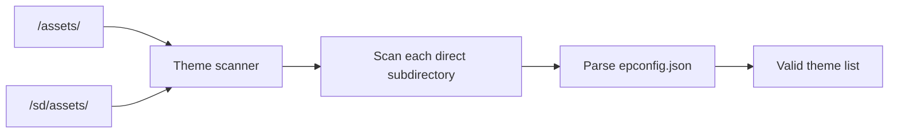
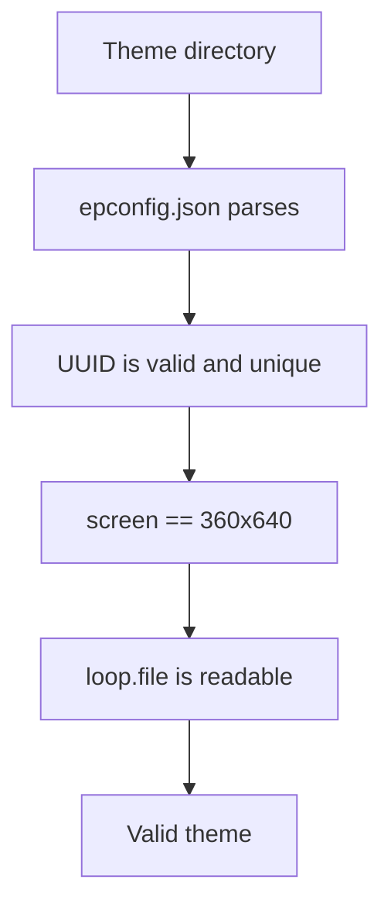
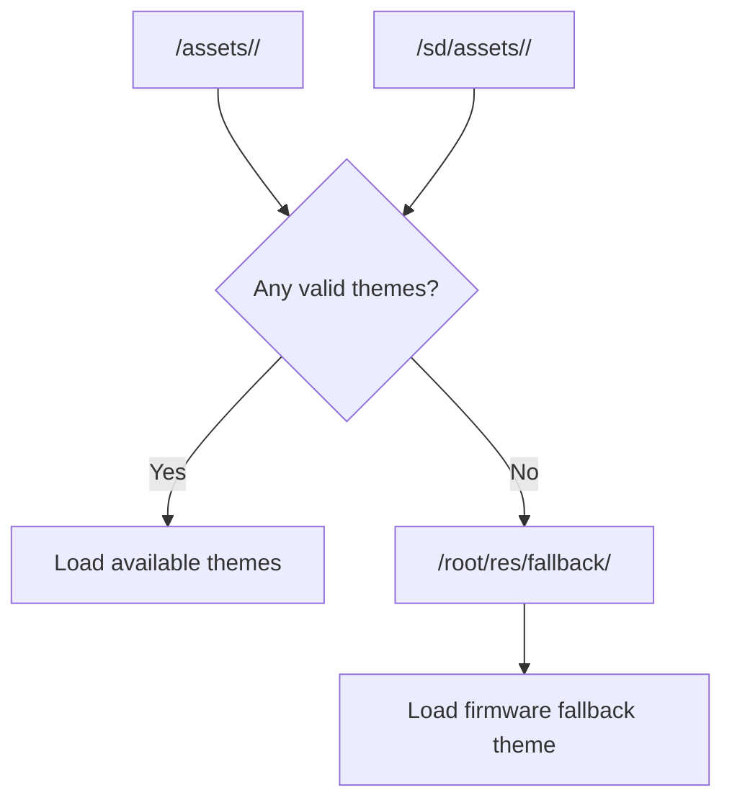
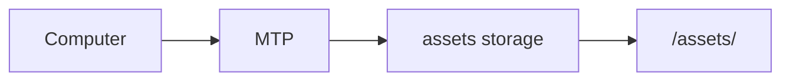

<div align="center">

# CRA Electric Pass Theme Asset Directory

<sub>Read this in other languages: [English](README_EN.md), [中文](README.md).</sub>

</div>

> [!NOTE]
> After Buildroot merges the rootfs overlay, this directory corresponds to `/assets/` on the device's internal NAND and stores installable theme assets.

> [!IMPORTANT]
> `/assets/` is not a main-application source directory, nor does it store the interface resources distributed as fixed firmware content under `/root/res/`.

<p align="center">
  <a href="#directory-role">Directory Role</a> ·
  <a href="#theme-scanning">Theme Scanning</a> ·
  <a href="#theme-directory-structure">Directory Structure</a> ·
  <a href="#minimum-theme-requirements">Minimum Requirements</a> ·
  <a href="#theme-source-priority">Source Priority</a> ·
  <a href="#fallback-theme">Fallback</a> ·
  <a href="#mtp-management">MTP</a> ·
  <a href="#security-boundary">Security Boundary</a>
</p>

---

## Directory Role

Corresponding path on the device:

```text
/assets/
```

CRA Electric Pass theme resources are organized into three layers:

<table>
<tr>
<td width="33%" valign="top">

### NAND

```text
/assets/
```

Installable themes stored in internal NAND.

They may come from the rootfs overlay or be written after the device is running.

</td>
<td width="33%" valign="top">

### SD Card

```text
/sd/assets/
```

External themes stored on an SD card.

They are scanned only when the SD card is mounted and the device is operating in the corresponding mode.

</td>
<td width="33%" valign="top">

### Firmware Fallback

```text
/root/res/fallback/
```

The fallback theme built into the firmware.

It is not part of the installable theme directory.

</td>
</tr>
</table>

---

## Theme Scanning

Main-application configuration:

```c
#define THEME_DIR "/assets/"
#define THEME_DIR_SD "/sd/assets/"
```

Corresponding source:

```text
drm_app_neo/src/config.h
```

The scanner checks only:

```text
/assets/<theme>/
/sd/assets/<theme>/
```

In other words, it examines only the **direct subdirectories** of the two theme roots.



> [!WARNING]
> Placing `epconfig.json`, videos, or icons directly in the `/assets/` root does not create a valid theme. Every theme must have its own subdirectory.

---

## Theme Directory Structure

Recommended structure:

```text
/assets/
└── example_theme/
    ├── epconfig.json
    ├── loop.mp4
    ├── icon.png
    └── Other optional resources
```

| File | Purpose |
| :--- | :--- |
| `epconfig.json` | Theme metadata and resource configuration |
| `loop.mp4` | Looping video resource |
| `icon.png` | Optional theme icon |
| Other resources | Entrance videos, transition images, overlay UI assets, and other optional content |

> [!NOTE]
> Whether an icon, entrance video, transition image, or overlay UI is required depends on the current theme configuration.

---

## Minimum Theme Requirements

A theme must meet at least the following conditions:

| Item | Requirement |
| :--- | :--- |
| `epconfig.json` | Parses successfully |
| Configuration version | Matches a version supported by the current firmware |
| `uuid` | Valid and unique |
| `screen` | Matches the current firmware |
| `loop.file` | References a readable loop video |

Current project screen:

```text
360x640
```

The screen definition in the theme configuration must therefore match the current firmware.



Theme parsing failures are written to:

```text
/root/asset.log
```

> [!TIP]
> If a theme does not appear, a resource is not loaded, or a configuration is rejected, check `/root/asset.log` first.

---

## Theme Source Priority

Theme-source relationship:



| Path | Meaning |
| :--- | :--- |
| `/assets/` | Internal NAND themes |
| `/sd/assets/` | SD-card themes |
| `/root/res/fallback/` | Firmware fallback used when no valid external theme is available |

---

## Fallback Theme

The program uses:

```text
/root/res/fallback/
```

only when neither:

```text
/assets/
/sd/assets/
```

contains a usable theme.

> [!IMPORTANT]
> The fallback is fixed firmware content. Do not move it into `/assets/` or maintain it as an ordinary installable theme.

The three directory layers have different responsibilities:

```text
/assets/             User / distribution themes
/sd/assets/          External SD-card themes
/root/res/fallback/  Minimum usable firmware theme
```

---

## MTP Management

uMTP Responder exposes the theme directory as writable storage:

```text
storage "/assets" "assets" "rw"
```



When the device enters MTP mode, a computer can:

- Copy themes
- Update theme resources
- Delete theme directories

> [!TIP]
> After modifying themes, rescan them or restart the main application to avoid using stale parsing results or cached resources.

---

## Security Boundary

Themes supplied through `/assets/` or `/sd/assets/` are external content.

The documentation for this directory does not establish that such content has undergone:

- Digital-signature verification
- File-hash verification
- Publisher-identity verification
- Media-format security validation
- Configuration-content review
- Capacity and resource-consumption limit validation

> [!CAUTION]
> An external theme configuration or media file should not be considered trusted merely because the device can read it. Before use, verify its source, resolution, encoding, size, and configuration fields.

### Recommended Pre-Release Checks

| Item | Check |
| :--- | :--- |
| Source | Theme provenance is known |
| UUID | Valid and not duplicated by an existing theme |
| Screen | Matches the `360x640` firmware |
| Loop | `loop.file` exists and is readable |
| Video | Encoding, resolution, and frame rate match device capabilities |
| Images | Dimensions, format, and memory usage are reasonable |
| Capacity | Sufficient free space is available on NAND / SD |
| Configuration | `epconfig.json` fields are valid |
| Log | `/root/asset.log` contains no parsing errors |

---

<div align="center">

<sub><b>CRA Electric Pass</b> · Theme asset directory and loading rules</sub>

</div>
