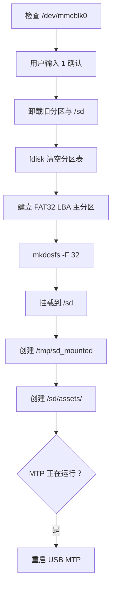
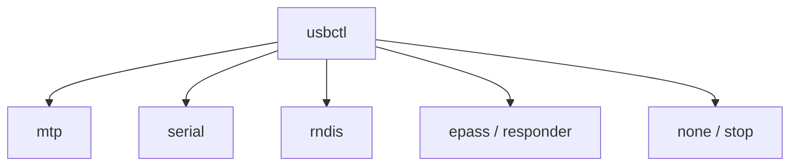
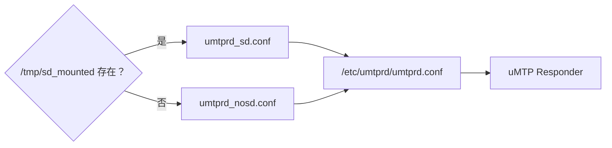
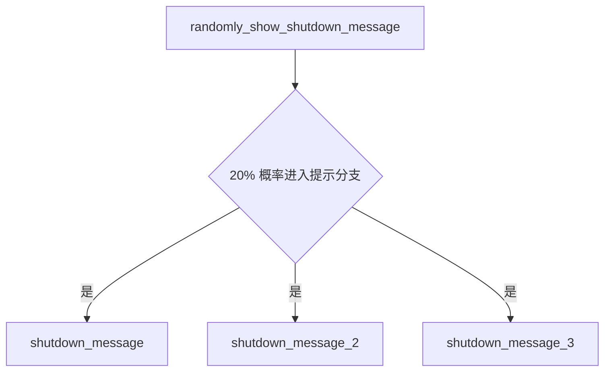

<div align="center">

# CRA Electric Pass 设备辅助程序

<sub>Read this in other languages: [English](README_EN.md), [中文](README.md).</sub>

</div>

> [!NOTE]
> 本目录中的文件会覆盖或安装到目标设备的 `/bin/`，包含 POSIX / BusyBox Shell 脚本以及面向设备 framebuffer 的 ARM 二进制辅助程序。

<p align="center">
  <a href="#目录定位">目录定位</a> ·
  <a href="#启动与登录">启动登录</a> ·
  <a href="#背光控制">背光</a> ·
  <a href="#存储维护">存储</a> ·
  <a href="#内存检查">内存</a> ·
  <a href="#usb-模式控制">USB</a> ·
  <a href="#关机提示程序">关机提示</a>
</p>

---

## 目录定位

目标设备路径：

```text
/bin/
```

本目录内容分为两类：

<table>
<tr>
<td width="50%" valign="top">

### Shell 脚本

基于：

```text
POSIX / BusyBox Shell
```

主要负责：

- 自动登录
- 背光调节
- SD 卡格式化
- Boot 分区挂载
- 内存检查
- USB Gadget 模式切换

</td>
<td width="50%" valign="top">

### ARM 辅助程序

面向设备 framebuffer 直接绘制。

当前主要包括：

```text
shutdown_message
shutdown_message_2
shutdown_message_3
```

</td>
</tr>
</table>

---

## 启动与登录

### `autologin`

最终执行：

```sh
exec /bin/login -f root
```

调用关系：


本地主控制台不会要求输入 root 密码。

> [!WARNING]
> `login -f root` 属于无密码本地自动登录机制。该设计依赖设备物理访问边界，不适合作为通用 Linux 主机的默认安全策略。

---

## 背光控制

### `brightness_down`

### `brightness_up`

两个脚本读写：

```text
/sys/class/backlight/backlight/brightness
```

处理方式：


当前脚本：

- 不读取 `max_brightness`
- 不限制最小值
- 不限制最大值

> [!CAUTION]
> 调用方需要自行避免越界。后续若重构脚本，建议先读取 `max_brightness` 并对结果进行边界钳制。

---

# 存储维护

## `format_sd`

脚本固定将：

```text
/dev/mmcblk0
```

视为 SD 卡。

### 执行流程



实际格式化目标：

```text
/dev/mmcblk0p1
```

文件系统：

```text
FAT32
```

### 已知问题

<table>
<tr>
<td width="50%" valign="top">

### README 路径提示不一致

脚本实际创建：

```text
/sd/assets/
```

但 `/sd/README.txt` 中的提示写成：

```text
/assets/
```

两者含义不同。

</td>
<td width="50%" valign="top">

### 顶层 `return 1`

挂载失败分支当前使用：

```sh
return 1
```

独立脚本更适合：

```sh
exit 1
```

当前仅记录，未修改。

</td>
</tr>
</table>

> [!CAUTION]
> `format_sd` 会删除目标卡上的全部数据。只应在已经确认 `/dev/mmcblk0` 对应实体 SD 卡的 CRA Electric Pass 上执行。

---

## `mount_boot`

执行：

```sh
ubiattach -m 1
mount -t ubifs ubi1:boot /boot
```

流程：


该脚本依赖当前项目固定的：

- MTD 编号
- UBI 编号
- UBIFS 卷名
- NAND 分区布局

> [!IMPORTANT]
> 修改 NAND 分区或 UBI 布局后，应同步检查 `mount_boot`。

---

## 内存检查

### `memcheck`

脚本读取：

```text
/proc/meminfo
```

使用：

```text
MemTotal
```

判断逻辑：


低于：

```text
46080 KiB
```

时，脚本提示设备可能使用仅有 32 MiB RAM 的 F1C100s，而不是预期的 64 MiB F1C200s。

> [!NOTE]
> 这是经验阈值，不是芯片型号的硬件鉴定方法。内核保留区等因素也会影响 Linux 可见内存。

---

# USB 模式控制

## `usbctl`

`usbctl` 使用 Linux ConfigFS 动态组装 USB Gadget。

### 支持命令

| 命令 | 功能 |
| :--- | :--- |
| `usbctl mtp` | 启动 uMTP Responder 文件传输 |
| `usbctl serial` | 创建 USB ACM 串口并启动 `getty` |
| `usbctl rndis` | 创建 RNDIS 网卡并执行 `/sbin/ifup -a` |
| `usbctl epass` | 创建自定义 FunctionFS 接口并启动 `usb_responder` |
| `usbctl responder` | 与 `epass` 相同 |
| `usbctl none` | 停止守护程序并拆除 Gadget |
| `usbctl stop` | 与 `none` 相同 |
| `usbctl start` | 兼容入口，等价于 MTP |

### Gadget 模式关系



USB 字符串：

```text
Electric Pass
```

---

### MTP 配置选择

MTP 模式会检查：

```text
/tmp/sd_mounted
```

然后选择：



这样可以根据 SD 卡是否挂载切换 MTP 暴露的存储内容。

---

# 关机提示程序

`shutdown_message*` 是同一个 ARM framebuffer 辅助程序的三个图像变体。

每个程序内嵌：

```text
360 × 129
RGB888
```

位图。

| 程序 | 当前文字 |
| :--- | :--- |
| `shutdown_message` | 要走了吗，不再看看 |
| `shutdown_message_2` | 再见，祝愿未来 |
| `shutdown_message_3` | 别忘记这里 |

### 调用关系

`/root/.profile` 中的：

```text
randomly_show_shutdown_message
```

负责随机执行。



三个绝对路径：

```text
/bin/shutdown_message
/bin/shutdown_message_2
/bin/shutdown_message_3
```

进入提示分支后，三个程序等概率选择。

---

## 工具风险总览

| 工具 | 风险等级 | 主要风险 |
| :--- | :---: | :--- |
| `autologin` | 中 | root 本地免密登录 |
| `brightness_*` | 低 | 未做亮度边界限制 |
| `format_sd` | **高** | 会清空 `/dev/mmcblk0` |
| `mount_boot` | 中 | 与固定 MTD / UBI 布局绑定 |
| `memcheck` | 低 | 经验阈值可能误判 |
| `usbctl` | 中 | 动态修改 USB Gadget 状态 |
| `shutdown_message*` | 低 | framebuffer 辅助显示 |

> [!CAUTION]
> `format_sd` 是本目录中最具破坏性的脚本。任何移植、调试或二次开发前，都应先确认块设备映射。

---

<div align="center">

<sub><b>CRA Electric Pass</b> · Device utility programs installed under <code>/bin/</code></sub>

</div>
