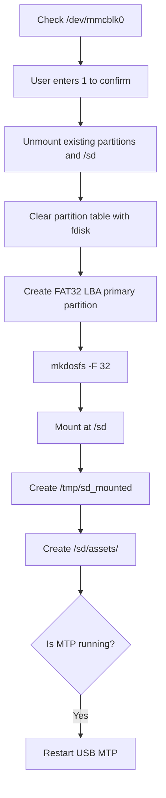
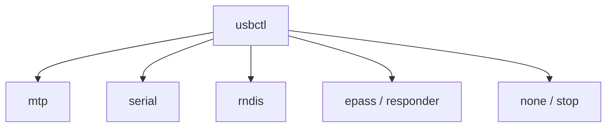
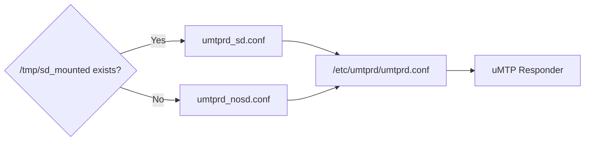
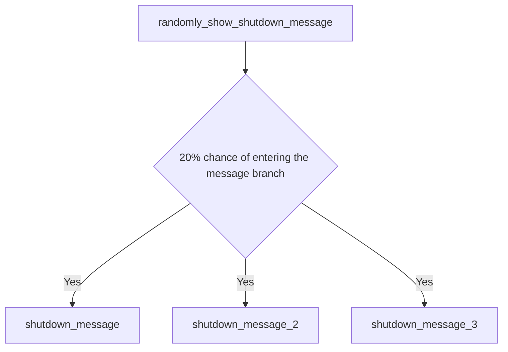

<div align="center">

# CRA Electric Pass Device Utilities

<sub>Read this in other languages: [English](README_EN.md), [中文](README.md).</sub>

</div>

> [!NOTE]
> The files in this directory are overlaid or installed into `/bin/` on the target device. They include POSIX / BusyBox shell scripts and ARM utilities that draw directly to the device framebuffer.

<p align="center">
  <a href="#directory-role">Directory Role</a> ·
  <a href="#boot-and-login">Boot and Login</a> ·
  <a href="#backlight-control">Backlight</a> ·
  <a href="#storage-maintenance">Storage</a> ·
  <a href="#memory-check">Memory</a> ·
  <a href="#usb-mode-control">USB</a> ·
  <a href="#shutdown-message-programs">Shutdown Messages</a>
</p>

---

## Directory Role

Target path on the device:

```text
/bin/
```

The contents of this directory fall into two categories:

<table>
<tr>
<td width="50%" valign="top">

### Shell Scripts

Based on:

```text
POSIX / BusyBox Shell
```

Primarily responsible for:

- Automatic login
- Backlight adjustment
- SD-card formatting
- Boot-partition mounting
- Memory checks
- USB Gadget mode switching

</td>
<td width="50%" valign="top">

### ARM Utilities

Draw directly to the device framebuffer.

The current utilities are:

```text
shutdown_message
shutdown_message_2
shutdown_message_3
```

</td>
</tr>
</table>

---

## Boot and Login

### `autologin`

Ultimately executes:

```sh
exec /bin/login -f root
```

Invocation flow:


The local primary console does not prompt for the root password.

> [!WARNING]
> `login -f root` implements passwordless local automatic login. This design relies on the physical-access boundary of the device and is not suitable as the default security policy for a general-purpose Linux host.

---

## Backlight Control

### `brightness_down`

### `brightness_up`

Both scripts read and write:

```text
/sys/class/backlight/backlight/brightness
```

Processing flow:


The current scripts:

- Do not read `max_brightness`
- Do not enforce a minimum value
- Do not enforce a maximum value

> [!CAUTION]
> Callers must prevent out-of-range values. If the scripts are refactored later, read `max_brightness` first and clamp the result to the valid range.

---

# Storage Maintenance

## `format_sd`

The script assumes that:

```text
/dev/mmcblk0
```

is the SD card.

### Execution Flow



Actual formatting target:

```text
/dev/mmcblk0p1
```

Filesystem:

```text
FAT32
```

### Known Issues

<table>
<tr>
<td width="50%" valign="top">

### Inconsistent README Path

The script actually creates:

```text
/sd/assets/
```

but the message in `/sd/README.txt` refers to:

```text
/assets/
```

These paths have different meanings.

</td>
<td width="50%" valign="top">

### Top-Level `return 1`

The mount-failure branch currently uses:

```sh
return 1
```

A standalone script should instead use:

```sh
exit 1
```

This issue is documented here but has not been modified.

</td>
</tr>
</table>

> [!CAUTION]
> `format_sd` deletes all data on the target card. Run it only on a CRA Electric Pass after confirming that `/dev/mmcblk0` is the physical SD card.

---

## `mount_boot`

Executes:

```sh
ubiattach -m 1
mount -t ubifs ubi1:boot /boot
```

Flow:


The script depends on the project's fixed:

- MTD index
- UBI index
- UBIFS volume name
- NAND partition layout

> [!IMPORTANT]
> After changing the NAND partitions or UBI layout, verify and update `mount_boot` accordingly.

---

## Memory Check

### `memcheck`

The script reads:

```text
/proc/meminfo
```

and uses:

```text
MemTotal
```

Decision flow:


When the value is below:

```text
46080 KiB
```

the script warns that the device may use an F1C100s with only 32 MiB of RAM instead of the expected 64 MiB F1C200s.

> [!NOTE]
> This is an empirical threshold, not a hardware-level chip-identification method. Kernel-reserved memory and other factors also affect the amount of memory visible to Linux.

---

# USB Mode Control

## `usbctl`

`usbctl` dynamically assembles a USB Gadget through Linux ConfigFS.

### Supported Commands

| Command | Function |
| :--- | :--- |
| `usbctl mtp` | Starts uMTP Responder file transfer |
| `usbctl serial` | Creates a USB ACM serial interface and starts `getty` |
| `usbctl rndis` | Creates an RNDIS network interface and runs `/sbin/ifup -a` |
| `usbctl epass` | Creates the custom FunctionFS interface and starts `usb_responder` |
| `usbctl responder` | Same as `epass` |
| `usbctl none` | Stops the daemons and removes the Gadget |
| `usbctl stop` | Same as `none` |
| `usbctl start` | Compatibility entry point equivalent to MTP |

### Gadget Mode Relationships



USB product string:

```text
Electric Pass
```

---

### MTP Configuration Selection

MTP mode checks:

```text
/tmp/sd_mounted
```

and then selects:



This switches the storage exposed through MTP according to whether the SD card is mounted.

---

# Shutdown Message Programs

`shutdown_message*` contains three image variants of the same ARM framebuffer utility.

Each program embeds a:

```text
360 × 129
RGB888
```

bitmap.

| Program | Current text |
| :--- | :--- |
| `shutdown_message` | 要走了吗，不再看看 |
| `shutdown_message_2` | 再见，祝愿未来 |
| `shutdown_message_3` | 别忘记这里 |

### Invocation

The following function in `/root/.profile`:

```text
randomly_show_shutdown_message
```

performs the random selection.



The three absolute paths are:

```text
/bin/shutdown_message
/bin/shutdown_message_2
/bin/shutdown_message_3
```

After the message branch is selected, each of the three programs has an equal probability of being executed.

---

## Utility Risk Overview

| Utility | Risk level | Main risk |
| :--- | :---: | :--- |
| `autologin` | Medium | Passwordless local root login |
| `brightness_*` | Low | No brightness-bound checking |
| `format_sd` | **High** | Erases `/dev/mmcblk0` |
| `mount_boot` | Medium | Coupled to a fixed MTD / UBI layout |
| `memcheck` | Low | Empirical threshold may produce false positives |
| `usbctl` | Medium | Dynamically changes USB Gadget state |
| `shutdown_message*` | Low | Framebuffer helper display |

> [!CAUTION]
> `format_sd` is the most destructive script in this directory. Before porting, debugging, or extending it, confirm the block-device mapping.

---

<div align="center">

<sub><b>CRA Electric Pass</b> · Device utility programs installed under <code>/bin/</code></sub>

</div>
