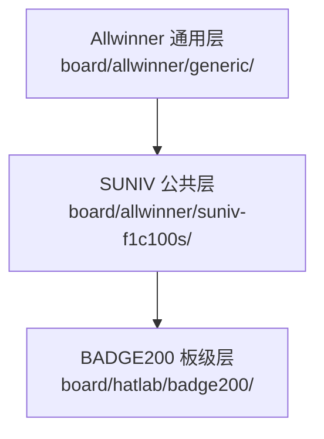
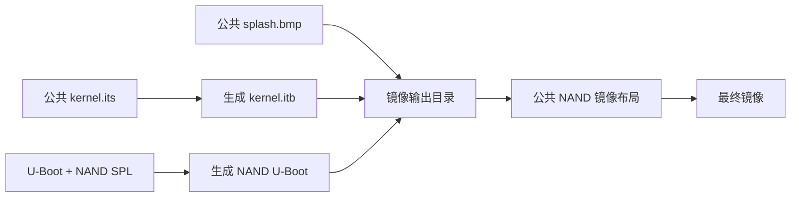

<div align="center">

# HatLab 板级支持

<sub>Read this in other languages: [English](README_EN.md), [中文](README.md).</sub>

</div>

> [!NOTE]
> `board/hatlab/` 保存 **HatLab BADGE200** 在 Buildroot 中使用的板级支持文件，覆盖 Buildroot 配置、Linux、U-Boot、设备树、rootfs、镜像脚本及配套工具。

<p align="center">
  <a href="#目录结构">目录结构</a> ·
  <a href="#支持状态">支持状态</a> ·
  <a href="#buildroot-配置">Buildroot 配置</a> ·
  <a href="#u-boot-与启动镜像">U-Boot 与镜像</a> ·
  <a href="#linux-配置与设备树">Linux 与设备树</a> ·
  <a href="#rootfs-覆盖层">Rootfs</a> ·
  <a href="#helper-与-mcu">Helper / MCU</a> ·
  <a href="#配置关系">配置关系</a>
</p>

---

## 目录结构

<table>
<tr>
<td width="25%" valign="top">

### 构建配置

`hatlab_badge200_defconfig`、`linux.defconfig`、`uboot.defconfig`

</td>
<td width="25%" valign="top">

### 系统描述

`devicetree/` 与 `rootfs/`，负责硬件描述和目标根文件系统覆盖。

</td>
<td width="25%" valign="top">

### 镜像与工具

`scripts/`、`helper/`，用于镜像后处理、vendor 分区制作与下载。

</td>
<td width="25%" valign="top">

### 独立组件

`mcu/` 保存 AVR 示例工程，`driver/` 保存 Windows RNDIS 驱动归档。

</td>
</tr>
</table>

```text
hatlab/
└── badge200/
    ├── hatlab_badge200_defconfig  Buildroot 板级配置
    ├── linux.defconfig            Linux 内核配置
    ├── uboot.defconfig            U-Boot 配置
    ├── devicetree/                Linux 与 U-Boot 设备树
    ├── rootfs/                    BADGE200 根文件系统覆盖层
    ├── scripts/                   固件镜像后处理脚本
    ├── helper/                    vendor 分区制作与下载脚本
    ├── mcu/                       独立的 ATmega328P 示例固件
    └── driver/                    Windows RNDIS 驱动归档
```

---

## 支持状态

`badge200/` 提供较完整的 BADGE200 构建链路，包括 Buildroot 配置、Linux、U-Boot、设备树、rootfs 与镜像生成脚本。

### Buildroot 入口

```text
configs/hatlab_badge200_defconfig
```

### 构建

```sh
make hatlab_badge200_defconfig
make
```

> [!WARNING]
> Windows 检出可能把 `configs/hatlab_badge200_defconfig` 的 Git 符号链接还原为普通文本文件。遇到这种情况时，应在 Linux 或 WSL 中恢复符号链接后再构建。

---

## Buildroot 配置

`badge200/hatlab_badge200_defconfig` 是 BADGE200 的总装配入口。

### 主要配置

| 类别 | 配置 |
| :--- | :--- |
| 架构与工具链 | ARMv5、Buildroot 内部 glibc 工具链 |
| U-Boot | `2020.07`、SPL、SPI flash、SPI-NAND、USB 下载、DFU |
| Linux | `5.4.100`、SUNIV F1C100S/F1C200S 公共补丁 |
| 文件系统 | ext4、JFFS2、SquashFS |
| Rootfs | BADGE200 专用覆盖层 |
| 设备与服务 | framebuffer、触摸、音频、摄像头、蓝牙、D-Bus、Python 3、调试工具 |
| 镜像生成 | `scripts/genimage.sh` 生成 NAND 镜像 |

### 配置层级



---

## U-Boot 与启动镜像

<table>
<tr>
<td width="50%" valign="top">

### `uboot.defconfig`

- SUNIV/F1C100S 架构与 SPL
- 408 MHz 系统时钟
- 168 MHz DRAM
- UART、SPI、SPI-NOR、SPI-NAND、MMC
- USB OTG、Mass Storage、DFU
- 480×272 LCD 时序
- `board/allwinner/generic/uboot.env`

</td>
<td width="50%" valign="top">

### `scripts/genimage.sh`

镜像后处理入口，负责 FIT、启动图、NAND U-Boot 与最终 NAND 镜像生成。

**启动图：** `board/allwinner/generic/splash.bmp`

</td>
</tr>
</table>

### 镜像生成流程



---

## Linux 配置与设备树

### `linux.defconfig`

BADGE200 的 Linux 内核配置文件，覆盖驱动、文件系统、网络、蓝牙、媒体、调试及 SoC 外设支持。

> [!IMPORTANT]
> 修改 `linux.defconfig` 后应执行实际内核构建，文本检查无法覆盖 Kconfig 依赖和驱动编译结果。

### `devicetree/linux/devicetree.dts`

| 类别 | 硬件 / 配置 |
| :--- | :--- |
| SoC | F1C200S/F1C100S 兼容 SoC |
| 存储 | SPI-NAND；`u-boot`、`kernel`、`rom`、`vendor`、`overlay` 分区 |
| 显示与音频 | RGB LCD、显示引擎、音频 codec |
| 基础接口 | UART、MMC、USB OTG |
| GPIO | AW9523B GPIO 扩展器 |
| 电源 | AXP199、电池与电源检测 |
| RTC | PCF8563 |
| 触摸 | Goodix GT911 |
| 摄像头 | OV2640、CSI |
| 按键 | LRADC 三个按键 |
| 蓝牙 | UART 连接 Broadcom 蓝牙控制器 |

### `devicetree/uboot/suniv-f1c100s-generic.dts`

U-Boot 设备树保留启动阶段需要的基础节点：串口、SPI flash、MMC 与 USB。

> [!NOTE]
> Linux 运行时设备树包含更完整的板级硬件描述；U-Boot DTS 仅覆盖启动阶段需要的节点。

---

## Rootfs 覆盖层

`rootfs/` 在 Buildroot 构建时复制到目标根文件系统。

| 路径 | 用途 |
| :--- | :--- |
| `etc/init.d/S30rndis` | 加载 `g_ether`，启动 USB RNDIS 网络 |
| `etc/init.d/S50dropbear` | 启动 Dropbear SSH 服务 |
| `etc/init.d/S90btbcm` | 加载蓝牙 HCI UART 驱动 |
| `etc/init.d/S99application` | 挂载 JFFS2 vendor 分区并运行应用启动脚本 |
| `etc/network/interfaces` | 配置目标网络接口 |
| `etc/dnsmasq.conf` | 配置 USB 网络侧 DHCP |
| `usr/lib/python3.8/site-packages/pyclui/` | 彩色命令行日志辅助模块 |
| `usr/lib/python3.8/site-packages/bthci/` | 蓝牙 HCI 操作辅助模块 |

> [!WARNING]
> `pyclui/` 与 `bthci/` 由板级覆盖层直接安装，不经过 Buildroot 标准 Python 包机制。升级 Python、BlueZ、PyBlueZ、Scapy 或 D-Bus 时需要重新验证兼容性。

---

## Helper 与 MCU

<table>
<tr>
<td width="50%" valign="top">

### `helper/`

- `mkvendor.sh`：将指定目录制作成固定参数的 JFFS2 `vendor.img`
- `dfu-nand-vendor.sh`：等待 DFU 设备并将镜像写入 `vendor` DFU alternate setting

> [!CAUTION]
> 脚本会生成或写入设备分区。执行前核对目标板、分区布局和镜像文件。

</td>
<td width="50%" valign="top">

### `mcu/`

独立的 AVR 示例工程：

- MCU：ATmega328P
- 时钟：16 MHz
- `main.c`：周期性翻转 PB0
- 工具链：`avr-gcc`、`avr-objcopy`、`avrdude`

该工程不由 BADGE200 的 Buildroot 构建命令自动编译。

</td>
</tr>
</table>

---

## 二进制文件

### `driver/windows-rndis-driver.zip`

预打包的 Windows RNDIS 驱动归档。

| 维护项 | 建议记录内容 |
| :--- | :--- |
| 来源 | 驱动原始来源 |
| 版本 | 发布版本或日期 |
| 完整性 | 文件哈希 |
| 兼容性 | 适用 Windows 版本 |

---

## 配置关系

### 本目录可提供的参考

<table>
<tr>
<td width="33%" valign="top">

**BADGE200 构建目标**

保留原仓库中的 BADGE200 Buildroot 构建支持。

</td>
<td width="33%" valign="top">

**F1C200S 配置参考**

包含外设、蓝牙、电源管理、摄像头等板级配置。

</td>
<td width="33%" valign="top">

**历史工具与镜像**

保存旧板级镜像流程、辅助脚本和配套资源。

</td>
</tr>
</table>

> [!IMPORTANT]
> CRA 配置修改为 `board/cra/epass/` 或对应应用目录。

```text
board/cra/epass/
```

---

<div align="center">

<sub><b>board/hatlab/</b> · board support for HatLab BADGE200 in Buildroot</sub>

</div>
