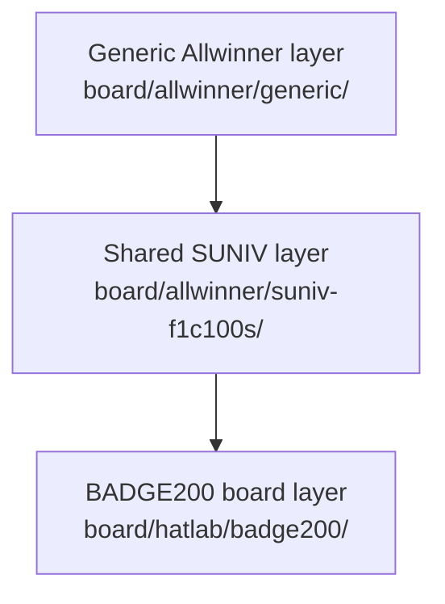
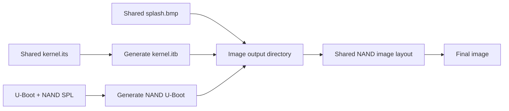

<div align="center">

# HatLab Board Support

<sub>Read this in other languages: [English](README_EN.md), [中文](README.md).</sub>

</div>

> [!NOTE]
> `board/hatlab/` contains the Buildroot board-support files for **HatLab BADGE200**, including the Buildroot configuration, Linux, U-Boot, device trees, rootfs overlay, image scripts, and supporting tools.

<p align="center">
  <a href="#directory-structure">Directory Structure</a> ·
  <a href="#support-status">Support Status</a> ·
  <a href="#buildroot-configuration">Buildroot Configuration</a> ·
  <a href="#u-boot-and-boot-images">U-Boot and Images</a> ·
  <a href="#linux-configuration-and-device-trees">Linux and Device Trees</a> ·
  <a href="#rootfs-overlay">Rootfs</a> ·
  <a href="#helper-and-mcu">Helper / MCU</a> ·
  <a href="#configuration-relationship">Configuration Relationship</a>
</p>

---

## Directory Structure

<table>
<tr>
<td width="25%" valign="top">

### Build Configurations

`hatlab_badge200_defconfig`, `linux.defconfig`, and `uboot.defconfig`

</td>
<td width="25%" valign="top">

### System Description

`devicetree/` and `rootfs/`, which describe the hardware and provide the target root filesystem overlay.

</td>
<td width="25%" valign="top">

### Images and Tools

`scripts/` and `helper/`, used for image post-processing, vendor partition creation, and image download.

</td>
<td width="25%" valign="top">

### Standalone Components

`mcu/` contains an AVR example project, while `driver/` contains a Windows RNDIS driver archive.

</td>
</tr>
</table>

```text
hatlab/
└── badge200/
    ├── hatlab_badge200_defconfig  Buildroot board configuration
    ├── linux.defconfig            Linux kernel configuration
    ├── uboot.defconfig            U-Boot configuration
    ├── devicetree/                Linux and U-Boot device trees
    ├── rootfs/                    BADGE200 root filesystem overlay
    ├── scripts/                   Firmware image post-processing scripts
    ├── helper/                    Vendor partition creation and download scripts
    ├── mcu/                       Standalone ATmega328P example firmware
    └── driver/                    Windows RNDIS driver archive
```

---

## Support Status

`badge200/` provides a relatively complete BADGE200 build flow, including Buildroot, Linux, U-Boot, device-tree, rootfs, and image-generation support.

### Buildroot Entry Point

```text
configs/hatlab_badge200_defconfig
```

### Build

```sh
make hatlab_badge200_defconfig
make
```

> [!WARNING]
> A Windows checkout may restore the Git symbolic link at `configs/hatlab_badge200_defconfig` as a regular text file. If this occurs, restore the symbolic link under Linux or WSL before building.

---

## Buildroot Configuration

`badge200/hatlab_badge200_defconfig` is the main assembly point for the BADGE200 build.

### Main Configuration

| Category | Configuration |
| :--- | :--- |
| Architecture and toolchain | ARMv5 with a Buildroot-internal glibc toolchain |
| U-Boot | `2020.07`, SPL, SPI flash, SPI-NAND, USB download, and DFU |
| Linux | `5.4.100` with shared SUNIV F1C100S/F1C200S patches |
| Filesystems | ext4, JFFS2, and SquashFS |
| Rootfs | BADGE200-specific overlay |
| Devices and services | Framebuffer, touch input, audio, camera, Bluetooth, D-Bus, Python 3, and debugging tools |
| Image generation | `scripts/genimage.sh` generates the NAND image |

### Configuration Layers



---

## U-Boot and Boot Images

<table>
<tr>
<td width="50%" valign="top">

### `uboot.defconfig`

- SUNIV/F1C100S architecture and SPL
- 408 MHz system clock
- 168 MHz DRAM
- UART, SPI, SPI-NOR, SPI-NAND, and MMC
- USB OTG, Mass Storage, and DFU
- 480×272 LCD timings
- `board/allwinner/generic/uboot.env`

</td>
<td width="50%" valign="top">

### `scripts/genimage.sh`

The image post-processing entry point. It generates the FIT image, boot splash, NAND-compatible U-Boot image, and final NAND image.

**Boot splash:** `board/allwinner/generic/splash.bmp`

</td>
</tr>
</table>

### Image-Generation Flow



---

## Linux Configuration and Device Trees

### `linux.defconfig`

The BADGE200 Linux kernel configuration, covering drivers, filesystems, networking, Bluetooth, media, debugging, and SoC peripheral support.

> [!IMPORTANT]
> After modifying `linux.defconfig`, perform an actual kernel build. Text-based checks cannot validate Kconfig dependencies or driver compilation.

### `devicetree/linux/devicetree.dts`

| Category | Hardware / Configuration |
| :--- | :--- |
| SoC | F1C200S/F1C100S-compatible SoC |
| Storage | SPI-NAND with `u-boot`, `kernel`, `rom`, `vendor`, and `overlay` partitions |
| Display and audio | RGB LCD, display engine, and audio codec |
| Basic interfaces | UART, MMC, and USB OTG |
| GPIO | AW9523B GPIO expander |
| Power | AXP199, battery monitoring, and power detection |
| RTC | PCF8563 |
| Touch input | Goodix GT911 |
| Camera | OV2640 and CSI |
| Buttons | Three LRADC buttons |
| Bluetooth | Broadcom Bluetooth controller connected over UART |

### `devicetree/uboot/suniv-f1c100s-generic.dts`

The U-Boot device tree retains the basic nodes required during early boot: UART, SPI flash, MMC, and USB.

> [!NOTE]
> The Linux runtime device tree contains a more complete description of the board hardware. The U-Boot DTS covers only the nodes required during the boot stage.

---

## Rootfs Overlay

`rootfs/` is copied into the target root filesystem during the Buildroot build.

| Path | Purpose |
| :--- | :--- |
| `etc/init.d/S30rndis` | Loads `g_ether` and starts USB RNDIS networking |
| `etc/init.d/S50dropbear` | Starts the Dropbear SSH service |
| `etc/init.d/S90btbcm` | Loads the Bluetooth HCI UART driver |
| `etc/init.d/S99application` | Mounts the JFFS2 vendor partition and runs the application startup script |
| `etc/network/interfaces` | Configures target network interfaces |
| `etc/dnsmasq.conf` | Configures DHCP for the USB network interface |
| `usr/lib/python3.8/site-packages/pyclui/` | Helper module for colored command-line logging |
| `usr/lib/python3.8/site-packages/bthci/` | Helper module for Bluetooth HCI operations |

> [!WARNING]
> `pyclui/` and `bthci/` are installed directly by the board-level overlay rather than through Buildroot's standard Python package mechanism. Revalidate compatibility when upgrading Python, BlueZ, PyBlueZ, Scapy, or D-Bus.

---

## Helper and MCU

<table>
<tr>
<td width="50%" valign="top">

### `helper/`

- `mkvendor.sh`: creates a JFFS2 `vendor.img` with fixed parameters from a specified directory
- `dfu-nand-vendor.sh`: waits for a DFU device and writes the image to the `vendor` DFU alternate setting

> [!CAUTION]
> These scripts generate images or write to device partitions. Verify the target board, partition layout, and image file before running them.

</td>
<td width="50%" valign="top">

### `mcu/`

A standalone AVR example project:

- MCU: ATmega328P
- Clock: 16 MHz
- `main.c`: periodically toggles PB0
- Toolchain: `avr-gcc`, `avr-objcopy`, and `avrdude`

This project is not built automatically by the BADGE200 Buildroot commands.

</td>
</tr>
</table>

---

## Binary Files

### `driver/windows-rndis-driver.zip`

A prepackaged Windows RNDIS driver archive.

| Maintenance item | Recommended record |
| :--- | :--- |
| Source | Original source of the driver |
| Version | Release version or date |
| Integrity | File hash |
| Compatibility | Supported Windows versions |

---

## Configuration Relationship

### References Provided by This Directory

<table>
<tr>
<td width="33%" valign="top">

**BADGE200 Build Target**

Preserves BADGE200 Buildroot build support from the original repository.

</td>
<td width="33%" valign="top">

**F1C200S Configuration Reference**

Includes board-level configurations for peripherals, Bluetooth, power management, and the camera.

</td>
<td width="33%" valign="top">

**Legacy Tools and Images**

Preserves the earlier board image flow, helper scripts, and related resources.

</td>
</tr>
</table>

> [!IMPORTANT]
> CRA-specific configuration changes should be made under `board/cra/epass/` or the corresponding application directory.

```text
board/cra/epass/
```

---

<div align="center">

<sub><b>board/hatlab/</b> · board support for HatLab BADGE200 in Buildroot</sub>

</div>
