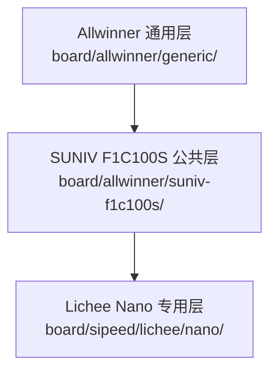
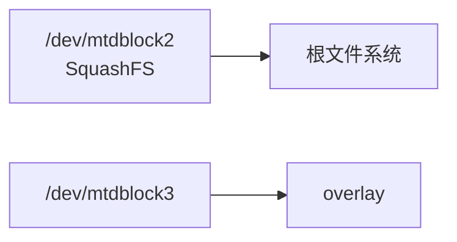

<div align="center">

# Sipeed 板级支持

<sub>Read this in other languages: [English](README_EN.md), [中文](README.md).</sub>

</div>

> [!NOTE]
> 本目录保存 Sipeed Lichee 系列开发板的 Buildroot 板级文件，目录入口为 `board/sipeed/`。

<p align="center">
  <a href="#目录结构">目录结构</a> ·
  <a href="#支持状态">支持状态</a> ·
  <a href="#lichee-nano">Lichee Nano</a> ·
  <a href="#lichee-zero">Lichee Zero</a>
</p>

---

## 目录结构

<table>
<tr>
<td width="50%" valign="top">

### Lichee Nano

SUNIV F1C100S/F1C200S 平台。

包含 Buildroot 配置、U-Boot 配置、Linux/U-Boot 设备树和专用 rootfs 覆盖层。

</td>
<td width="50%" valign="top">

### Lichee Zero

Allwinner V3s/S3 平台。

当前仅保留板级 defconfig。

</td>
</tr>
</table>

```text
sipeed/
└── lichee/
    ├── nano/
    │   ├── sipeed_lichee_nano_defconfig
    │   ├── uboot.defconfig
    │   ├── devicetree/
    │   │   ├── linux/devicetree.dts
    │   │   └── uboot/suniv-f1c100s-generic.dts
    │   └── rootfs/
    │       └── etc/
    └── zero/
        └── sipeed_lichee_zero_defconfig
```

---

## 支持状态

| 目标 | SoC / 架构 | 当前状态 |
| :--- | :--- | :--- |
| **Lichee Nano** | SUNIV F1C100S/F1C200S · ARMv5 | 配置、U-Boot、设备树和 MTP 覆盖层基本齐全 |
| **Lichee Zero** | V3s/S3 · Cortex-A7 hard-float | 仅保留板级 defconfig，多个引用文件缺失，当前不可直接构建 |

---

# Lichee Nano

## Buildroot 配置

<table>
<tr>
<td width="50%" valign="top">

### 板级配置

```text
board/sipeed/lichee/nano/
sipeed_lichee_nano_defconfig
```

</td>
<td width="50%" valign="top">

### Buildroot 入口

```text
configs/
sipeed_lichee_nano_defconfig
```

</td>
</tr>
</table>

在保留符号链接的 Linux 检出中：

```sh
make sipeed_lichee_nano_defconfig
make
```

### 配置组成



### 主要配置

| 类别 | 配置 |
| :--- | :--- |
| 架构 | ARMv5 |
| 工具链 | Buildroot 内部 glibc 工具链 |
| U-Boot | `2020.07` · SUNIV SPL |
| Linux | `5.4.92` |
| 文件系统 | CPIO · ext4 · SquashFS |
| 用户空间 | uMTP Responder · 触摸 · framebuffer 测试 · 音频组件 |
| Rootfs | Allwinner 通用层 + SUNIV 公共层 + Nano 专用覆盖层 |

---

## U-Boot

`uboot.defconfig` 包含：

| 项目 | 配置 |
| :--- | :--- |
| 平台 | SUNIV / F1C100S |
| 启动 | SPL · SPI |
| 系统时钟 | 408 MHz |
| DRAM 时钟 | 168 MHz |
| LCD | 480×272 |
| 存储 | SPI-NOR · SPI-NAND · MMC |
| USB | Mass Storage · DFU |
| 默认环境 | `board/allwinner/generic/uboot.env` |

Nano 构建使用公共镜像脚本，启动图来自：

```text
board/allwinner/generic/splash.bmp
```

---

## Linux 设备树

`lichee/nano/devicetree/linux/devicetree.dts` 描述当前 Nano 目标的主要硬件。

| 类别 | 内容 |
| :--- | :--- |
| SoC | F1C100S |
| SPI-NOR | `u-boot` · `kernel` · `rom` · `overlay` 分区 |
| SPI-NAND | 一组默认禁用的分区布局 |
| 基础外设 | UART · MMC · USB OTG |
| 显示 / 多媒体 | 显示引擎 · RGB LCD · TV encoder · 音频 codec |
| 触摸 | TSC2007 电阻触摸控制器 |

### 默认根文件系统



内核默认从 `/dev/mtdblock2` 的 SquashFS 启动，并将 `/dev/mtdblock3` 用作 overlay。

---

## U-Boot 设备树

`lichee/nano/devicetree/uboot/suniv-f1c100s-generic.dts` 保留启动阶段需要的节点：

- 串口
- SPI
- MMC
- USB

> [!IMPORTANT]
> Linux 与 U-Boot 设备树服务于不同启动阶段，修改后应分别验证。

---

## Rootfs 覆盖层

Nano 专用覆盖层包含：

| 文件 | 用途 |
| :--- | :--- |
| `etc/umtprd/umtprd.conf` | 将根文件系统作为可读写 MTP 存储导出，并设置 Sipeed/Nano USB 标识 |
| `etc/init.d/S98uMTPrd` | 使用 configfs 和 FunctionFS 创建 MTP USB gadget，并启动 `umtprd` |

> [!WARNING]
> 脚本直接操作 `/sys/kernel/config/usb_gadget/`。修改 VID、PID、FunctionFS 端点或 UDC 绑定顺序后，需要在真实 Nano 硬件上验证。

---

# Lichee Zero

`lichee/zero/sipeed_lichee_zero_defconfig` 描述另一套平台配置。

| 项目 | 配置 |
| :--- | :--- |
| CPU | Cortex-A7 |
| ABI | ARM EABI hard-float |
| FPU | VFPv4-D16 |
| 公共平台层 | Allwinner V3s/S3 |
| Linux | `5.4.92` |
| 板级依赖 | Lichee Zero 专用 U-Boot 与设备树 |

> [!CAUTION]
> 不完整的，先别用。

---

<div align="center">

<sub><b>board/sipeed/</b> · Buildroot board support for Sipeed Lichee targets</sub>

</div>
