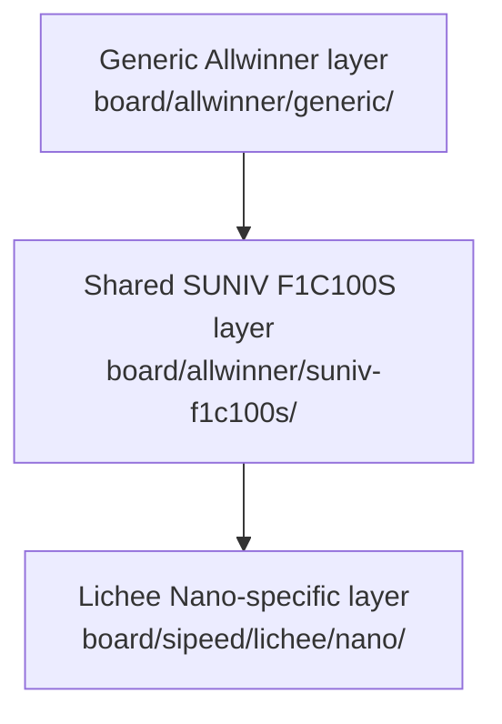
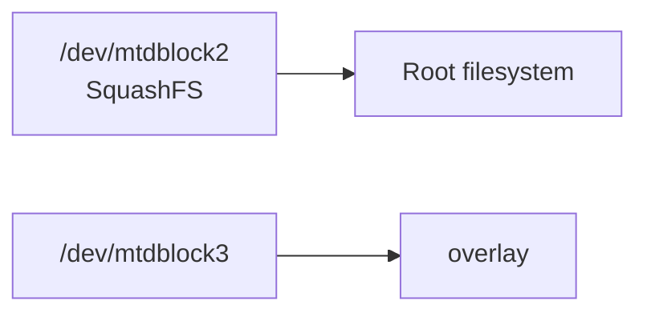

<div align="center">

# Sipeed Board Support

<sub>Read this in other languages: [English](README_EN.md), [中文](README.md).</sub>

</div>

> [!NOTE]
> This directory contains Buildroot board-support files for Sipeed Lichee development boards. Its entry point is `board/sipeed/`.

<p align="center">
  <a href="#directory-structure">Directory Structure</a> ·
  <a href="#support-status">Support Status</a> ·
  <a href="#lichee-nano">Lichee Nano</a> ·
  <a href="#lichee-zero">Lichee Zero</a>
</p>

---

## Directory Structure

<table>
<tr>
<td width="50%" valign="top">

### Lichee Nano

SUNIV F1C100S/F1C200S platform.

Includes a Buildroot configuration, U-Boot configuration, Linux and U-Boot device trees, and a dedicated rootfs overlay.

</td>
<td width="50%" valign="top">

### Lichee Zero

Allwinner V3s/S3 platform.

Only the board-level defconfig is currently retained.

</td>
</tr>
</table>

```text
sipeed/
└── lichee/
    ├── nano/
    │   ├── sipeed_lichee_nano_defconfig
    │   ├── uboot.defconfig
    │   ├── devicetree/
    │   │   ├── linux/devicetree.dts
    │   │   └── uboot/suniv-f1c100s-generic.dts
    │   └── rootfs/
    │       └── etc/
    └── zero/
        └── sipeed_lichee_zero_defconfig
```

---

## Support Status

| Target | SoC / Architecture | Current status |
| :--- | :--- | :--- |
| **Lichee Nano** | SUNIV F1C100S/F1C200S · ARMv5 | The configuration, U-Boot support, device trees, and MTP overlay are largely complete |
| **Lichee Zero** | V3s/S3 · Cortex-A7 hard-float | Only the board-level defconfig remains; several referenced files are missing, so the target cannot currently be built directly |

---

# Lichee Nano

## Buildroot Configuration

<table>
<tr>
<td width="50%" valign="top">

### Board Configuration

```text
board/sipeed/lichee/nano/
sipeed_lichee_nano_defconfig
```

</td>
<td width="50%" valign="top">

### Buildroot Entry Point

```text
configs/
sipeed_lichee_nano_defconfig
```

</td>
</tr>
</table>

In a Linux checkout that preserves symbolic links:

```sh
make sipeed_lichee_nano_defconfig
make
```

### Configuration Layers



### Main Configuration

| Category | Configuration |
| :--- | :--- |
| Architecture | ARMv5 |
| Toolchain | Buildroot-internal glibc toolchain |
| U-Boot | `2020.07` · SUNIV SPL |
| Linux | `5.4.92` |
| Filesystems | CPIO · ext4 · SquashFS |
| User space | uMTP Responder · touch input · framebuffer tests · audio components |
| Rootfs | Generic Allwinner layer + shared SUNIV layer + Nano-specific overlay |

---

## U-Boot

`uboot.defconfig` contains:

| Item | Configuration |
| :--- | :--- |
| Platform | SUNIV / F1C100S |
| Boot | SPL · SPI |
| System clock | 408 MHz |
| DRAM clock | 168 MHz |
| LCD | 480×272 |
| Storage | SPI-NOR · SPI-NAND · MMC |
| USB | Mass Storage · DFU |
| Default environment | `board/allwinner/generic/uboot.env` |

The Nano build uses the shared image script, and its boot splash comes from:

```text
board/allwinner/generic/splash.bmp
```

---

## Linux Device Tree

`lichee/nano/devicetree/linux/devicetree.dts` describes the main hardware for the current Nano target.

| Category | Contents |
| :--- | :--- |
| SoC | F1C100S |
| SPI-NOR | `u-boot`, `kernel`, `rom`, and `overlay` partitions |
| SPI-NAND | A partition layout that is disabled by default |
| Basic peripherals | UART · MMC · USB OTG |
| Display / multimedia | Display engine · RGB LCD · TV encoder · audio codec |
| Touch input | TSC2007 resistive-touch controller |

### Default Root Filesystem



By default, the kernel boots from the SquashFS filesystem on `/dev/mtdblock2` and uses `/dev/mtdblock3` as the overlay.

---

## U-Boot Device Tree

`lichee/nano/devicetree/uboot/suniv-f1c100s-generic.dts` retains the nodes required during the boot stage:

- UART
- SPI
- MMC
- USB

> [!IMPORTANT]
> The Linux and U-Boot device trees serve different boot stages and must be validated separately after modification.

---

## Rootfs Overlay

The Nano-specific overlay contains:

| File | Purpose |
| :--- | :--- |
| `etc/umtprd/umtprd.conf` | Exports the root filesystem as writable MTP storage and sets the Sipeed/Nano USB identifiers |
| `etc/init.d/S98uMTPrd` | Creates an MTP USB gadget using configfs and FunctionFS, then starts `umtprd` |

> [!WARNING]
> The script operates directly on `/sys/kernel/config/usb_gadget/`. Any change to the VID, PID, FunctionFS endpoints, or UDC binding order must be validated on actual Nano hardware.

---

# Lichee Zero

`lichee/zero/sipeed_lichee_zero_defconfig` describes a separate platform configuration.

| Item | Configuration |
| :--- | :--- |
| CPU | Cortex-A7 |
| ABI | ARM EABI hard-float |
| FPU | VFPv4-D16 |
| Shared platform layer | Allwinner V3s/S3 |
| Linux | `5.4.92` |
| Board dependencies | Lichee Zero-specific U-Boot support and device tree |

> [!CAUTION]
> This target is incomplete and should not be used yet.

---

<div align="center">

<sub><b>board/sipeed/</b> · Buildroot board support for Sipeed Lichee targets</sub>

</div>
