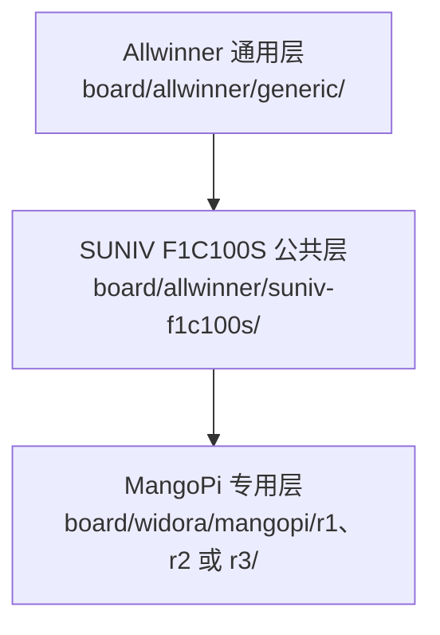
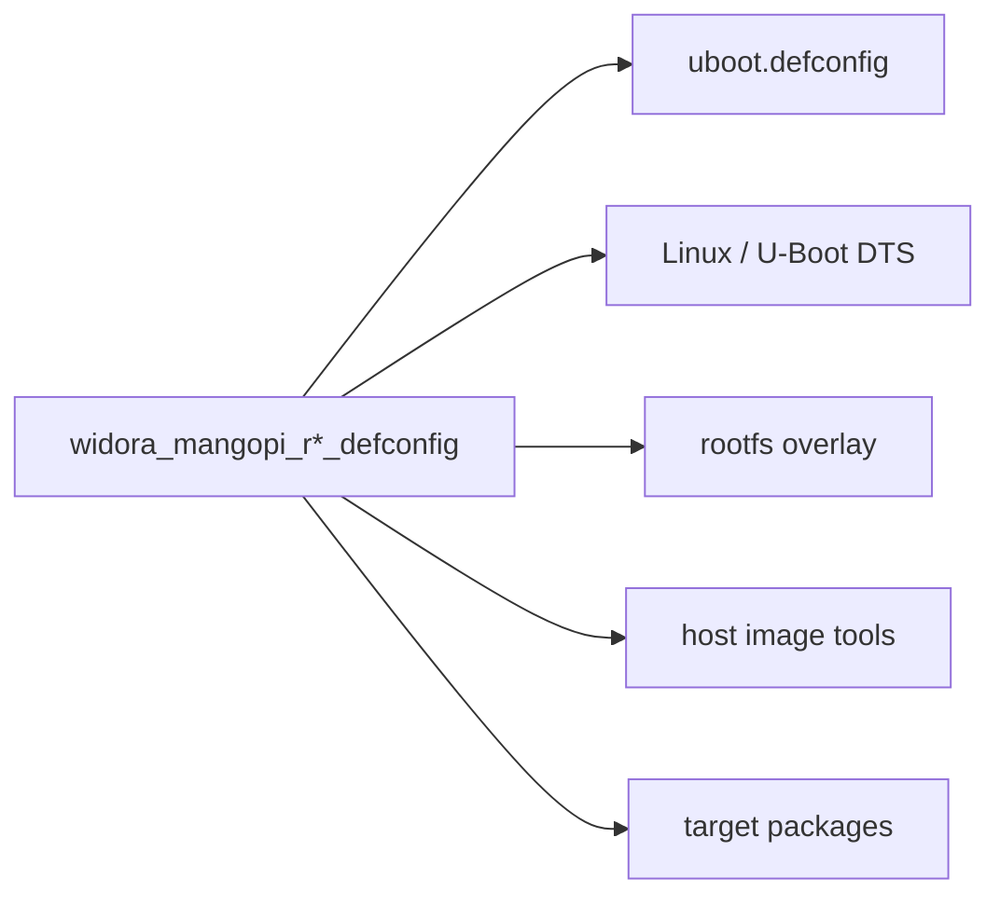
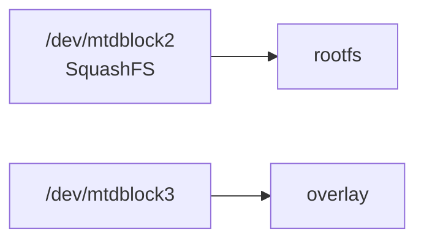

<div align="center">

# Widora MangoPi 板级支持

<sub>Read this in other languages: [English](README_EN.md), [中文](README.md).</sub>

</div>

> [!NOTE]
> 本目录保存 Widora MangoPi R1、R2 和 R3 的 Buildroot 板级支持，目录入口为 `board/widora/`。

<p align="center">
  <a href="#目录结构">目录结构</a> ·
  <a href="#构建入口">构建入口</a> ·
  <a href="#公共配置">公共配置</a> ·
  <a href="#r1r2-与-r3-差异">版本差异</a> ·
  <a href="#buildroot-defconfig">Buildroot</a> ·
  <a href="#u-boot-配置">U-Boot</a> ·
  <a href="#linux-设备树">Linux DTS</a> ·
  <a href="#rootfs-覆盖层">Rootfs</a>
</p>

---

## 目录结构

<table>
<tr>
<td width="33%" valign="top">

### MangoPi R1

- 480×272 LCD
- SPI-NOR 默认
- TSC2007 默认
- 无 CSI 摄像头节点
- 含 GT911 配置固件

</td>
<td width="33%" valign="top">

### MangoPi R2

- 480×272 LCD
- SPI-NOR 默认
- TSC2007
- OV2640 默认
- OV5640 可选

</td>
<td width="33%" valign="top">

### MangoPi R3

- 800×480 LCD
- SPI-NAND 默认
- GT911 默认
- OV2640 默认
- OV5640 可选

</td>
</tr>
</table>

```text
widora/
└── mangopi/
    ├── r1/
    │   ├── widora_mangopi_r1_defconfig
    │   ├── uboot.defconfig
    │   ├── devicetree/
    │   └── rootfs/
    ├── r2/
    │   ├── widora_mangopi_r2_defconfig
    │   ├── uboot.defconfig
    │   ├── devicetree/
    │   └── rootfs/
    └── r3/
        ├── widora_mangopi_r3_defconfig
        ├── uboot.defconfig
        ├── devicetree/
        └── rootfs/
```

三个版本均包含 Buildroot 配置、U-Boot 配置、Linux/U-Boot 设备树和 MTP rootfs 覆盖层。R1 与 R3 还提供 Goodix GT911 配置固件。

---

## 构建入口

| 目标 | Buildroot 入口 | 构建命令 |
| :--- | :--- | :--- |
| MangoPi R1 | `configs/widora_mangopi_r1_defconfig` | `make widora_mangopi_r1_defconfig` |
| MangoPi R2 | `configs/widora_mangopi_r2_defconfig` | `make widora_mangopi_r2_defconfig` |
| MangoPi R3 | `configs/widora_mangopi_r3_defconfig` | `make widora_mangopi_r3_defconfig` |

加载配置后执行：

```sh
make
```

> [!IMPORTANT]
> 切换板型前优先执行 `make distclean`，请勿在同一个输出目录上直接叠加不同板卡配置。

> [!NOTE]
> Windows 未启用符号链接支持时，`configs/widora_mangopi_r*_defconfig` 可能被检出为普通文本文件。构建前需要在 Linux 或 WSL 中恢复有效符号链接。

---

## 公共配置

R1、R2 和 R3 共用以下基础配置：

| 类别 | 配置 |
| :--- | :--- |
| 架构 | ARMv5 |
| 工具链 | Buildroot 内部 glibc 工具链 |
| U-Boot | `2020.07` · SUNIV SPL · SPI · MMC · USB · DFU |
| Linux | `5.4.99` |
| 文件系统 | CPIO · ext4 · SquashFS |
| 用户空间 | eudev · uMTP Responder · 触摸 · framebuffer 测试 · 音频 |
| 镜像 | Allwinner 公共镜像脚本 |
| Rootfs | Allwinner 通用层 + SUNIV 公共层 + 对应修订版专用层 |

### 装配层次



---

## R1、R2 与 R3 差异

| 项目 | MangoPi R1 | MangoPi R2 | MangoPi R3 |
| :--- | :---: | :---: | :---: |
| U-Boot 控制台索引 | `1` | `2` | `2` |
| LCD 模式 | 480×272 | 480×272 | 800×480 |
| 背光 GPIO | `134` | `140` | `134` |
| Linux USB 模式 | OTG | Peripheral | Peripheral |
| 默认 Flash | SPI-NOR | SPI-NOR | SPI-NAND |
| SPI-NAND | 禁用 | 禁用 | 启用 |
| 触摸 | TSC2007 | TSC2007 | GT911 |
| GT911 节点 | 禁用 | — | 启用 |
| CSI 摄像头 | 未启用 | OV2640 默认 / OV5640 可选 | OV2640 默认 / OV5640 可选 |
| 摄像头工具 | 未启用 | `libv4l` · V4L2 · `fswebcam` | `libv4l` · V4L2 · `fswebcam` |
| GT911 固件 | 有 | 无 | 有 |

> [!WARNING]
> 这些差异对应实际串口、显示、背光、存储、触摸和摄像头布线。DTS 与 U-Boot 配置应按具体修订版使用。

---

## Buildroot defconfig

每个 `widora_mangopi_r*_defconfig` 都负责选择对应板型的完整构建组合：



三个版本共用：

```text
board/allwinner/generic/scripts/genimage.sh
board/allwinner/generic/uboot.env
board/allwinner/generic/splash.bmp
```

> [!IMPORTANT]
> 修改公共启动图、公共 U-Boot 环境或公共镜像脚本时，R1、R2、R3 都可能受到影响。

---

## U-Boot 配置

各版本的 `uboot.defconfig` 主要负责：

| 类别 | 内容 |
| :--- | :--- |
| SoC | SUNIV / F1C100S |
| 启动 | SPL |
| CPU / DRAM | CPU、DRAM 与时钟参数 |
| 串口 | 控制台 UART |
| 显示 | LCD 分辨率、时序、背光 GPIO |
| 存储 | SPI-NOR · SPI-NAND · MMC |
| USB | Mass Storage · DFU |
| 环境 | 公共 U-Boot 默认环境 |

### 串口差异

| 版本 | 主要串口 |
| :--- | :--- |
| R1 | UART0 |
| R2 | UART1 |
| R3 | UART1 |

> [!WARNING]
> 修改 U-Boot 控制台后应同步检查 Linux `bootargs`，避免 U-Boot 与 Linux 日志输出到不同串口。

---

## Linux 设备树

三个 Linux DTS 均包含：

- F1C100S/F1C200S 兼容 SoC
- SPI flash 固定分区
- MMC
- USB
- 音频
- I2C
- 显示
- 触摸

### 修订版扩展

<table>
<tr>
<td width="50%" valign="top">

### R1

- SPI-NOR 默认
- TSC2007
- 未启用 CSI 摄像头节点

</td>
<td width="50%" valign="top">

### R2 / R3

- 配置 CSI
- OV2640 默认
- OV5640 可选
- R3 默认使用 SPI-NAND 与 GT911

</td>
</tr>
</table>

### 默认内核启动参数

```text
root=/dev/mtdblock2 rootfstype=squashfs overlayfsdev=/dev/mtdblock3
```



> [!CAUTION]
> 修改分区起始地址或大小时，应同步检查 U-Boot、镜像生成脚本和内核启动参数。上述参数只对应相应 MangoPi 镜像布局。

---

## Rootfs 覆盖层

每个版本都提供：

| 文件 | 用途 |
| :--- | :--- |
| `etc/umtprd/umtprd.conf` | 将 `/` 作为可读写 MTP 存储导出，并设置 Widora/MangoPi USB 标识 |
| `etc/init.d/S98uMTPrd` | 使用 configfs 与 FunctionFS 创建 MTP gadget，并启动 `umtprd` |

R1 与 R3 另外提供：

```text
rootfs/lib/firmware/goodix_911_cfg.bin
```

该文件是 GT911 触摸控制器使用的二进制配置。

> [!WARNING]
> 更新 `goodix_911_cfg.bin` 时应记录来源、适用面板与校验值，请勿进行文本替换或行尾转换。

---

<div align="center">

<sub><b>board/widora/</b> · Buildroot board support for Widora MangoPi R1 / R2 / R3</sub>

</div>
