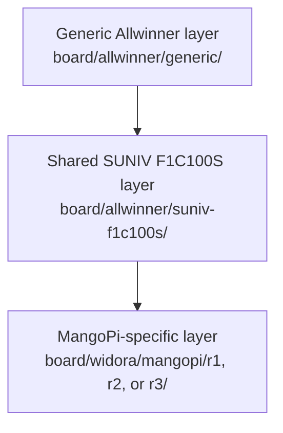
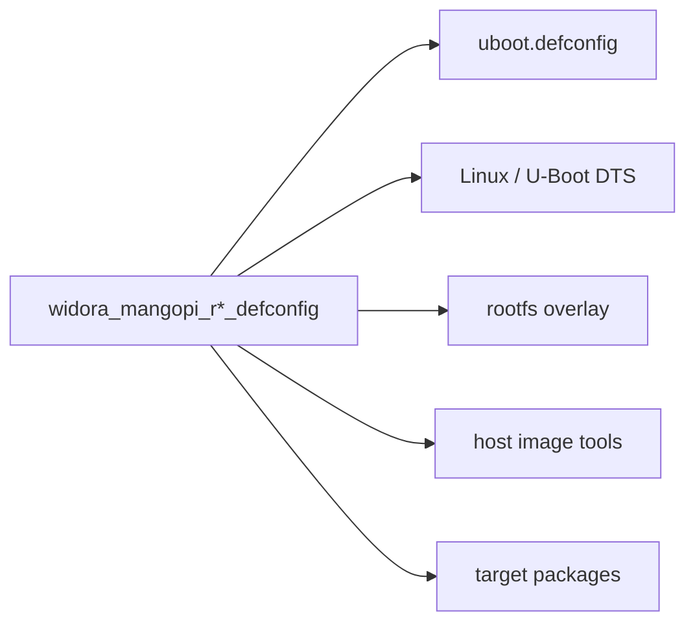
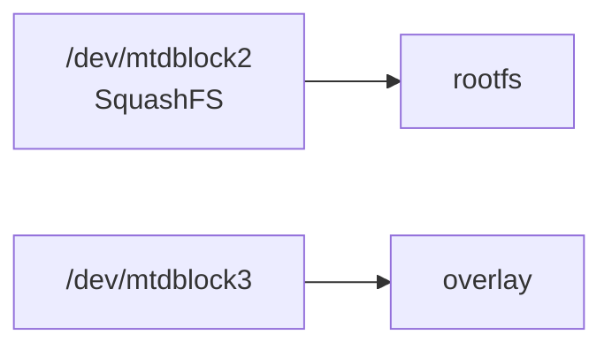

<div align="center">

# Widora MangoPi Board Support

<sub>Read this in other languages: [English](README_EN.md), [中文](README.md).</sub>

</div>

> [!NOTE]
> This directory contains Buildroot board support for the Widora MangoPi R1, R2, and R3. Its entry point is `board/widora/`.

<p align="center">
  <a href="#directory-structure">Directory Structure</a> ·
  <a href="#build-entry-points">Build Entry Points</a> ·
  <a href="#shared-configuration">Shared Configuration</a> ·
  <a href="#differences-between-r1-r2-and-r3">Revision Differences</a> ·
  <a href="#buildroot-defconfig">Buildroot</a> ·
  <a href="#u-boot-configuration">U-Boot</a> ·
  <a href="#linux-device-trees">Linux DTS</a> ·
  <a href="#rootfs-overlays">Rootfs</a>
</p>

---

## Directory Structure

<table>
<tr>
<td width="33%" valign="top">

### MangoPi R1

- 480×272 LCD
- SPI-NOR by default
- TSC2007 by default
- No CSI camera node
- Includes GT911 configuration firmware

</td>
<td width="33%" valign="top">

### MangoPi R2

- 480×272 LCD
- SPI-NOR by default
- TSC2007
- OV2640 by default
- Optional OV5640

</td>
<td width="33%" valign="top">

### MangoPi R3

- 800×480 LCD
- SPI-NAND by default
- GT911 by default
- OV2640 by default
- Optional OV5640

</td>
</tr>
</table>

```text
widora/
└── mangopi/
    ├── r1/
    │   ├── widora_mangopi_r1_defconfig
    │   ├── uboot.defconfig
    │   ├── devicetree/
    │   └── rootfs/
    ├── r2/
    │   ├── widora_mangopi_r2_defconfig
    │   ├── uboot.defconfig
    │   ├── devicetree/
    │   └── rootfs/
    └── r3/
        ├── widora_mangopi_r3_defconfig
        ├── uboot.defconfig
        ├── devicetree/
        └── rootfs/
```

All three revisions include Buildroot and U-Boot configurations, Linux and U-Boot device trees, and an MTP rootfs overlay. R1 and R3 also provide Goodix GT911 configuration firmware.

---

## Build Entry Points

| Target | Buildroot entry point | Build command |
| :--- | :--- | :--- |
| MangoPi R1 | `configs/widora_mangopi_r1_defconfig` | `make widora_mangopi_r1_defconfig` |
| MangoPi R2 | `configs/widora_mangopi_r2_defconfig` | `make widora_mangopi_r2_defconfig` |
| MangoPi R3 | `configs/widora_mangopi_r3_defconfig` | `make widora_mangopi_r3_defconfig` |

After loading the configuration, run:

```sh
make
```

> [!IMPORTANT]
> Run `make distclean` before switching board revisions. Do not reuse the same output directory for different board configurations without cleaning it first.

> [!NOTE]
> If symbolic-link support is disabled on Windows, `configs/widora_mangopi_r*_defconfig` may be checked out as regular text files. Restore the symbolic links under Linux or WSL before building.

---

## Shared Configuration

R1, R2, and R3 share the following base configuration:

| Category | Configuration |
| :--- | :--- |
| Architecture | ARMv5 |
| Toolchain | Buildroot-internal glibc toolchain |
| U-Boot | `2020.07` · SUNIV SPL · SPI · MMC · USB · DFU |
| Linux | `5.4.99` |
| Filesystems | CPIO · ext4 · SquashFS |
| User space | eudev · uMTP Responder · touch input · framebuffer tests · audio |
| Images | Shared Allwinner image scripts |
| Rootfs | Generic Allwinner layer + shared SUNIV layer + revision-specific layer |

### Assembly Layers



---

## Differences Between R1, R2, and R3

| Item | MangoPi R1 | MangoPi R2 | MangoPi R3 |
| :--- | :---: | :---: | :---: |
| U-Boot console index | `1` | `2` | `2` |
| LCD mode | 480×272 | 480×272 | 800×480 |
| Backlight GPIO | `134` | `140` | `134` |
| Linux USB mode | OTG | Peripheral | Peripheral |
| Default flash | SPI-NOR | SPI-NOR | SPI-NAND |
| SPI-NAND | Disabled | Disabled | Enabled |
| Touch input | TSC2007 | TSC2007 | GT911 |
| GT911 node | Disabled | — | Enabled |
| CSI camera | Not enabled | OV2640 by default / optional OV5640 | OV2640 by default / optional OV5640 |
| Camera tools | Not enabled | `libv4l` · V4L2 · `fswebcam` | `libv4l` · V4L2 · `fswebcam` |
| GT911 firmware | Included | Not included | Included |

> [!WARNING]
> These differences reflect the actual UART, display, backlight, storage, touch, and camera wiring. Use the DTS and U-Boot configuration that match the specific board revision.

---

## Buildroot Defconfig

Each `widora_mangopi_r*_defconfig` selects the complete build composition for its corresponding board revision:



All three revisions share:

```text
board/allwinner/generic/scripts/genimage.sh
board/allwinner/generic/uboot.env
board/allwinner/generic/splash.bmp
```

> [!IMPORTANT]
> Changes to the shared boot splash, shared U-Boot environment, or shared image scripts may affect R1, R2, and R3.

---

## U-Boot Configuration

The `uboot.defconfig` for each revision primarily configures:

| Category | Contents |
| :--- | :--- |
| SoC | SUNIV / F1C100S |
| Boot | SPL |
| CPU / DRAM | CPU, DRAM, and clock parameters |
| UART | Console UART |
| Display | LCD resolution, timings, and backlight GPIO |
| Storage | SPI-NOR · SPI-NAND · MMC |
| USB | Mass Storage · DFU |
| Environment | Shared default U-Boot environment |

### UART Differences

| Revision | Primary UART |
| :--- | :--- |
| R1 | UART0 |
| R2 | UART1 |
| R3 | UART1 |

> [!WARNING]
> After changing the U-Boot console, update and verify the Linux `bootargs` as well to prevent U-Boot and Linux logs from being sent to different UARTs.

---

## Linux Device Trees

All three Linux DTS files include:

- F1C100S/F1C200S-compatible SoC support
- Fixed SPI flash partitions
- MMC
- USB
- Audio
- I2C
- Display
- Touch input

### Revision-Specific Extensions

<table>
<tr>
<td width="50%" valign="top">

### R1

- SPI-NOR by default
- TSC2007
- No enabled CSI camera node

</td>
<td width="50%" valign="top">

### R2 / R3

- CSI configured
- OV2640 by default
- Optional OV5640
- R3 uses SPI-NAND and GT911 by default

</td>
</tr>
</table>

### Default Kernel Command Line

```text
root=/dev/mtdblock2 rootfstype=squashfs overlayfsdev=/dev/mtdblock3
```



> [!CAUTION]
> When changing partition start addresses or sizes, also verify U-Boot, the image-generation scripts, and the kernel command line. The parameters above apply only to the corresponding MangoPi image layout.

---

## Rootfs Overlays

Each revision provides:

| File | Purpose |
| :--- | :--- |
| `etc/umtprd/umtprd.conf` | Exports `/` as writable MTP storage and sets the Widora/MangoPi USB identifiers |
| `etc/init.d/S98uMTPrd` | Creates an MTP gadget with configfs and FunctionFS, then starts `umtprd` |

R1 and R3 additionally provide:

```text
rootfs/lib/firmware/goodix_911_cfg.bin
```

This is the binary configuration used by the GT911 touch controller.

> [!WARNING]
> When updating `goodix_911_cfg.bin`, record its source, compatible panel, and checksum. Do not perform text replacement or line-ending conversion on this file.

---

<div align="center">

<sub><b>board/widora/</b> · Buildroot board support for Widora MangoPi R1 / R2 / R3</sub>

</div>
