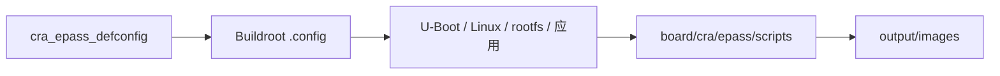

<div align="center">

# CRA Electric Pass Buildroot SDK

<sub>面向 Allwinner F1C100S / F1C200S 的完整固件构建环境</sub>

</div>

**Read this in other languages:** [English](README_EN.md) · [中文](README.md)

> [!NOTE]
> 本仓库基于 aodzip 的 [`buildroot-tiny200`](https://github.com/aodzip/buildroot-tiny200) 继续开发，使用 UBIFS 根文件系统，并在 U-Boot 层接入 Device Tree Overlay 与相关硬件解码修补。
>
> 一次完整构建可生成 **Linux Kernel、U-Boot、rootfs 与 `epass_drm_app`**。CRA 项目文件集中位于 `board/cra/epass/`。

<p align="center">
  <a href="#项目组成">项目组成</a> ·
  <a href="#构建环境">构建环境</a> ·
  <a href="#构建固件">构建固件</a> ·
  <a href="#增量重建">增量重建</a> ·
  <a href="#烧录固件">烧录固件</a> ·
  <a href="#docker-构建环境">Docker</a> ·
  <a href="#来源与历史目标">来源说明</a>
</p>

---

## 项目组成

| 组成 | 主要内容 |
| :--- | :--- |
| Linux Kernel | 内核、设备树及 CRA / Allwinner 补丁 |
| U-Boot | SPL、引导程序、默认环境与启动设备树 |
| rootfs | Buildroot 用户空间与 `board/cra/epass/rootfs/` Overlay |
| `epass_drm_app` | CRA Electric Pass 主界面应用 |
| 镜像后处理 | SPI-NAND、UBI/UBIFS、FIT 与最终烧录镜像 |

默认登录信息：

```text
用户名：root
密码：toor
```

项目定制与上游通用构建框架的主要边界如下：

```text
buildroot-epass/
├── board/cra/epass/     CRA Electric Pass 板级配置与运行时 Overlay
├── configs/             可由 make 直接载入的 defconfig 入口
├── boot/                Buildroot 启动程序构建框架
├── linux/               Buildroot Linux 内核构建框架
├── fs/                  根文件系统镜像基础设施
├── package/             Buildroot 软件包定义
└── output/              本地构建生成物，不应纳入版本控制
```

---

## 构建环境

当前流程在 **Ubuntu 24.04** 上验证。其他 Linux 发行版的软件包名称与默认工具版本可能不同，需要按实际环境调整。

### 安装依赖

```sh
sudo apt install wget unzip build-essential git bc swig \
    libncurses-dev libpython3-dev libssl-dev mtd-utils fakeroot
sudo apt install python3-distutils
```

> [!TIP]
> 部分较新的发行版不再单独提供 `python3-distutils`。如果包管理器提示找不到该包，应先确认系统 Python 版本及 Buildroot 的实际报错，再安装对应兼容包。

---

## 构建固件

### 1. 载入 CRA 配置

> [!WARNING]
> `make cra_epass_defconfig` 会用 CRA 的默认配置覆盖当前 `.config`。通常只需在首次构建、执行 `distclean` 后或切换目标板时运行一次。

```sh
make cra_epass_defconfig
```

### 2. 准备下载缓存（可选）

Buildroot 会在构建过程中下载所需源码。网络受限时，可以使用可信的 `dl/` 缓存归档加速构建。

历史下载缓存：

```text
文件：epass-dl.tar.gz
链接：https://pan.baidu.com/s/1eCxZEsx1CHZdeZn9TVkyzg?pwd=34qg
提取码：34qg
```

把归档放到 Buildroot 根目录后解压：

```sh
tar xzvf epass-dl.tar.gz
```

下载缓存只用于减少重复下载。使用第三方归档前应确认来源可信，并保留 Buildroot 的哈希校验。

### 3. 开始构建

```sh
make -j$(nproc)
```

主要结果位于 `output/images/`：

| 输出 | 用途 |
| :--- | :--- |
| `u-boot-sunxi-with-nand-spl.bin` | 面向 SPI-NAND 的 U-Boot + SPL 启动镜像 |
| `boot_ubi.img` | 包含 Linux Kernel 与设备树的 Boot UBI 镜像 |
| `rootfs_ubi.img` | 包含 `epass_drm_app` 等内容的 Rootfs UBI 镜像 |



---

## 增量重建

根目录保留了两个便捷脚本：

```sh
./rebuild-kernel.sh
./rebuild-uboot.sh
```

仓库同时在 `helper/` 中保存了对应的开发辅助脚本及详细说明。它们适合普通源码、配置或设备树调整后的增量构建；修改补丁序列、切换版本或怀疑旧构建状态残留时，应使用相应的 `*-dirclean` 目标后重新构建。

| 场景 | 推荐命令 |
| :--- | :--- |
| 重新编译 Linux | `make linux-rebuild -j$(nproc)` |
| 从干净 Linux 源码树重建 | `make linux-dirclean && make -j$(nproc)` |
| 重新编译 U-Boot | `make uboot-rebuild -j$(nproc)` |
| 从干净 U-Boot 源码树重建 | `make uboot-dirclean && make -j$(nproc)` |

完成单组件重建后再执行一次 `make`，可刷新依赖该组件的最终镜像。

### 更新 `epass_drm_app`

更新应用版本后，需要同步调整 Buildroot 软件包版本：

```text
package/epass_drm_app/epass_drm_app.mk
```

将其中的 `EPASS_DRM_APP_VERSION` 修改为目标版本，再按需要清理并重建对应软件包与最终镜像。

---

## 烧录固件

烧录前需要安装 [XFEL](https://github.com/xboot/xfel) 与 `dfu-util`。

### 准备启动环境

创建 `bootenv.txt`，写入与实际屏幕匹配的配置：

```text
screen=hsd
```

文件末尾还需要换行与 NUL 终止符。可用屏幕值包括：

```text
boe
hsd
laowu
```

> [!CAUTION]
> 擦除与烧录命令会直接改写目标设备。执行前必须核对设备连接、屏幕型号及镜像文件，重要数据应提前备份。

### 写入镜像

```sh
xfel spinand erase 0 0x8000000
xfel spinand write 0 u-boot-sunxi-with-nand-spl.bin
xfel spinand write 0xfa000 bootenv.txt
xfel reset

dfu-util -R -a boot -D boot_ubi.img
dfu-util -R -a rootfs -D rootfs_ubi.img
```

Linux 与 Windows 烧录方式的详细说明见 [`flashutils/README.md`](flashutils/README.md)。

---

## Docker 构建环境

仓库根目录的 `Dockerfile` 可用于建立隔离构建环境。默认会将 APT 源替换为国内镜像；需要使用国外源时，应先调整 Dockerfile 中对应配置。

### 构建镜像

```sh
docker build \
  --build-arg UID=$(id -u) \
  --build-arg GID=$(id -g) \
  --build-arg USERNAME=$(whoami) \
  -t epass-buildroot .
```

### 启动容器

```sh
docker run -it --rm \
  --user $(id -u):$(id -g) \
  -v $(pwd):/buildroot \
  epass-buildroot
```

进入容器后载入配置并构建：

```sh
make cra_epass_defconfig
make -j$(nproc)
```

---

## 来源与历史目标

本仓库的 Buildroot 基础源自面向 Allwinner F1C100S / F1C200S 的开源开发包 `buildroot-tiny200`。上游版本还包含 HatLab BADGE200、Sipeed Lichee Nano 与 Widora MangoPi 等板型支持；CRA Electric Pass 是当前项目的主要目标。

驱动支持历史记录：

- [F1C100S / F1C200S 驱动进度](PROGRESS-SUNIV.md)
- [V3 / V3s / S3 / S3L 驱动进度](PROGRESS-V3.md)

---

<div align="center">

<sub><b>CRA Electric Pass</b> · Buildroot firmware SDK</sub>

</div>
