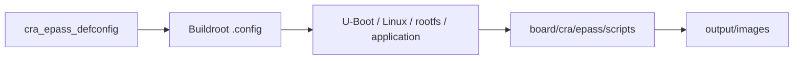

<div align="center">

# CRA Electric Pass Buildroot SDK

<sub>A complete firmware build environment for Allwinner F1C100S / F1C200S</sub>

</div>

**Read this in other languages:** [English](README_EN.md) · [中文](README.md)

> [!NOTE]
> This repository continues development from aodzip's [`buildroot-tiny200`](https://github.com/aodzip/buildroot-tiny200). It uses a UBIFS root filesystem and integrates Device Tree Overlay support together with related hardware-decoding patches at the U-Boot layer.
>
> A complete build produces the **Linux kernel, U-Boot, rootfs, and `epass_drm_app`**. CRA-specific project files are concentrated in `board/cra/epass/`.

<p align="center">
  <a href="#project-components">Components</a> ·
  <a href="#build-environment">Environment</a> ·
  <a href="#building-the-firmware">Build</a> ·
  <a href="#incremental-rebuilds">Rebuild</a> ·
  <a href="#flashing">Flash</a> ·
  <a href="#docker-build-environment">Docker</a> ·
  <a href="#origin-and-historical-targets">Origins</a>
</p>

---

## Project components

| Component | Contents |
| :--- | :--- |
| Linux kernel | Kernel, device trees, and CRA/Allwinner patches |
| U-Boot | SPL, bootloader, default environment, and boot device tree |
| rootfs | Buildroot user space plus the `board/cra/epass/rootfs/` overlay |
| `epass_drm_app` | Main CRA Electric Pass user-interface application |
| Image post-processing | SPI-NAND, UBI/UBIFS, FIT, and final flash images |

Default development login:

```text
User: root
Password: toor
```

The main boundary between project customization and the generic upstream framework is:

```text
buildroot-epass/
├── board/cra/epass/     CRA Electric Pass board configuration and runtime overlay
├── configs/             defconfig entry points loadable by make
├── boot/                Buildroot bootloader infrastructure
├── linux/               Buildroot Linux kernel infrastructure
├── fs/                  Root filesystem image infrastructure
├── package/             Buildroot package definitions
└── output/              Local build output; do not commit
```

---

## Build environment

The current workflow has been validated on **Ubuntu 24.04**. Package names and default tool versions may differ on other Linux distributions.

### Install dependencies

```sh
sudo apt install wget unzip build-essential git bc swig \
    libncurses-dev libpython3-dev libssl-dev mtd-utils fakeroot
sudo apt install python3-distutils
```

> [!TIP]
> Some recent distributions no longer ship `python3-distutils` as a separate package. If it is unavailable, check the system Python version and the actual Buildroot error before selecting a compatible replacement.

---

## Building the firmware

### 1. Load the CRA configuration

> [!WARNING]
> `make cra_epass_defconfig` replaces the current `.config` with CRA defaults. Normally run it only for the first build, after `distclean`, or when switching targets.

```sh
make cra_epass_defconfig
```

### 2. Prepare the download cache (optional)

Buildroot downloads source archives during the build. In restricted network environments, a trusted `dl/` cache archive can reduce repeated downloads.

Historical cache:

```text
Archive: epass-dl.tar.gz
URL: https://pan.baidu.com/s/1eCxZEsx1CHZdeZn9TVkyzg?pwd=34qg
Extraction code: 34qg
```

Place the archive in the Buildroot root and extract it:

```sh
tar xzvf epass-dl.tar.gz
```

The cache is only an optimization. Verify the source of third-party archives and retain Buildroot's hash verification.

### 3. Build

```sh
make -j$(nproc)
```

Primary outputs are written to `output/images/`:

| Output | Purpose |
| :--- | :--- |
| `u-boot-sunxi-with-nand-spl.bin` | U-Boot + SPL image for SPI-NAND |
| `boot_ubi.img` | Boot UBI image containing Linux and device trees |
| `rootfs_ubi.img` | Rootfs UBI image containing `epass_drm_app` and user space |



---

## Incremental rebuilds

Two convenience scripts are provided at the repository root:

```sh
./rebuild-kernel.sh
./rebuild-uboot.sh
```

Related development helpers and detailed notes are stored in `helper/`. Incremental targets are suitable for ordinary source, configuration, or device-tree edits. When the patch series or selected version changes, or stale state is suspected, clean the component build tree first.

| Scenario | Recommended command |
| :--- | :--- |
| Rebuild Linux | `make linux-rebuild -j$(nproc)` |
| Rebuild Linux from a clean source tree | `make linux-dirclean && make -j$(nproc)` |
| Rebuild U-Boot | `make uboot-rebuild -j$(nproc)` |
| Rebuild U-Boot from a clean source tree | `make uboot-dirclean && make -j$(nproc)` |

Run `make` after a component-only rebuild to refresh final images that depend on that component.

### Updating `epass_drm_app`

After selecting a new application release, update:

```text
package/epass_drm_app/epass_drm_app.mk
```

Set `EPASS_DRM_APP_VERSION` to the required version, then clean or rebuild the package and final images as appropriate.

---

## Flashing

Install [XFEL](https://github.com/xboot/xfel) and `dfu-util` before flashing.

### Prepare the boot environment

Create `bootenv.txt` with the value matching the physical display:

```text
screen=hsd
```

The file also requires a trailing newline and a NUL terminator. Supported values are:

```text
boe
hsd
laowu
```

> [!CAUTION]
> Erase and write commands directly modify the connected device. Verify the target, display type, and image files, and back up important data before continuing.

### Write the images

```sh
xfel spinand erase 0 0x8000000
xfel spinand write 0 u-boot-sunxi-with-nand-spl.bin
xfel spinand write 0xfa000 bootenv.txt
xfel reset

dfu-util -R -a boot -D boot_ubi.img
dfu-util -R -a rootfs -D rootfs_ubi.img
```

See [`flashutils/README_EN.md`](flashutils/README_EN.md) for Linux and Windows flashing workflows.

---

## Docker build environment

The root `Dockerfile` creates an isolated build environment. It replaces APT sources with mirrors intended for mainland China; adjust those entries first if other mirrors are preferred.

### Build the image

```sh
docker build \
  --build-arg UID=$(id -u) \
  --build-arg GID=$(id -g) \
  --build-arg USERNAME=$(whoami) \
  -t epass-buildroot .
```

### Start the container

```sh
docker run -it --rm \
  --user $(id -u):$(id -g) \
  -v $(pwd):/buildroot \
  epass-buildroot
```

Inside the container:

```sh
make cra_epass_defconfig
make -j$(nproc)
```

---

## Origin and historical targets

The Buildroot base derives from the open-source `buildroot-tiny200` SDK for Allwinner F1C100S/F1C200S. The upstream tree also carries support for HatLab BADGE200, Sipeed Lichee Nano, Widora MangoPi, and other boards. CRA Electric Pass is the primary target of this fork.

Historical driver tracking:

- [F1C100S / F1C200S driver progress](PROGRESS-SUNIV.md)
- [V3 / V3s / S3 / S3L driver progress](PROGRESS-V3.md)

---

<div align="center">

<sub><b>CRA Electric Pass</b> · Buildroot firmware SDK</sub>

</div>
