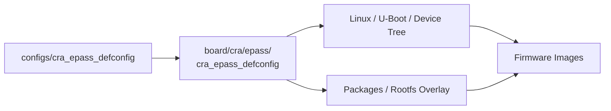

<div align="center">

# CRA 板级支持入口

<sub>CRA-owned board definitions for the Buildroot firmware tree</sub>

</div>

**Read this in other languages:** [English](README_EN.md) · [中文](README.md)

> [!NOTE]
> `board/cra/` 是 CRA 自有硬件目标的板级命名空间。当前核心目标只有 [`epass/`](epass/README.md)，用于组织 CRA Electric Pass 的构建配置、设备树、补丁、rootfs 覆盖层、镜像脚本和开发工具。

<p align="center">
  <a href="#目录定位">目录定位</a> ·
  <a href="#当前目标">当前目标</a> ·
  <a href="#配置关系">配置关系</a> ·
  <a href="#维护边界">维护边界</a>
</p>

---

## 目录定位

<table>
<tr>
<td width="50%" valign="top">

### CRA 自有层

存放由 CRA 维护、面向具体硬件产品的板级定义。

</td>
<td width="50%" valign="top">

### Buildroot 装配层

把架构、Linux、U-Boot、设备树、软件包、rootfs 与镜像后处理组合为可复现的固件目标。

</td>
</tr>
</table>

```text
board/cra/
├── README.md
└── epass/       CRA Electric Pass 板级支持包
```

---

## 当前目标

| 目录 | 目标 | 状态 | 详细说明 |
| :--- | :--- | :---: | :--- |
| [`epass/`](epass/README.md) | CRA Electric Pass | 主要维护目标 | [查看板级支持包](epass/README.md) |

`epass/` 当前包含：

- `cra_epass_defconfig`：Buildroot 板级配置源；
- `linux.defconfig`：Linux 内核配置；
- `uboot.defconfig`、`uboot.env`、`uEnv.txt`：U-Boot 配置与环境；
- `devicetree/`：Linux 与 U-Boot 设备树；
- `patch/`：固定版本 Linux 与 U-Boot 的补丁序列；
- `rootfs/`：目标根文件系统覆盖层；
- `scripts/`：设备树、FIT、UBI 与镜像生成脚本；
- `tools/`：在开发电脑上运行的资源辅助工具。

---

## 配置关系

CRA Electric Pass 的常用配置入口位于仓库根层的 `configs/`，其规范源文件保存在本目录下：



在正确保留 Git 符号链接的 Linux 或 WSL 工作树中，从 Buildroot 根目录载入配置：

```sh
make cra_epass_defconfig
```

> [!IMPORTANT]
> `configs/cra_epass_defconfig` 通常是指向板级配置源文件的符号链接。Windows 检出若将其还原为只含相对路径文字的普通文件，应先恢复符号链接，再进行构建。

---

## 维护边界

| 变更类型 | 推荐位置 |
| :--- | :--- |
| CRA Electric Pass 专用硬件描述 | `epass/devicetree/` |
| 固定上游版本所需修复 | `epass/patch/` |
| 开机服务、资源与设备配置 | `epass/rootfs/` |
| 镜像打包和后处理 | `epass/scripts/` |
| 开发电脑端资源生成 | `epass/tools/` |
| Allwinner 多板共用能力 | `board/allwinner/`，修改前检查全部下游目标 |

- 新增 CRA 板卡时，在 `board/cra/<target>/` 中建立独立目录，不与 `epass/` 混放。
- Linux DTS、U-Boot DTS、分区布局、启动参数与镜像脚本必须保持一致。
- 构建、验证与实体设备写入是三个独立步骤；板级目录中的普通构建命令不应隐式刷写设备。
- 保留 Shell 脚本的 LF 行尾、可执行权限和 Git 符号链接。

---

<div align="center">

<sub><b>board/cra/</b> · CRA-owned board support namespace</sub>

</div>
