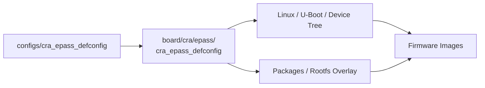

<div align="center">

# CRA Board Support

<sub>CRA-owned board definitions for the Buildroot firmware tree</sub>

</div>

**Read this in other languages:** [English](README_EN.md) · [中文](README.md)

> [!NOTE]
> `board/cra/` is the namespace for CRA-owned hardware targets. Its primary target is currently [`epass/`](epass/README_EN.md), which collects the CRA Electric Pass build configuration, device trees, patches, root filesystem overlay, image scripts, and development tools.

<p align="center">
  <a href="#purpose">Purpose</a> ·
  <a href="#current-target">Current target</a> ·
  <a href="#configuration-flow">Configuration flow</a> ·
  <a href="#maintenance-boundaries">Maintenance boundaries</a>
</p>

---

## Purpose

<table>
<tr>
<td width="50%" valign="top">

### CRA-owned layer

Contains board definitions maintained by CRA for specific hardware products.

</td>
<td width="50%" valign="top">

### Buildroot integration layer

Combines the architecture, Linux, U-Boot, device trees, packages, root filesystem, and image post-processing into a reproducible firmware target.

</td>
</tr>
</table>

```text
board/cra/
├── README.md
├── README_EN.md
└── epass/       CRA Electric Pass board support package
```

---

## Current target

| Directory | Target | Status | Documentation |
| :--- | :--- | :---: | :--- |
| [`epass/`](epass/README_EN.md) | CRA Electric Pass | Primary maintained target | [Board support package](epass/README_EN.md) |

`epass/` currently contains:

- `cra_epass_defconfig`: canonical Buildroot board configuration;
- `linux.defconfig`: Linux kernel configuration;
- `uboot.defconfig`, `uboot.env`, and `uEnv.txt`: U-Boot configuration and environment;
- `devicetree/`: Linux and U-Boot device trees;
- `patch/`: patch series for the pinned Linux and U-Boot versions;
- `rootfs/`: target root filesystem overlay;
- `scripts/`: device-tree, FIT, UBI, and firmware image generation scripts;
- `tools/`: host-side resource preparation tools.

---

## Configuration flow

The user-facing configuration entry lives in the repository-level `configs/` directory, while its canonical source is stored under this board directory:



From the Buildroot root, load the configuration in a Linux or WSL checkout that preserves Git symbolic links:

```sh
make cra_epass_defconfig
```

> [!IMPORTANT]
> `configs/cra_epass_defconfig` is normally a symbolic link to the board configuration. If a Windows checkout restores it as a plain text file containing only a relative path, restore the symbolic link before building.

---

## Maintenance boundaries

| Change | Preferred location |
| :--- | :--- |
| CRA Electric Pass hardware description | `epass/devicetree/` |
| Fixes required by pinned upstream versions | `epass/patch/` |
| Startup services, assets, and device configuration | `epass/rootfs/` |
| Image packaging and post-processing | `epass/scripts/` |
| Host-side resource generation | `epass/tools/` |
| Features shared by several Allwinner boards | `board/allwinner/`, after checking every downstream target |

- Add future CRA boards under their own `board/cra/<target>/` directory; do not mix them into `epass/`.
- Keep Linux DTS, U-Boot DTS, partition layout, boot arguments, and image scripts consistent.
- Building, validating, and flashing physical hardware are separate operations. Ordinary board build commands must not flash a device implicitly.
- Preserve LF line endings, executable bits, and Git symbolic links for shell-based build infrastructure.

---

<div align="center">

<sub><b>board/cra/</b> · CRA-owned board support namespace</sub>

</div>
