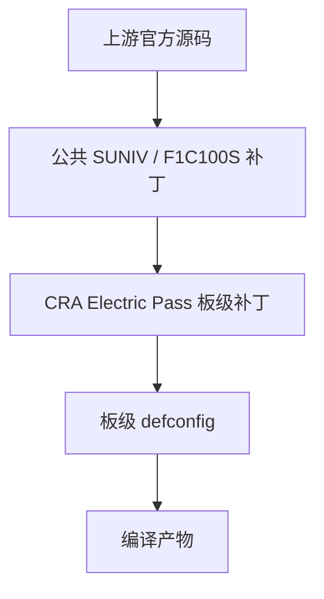
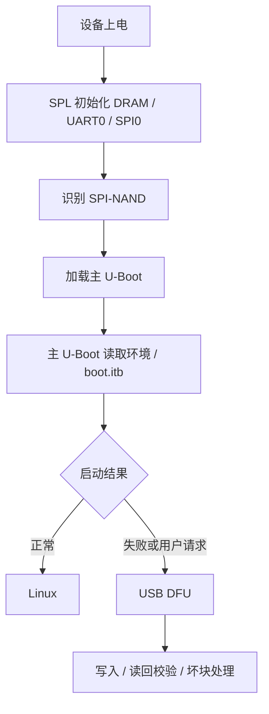
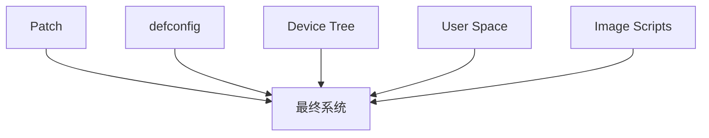

<div align="center">

# CRA Electric Pass 板级补丁

<sub>Read this in other languages: [English](README_EN.md), [中文](README.md).</sub>

</div>

> [!NOTE]
> 本目录保存 CRA Electric Pass 在 Buildroot 构建过程中应用到 **Linux 5.4.99** 与 **U-Boot** 的板级源码补丁。

<p align="center">
  <a href="#目录结构">目录结构</a> ·
  <a href="#补丁体系">补丁体系</a> ·
  <a href="#应用顺序">应用顺序</a> ·
  <a href="#linux-补丁">Linux</a> ·
  <a href="#u-boot-补丁">U-Boot</a> ·
  <a href="#跨目录联动">联动关系</a> ·
  <a href="#正确重建方式">重建方式</a> ·
  <a href="#验证状态">验证状态</a>
</p>

---

## 目录结构

<table>
<tr>
<td width="50%" valign="top">

### `linux/`

**目标：Linux 5.4.99**

共 **13 个补丁**

覆盖：

- 显示与屏幕初始化
- ADC
- USB
- DRM 私有接口
- CardKB
- I²S / ES8311
- GPIO UAPI

[查看 Linux 补丁说明](linux/README.md)

</td>
<td width="50%" valign="top">

### `uboot/`

**目标：U-Boot**

共 **5 个补丁**

覆盖：

- UART0
- USB DFU
- SPI-NAND
- SUNIV SPI 时钟
- NAND 写后校验

[查看 U-Boot 补丁说明](uboot/README.md)

</td>
</tr>
</table>

```text
patch/
├─ linux/
│  ├─ 0000-f1c100s-gpadc-regs.patch
│  ├─ 0001-epass-icon.patch
│  ├─ 0002-panel-simple.patch
│  ├─ 0003-f1c100s-defe-debe-fix.patch
│  ├─ 0004-swap_rb_as_config.patch
│  ├─ 0005-gpadc-low-freq.patch
│  ├─ 0006-initalize-st7701.patch
│  ├─ 0007-srgn-drm-atomic-ioctl.patch
│  ├─ 0008-force-usb-fs-dt-switch.patch
│  ├─ 0009-m5stack-cardkb-driver.patch
│  ├─ 0010-i2s-and-es-driver.patch
│  ├─ 0011-fbcon-cra-width-hack.patch
│  ├─ 0012-gpio-backport-pulls.patch
│  └─ README.md
├─ uboot/
│  ├─ 0001-uart-pull.patch
│  ├─ 0002-musb-force-fs.patch
│  ├─ 0003-spi-nand-mx35lf1g.patch
│  ├─ 0004-f1c-spi-fix.patch
│  ├─ 0005-dfu-verify-block.patch
│  └─ README.md
└─ README.md
```

| 子目录 | 目标源码 | 补丁数量 | 详细说明 |
| :--- | :--- | ---: | :--- |
| `linux/` | Linux 5.4.99 | 13 | [Linux 补丁说明](linux/README.md) |
| `uboot/` | U-Boot | 5 | [U-Boot 补丁说明](uboot/README.md) |

---

## 补丁体系

CRA Electric Pass 的 Linux 与 U-Boot 均采用两级补丁结构。



Buildroot 配置入口：

```text
board/cra/epass/cra_epass_defconfig
```

### Linux

```make
BR2_LINUX_KERNEL_CUSTOM_VERSION_VALUE="5.4.99"
BR2_LINUX_KERNEL_PATCH="board/allwinner/suniv-f1c100s/patch/linux board/cra/epass/patch/linux"
BR2_LINUX_KERNEL_CUSTOM_CONFIG_FILE="board/cra/epass/linux.defconfig"
```

### U-Boot

```make
BR2_TARGET_UBOOT_CUSTOM_VERSION_VALUE="2020.07"
BR2_TARGET_UBOOT_PATCH="board/allwinner/suniv-f1c100s/patch/u-boot board/cra/epass/patch/uboot"
BR2_TARGET_UBOOT_CUSTOM_CONFIG_FILE="board/cra/epass/uboot.defconfig"
```

> [!IMPORTANT]
> 公共补丁提供 SoC 级基础支持，本目录补丁处理 CRA Electric Pass 的板级功能与历史适配。两级补丁存在上下文依赖，本目录补丁不能脱离公共 SUNIV 补丁直接应用到原始源码。

---

## 应用顺序

Buildroot 按补丁文件名的字典顺序依次应用：

```text
0000
0001
0002
...
0012
```

编号不仅用于排序，也承担补丁之间的依赖关系。

例如：


> [!WARNING]
> 重命名、移动或插入补丁可能改变应用顺序。修改前一个补丁后，应重新检查所有后续补丁是否还能匹配新的上下文。

### 补丁验证不是单一步骤


每一步都需要独立验证。

---

# Linux 补丁

Linux 补丁主要覆盖：

| 功能 | 相关补丁 |
| :--- | :--- |
| GPADC 寄存器 / 采样 / 滤波 | `0000`、`0005` |
| framebuffer 启动 Logo | `0001` |
| 384×640 面板时序 | `0002` |
| DEFE / DEBE、缩放与 YUV | `0003` |
| 红蓝通道交换 | `0004` |
| ST7701 GPIO 初始化 | `0006` |
| `drm_app_neo` 私有 DRM 接口 | `0007` |
| MUSB Full / High-Speed 选择 | `0008` |
| M5Stack CardKB | `0009` |
| I²S / ES 系列 Codec | `0010` |
| framebuffer Console 宽度规避 | `0011` |
| GPIO Bias / Runtime Config | `0012` |

### 功能分组

<table>
<tr>
<td width="33%" valign="top">

### Display

`0001` `0002` `0003`  
`0004` `0006` `0007` `0011`

LCD、ST7701、DEFE/DEBE、DRM 与 fbcon。

</td>
<td width="33%" valign="top">

### Input / Audio / ADC

`0000` `0005`  
`0009` `0010`

GPADC、CardKB、I²S 与 ES8311。

</td>
<td width="33%" valign="top">

### USB / GPIO

`0008` `0012`

USB 速度控制与 GPIO UAPI 回移。

</td>
</tr>
</table>

### 高风险维护项

| 补丁 | 风险 |
| :--- | :--- |
| `0003` | 与当前分辨率、YUV 路径和厂商 BSP 参数绑定较深 |
| `0007` | 私有 DRM UAPI、寄存器操作与用户内存映射 |
| `0008` | MUSB `power` 局部变量存在已知初始化问题 |
| `0011` | 修改通用 framebuffer Console |
| `0012` | 回移 GPIO Core / UAPI 功能 |

> [!CAUTION]
> Linux 补丁中的高风险部分不适合仅根据“Patch 能应用”判断其运行安全性。

详细实现、依赖与已知问题：

```text
linux/README.md
```

---

# U-Boot 补丁

| 功能 | 相关补丁 |
| :--- | :--- |
| UART0 TX / RX 上拉 | `0001` |
| MUSB Gadget 强制 Full-Speed | `0002` |
| SPL 识别 Macronix SPI-NAND | `0003` |
| SUNIV SPI Parent / Divider | `0004` |
| DFU 写后校验与坏块处理 | `0005` |

### 在启动链路中的位置



其中：

- `0001`：稳定 UART0 启动早期电平
- `0003`：帮助 SPL 识别 Macronix SPI-NAND
- `0004`：修正 SUNIV SPI Clock / Divider
- `0002`：U-Boot MUSB 固定 Full-Speed
- `0005`：DFU 写入后读回校验并处理坏块

详细实现、NAND 布局与 DFU 行为：

```text
uboot/README.md
```

---

## 跨目录联动

本目录不能脱离配置、设备树、用户空间与镜像脚本单独维护。



---

### Defconfig

```text
board/cra/epass/linux.defconfig
board/cra/epass/uboot.defconfig
```

> [!IMPORTANT]
> Patch 新增 Kconfig 功能后，必须由对应 defconfig 选择。代码存在于源码树中，不代表它会进入最终内核或 U-Boot。

---

### Device Tree

```text
board/cra/epass/devicetree/linux/
board/cra/epass/devicetree/uboot/
```

以下标识必须与驱动保持一致：

```text
cra,epass-panel
cra,st7701-initseq
cra,swap-b-r
cra,usb-hs-enabled
```

还需要同步核对：

- SPI0
- SPI-NAND
- `spi-max-frequency`
- CardKB
- ES8311
- 其他扩展节点

---

### 私有 DRM ABI

Linux：

```text
0007-srgn-drm-atomic-ioctl.patch
```

与用户空间：

```text
drm_app_neo/src/driver/srgn_drm.h
drm_app_neo/src/driver/drm_warpper.c
drm_app_neo/src/render/
drm_app_neo/src/overlay/
```

共同定义内核 / 用户空间 ABI。


> [!CAUTION]
> IOCTL 编号、结构体布局、字段宽度和命令语义必须保持完全一致。任意一侧单独修改都可能破坏 ABI。

---

### 镜像脚本

```text
board/cra/epass/scripts/mknanduboot.sh
board/cra/epass/scripts/mkdt.sh
board/cra/epass/scripts/buildimage.sh
```

| 脚本 | 职责 |
| :--- | :--- |
| `mknanduboot.sh` | NAND SPL / U-Boot 布局 |
| `mkdt.sh` | Linux DTB / DTBO 编译 |
| `buildimage.sh` | UBI 与 `boot.itb` |

> [!NOTE]
> Patch 仅修改源码。设备树编译、NAND 二进制布局和最终系统镜像生成属于独立构建阶段。

---

## 正确重建方式

### 修改 Linux Patch

```bash
make cra_epass_defconfig
make linux-dirclean
make linux
```

### 修改 U-Boot Patch

```bash
make cra_epass_defconfig
make uboot-dirclean
make uboot
```

### 完整系统

```bash
make
```

---

## 验证状态

当前已完成：

- 13 个 Linux Patch 可作为统一 Diff 正确解析
- 5 个 U-Boot Patch 可作为统一 Diff 正确解析
- 所有 Patch 已统一为 LF
- SUNIV Linux Patch + CRA Linux Patch 可在干净 Linux 5.4.99 上按顺序应用
- Linux Kconfig 可识别 `CONFIG_CRA_EP_*`
- SUNIV U-Boot Patch + CRA U-Boot Patch 可按 Buildroot 顺序应用
- 当前 U-Boot Patch 已完成过编译验证


> [!IMPORTANT]
> 现有检查证明当前补丁序列、命名与配置关系可继续用于构建，不替代完整系统构建和实体硬件验证。

---

<div align="center">

<sub><b>CRA Electric Pass</b> · Linux 5.4.99 & U-Boot board patch set</sub>

</div>
