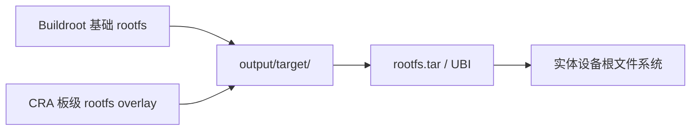

<div align="center">

# CRA Electric Pass rootfs 覆盖层

<sub>Read this in other languages: [English](README_EN.md), [中文](README.md).</sub>

</div>

> [!NOTE]
> 本目录是 CRA Electric Pass 的板级 rootfs overlay。Buildroot 生成目标根文件系统时，会把这里的内容按相同相对路径覆盖到 `output/target/`。

<p align="center">
  <a href="#覆盖关系">覆盖关系</a> ·
  <a href="#目录职责">目录职责</a> ·
  <a href="#构建位置">构建位置</a> ·
  <a href="#修改与验证">修改验证</a> ·
  <a href="#维护边界">维护边界</a>
</p>

---

## 覆盖关系

```text
board/cra/epass/rootfs/bin/usbctl
                │
                └──→ output/target/bin/usbctl
                           │
                           └──→ 目标设备 /bin/usbctl
```

该过程复制的是目录树，而不是把 `rootfs/` 本身作为目标设备上的一级目录。



---

## 目录职责

<table>
<tr>
<td width="20%" valign="top">

### [`app/`](app/README.md)

扩展应用与其运行资源。

</td>
<td width="20%" valign="top">

### [`assets/`](assets/README.md)

随固件预装的主题素材。

</td>
<td width="20%" valign="top">

### [`bin/`](bin/README.md)

设备维护、挂载、亮度与关机辅助程序。

</td>
<td width="20%" valign="top">

### [`etc/`](etc/README.md)

启动、网络、MTP 与系统级配置覆盖。

</td>
<td width="20%" valign="top">

### [`root/`](root/README.md)

root 登录流程、字符 Logo 和主程序固定资源。

</td>
</tr>
</table>

```text
rootfs/
├─ app/       → /app/
├─ assets/    → /assets/
├─ bin/       → /bin/
├─ etc/       → /etc/
└─ root/      → /root/
```

> [!IMPORTANT]
> 同一路径若同时由 Buildroot skeleton、软件包安装步骤和本 overlay 提供，后执行的阶段可能覆盖前一阶段。修改前应确认最终文件来源。

---

## 构建位置

板级配置通过 rootfs overlay 选项引用本目录。完整链路为：

```text
board/cra/epass/cra_epass_defconfig
    → board/cra/epass/rootfs/
    → output/target/
    → rootfs.tar
    → UBIFS / UBI
```

常规构建：

```sh
make cra_epass_defconfig
make
```

> [!NOTE]
> 构建只更新本地镜像文件，不会自动把变更写入实体设备。

---

## 修改与验证

| 修改内容 | 至少检查 |
| :--- | :--- |
| Shell 脚本或 `.profile` | LF 行尾、解释器、可执行权限、BusyBox 兼容性 |
| `/etc/inittab` 与启动逻辑 | tty、自动登录、主程序拉起与失败恢复 |
| 网络 / MTP 配置 | 接口名称、地址、USB 模式与对应服务 |
| 主题和固定资源 | 文件名、格式、分辨率、配置引用与目标端解码 |
| ELF 辅助程序 | ARMv5、EABI、soft-float、动态库与执行权限 |

可先检查暂存根文件系统：

```sh
find output/target -maxdepth 3 -type f | sort
```

对于脚本和配置，还应在生成镜像前比较源文件与 `output/target/` 中的最终内容。

---

## 维护边界

- 可追踪的设备定制应保存在本目录、相应 Buildroot 软件包或板级脚本中。
- 不要直接修改 `output/target/` 作为长期方案；清理构建后这些改动会消失。
- 不要把设备运行日志、缓存、用户上传内容或密钥写回 overlay。
- 预编译二进制应记录来源、架构和生成方式；源码可用时优先通过 Buildroot 软件包构建。
- 刷写前核对镜像、分区与设备型号，避免把普通文件复制操作等同于安全部署。

---

<div align="center">

<sub><b>rootfs/</b> · CRA Electric Pass target filesystem overlay</sub>

</div>
