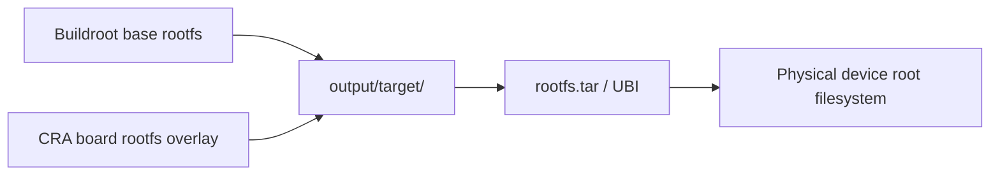

<div align="center">

# CRA Electric Pass Rootfs Overlay

<sub>Read this in other languages: [English](README_EN.md), [中文](README.md).</sub>

</div>

> [!NOTE]
> This directory is the board-level rootfs overlay for CRA Electric Pass. During a Buildroot image build, its contents are copied to `output/target/` using the same relative paths.

<p align="center">
  <a href="#overlay-mapping">Overlay mapping</a> ·
  <a href="#directory-responsibilities">Responsibilities</a> ·
  <a href="#place-in-the-build">Build flow</a> ·
  <a href="#modification-and-verification">Verification</a> ·
  <a href="#maintenance-boundaries">Boundaries</a>
</p>

---

## Overlay mapping

```text
board/cra/epass/rootfs/bin/usbctl
                │
                └──→ output/target/bin/usbctl
                           │
                           └──→ target device /bin/usbctl
```

The directory tree is copied into the target; `rootfs/` itself does not become a top-level device directory.



## Directory responsibilities

| Directory | Purpose |
| :--- | :--- |
| [`app/`](app/README_EN.md) | Extension applications and their runtime resources |
| [`assets/`](assets/README_EN.md) | Theme assets preinstalled in the firmware |
| [`bin/`](bin/README_EN.md) | Device maintenance, mounting, brightness, and shutdown helpers |
| [`etc/`](etc/README_EN.md) | Startup, networking, MTP, and system configuration overrides |
| [`root/`](root/README_EN.md) | Root login flow, character-art logo, and fixed application assets |

```text
rootfs/
├─ app/       → /app/
├─ assets/    → /assets/
├─ bin/       → /bin/
├─ etc/       → /etc/
└─ root/      → /root/
```

> [!IMPORTANT]
> When the Buildroot skeleton, a package install step, and this overlay provide the same target path, a later stage may overwrite an earlier one. Confirm the final source of a file before modifying it.

## Place in the build

```text
board/cra/epass/cra_epass_defconfig
    → board/cra/epass/rootfs/
    → output/target/
    → rootfs.tar
    → UBIFS / UBI
```

```sh
make cra_epass_defconfig
make
```

> [!NOTE]
> A build only updates local image files. It does not write changes to a physical device automatically.

## Modification and verification

| Change | Minimum checks |
| :--- | :--- |
| Shell scripts or `.profile` | LF endings, interpreter, executable bit, and BusyBox compatibility |
| `/etc/inittab` or startup logic | tty, autologin, main-program launch, and failure recovery |
| Network or MTP configuration | Interface name, address, USB mode, and corresponding service |
| Themes and fixed assets | Filename, format, resolution, configuration reference, and target decoder support |
| ELF helper programs | ARMv5, EABI, soft-float, shared libraries, and executable bit |

Inspect the staged root filesystem before packaging:

```sh
find output/target -maxdepth 3 -type f | sort
```

For scripts and configuration, compare the source with the final file under `output/target/` before image generation.

## Maintenance boundaries

- Keep trackable device customization here, in the relevant Buildroot package, or in board scripts.
- Do not use direct edits under `output/target/` as a permanent solution; cleaning the build removes them.
- Do not commit device logs, caches, user uploads, or secrets into the overlay.
- Record the origin, architecture, and build method for precompiled binaries; build from source through Buildroot when source is available.
- Verify image, partition, and device model before flashing. A successful file copy is not equivalent to a safe deployment.

---

<div align="center">

<sub><b>rootfs/</b> · CRA Electric Pass target filesystem overlay</sub>

</div>
