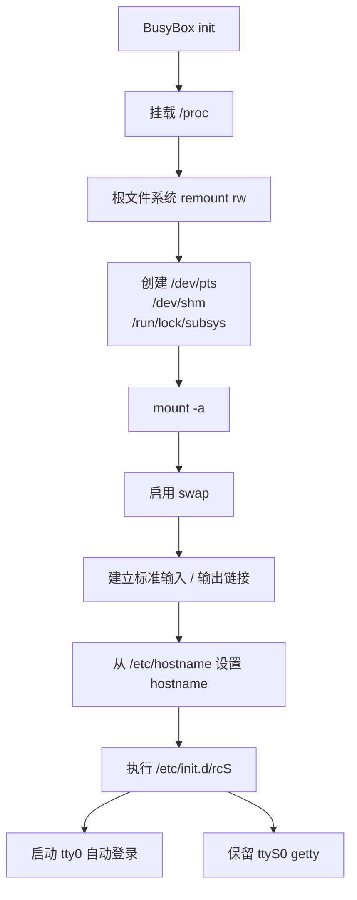
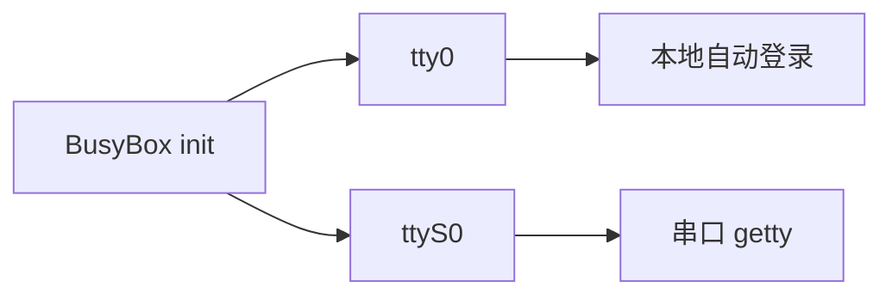
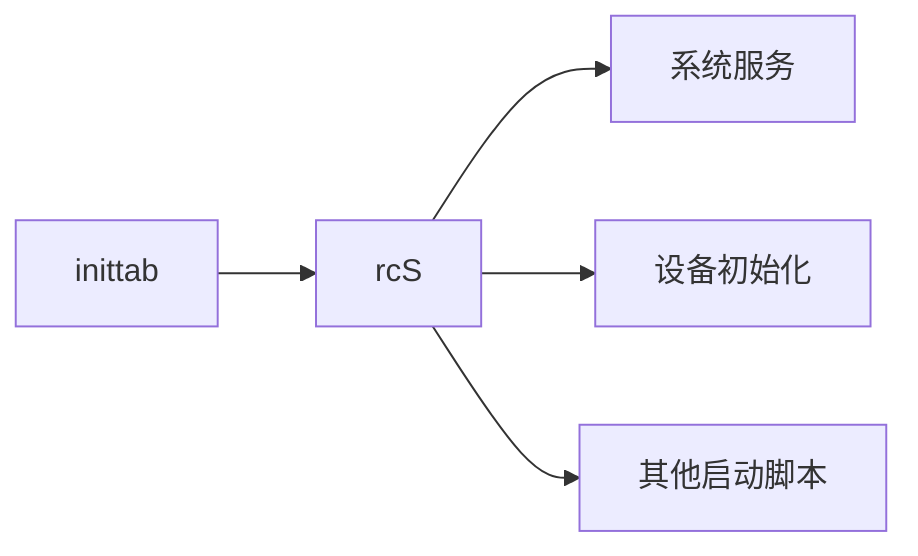
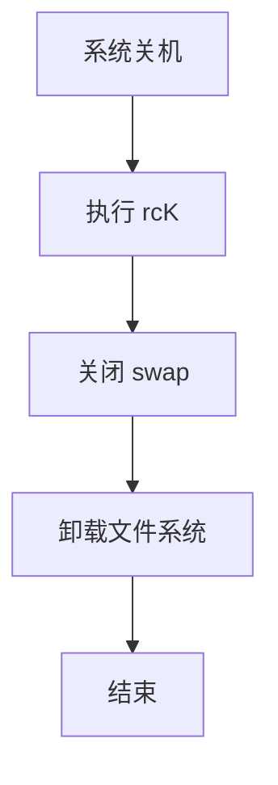

<div align="center">

# CRA Electric Pass 系统配置覆盖

<sub>Read this in other languages: [English](README_EN.md), [中文](README.md).</sub>

</div>

> [!NOTE]
> 本目录对应目标设备的 `/etc/`，用于覆盖 CRA Electric Pass 运行所需的系统级配置文件。

<p align="center">
  <a href="#目录定位">目录定位</a> ·
  <a href="#cedarxconf"><code>cedarx.conf</code></a> ·
  <a href="#inittab"><code>inittab</code></a> ·
  <a href="#启动流程">启动流程</a> ·
  <a href="#登录链路">登录链路</a> ·
  <a href="#关机流程">关机流程</a>
</p>

---

## 目录定位

目标设备路径：

```text
/etc/
```

当前 README 主要涉及：

<table>
<tr>
<td width="50%" valign="top">

### `cedarx.conf`

CedarX 相关运行参数。

当前主要配置日志等级。

</td>
<td width="50%" valign="top">

### `inittab`

BusyBox init 的系统启动入口。

负责：

- 系统初始化
- `rcS`
- 本地自动登录
- 串口 `getty`
- 关机清理

</td>
</tr>
</table>

---

# `cedarx.conf`

当前内容：

```ini
[paramter]
log_level = 6
```

该文件用于向 CedarX 相关组件提供运行参数。

| 项目 | 当前值 |
| :--- | :--- |
| Section | `[paramter]` |
| `log_level` | `6` |

> [!NOTE]
> 当前 README 仅记录现有配置，不对 CedarX 日志等级的具体语义做额外扩展。

---

# `inittab`

CRA Electric Pass 使用：

```text
BusyBox init
```

`/etc/inittab` 是设备从用户空间初始化到主程序启动的重要入口。

---

## 启动流程

主要执行顺序：



### 初始化阶段

`inittab` 主要负责：

1. 挂载 `/proc`；
2. 将根文件系统重新挂载为可写；
3. 创建 `/dev/pts`、`/dev/shm` 与 `/run/lock/subsys`；
4. 执行 `/bin/mount -a`；
5. 启用 swap；
6. 建立标准输入输出相关链接；
7. 从 `/etc/hostname` 设置主机名；
8. 执行 `/etc/init.d/rcS`。

---

## 登录链路

本地主控制台关键行：

```text
tty0::respawn:/sbin/getty -L tty0 0 vt100 -n -l /bin/autologin
```

含义：

| 参数 | 作用 |
| :--- | :--- |
| `tty0` | 本地主控制台 |
| `respawn` | 进程退出后重新启动 |
| `getty` | 初始化终端 |
| `-L` | 本地线路 |
| `vt100` | 终端类型 |
| `-n` | 不显示普通登录提示 |
| `-l /bin/autologin` | 使用自定义自动登录程序 |

完整主程序启动链：


> [!IMPORTANT]
> `inittab → autologin → .profile → epass_drm_app` 是当前设备主界面的核心启动链。

---

## 本地控制台

`tty0` 使用自动 root 登录。

调用：

```text
/bin/autologin
```

其后 root Shell 读取：

```text
/root/.profile
```

并进入主程序启动流程。

> [!WARNING]
> 本地 `tty0` 不要求 root 密码。该机制依赖实体设备的物理访问边界，不适合作为通用 Linux 主机的默认安全策略。

---

## 串口控制台

`inittab` 同时保留：

```text
ttyS0
```

上的串口 `getty`。



这样设备同时保留：

- 本地 framebuffer / tty0 操作入口
- UART0 串口调试入口

---

## `rcS`

系统初始化阶段会执行：

```text
/etc/init.d/rcS
```

`rcS` 负责继续执行系统服务和启动脚本。



> [!NOTE]
> `inittab` 负责进入系统初始化阶段，具体服务启动逻辑继续下沉到 `/etc/init.d/`。

---

## 关机流程

系统退出时，`inittab` 负责执行：

```text
rcK
```

并完成：

- 关闭 swap
- 卸载文件系统



> [!IMPORTANT]
> 修改文件系统、UBI、SD 卡或额外挂载点后，应同步确认关机阶段仍能正确卸载资源。

---

## 配置联动

| 修改项 | 同步检查 |
| :--- | :--- |
| `tty0` 登录方式 | `/bin/autologin` |
| 自动登录行为 | `/root/.profile` |
| 主程序启动 | `.profile` 与 `epass_drm_app` |
| 串口设备 | `ttyS0`、U-Boot / Linux UART 配置 |
| `rcS` | `/etc/init.d/` 启动脚本 |
| `rcK` | 服务停止与文件系统卸载 |
| 挂载项 | `/etc/fstab` 与设备实际分区 |
| Hostname | `/etc/hostname` |

---

<div align="center">

<sub><b>CRA Electric Pass</b> · BusyBox init and system configuration under <code>/etc/</code></sub>

</div>
