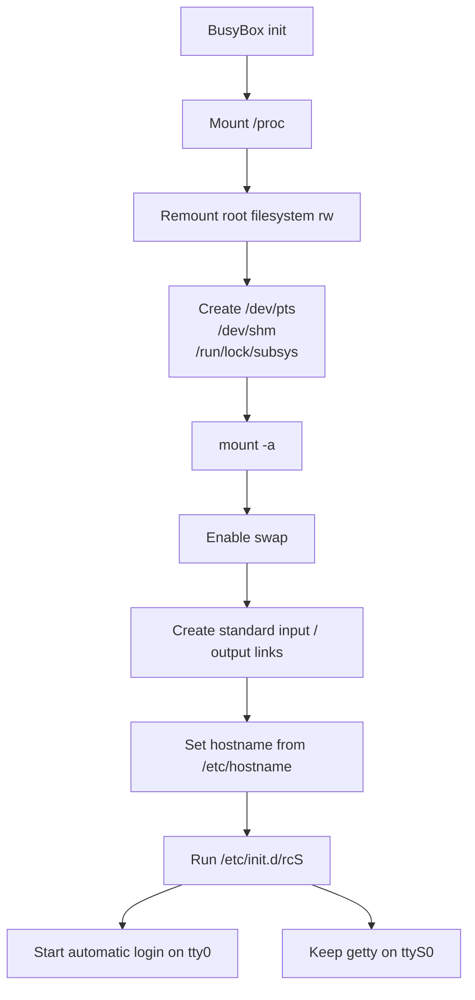
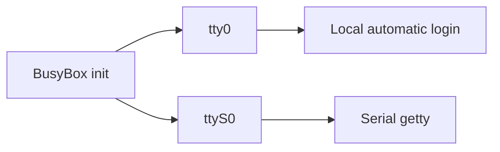
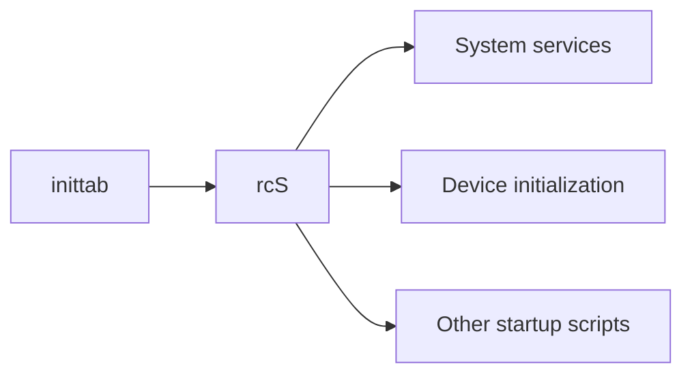
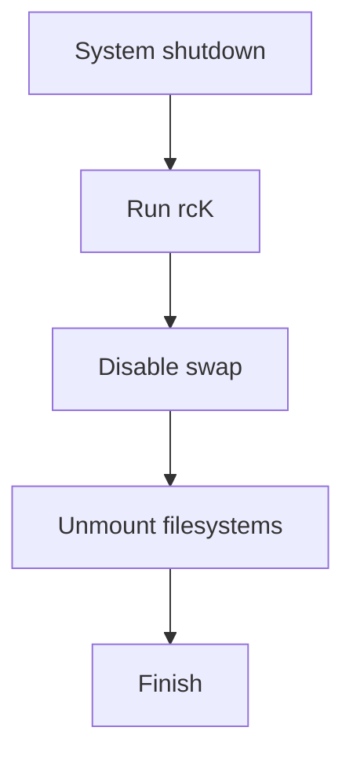

<div align="center">

# CRA Electric Pass System Configuration Overlay

<sub>Read this in other languages: [English](README_EN.md), [中文](README.md).</sub>

</div>

> [!NOTE]
> This directory maps to `/etc/` on the target device and overrides the system-level configuration files required by CRA Electric Pass.

<p align="center">
  <a href="#directory-layout">Directory Layout</a> ·
  <a href="#cedarxconf"><code>cedarx.conf</code></a> ·
  <a href="#inittab"><code>inittab</code></a> ·
  <a href="#boot-sequence">Boot Sequence</a> ·
  <a href="#login-chain">Login Chain</a> ·
  <a href="#shutdown-sequence">Shutdown Sequence</a>
</p>

---

## Directory Layout

Path on the target device:

```text
/etc/
```

This README primarily covers:

<table>
<tr>
<td width="50%" valign="top">

### `cedarx.conf`

Runtime parameters for CedarX-related components.

The current configuration primarily sets the log level.

</td>
<td width="50%" valign="top">

### `inittab`

The system startup entry point for BusyBox init.

It is responsible for:

- System initialization
- `rcS`
- Local automatic login
- Serial `getty`
- Shutdown cleanup

</td>
</tr>
</table>

---

# `cedarx.conf`

Current contents:

```ini
[paramter]
log_level = 6
```

This file provides runtime parameters to CedarX-related components.

| Item | Current value |
| :--- | :--- |
| Section | `[paramter]` |
| `log_level` | `6` |

> [!NOTE]
> This README only documents the existing configuration and does not attempt to define the exact semantics of CedarX log levels.

---

# `inittab`

CRA Electric Pass uses:

```text
BusyBox init
```

`/etc/inittab` is a key entry point in the device's transition from userspace initialization to launching the main application.

---

## Boot Sequence

Main execution order:



### Initialization Stage

`inittab` is primarily responsible for:

1. Mounting `/proc`.
2. Remounting the root filesystem as writable.
3. Creating `/dev/pts`, `/dev/shm`, and `/run/lock/subsys`.
4. Running `/bin/mount -a`.
5. Enabling swap.
6. Creating the links associated with standard input and output.
7. Setting the hostname from `/etc/hostname`.
8. Running `/etc/init.d/rcS`.

---

## Login Chain

Key line for the local main console:

```text
tty0::respawn:/sbin/getty -L tty0 0 vt100 -n -l /bin/autologin
```

Meaning:

| Parameter | Purpose |
| :--- | :--- |
| `tty0` | Local main console |
| `respawn` | Restart the process after it exits |
| `getty` | Initialize the terminal |
| `-L` | Use a local line |
| `vt100` | Terminal type |
| `-n` | Do not display the normal login prompt |
| `-l /bin/autologin` | Use the custom automatic-login program |

Complete main-application startup chain:


> [!IMPORTANT]
> `inittab → autologin → .profile → epass_drm_app` is the core startup chain for the current device interface.

---

## Local Console

`tty0` uses automatic root login.

It invokes:

```text
/bin/autologin
```

The root shell then reads:

```text
/root/.profile
```

and enters the main-application startup sequence.

> [!WARNING]
> The local `tty0` console does not require the root password. This mechanism relies on the physical access boundary of the device and is not an appropriate default security policy for a general-purpose Linux host.

---

## Serial Console

`inittab` also retains a serial `getty` on:

```text
ttyS0
```



This keeps both of the following access paths available:

- Local framebuffer / `tty0` access
- UART0 serial debugging access

---

## `rcS`

During system initialization, the following script is executed:

```text
/etc/init.d/rcS
```

`rcS` continues by running system services and startup scripts.



> [!NOTE]
> `inittab` enters the system initialization stage, while the detailed service startup logic is delegated to `/etc/init.d/`.

---

## Shutdown Sequence

When the system shuts down, `inittab` runs:

```text
rcK
```

and performs the following cleanup:

- Disable swap
- Unmount filesystems



> [!IMPORTANT]
> After modifying filesystems, UBI volumes, SD card handling, or additional mount points, verify that the shutdown stage can still unmount all resources correctly.

---

## Related Configuration

| Changed item | Also verify |
| :--- | :--- |
| `tty0` login method | `/bin/autologin` |
| Automatic-login behavior | `/root/.profile` |
| Main-application startup | `.profile` and `epass_drm_app` |
| Serial device | `ttyS0` and the U-Boot / Linux UART configuration |
| `rcS` | Startup scripts under `/etc/init.d/` |
| `rcK` | Service shutdown and filesystem unmounting |
| Mount entries | `/etc/fstab` and the device's actual partitions |
| Hostname | `/etc/hostname` |

---

<div align="center">

<sub><b>CRA Electric Pass</b> · BusyBox init and system configuration under <code>/etc/</code></sub>

</div>
