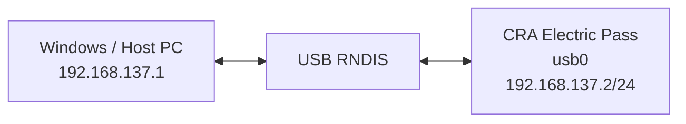
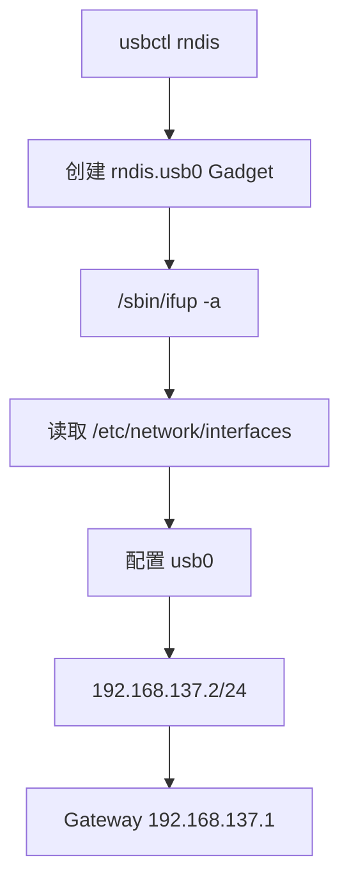
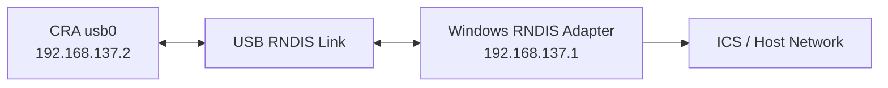

<div align="center">

# CRA Electric Pass 网络接口配置

<sub>Read this in other languages: [English](README_EN.md), [中文](README.md).</sub>

</div>

> [!NOTE]
> 本目录会在 Buildroot 合并 rootfs overlay 后写入设备的 `/etc/network/`，用于配置回环接口和 USB RNDIS 网络接口。

<p align="center">
  <a href="#目录定位">目录定位</a> ·
  <a href="#当前网络参数">网络参数</a> ·
  <a href="#rndis-链路">RNDIS</a> ·
  <a href="#interfaces-配置">interfaces</a> ·
  <a href="#windows-主机侧">Windows 主机</a>
</p>

---

## 目录定位

目标设备路径：

```text
/etc/network/
```

当前主要负责两类接口：

<table>
<tr>
<td width="50%" valign="top">

### `lo`

回环接口：

```text
127.0.0.1
```

用于设备本机网络栈。

</td>
<td width="50%" valign="top">

### `usb0`

USB RNDIS 网络接口：

```text
192.168.137.2/24
```

通过 USB 与电脑建立点对点 IPv4 网络。

</td>
</tr>
</table>

---

## 当前网络参数

| 项目 | 当前值 |
| :--- | :--- |
| Loopback | `127.0.0.1` |
| USB Interface | `usb0` |
| Device IPv4 | `192.168.137.2/24` |
| Gateway | `192.168.137.1` |
| Subnet | `192.168.137.0/24` |



> [!NOTE]
> `192.168.137.1` 是 Windows Internet Connection Sharing 常见的主机侧地址，但并不是由设备端自动创建。

---

## RNDIS 链路

USB Gadget 由：

```text
usbctl rndis
```

创建。

`usbctl` 会建立：

```text
rndis.usb0
```

随后调用：

```sh
/sbin/ifup -a
```

再由 `/etc/network/` 中的配置为 `usb0` 写入静态 IPv4 参数。



> [!IMPORTANT]
> `usbctl rndis` 负责创建 USB Gadget；`/etc/network/interfaces` 负责设备端 IP 配置。两者缺一不可。

---

## `interfaces` 配置

### Loopback

```text
auto lo
iface lo inet loopback
```

表示系统启动网络时自动启用：

```text
lo
```

---

### USB RNDIS

```text
auto usb0
iface usb0 inet static
```

表示：

- 自动配置 `usb0`
- 使用静态 IPv4
- 不依赖 DHCP 获取设备端地址

当前固定地址：

```text
192.168.137.2/24
```

当前网关：

```text
192.168.137.1
```

`network` 与 `broadcast` 字段应与 `/24` 掩码保持一致。

---

## Windows 主机侧

设备端配置完成后，电脑端仍需要正确配置 RNDIS。

典型关系：



主机侧通常需要：

- 正确安装 / 识别 RNDIS 驱动
- 主机 RNDIS 网卡地址为 `192.168.137.1`
- 或启用 Windows Internet Connection Sharing
- 防火墙允许需要的通信
- 路由与共享策略正确

> [!WARNING]
> 设备端设置 `192.168.137.1` 为网关，不代表 Windows 一定已经启用 ICS。主机端仍需要独立完成网络共享或静态地址配置。

---

## 修改原则

| 修改项 | 同步检查 |
| :--- | :--- |
| `usb0` 地址 | Windows 主机端 RNDIS 地址 |
| 子网掩码 | `network` / `broadcast` |
| Gateway | 主机端实际地址 |
| USB 模式 | `usbctl rndis` |
| 接口名 | ConfigFS Gadget 与网络配置 |
| ICS 网段 | 设备静态 IPv4 与默认路由 |

> [!TIP]
> 修改网段后，设备端与电脑端应同时调整，避免两端处于不同子网。

---

<div align="center">

<sub><b>CRA Electric Pass</b> · USB RNDIS network configuration</sub>

</div>
