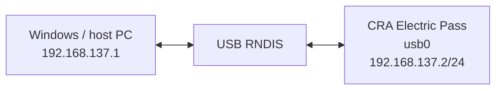
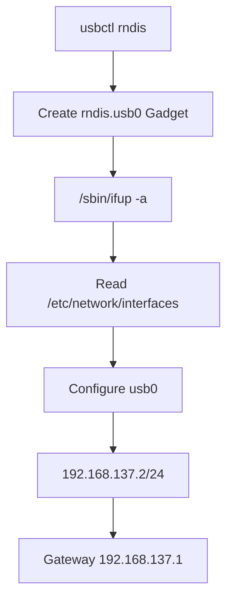
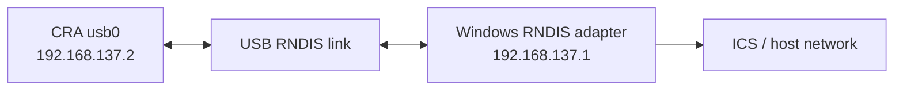

<div align="center">

# CRA Electric Pass Network Interface Configuration

<sub>Read this in other languages: [English](README_EN.md), [中文](README.md).</sub>

</div>

> [!NOTE]
> After Buildroot merges the rootfs overlay, this directory is installed at `/etc/network/` on the device. It configures the loopback interface and the USB RNDIS network interface.

<p align="center">
  <a href="#directory-role">Directory Role</a> ·
  <a href="#current-network-parameters">Network Parameters</a> ·
  <a href="#rndis-flow">RNDIS</a> ·
  <a href="#interfaces-configuration">interfaces</a> ·
  <a href="#windows-host">Windows Host</a>
</p>

---

## Directory Role

Target path on the device:

```text
/etc/network/
```

The current configuration primarily manages two interfaces:

<table>
<tr>
<td width="50%" valign="top">

### `lo`

Loopback interface:

```text
127.0.0.1
```

Used by the device's local network stack.

</td>
<td width="50%" valign="top">

### `usb0`

USB RNDIS network interface:

```text
192.168.137.2/24
```

Creates a point-to-point IPv4 network with a computer over USB.

</td>
</tr>
</table>

---

## Current Network Parameters

| Item | Current value |
| :--- | :--- |
| Loopback | `127.0.0.1` |
| USB Interface | `usb0` |
| Device IPv4 | `192.168.137.2/24` |
| Gateway | `192.168.137.1` |
| Subnet | `192.168.137.0/24` |



> [!NOTE]
> `192.168.137.1` is a common host-side address for Windows Internet Connection Sharing, but it is not created automatically by the device.

---

## RNDIS Flow

The USB Gadget is created by:

```text
usbctl rndis
```

`usbctl` creates:

```text
rndis.usb0
```

and then invokes:

```sh
/sbin/ifup -a
```

The configuration under `/etc/network/` then assigns the static IPv4 parameters to `usb0`.



> [!IMPORTANT]
> `usbctl rndis` creates the USB Gadget, while `/etc/network/interfaces` configures the device-side IP address. Both are required.

---

## `interfaces` Configuration

### Loopback

```text
auto lo
iface lo inet loopback
```

This tells the networking system to enable:

```text
lo
```

automatically.

---

### USB RNDIS

```text
auto usb0
iface usb0 inet static
```

This means:

- Configure `usb0` automatically
- Use a static IPv4 address
- Do not obtain the device-side address through DHCP

Current static address:

```text
192.168.137.2/24
```

Current gateway:

```text
192.168.137.1
```

The `network` and `broadcast` fields must remain consistent with the `/24` subnet mask.

---

## Windows Host

After the device-side configuration is complete, the RNDIS interface must still be configured correctly on the computer.

Typical relationship:



The host generally requires:

- The RNDIS driver to be installed and recognized correctly
- The host RNDIS adapter address to be `192.168.137.1`
- Or Windows Internet Connection Sharing to be enabled
- Firewall rules that permit the required traffic
- Correct routing and sharing policies

> [!WARNING]
> Configuring `192.168.137.1` as the device gateway does not mean that Windows has enabled ICS. Network sharing or a static host-side address must still be configured independently.

---

## Modification Guidelines

| Changed item | Also verify |
| :--- | :--- |
| `usb0` address | Windows host-side RNDIS address |
| Subnet mask | `network` / `broadcast` |
| Gateway | Actual host-side address |
| USB mode | `usbctl rndis` |
| Interface name | ConfigFS Gadget and network configuration |
| ICS subnet | Device static IPv4 address and default route |

> [!TIP]
> When changing the subnet, update both the device and the computer so that they remain on the same network.

---

<div align="center">

<sub><b>CRA Electric Pass</b> · USB RNDIS network configuration</sub>

</div>
