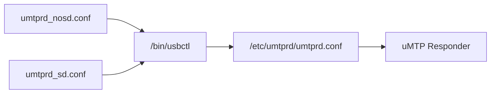
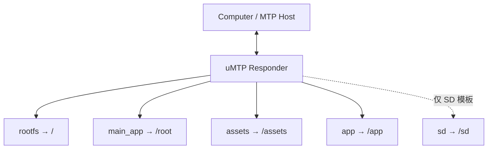
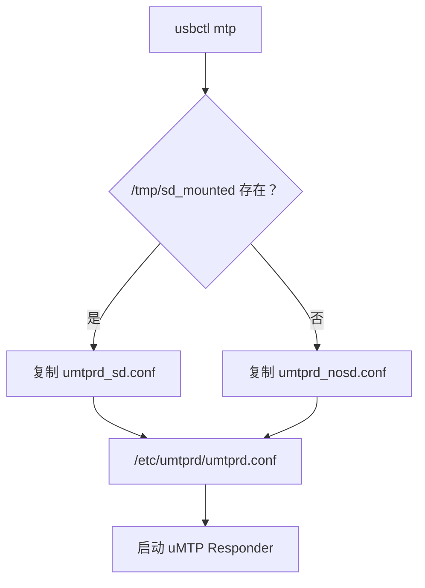

<div align="center">

# CRA Electric Pass uMTP Responder 配置模板

<sub>Read this in other languages: [English](README_EN.md), [中文](README.md).</sub>

</div>

> [!NOTE]
> 本目录对应设备上的 `/etc/umtprd/`，用于保存 uMTP Responder 的两套运行模板。

<p align="center">
  <a href="#目录定位">目录定位</a> ·
  <a href="#模板区别">模板区别</a> ·
  <a href="#选择逻辑">选择逻辑</a> ·
  <a href="#usb-身份">USB 身份</a> ·
  <a href="#functionfs-端点">FunctionFS</a> ·
  <a href="#权限与风险">权限风险</a>
</p>

---

## 目录定位

设备端路径：

```text
/etc/umtprd/
```

目录中保存两份模板：

```text
umtprd_nosd.conf
umtprd_sd.conf
```

设备进入 MTP 模式时，`/bin/usbctl` 会根据 SD 卡状态选择其中一份，并复制为运行时配置：

```text
/etc/umtprd/umtprd.conf
```



> [!IMPORTANT]
> `umtprd.conf` 是运行时实际读取的配置文件；两份模板用于根据设备当前 SD 卡状态动态生成它。

---

## 模板区别

### `umtprd_nosd.conf`

无 SD 卡时暴露：

| 设备路径 | MTP 名称 | 权限 |
| :--- | :--- | :---: |
| `/` | `rootfs` | `rw` |
| `/root` | `main_app` | `rw` |
| `/assets` | `assets` | `rw` |
| `/app` | `app` | `rw` |

```text
/         → rootfs
/root     → main_app
/assets   → assets
/app      → app
```

---

### `umtprd_sd.conf`

在无 SD 模板基础上增加：

| 设备路径 | MTP 名称 | 权限 |
| :--- | :--- | :---: |
| `/sd` | `sd` | `rw` |

完整关系：

```text
/         → rootfs
/root     → main_app
/assets   → assets
/app      → app
/sd       → sd
```

---

## 存储暴露关系



<table>
<tr>
<td width="50%" valign="top">

### 固定暴露

两套模板都包含：

```text
/
 /root
 /assets
 /app
```

</td>
<td width="50%" valign="top">

### SD 模式附加

仅 `umtprd_sd.conf` 增加：

```text
/sd
```

</td>
</tr>
</table>

---

## 选择逻辑

`usbctl mtp` 检查：

```text
/tmp/sd_mounted
```

然后决定运行时模板。



该状态文件由：

- `/root/.profile` 中的 SD 挂载逻辑
- `format_sd`

创建。

> [!NOTE]
> `/tmp/sd_mounted` 只是运行时状态标记，不等价于对真实挂载状态的强验证。排查 MTP 存储异常时，应同时检查 `/sd` 是否实际挂载。

---

## USB 身份

当前两份模板的身份信息：

| 项目 | 无 SD | 有 SD |
| :--- | :--- | :--- |
| `manufacturer` | `CCU Robotics Association` | `CCU Robotics Association` |
| `product` | `Electronic Pass` | `Electronic Pass(SD)` |
| `serial` | `CRAEPASS` | `CRAEPASS` |
| `interface` | `MTP` | `MTP` |

主要区别：

```text
Electronic Pass
Electronic Pass(SD)
```

用于让主机侧区分当前是否启用了 SD 存储模板。

---

## FunctionFS 端点

两份模板均使用：

```text
/dev/ffs-mtp/ep0
/dev/ffs-mtp/ep1
/dev/ffs-mtp/ep2
/dev/ffs-mtp/ep3
```

关系：


> [!IMPORTANT]
> uMTP 配置中的 FunctionFS Endpoint 路径必须与 `usbctl` 创建和挂载的 `ffs.mtp` 保持一致。

---

## 权限与风险

当前所有 MTP 存储入口均为：

```text
rw
```

这意味着电脑可以通过 MTP 修改设备上的实际文件。

### 风险等级

| MTP 名称 | 对应路径 | 风险 |
| :--- | :--- | :---: |
| `rootfs` | `/` | **高** |
| `main_app` | `/root` | **高** |
| `assets` | `/assets` | 中 |
| `app` | `/app` | 中 |
| `sd` | `/sd` | 中 |

> [!CAUTION]
> `rootfs` 和 `main_app` 具有非常大的写入范围。连接不可信电脑、误操作文件管理器或批量删除时，可能直接破坏系统文件、主程序或启动所需资源。

### 使用建议

- 不在不可信电脑上开放 MTP；
- 更新 `/root` 前先备份主程序与配置；
- 不随意删除 `/` 下系统目录；
- 更新 `/assets` 或 `/app` 后重新扫描对应内容；
- SD 卡挂载异常时先检查 `/tmp/sd_mounted` 与真实挂载状态是否一致；
- 修改 FunctionFS 路径时同步检查 `usbctl`。

---

## 配置联动

| 修改项 | 同步检查 |
| :--- | :--- |
| 模板文件名 | `/bin/usbctl` |
| `/tmp/sd_mounted` | `.profile`、`format_sd`、真实 SD 挂载 |
| MTP Storage 路径 | 对应设备目录是否存在 |
| `rw` / `ro` | 主机侧是否需要写权限 |
| Product String | 主机识别与显示 |
| FunctionFS Endpoint | `usbctl` 中的 `ffs.mtp` |
| `/sd` 暴露 | SD 是否已正确挂载 |

---

<div align="center">

<sub><b>CRA Electric Pass</b> · uMTP Responder templates and MTP storage exposure</sub>

</div>
