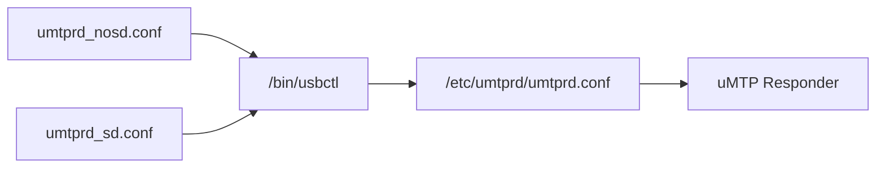
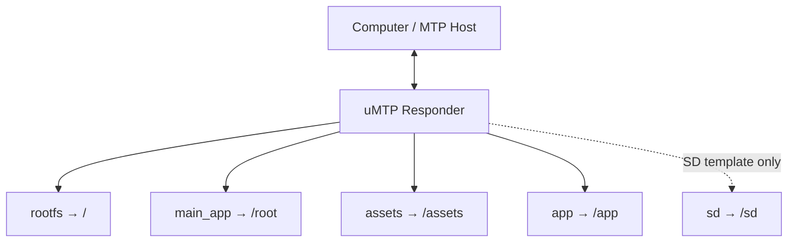
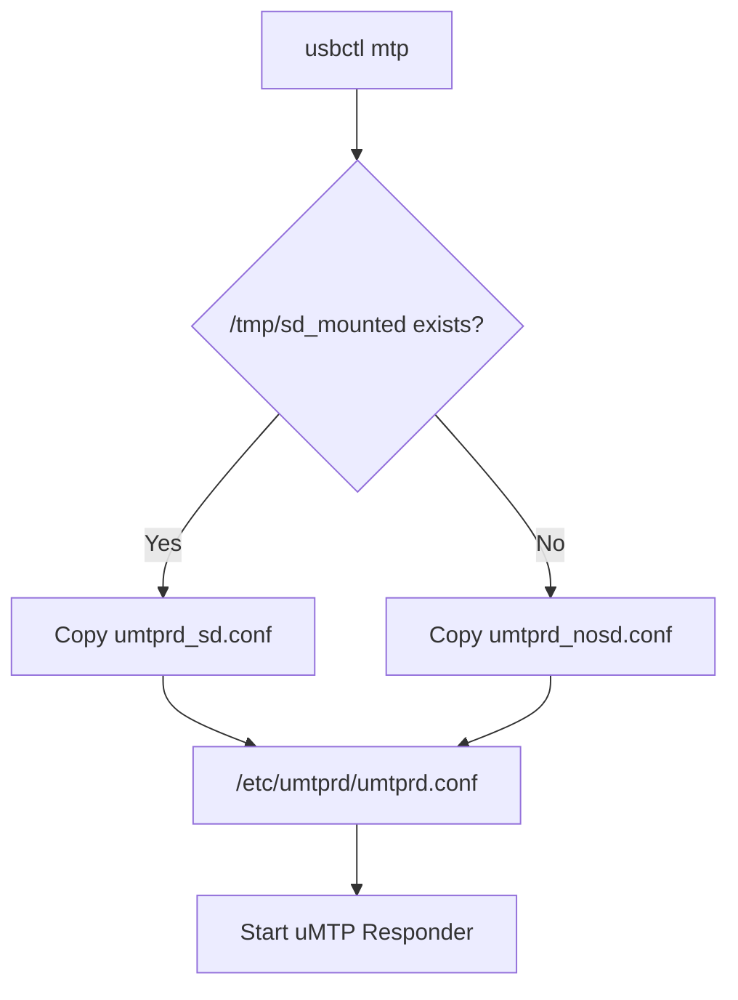

<div align="center">

# CRA Electric Pass uMTP Responder Configuration Templates

<sub>Read this in other languages: [English](README_EN.md), [中文](README.md).</sub>

</div>

> [!NOTE]
> This directory is installed as `/etc/umtprd/` on the device and contains the two runtime configuration templates for uMTP Responder.

<p align="center">
  <a href="#directory-layout">Directory Layout</a> ·
  <a href="#template-differences">Template Differences</a> ·
  <a href="#template-selection">Template Selection</a> ·
  <a href="#usb-identity">USB Identity</a> ·
  <a href="#functionfs-endpoints">FunctionFS</a> ·
  <a href="#permissions-and-risks">Permissions and Risks</a>
</p>

---

## Directory Layout

Path on the device:

```text
/etc/umtprd/
```

The directory contains two templates:

```text
umtprd_nosd.conf
umtprd_sd.conf
```

When the device enters MTP mode, `/bin/usbctl` selects one of them according to the SD card state and copies it to the runtime configuration:

```text
/etc/umtprd/umtprd.conf
```



> [!IMPORTANT]
> `umtprd.conf` is the configuration file read at runtime. The two templates are used to generate it dynamically according to the device's current SD card state.

---

## Template Differences

### `umtprd_nosd.conf`

Without an SD card, the following storage locations are exposed:

| Device path | MTP name | Access |
| :--- | :--- | :---: |
| `/` | `rootfs` | `rw` |
| `/root` | `main_app` | `rw` |
| `/assets` | `assets` | `rw` |
| `/app` | `app` | `rw` |

```text
/         → rootfs
/root     → main_app
/assets   → assets
/app      → app
```

---

### `umtprd_sd.conf`

The SD template adds the following entry to the no-SD configuration:

| Device path | MTP name | Access |
| :--- | :--- | :---: |
| `/sd` | `sd` | `rw` |

Complete mapping:

```text
/         → rootfs
/root     → main_app
/assets   → assets
/app      → app
/sd       → sd
```

---

## Exposed Storage Layout



<table>
<tr>
<td width="50%" valign="top">

### Always Exposed

Both templates include:

```text
/
/root
/assets
/app
```

</td>
<td width="50%" valign="top">

### Additional Storage in SD Mode

Only `umtprd_sd.conf` adds:

```text
/sd
```

</td>
</tr>
</table>

---

## Template Selection

`usbctl mtp` checks for:

```text
/tmp/sd_mounted
```

It then selects the runtime template.



This state file is created by:

- The SD mounting logic in `/root/.profile`
- `format_sd`

> [!NOTE]
> `/tmp/sd_mounted` is only a runtime state marker, not a definitive check of the actual mount state. When diagnosing MTP storage issues, also verify that `/sd` is genuinely mounted.

---

## USB Identity

The two templates currently use the following identity information:

| Item | Without SD | With SD |
| :--- | :--- | :--- |
| `manufacturer` | `CCU Robotics Association` | `CCU Robotics Association` |
| `product` | `Electronic Pass` | `Electronic Pass(SD)` |
| `serial` | `CRAEPASS` | `CRAEPASS` |
| `interface` | `MTP` | `MTP` |

The main difference is:

```text
Electronic Pass
Electronic Pass(SD)
```

This allows the host to distinguish whether the SD storage template is active.

---

## FunctionFS Endpoints

Both templates use:

```text
/dev/ffs-mtp/ep0
/dev/ffs-mtp/ep1
/dev/ffs-mtp/ep2
/dev/ffs-mtp/ep3
```

Relationship:


> [!IMPORTANT]
> The FunctionFS endpoint paths in the uMTP configuration must match the `ffs.mtp` instance created and mounted by `usbctl`.

---

## Permissions and Risks

All current MTP storage entries use:

```text
rw
```

This allows a computer to modify the actual files on the device over MTP.

### Risk Levels

| MTP name | Mapped path | Risk |
| :--- | :--- | :---: |
| `rootfs` | `/` | **High** |
| `main_app` | `/root` | **High** |
| `assets` | `/assets` | Medium |
| `app` | `/app` | Medium |
| `sd` | `/sd` | Medium |

> [!CAUTION]
> `rootfs` and `main_app` provide very broad write access. Connecting the device to an untrusted computer, making a mistake in a file manager, or performing a bulk deletion can directly damage system files, the main application, or resources required at startup.

### Recommendations

- Do not expose MTP to untrusted computers.
- Back up the main application and its configuration before updating `/root`.
- Do not delete system directories under `/` without verifying their purpose.
- Rescan the relevant content after updating `/assets` or `/app`.
- If the SD card fails to appear correctly, compare `/tmp/sd_mounted` with the actual mount state.
- When changing FunctionFS paths, update and verify `usbctl` at the same time.

---

## Related Configuration

| Changed item | Also verify |
| :--- | :--- |
| Template filename | `/bin/usbctl` |
| `/tmp/sd_mounted` | `.profile`, `format_sd`, and the actual SD mount |
| MTP storage path | Whether the corresponding device directory exists |
| `rw` / `ro` | Whether the host requires write access |
| Product String | Host-side identification and display |
| FunctionFS Endpoint | `ffs.mtp` in `usbctl` |
| Exposure of `/sd` | Whether the SD card is mounted correctly |

---

<div align="center">

<sub><b>CRA Electric Pass</b> · uMTP Responder templates and MTP storage exposure</sub>

</div>
