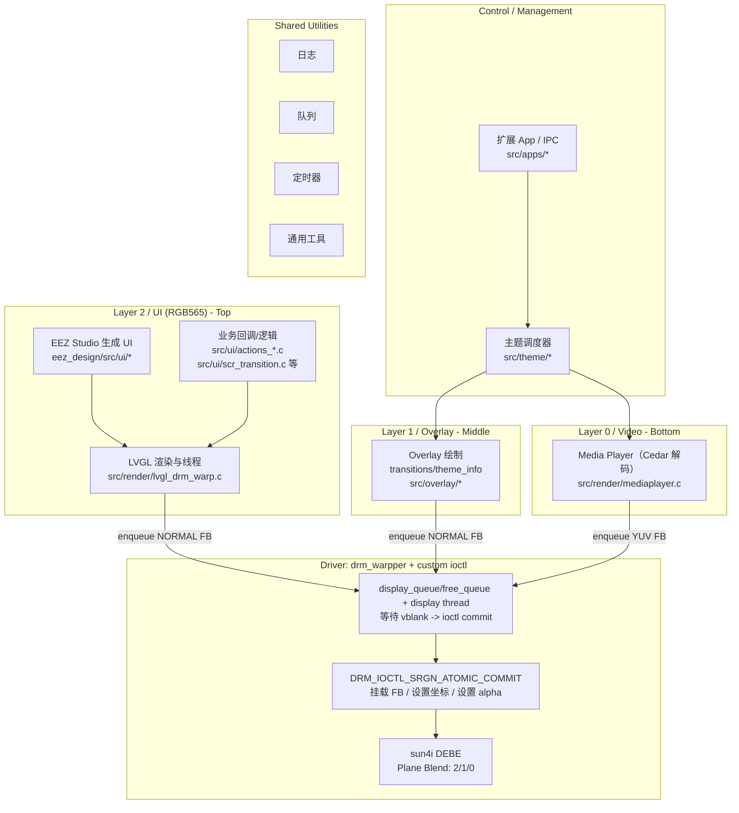

<div align="center">

# CRA Electric Pass 设备端程序

<sub>DRM · LVGL · CedarX · Multi-plane Rendering</sub>

</div>

> [!NOTE]
> 本项目是 CRA Electric Pass 的设备端主程序，面向 Allwinner SUNIV 平台，通过 DRM 多图层、LVGL 与 CedarX 完成视频、叠加动画和系统 UI 的协同渲染。

<p align="center">
  <a href="#架构概览">架构概览</a> ·
  <a href="#开始使用">开始使用</a> ·
  <a href="#编译方法">编译方法</a> ·
  <a href="#开发指引">开发指引</a> ·
  <a href="#直接嵌入的开源代码">开源组件</a>
</p>

---

## 架构概览

<table>
<tr>
<td width="33%" valign="top">

### Video · Layer 0

CedarX 解码视频，以 YUV 图层提交到显示队列。

</td>
<td width="33%" valign="top">

### Overlay · Layer 1

绘制过渡动画、主题信息和 CRA 自定义叠加界面。

</td>
<td width="33%" valign="top">

### UI · Layer 2

LVGL 与 EEZ Studio 生成界面，承载菜单、设置和扩展应用入口。

</td>
</tr>
</table>



---

## 开始使用

播放程序与电子通行证固件一起分发，可在
[CRA-Electric-Pass Releases](https://github.com/CCU-Robotics-Association/CRA-Electric-Pass/releases)
下载发布版本。

---

## 编译方法

### 直接编译

需要提前准备的其他源码：

* 本项目配套的 Buildroot 工作区：
  [CRA-Electric-Pass](https://github.com/CCU-Robotics-Association/CRA-Electric-Pass)

构建：

1. 拉取配套 Buildroot，并按其 README 完成一次构建，以生成工具链和依赖库。
2. 在 Buildroot 根目录执行 `source ./output/host/environment-setup`，载入交叉编译环境。
3. 在本仓库根目录执行：

```bash
mkdir build
cd build
cmake ..
make
```

调试构建可改用：

```bash
cmake -S . -B build -DCMAKE_BUILD_TYPE=Debug
cmake --build build --parallel
```

构建成功后，终端会显示以下日志，并在 `build/` 中生成 `epass_drm_app`：

```
[100%] Built target epass_drm_app
```

### 跟随 Buildroot 一起生成

按配套 Buildroot 的 README 完成系统构建，程序会随 rootfs 一起安装。中间编译目录位于 `output/build/epass_drm_app-*/`。

---

## 开发指引

- [文档索引](docs/README.md)
- [程序结构](docs/application_structure.md)
- [Overlay 层开发指南](docs/overlay_dev_note.md)
- [源码目录说明](src/README.md)
- [桌面 UI 模拟器](simulator/README.md)

> [!IMPORTANT]
> `eez_design/src/ui/` 属于 EEZ Studio 生成代码。界面结构应在 EEZ 工程中修改后重新导出，项目业务逻辑放在 `src/ui/`，不要直接维护生成文件。

---

## 直接嵌入的开源代码

* [log](https://github.com/rxi/log.c) A minimal but powerful logging facility for C.
* [stb](https://github.com/nothings/stb) single-file public domain libraries for C/C++
* [code128](https://github.com/fhunleth/code128) barcode generator
* [lvgl](https://github.com/lvgl/lvgl) Embedded graphics library to create beautiful UIs for any MCU, MPU and display type.
* [cJSON](https://github.com/DaveGamble/cJSON) Ultralightweight JSON parser in ANSI C

> [!NOTE]
> 上述组件遵循各自许可证。升级依赖时应同步验证目标工具链、ABI、LVGL 版本与设备端显示路径。

---

<div align="center">

<sub><b>drm_app_neo</b> · CRA Electric Pass device runtime</sub>

</div>
