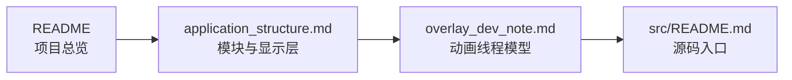

# CRA Electric Pass 程序文档

Architecture · Overlay Model · Visual References

> [!NOTE]
> `docs/` 保存设备端程序的架构说明、Overlay 开发约束与 README 使用的图像资源。

---

## 文档索引

<table>
<tr>
<td width="50%" valign="top">

### [程序结构](application_structure.md)

说明 Driver、Render、Overlay、Theme、UI 与 Utils 的职责，以及三层 DRM Plane 的数据流和限制。

</td>
<td width="50%" valign="top">

### [Overlay 开发指南](overlay_dev_note.md)

说明 Overlay worker、定时器、资源回收、终止协议，以及新增 Transition / ThemeInfo 效果时必须遵守的线程约束。

</td>
</tr>
</table>

`assets/` 保存文档页面引用的横幅与示意资源，不参与设备端 rootfs 安装。

---

## 阅读路径

---

## 维护原则

- 文档中的结构体、函数名、路径和线程关系应与当前源码同步。
- 修改 DRM 私有 IOCTL 时，还需同步核对 Buildroot 内核补丁中的 UAPI 定义。
- 修改主题配置格式时，应同步更新设备端加载器、素材工具和示例主题。
- `assets/` 只保存文档资源；设备运行资源应放入对应 rootfs 或主题目录。

---

<b>docs/</b> · architecture and development notes

